# Projects and dependencies analysis

This document provides a comprehensive overview of the projects and their dependencies in the context of upgrading to .NETCoreApp,Version=v10.0.

## Table of Contents

- [Executive Summary](#executive-Summary)
  - [Highlevel Metrics](#highlevel-metrics)
  - [Projects Compatibility](#projects-compatibility)
  - [Package Compatibility](#package-compatibility)
  - [API Compatibility](#api-compatibility)
- [Aggregate NuGet packages details](#aggregate-nuget-packages-details)
- [Top API Migration Challenges](#top-api-migration-challenges)
  - [Technologies and Features](#technologies-and-features)
  - [Most Frequent API Issues](#most-frequent-api-issues)
- [Projects Relationship Graph](#projects-relationship-graph)
- [Project Details](#project-details)

  - [samples\MicroServices\NBB.Contracts\NBB.Contracts.Api\NBB.Contracts.Api.csproj](#samplesmicroservicesnbbcontractsnbbcontractsapinbbcontractsapicsproj)
  - [samples\MicroServices\NBB.Contracts\NBB.Contracts.Application\NBB.Contracts.Application.csproj](#samplesmicroservicesnbbcontractsnbbcontractsapplicationnbbcontractsapplicationcsproj)
  - [samples\MicroServices\NBB.Contracts\NBB.Contracts.Domain\NBB.Contracts.Domain.csproj](#samplesmicroservicesnbbcontractsnbbcontractsdomainnbbcontractsdomaincsproj)
  - [samples\MicroServices\NBB.Contracts\NBB.Contracts.Migrations\NBB.Contracts.Migrations.csproj](#samplesmicroservicesnbbcontractsnbbcontractsmigrationsnbbcontractsmigrationscsproj)
  - [samples\MicroServices\NBB.Contracts\NBB.Contracts.PublishedLanguage\NBB.Contracts.PublishedLanguage.csproj](#samplesmicroservicesnbbcontractsnbbcontractspublishedlanguagenbbcontractspublishedlanguagecsproj)
  - [samples\MicroServices\NBB.Contracts\NBB.Contracts.ReadModel.Data\NBB.Contracts.ReadModel.Data.csproj](#samplesmicroservicesnbbcontractsnbbcontractsreadmodeldatanbbcontractsreadmodeldatacsproj)
  - [samples\MicroServices\NBB.Contracts\NBB.Contracts.ReadModel\NBB.Contracts.ReadModel.csproj](#samplesmicroservicesnbbcontractsnbbcontractsreadmodelnbbcontractsreadmodelcsproj)
  - [samples\MicroServices\NBB.Contracts\NBB.Contracts.Worker\NBB.Contracts.Worker.csproj](#samplesmicroservicesnbbcontractsnbbcontractsworkernbbcontractsworkercsproj)
  - [samples\MicroServices\NBB.Contracts\NBB.Contracts.WriteModel.Data\NBB.Contracts.WriteModel.Data.csproj](#samplesmicroservicesnbbcontractsnbbcontractswritemodeldatanbbcontractswritemodeldatacsproj)
  - [samples\MicroServices\NBB.Invoices.FSharp\NBB.Invoices.FSharp.Api\NBB.Invoices.FSharp.Api.fsproj](#samplesmicroservicesnbbinvoicesfsharpnbbinvoicesfsharpapinbbinvoicesfsharpapifsproj)
  - [samples\MicroServices\NBB.Invoices.FSharp\NBB.Invoices.FSharp.Worker\NBB.Invoices.FSharp.Worker.fsproj](#samplesmicroservicesnbbinvoicesfsharpnbbinvoicesfsharpworkernbbinvoicesfsharpworkerfsproj)
  - [samples\MicroServices\NBB.Invoices.FSharp\NBB.Invoices.FSharp\NBB.Invoices.FSharp.fsproj](#samplesmicroservicesnbbinvoicesfsharpnbbinvoicesfsharpnbbinvoicesfsharpfsproj)
  - [samples\MicroServices\NBB.Invoices\NBB.Invoices.Api\NBB.Invoices.Api.csproj](#samplesmicroservicesnbbinvoicesnbbinvoicesapinbbinvoicesapicsproj)
  - [samples\MicroServices\NBB.Invoices\NBB.Invoices.Application\NBB.Invoices.Application.csproj](#samplesmicroservicesnbbinvoicesnbbinvoicesapplicationnbbinvoicesapplicationcsproj)
  - [samples\MicroServices\NBB.Invoices\NBB.Invoices.Data\NBB.Invoices.Data.csproj](#samplesmicroservicesnbbinvoicesnbbinvoicesdatanbbinvoicesdatacsproj)
  - [samples\MicroServices\NBB.Invoices\NBB.Invoices.Domain\NBB.Invoices.Domain.csproj](#samplesmicroservicesnbbinvoicesnbbinvoicesdomainnbbinvoicesdomaincsproj)
  - [samples\MicroServices\NBB.Invoices\NBB.Invoices.Migrations\NBB.Invoices.Migrations.csproj](#samplesmicroservicesnbbinvoicesnbbinvoicesmigrationsnbbinvoicesmigrationscsproj)
  - [samples\MicroServices\NBB.Invoices\NBB.Invoices.PublishedLanguage\NBB.Invoices.PublishedLanguage.csproj](#samplesmicroservicesnbbinvoicesnbbinvoicespublishedlanguagenbbinvoicespublishedlanguagecsproj)
  - [samples\MicroServices\NBB.Invoices\NBB.Invoices.Worker\NBB.Invoices.Worker.csproj](#samplesmicroservicesnbbinvoicesnbbinvoicesworkernbbinvoicesworkercsproj)
  - [samples\MicroServices\NBB.MicroServicesOrchestration\NBB.MicroServicesOrchestration.csproj](#samplesmicroservicesnbbmicroservicesorchestrationnbbmicroservicesorchestrationcsproj)
  - [samples\MicroServices\NBB.Payments\NBB.Payments.Api\NBB.Payments.Api.csproj](#samplesmicroservicesnbbpaymentsnbbpaymentsapinbbpaymentsapicsproj)
  - [samples\MicroServices\NBB.Payments\NBB.Payments.Application\NBB.Payments.Application.csproj](#samplesmicroservicesnbbpaymentsnbbpaymentsapplicationnbbpaymentsapplicationcsproj)
  - [samples\MicroServices\NBB.Payments\NBB.Payments.Data\NBB.Payments.Data.csproj](#samplesmicroservicesnbbpaymentsnbbpaymentsdatanbbpaymentsdatacsproj)
  - [samples\MicroServices\NBB.Payments\NBB.Payments.Domain\NBB.Payments.Domain.csproj](#samplesmicroservicesnbbpaymentsnbbpaymentsdomainnbbpaymentsdomaincsproj)
  - [samples\MicroServices\NBB.Payments\NBB.Payments.Migrations\NBB.Payments.Migrations.csproj](#samplesmicroservicesnbbpaymentsnbbpaymentsmigrationsnbbpaymentsmigrationscsproj)
  - [samples\MicroServices\NBB.Payments\NBB.Payments.PublishedLanguage\NBB.Payments.PublishedLanguage.csproj](#samplesmicroservicesnbbpaymentsnbbpaymentspublishedlanguagenbbpaymentspublishedlanguagecsproj)
  - [samples\MicroServices\NBB.Payments\NBB.Payments.Worker\NBB.Payments.Worker.csproj](#samplesmicroservicesnbbpaymentsnbbpaymentsworkernbbpaymentsworkercsproj)
  - [samples\Monolith\NBB.Mono.Migrations\NBB.Mono.Migrations.csproj](#samplesmonolithnbbmonomigrationsnbbmonomigrationscsproj)
  - [samples\Monolith\NBB.Mono\NBB.Mono.csproj](#samplesmonolithnbbmononbbmonocsproj)
  - [samples\MultiTenancy\NBB.Todo.Api\NBB.Todo.Api.csproj](#samplesmultitenancynbbtodoapinbbtodoapicsproj)
  - [samples\MultiTenancy\NBB.Todo.Data\NBB.Todo.Data.csproj](#samplesmultitenancynbbtododatanbbtododatacsproj)
  - [samples\MultiTenancy\NBB.Todo.Migrations\NBB.Todo.Migrations.csproj](#samplesmultitenancynbbtodomigrationsnbbtodomigrationscsproj)
  - [samples\MultiTenancy\NBB.Todo.PublishedLanguage\NBB.Todo.PublishedLanguage.csproj](#samplesmultitenancynbbtodopublishedlanguagenbbtodopublishedlanguagecsproj)
  - [samples\MultiTenancy\NBB.Todo.Worker\NBB.Todo.Worker.csproj](#samplesmultitenancynbbtodoworkernbbtodoworkercsproj)
  - [samples\Orchestration\ProcessManagerSample\ProcessManagerSample.csproj](#samplesorchestrationprocessmanagersampleprocessmanagersamplecsproj)
  - [src\Application\NBB.Application.DataContracts.Schema\NBB.Application.DataContracts.Schema.csproj](#srcapplicationnbbapplicationdatacontractsschemanbbapplicationdatacontractsschemacsproj)
  - [src\Application\NBB.Application.DataContracts\NBB.Application.DataContracts.csproj](#srcapplicationnbbapplicationdatacontractsnbbapplicationdatacontractscsproj)
  - [src\Application\NBB.Application.Mediator.FSharp\NBB.Application.Mediator.FSharp.fsproj](#srcapplicationnbbapplicationmediatorfsharpnbbapplicationmediatorfsharpfsproj)
  - [src\Application\NBB.Application.MediatR.Effects\NBB.Application.MediatR.Effects.csproj](#srcapplicationnbbapplicationmediatreffectsnbbapplicationmediatreffectscsproj)
  - [src\Application\NBB.Application.MediatR\NBB.Application.MediatR.csproj](#srcapplicationnbbapplicationmediatrnbbapplicationmediatrcsproj)
  - [src\Core\NBB.Core.Abstractions\NBB.Core.Abstractions.csproj](#srccorenbbcoreabstractionsnbbcoreabstractionscsproj)
  - [src\Core\NBB.Core.Configuration\NBB.Core.Configuration.csproj](#srccorenbbcoreconfigurationnbbcoreconfigurationcsproj)
  - [src\Core\NBB.Core.DependencyInjection\NBB.Core.DependencyInjection.csproj](#srccorenbbcoredependencyinjectionnbbcoredependencyinjectioncsproj)
  - [src\Core\NBB.Core.Effects.FSharp\NBB.Core.Effects.FSharp.fsproj](#srccorenbbcoreeffectsfsharpnbbcoreeffectsfsharpfsproj)
  - [src\Core\NBB.Core.Effects\NBB.Core.Effects.csproj](#srccorenbbcoreeffectsnbbcoreeffectscsproj)
  - [src\Core\NBB.Core.Evented.FSharp\NBB.Core.Evented.FSharp.fsproj](#srccorenbbcoreeventedfsharpnbbcoreeventedfsharpfsproj)
  - [src\Core\NBB.Core.FSharp\NBB.Core.FSharp.fsproj](#srccorenbbcorefsharpnbbcorefsharpfsproj)
  - [src\Core\NBB.Core.Pipeline\NBB.Core.Pipeline.csproj](#srccorenbbcorepipelinenbbcorepipelinecsproj)
  - [src\Correlation\NBB.Correlation.AspNet\NBB.Correlation.AspNet.csproj](#srccorrelationnbbcorrelationaspnetnbbcorrelationaspnetcsproj)
  - [src\Correlation\NBB.Correlation.Serilog.SqlServer\NBB.Correlation.Serilog.SqlServer.csproj](#srccorrelationnbbcorrelationserilogsqlservernbbcorrelationserilogsqlservercsproj)
  - [src\Correlation\NBB.Correlation.Serilog\NBB.Correlation.Serilog.csproj](#srccorrelationnbbcorrelationserilognbbcorrelationserilogcsproj)
  - [src\Correlation\NBB.Correlation\NBB.Correlation.csproj](#srccorrelationnbbcorrelationnbbcorrelationcsproj)
  - [src\Data\NBB.Data.Abstractions\NBB.Data.Abstractions.csproj](#srcdatanbbdataabstractionsnbbdataabstractionscsproj)
  - [src\Data\NBB.Data.EntityFramework.MultiTenancy\NBB.Data.EntityFramework.MultiTenancy.csproj](#srcdatanbbdataentityframeworkmultitenancynbbdataentityframeworkmultitenancycsproj)
  - [src\Data\NBB.Data.EntityFramework\NBB.Data.EntityFramework.csproj](#srcdatanbbdataentityframeworknbbdataentityframeworkcsproj)
  - [src\Data\NBB.Data.EventSourcing\NBB.Data.EventSourcing.csproj](#srcdatanbbdataeventsourcingnbbdataeventsourcingcsproj)
  - [src\Domain\NBB.Domain.Abstractions\NBB.Domain.Abstractions.csproj](#srcdomainnbbdomainabstractionsnbbdomainabstractionscsproj)
  - [src\Domain\NBB.Domain\NBB.Domain.csproj](#srcdomainnbbdomainnbbdomaincsproj)
  - [src\EventStore\NBB.EventStore.Abstractions\NBB.EventStore.Abstractions.csproj](#srceventstorenbbeventstoreabstractionsnbbeventstoreabstractionscsproj)
  - [src\EventStore\NBB.EventStore.AdoNet.Migrations\NBB.EventStore.AdoNet.Migrations.csproj](#srceventstorenbbeventstoreadonetmigrationsnbbeventstoreadonetmigrationscsproj)
  - [src\EventStore\NBB.EventStore.AdoNet.Multitenancy\NBB.EventStore.AdoNet.MultiTenancy.csproj](#srceventstorenbbeventstoreadonetmultitenancynbbeventstoreadonetmultitenancycsproj)
  - [src\EventStore\NBB.EventStore.AdoNet\NBB.EventStore.AdoNet.csproj](#srceventstorenbbeventstoreadonetnbbeventstoreadonetcsproj)
  - [src\EventStore\NBB.EventStore.Effects\NBB.EventStore.Effects.csproj](#srceventstorenbbeventstoreeffectsnbbeventstoreeffectscsproj)
  - [src\EventStore\NBB.EventStore.InMemory\NBB.EventStore.InMemory.csproj](#srceventstorenbbeventstoreinmemorynbbeventstoreinmemorycsproj)
  - [src\EventStore\NBB.EventStore\NBB.EventStore.csproj](#srceventstorenbbeventstorenbbeventstorecsproj)
  - [src\EventStore\NBB.SQLStreamStore.Migrations\NBB.SQLStreamStore.Migrations.csproj](#srceventstorenbbsqlstreamstoremigrationsnbbsqlstreamstoremigrationscsproj)
  - [src\EventStore\NBB.SQLStreamStore\NBB.SQLStreamStore.csproj](#srceventstorenbbsqlstreamstorenbbsqlstreamstorecsproj)
  - [src\Http\NBB.Http.Effects\NBB.Http.Effects.csproj](#srchttpnbbhttpeffectsnbbhttpeffectscsproj)
  - [src\Messaging\NBB.Messaging.Abstractions\NBB.Messaging.Abstractions.csproj](#srcmessagingnbbmessagingabstractionsnbbmessagingabstractionscsproj)
  - [src\Messaging\NBB.Messaging.BackwardCompatibility\NBB.Messaging.BackwardCompatibility.csproj](#srcmessagingnbbmessagingbackwardcompatibilitynbbmessagingbackwardcompatibilitycsproj)
  - [src\Messaging\NBB.Messaging.DataContracts\NBB.Messaging.DataContracts.csproj](#srcmessagingnbbmessagingdatacontractsnbbmessagingdatacontractscsproj)
  - [src\Messaging\NBB.Messaging.Effects\NBB.Messaging.Effects.csproj](#srcmessagingnbbmessagingeffectsnbbmessagingeffectscsproj)
  - [src\Messaging\NBB.Messaging.Host\NBB.Messaging.Host.csproj](#srcmessagingnbbmessaginghostnbbmessaginghostcsproj)
  - [src\Messaging\NBB.Messaging.InProcessMessaging\NBB.Messaging.InProcessMessaging.csproj](#srcmessagingnbbmessaginginprocessmessagingnbbmessaginginprocessmessagingcsproj)
  - [src\Messaging\NBB.Messaging.JetStream\NBB.Messaging.JetStream.csproj](#srcmessagingnbbmessagingjetstreamnbbmessagingjetstreamcsproj)
  - [src\Messaging\NBB.Messaging.MultiTenancy\NBB.Messaging.MultiTenancy.csproj](#srcmessagingnbbmessagingmultitenancynbbmessagingmultitenancycsproj)
  - [src\Messaging\NBB.Messaging.Nats\NBB.Messaging.Nats.csproj](#srcmessagingnbbmessagingnatsnbbmessagingnatscsproj)
  - [src\Messaging\NBB.Messaging.Noop\NBB.Messaging.Noop.csproj](#srcmessagingnbbmessagingnoopnbbmessagingnoopcsproj)
  - [src\Messaging\NBB.Messaging.OpenTelemetry\NBB.Messaging.OpenTelemetry.csproj](#srcmessagingnbbmessagingopentelemetrynbbmessagingopentelemetrycsproj)
  - [src\Messaging\NBB.Messaging.Rusi\NBB.Messaging.Rusi.csproj](#srcmessagingnbbmessagingrusinbbmessagingrusicsproj)
  - [src\MultiTenancy\NBB.MultiTenancy.Abstractions\NBB.MultiTenancy.Abstractions.csproj](#srcmultitenancynbbmultitenancyabstractionsnbbmultitenancyabstractionscsproj)
  - [src\MultiTenancy\NBB.MultiTenancy.AspNet\NBB.MultiTenancy.AspNet.csproj](#srcmultitenancynbbmultitenancyaspnetnbbmultitenancyaspnetcsproj)
  - [src\MultiTenancy\NBB.MultiTenancy.Identification.Http\NBB.MultiTenancy.Identification.Http.csproj](#srcmultitenancynbbmultitenancyidentificationhttpnbbmultitenancyidentificationhttpcsproj)
  - [src\MultiTenancy\NBB.MultiTenancy.Identification.Messaging\NBB.MultiTenancy.Identification.Messaging.csproj](#srcmultitenancynbbmultitenancyidentificationmessagingnbbmultitenancyidentificationmessagingcsproj)
  - [src\MultiTenancy\NBB.MultiTenancy.Identification\NBB.MultiTenancy.Identification.csproj](#srcmultitenancynbbmultitenancyidentificationnbbmultitenancyidentificationcsproj)
  - [src\Orchestration\NBB.ProcessManager.Definition\NBB.ProcessManager.Definition.csproj](#srcorchestrationnbbprocessmanagerdefinitionnbbprocessmanagerdefinitioncsproj)
  - [src\Orchestration\NBB.ProcessManager.Runtime\NBB.ProcessManager.Runtime.csproj](#srcorchestrationnbbprocessmanagerruntimenbbprocessmanagerruntimecsproj)
  - [src\Projections\NBB.ProjectR\NBB.ProjectR.csproj](#srcprojectionsnbbprojectrnbbprojectrcsproj)
  - [src\Tools\Serilog\NBB.Tools.Serilog.Enrichers.ServiceIdentifier\NBB.Tools.Serilog.Enrichers.ServiceIdentifier.csproj](#srctoolsserilognbbtoolsserilogenrichersserviceidentifiernbbtoolsserilogenrichersserviceidentifiercsproj)
  - [src\Tools\Serilog\NBB.Tools.Serilog.Enrichers.TenantId\NBB.Tools.Serilog.Enrichers.TenantId.csproj](#srctoolsserilognbbtoolsserilogenricherstenantidnbbtoolsserilogenricherstenantidcsproj)
  - [src\Tools\Serilog\NBB.Tools.Serilog.OpenTelemetryTracingSink\NBB.Tools.Serilog.OpenTelemetryTracingSink.csproj](#srctoolsserilognbbtoolsserilogopentelemetrytracingsinknbbtoolsserilogopentelemetrytracingsinkcsproj)
  - [test\Benchmarks\EffectsBenchmarks\EffectsBenchmarks\EffectsBenchmarks.fsproj](#testbenchmarkseffectsbenchmarkseffectsbenchmarkseffectsbenchmarksfsproj)
  - [test\Benchmarks\EventStoreBenchmarks\EventStoreBenchmarks.csproj](#testbenchmarkseventstorebenchmarkseventstorebenchmarkscsproj)
  - [test\Integration\NBB.EventStore.IntegrationTests\NBB.EventStore.IntegrationTests.csproj](#testintegrationnbbeventstoreintegrationtestsnbbeventstoreintegrationtestscsproj)
  - [test\Integration\NBB.Messaging.Rusi.IntegrationTests\NBB.Messaging.Rusi.IntegrationTests.csproj](#testintegrationnbbmessagingrusiintegrationtestsnbbmessagingrusiintegrationtestscsproj)
  - [test\UnitTests\Application\NBB.Application.Effects.Tests\NBB.Application.Effects.Tests.csproj](#testunittestsapplicationnbbapplicationeffectstestsnbbapplicationeffectstestscsproj)
  - [test\UnitTests\Application\NBB.Application.Mediator.FSharp.Tests\NBB.Application.Mediator.FSharp.Tests.fsproj](#testunittestsapplicationnbbapplicationmediatorfsharptestsnbbapplicationmediatorfsharptestsfsproj)
  - [test\UnitTests\Core\NBB.Core.Configuration.Tests\NBB.Core.Configuration.Tests.csproj](#testunittestscorenbbcoreconfigurationtestsnbbcoreconfigurationtestscsproj)
  - [test\UnitTests\Core\NBB.Core.Effects.FSharp.Tests\NBB.Core.Effects.FSharp.Tests.fsproj](#testunittestscorenbbcoreeffectsfsharptestsnbbcoreeffectsfsharptestsfsproj)
  - [test\UnitTests\Core\NBB.Core.Effects.Tests\NBB.Core.Effects.Tests.csproj](#testunittestscorenbbcoreeffectstestsnbbcoreeffectstestscsproj)
  - [test\UnitTests\Core\NBB.Core.Evented.FSharp.Tests\NBB.Core.Evented.FSharp.Tests.fsproj](#testunittestscorenbbcoreeventedfsharptestsnbbcoreeventedfsharptestsfsproj)
  - [test\UnitTests\Core\NBB.Core.Pipeline.Tests\NBB.Core.Pipeline.Tests.csproj](#testunittestscorenbbcorepipelinetestsnbbcorepipelinetestscsproj)
  - [test\UnitTests\Data\NBB.Data.EntityFramework.MultiTenancy.Tests\NBB.Data.EntityFramework.MultiTenancy.Tests.csproj](#testunittestsdatanbbdataentityframeworkmultitenancytestsnbbdataentityframeworkmultitenancytestscsproj)
  - [test\UnitTests\Data\NBB.Data.EntityFramework.Tests\NBB.Data.EntityFramework.Tests.csproj](#testunittestsdatanbbdataentityframeworktestsnbbdataentityframeworktestscsproj)
  - [test\UnitTests\Data\NBB.Data.EventSourcing.Tests\NBB.Data.EventSourcing.Tests.csproj](#testunittestsdatanbbdataeventsourcingtestsnbbdataeventsourcingtestscsproj)
  - [test\UnitTests\Domain\NBB.Domain.Tests\NBB.Domain.Tests.csproj](#testunittestsdomainnbbdomaintestsnbbdomaintestscsproj)
  - [test\UnitTests\EventStore\NBB.EventStore.AdoNet.Tests\NBB.EventStore.AdoNet.Tests.csproj](#testunittestseventstorenbbeventstoreadonettestsnbbeventstoreadonettestscsproj)
  - [test\UnitTests\EventStore\NBB.EventStore.InMemory.Tests\NBB.EventStore.InMemory.Tests.csproj](#testunittestseventstorenbbeventstoreinmemorytestsnbbeventstoreinmemorytestscsproj)
  - [test\UnitTests\EventStore\NBB.EventStore.Tests\NBB.EventStore.Tests.csproj](#testunittestseventstorenbbeventstoretestsnbbeventstoretestscsproj)
  - [test\UnitTests\Http\NBB.Http.Effects.Tests\NBB.Http.Effects.Tests.csproj](#testunittestshttpnbbhttpeffectstestsnbbhttpeffectstestscsproj)
  - [test\UnitTests\Messaging\NBB.Messaging.Abstractions.Tests\NBB.Messaging.Abstractions.Tests.csproj](#testunittestsmessagingnbbmessagingabstractionstestsnbbmessagingabstractionstestscsproj)
  - [test\UnitTests\Messaging\NBB.Messaging.DataContracts.Tests\NBB.Messaging.DataContracts.Tests.csproj](#testunittestsmessagingnbbmessagingdatacontractstestsnbbmessagingdatacontractstestscsproj)
  - [test\UnitTests\Messaging\NBB.Messaging.Effects.Tests\NBB.Messaging.Effects.Tests.csproj](#testunittestsmessagingnbbmessagingeffectstestsnbbmessagingeffectstestscsproj)
  - [test\UnitTests\Messaging\NBB.Messaging.Host.Tests\NBB.Messaging.Host.Tests.csproj](#testunittestsmessagingnbbmessaginghosttestsnbbmessaginghosttestscsproj)
  - [test\UnitTests\Messaging\NBB.Messaging.InProcessMessaging.Tests\NBB.Messaging.InProcessMessaging.Tests.csproj](#testunittestsmessagingnbbmessaginginprocessmessagingtestsnbbmessaginginprocessmessagingtestscsproj)
  - [test\UnitTests\Messaging\NBB.Messaging.MultiTenancy.Tests\NBB.Messaging.MultiTenancy.Tests.csproj](#testunittestsmessagingnbbmessagingmultitenancytestsnbbmessagingmultitenancytestscsproj)
  - [test\UnitTests\Messaging\NBB.Messaging.Rusi.Tests\NBB.Messaging.Rusi.Tests.csproj](#testunittestsmessagingnbbmessagingrusitestsnbbmessagingrusitestscsproj)
  - [test\UnitTests\MultiTenancy\NBB.MultiTenancy.Configuration.Tests\NBB.MultiTenancy.Abstractions.Tests.csproj](#testunittestsmultitenancynbbmultitenancyconfigurationtestsnbbmultitenancyabstractionstestscsproj)
  - [test\UnitTests\MultiTenancy\NBB.MultiTenancy.Identification.Http.Tests\NBB.MultiTenancy.Identification.Http.Tests.csproj](#testunittestsmultitenancynbbmultitenancyidentificationhttptestsnbbmultitenancyidentificationhttptestscsproj)
  - [test\UnitTests\MultiTenancy\NBB.MultiTenancy.Identification.Messaging.Tests\NBB.MultiTenancy.Identification.Messaging.Tests.csproj](#testunittestsmultitenancynbbmultitenancyidentificationmessagingtestsnbbmultitenancyidentificationmessagingtestscsproj)
  - [test\UnitTests\MultiTenancy\NBB.MultiTenancy.Identification.Tests\NBB.MultiTenancy.Identification.Tests.csproj](#testunittestsmultitenancynbbmultitenancyidentificationtestsnbbmultitenancyidentificationtestscsproj)
  - [test\UnitTests\NBB.Core.FSharp.Tests\NBB.Core.FSharp.Tests.fsproj](#testunittestsnbbcorefsharptestsnbbcorefsharptestsfsproj)
  - [test\UnitTests\Orchestration\NBB.ProcessManager.Tests\NBB.ProcessManager.Tests.csproj](#testunittestsorchestrationnbbprocessmanagertestsnbbprocessmanagertestscsproj)
  - [test\UnitTests\Projections\NBB.ProjectR.Tests\NBB.ProjectR.Tests.csproj](#testunittestsprojectionsnbbprojectrtestsnbbprojectrtestscsproj)
  - [test\UnitTests\Tools\NBB.Tools.Serilog.Enrichers.ServiceIdentifier.Tests\NBB.Tools.Serilog.Enrichers.ServiceIdentifier.Tests.csproj](#testunitteststoolsnbbtoolsserilogenrichersserviceidentifiertestsnbbtoolsserilogenrichersserviceidentifiertestscsproj)
  - [test\UnitTests\Tools\NBB.Tools.Serilog.Enrichers.TenantId.Tests\NBB.Tools.Serilog.Enrichers.TenantId.Tests.csproj](#testunitteststoolsnbbtoolsserilogenricherstenantidtestsnbbtoolsserilogenricherstenantidtestscsproj)


## Executive Summary

### Highlevel Metrics

| Metric | Count | Status |
| :--- | :---: | :--- |
| Total Projects | 126 | All require upgrade |
| Total NuGet Packages | 85 | 31 need upgrade |
| Total Code Files | 553 |  |
| Total Code Files with Incidents | 175 |  |
| Total Lines of Code | 31618 |  |
| Total Number of Issues | 438 |  |
| Estimated LOC to modify | 98+ | at least 0.3% of codebase |

### Projects Compatibility

| Project | Target Framework | Difficulty | Package Issues | API Issues | Est. LOC Impact | Description |
| :--- | :---: | :---: | :---: | :---: | :---: | :--- |
| [samples\MicroServices\NBB.Contracts\NBB.Contracts.Api\NBB.Contracts.Api.csproj](#samplesmicroservicesnbbcontractsnbbcontractsapinbbcontractsapicsproj) | net9.0 | 🟢 Low | 0 | 4 | 4+ | AspNetCore, Sdk Style = True |
| [samples\MicroServices\NBB.Contracts\NBB.Contracts.Application\NBB.Contracts.Application.csproj](#samplesmicroservicesnbbcontractsnbbcontractsapplicationnbbcontractsapplicationcsproj) | net9.0 | 🟢 Low | 0 | 0 |  | ClassLibrary, Sdk Style = True |
| [samples\MicroServices\NBB.Contracts\NBB.Contracts.Domain\NBB.Contracts.Domain.csproj](#samplesmicroservicesnbbcontractsnbbcontractsdomainnbbcontractsdomaincsproj) | net9.0 | 🟢 Low | 0 | 0 |  | ClassLibrary, Sdk Style = True |
| [samples\MicroServices\NBB.Contracts\NBB.Contracts.Migrations\NBB.Contracts.Migrations.csproj](#samplesmicroservicesnbbcontractsnbbcontractsmigrationsnbbcontractsmigrationscsproj) | net9.0 | 🟢 Low | 3 | 0 |  | DotNetCoreApp, Sdk Style = True |
| [samples\MicroServices\NBB.Contracts\NBB.Contracts.PublishedLanguage\NBB.Contracts.PublishedLanguage.csproj](#samplesmicroservicesnbbcontractsnbbcontractspublishedlanguagenbbcontractspublishedlanguagecsproj) | net9.0 | 🟢 Low | 0 | 0 |  | ClassLibrary, Sdk Style = True |
| [samples\MicroServices\NBB.Contracts\NBB.Contracts.ReadModel.Data\NBB.Contracts.ReadModel.Data.csproj](#samplesmicroservicesnbbcontractsnbbcontractsreadmodeldatanbbcontractsreadmodeldatacsproj) | net9.0 | 🟢 Low | 2 | 0 |  | ClassLibrary, Sdk Style = True |
| [samples\MicroServices\NBB.Contracts\NBB.Contracts.ReadModel\NBB.Contracts.ReadModel.csproj](#samplesmicroservicesnbbcontractsnbbcontractsreadmodelnbbcontractsreadmodelcsproj) | net9.0 | 🟢 Low | 0 | 0 |  | ClassLibrary, Sdk Style = True |
| [samples\MicroServices\NBB.Contracts\NBB.Contracts.Worker\NBB.Contracts.Worker.csproj](#samplesmicroservicesnbbcontractsnbbcontractsworkernbbcontractsworkercsproj) | net9.0 | 🟢 Low | 7 | 4 | 4+ | DotNetCoreApp, Sdk Style = True |
| [samples\MicroServices\NBB.Contracts\NBB.Contracts.WriteModel.Data\NBB.Contracts.WriteModel.Data.csproj](#samplesmicroservicesnbbcontractsnbbcontractswritemodeldatanbbcontractswritemodeldatacsproj) | net9.0 | 🟢 Low | 1 | 0 |  | ClassLibrary, Sdk Style = True |
| [samples\MicroServices\NBB.Invoices.FSharp\NBB.Invoices.FSharp.Api\NBB.Invoices.FSharp.Api.fsproj](#samplesmicroservicesnbbinvoicesfsharpnbbinvoicesfsharpapinbbinvoicesfsharpapifsproj) | net9.0 | 🟢 Low | 3 | 0 |  | AspNetCore, Sdk Style = True |
| [samples\MicroServices\NBB.Invoices.FSharp\NBB.Invoices.FSharp.Worker\NBB.Invoices.FSharp.Worker.fsproj](#samplesmicroservicesnbbinvoicesfsharpnbbinvoicesfsharpworkernbbinvoicesfsharpworkerfsproj) | net9.0 | 🟢 Low | 7 | 0 |  | DotNetCoreApp, Sdk Style = True |
| [samples\MicroServices\NBB.Invoices.FSharp\NBB.Invoices.FSharp\NBB.Invoices.FSharp.fsproj](#samplesmicroservicesnbbinvoicesfsharpnbbinvoicesfsharpnbbinvoicesfsharpfsproj) | net9.0 | 🟢 Low | 1 | 0 |  | ClassLibrary, Sdk Style = True |
| [samples\MicroServices\NBB.Invoices\NBB.Invoices.Api\NBB.Invoices.Api.csproj](#samplesmicroservicesnbbinvoicesnbbinvoicesapinbbinvoicesapicsproj) | net9.0 | 🟢 Low | 0 | 0 |  | AspNetCore, Sdk Style = True |
| [samples\MicroServices\NBB.Invoices\NBB.Invoices.Application\NBB.Invoices.Application.csproj](#samplesmicroservicesnbbinvoicesnbbinvoicesapplicationnbbinvoicesapplicationcsproj) | net9.0 | 🟢 Low | 0 | 0 |  | ClassLibrary, Sdk Style = True |
| [samples\MicroServices\NBB.Invoices\NBB.Invoices.Data\NBB.Invoices.Data.csproj](#samplesmicroservicesnbbinvoicesnbbinvoicesdatanbbinvoicesdatacsproj) | net9.0 | 🟢 Low | 1 | 0 |  | ClassLibrary, Sdk Style = True |
| [samples\MicroServices\NBB.Invoices\NBB.Invoices.Domain\NBB.Invoices.Domain.csproj](#samplesmicroservicesnbbinvoicesnbbinvoicesdomainnbbinvoicesdomaincsproj) | net9.0 | 🟢 Low | 0 | 0 |  | ClassLibrary, Sdk Style = True |
| [samples\MicroServices\NBB.Invoices\NBB.Invoices.Migrations\NBB.Invoices.Migrations.csproj](#samplesmicroservicesnbbinvoicesnbbinvoicesmigrationsnbbinvoicesmigrationscsproj) | net9.0 | 🟢 Low | 3 | 0 |  | DotNetCoreApp, Sdk Style = True |
| [samples\MicroServices\NBB.Invoices\NBB.Invoices.PublishedLanguage\NBB.Invoices.PublishedLanguage.csproj](#samplesmicroservicesnbbinvoicesnbbinvoicespublishedlanguagenbbinvoicespublishedlanguagecsproj) | net9.0 | 🟢 Low | 0 | 0 |  | ClassLibrary, Sdk Style = True |
| [samples\MicroServices\NBB.Invoices\NBB.Invoices.Worker\NBB.Invoices.Worker.csproj](#samplesmicroservicesnbbinvoicesnbbinvoicesworkernbbinvoicesworkercsproj) | net9.0 | 🟢 Low | 7 | 5 | 5+ | DotNetCoreApp, Sdk Style = True |
| [samples\MicroServices\NBB.MicroServicesOrchestration\NBB.MicroServicesOrchestration.csproj](#samplesmicroservicesnbbmicroservicesorchestrationnbbmicroservicesorchestrationcsproj) | net9.0 | 🟢 Low | 7 | 4 | 4+ | DotNetCoreApp, Sdk Style = True |
| [samples\MicroServices\NBB.Payments\NBB.Payments.Api\NBB.Payments.Api.csproj](#samplesmicroservicesnbbpaymentsnbbpaymentsapinbbpaymentsapicsproj) | net9.0 | 🟢 Low | 0 | 0 |  | AspNetCore, Sdk Style = True |
| [samples\MicroServices\NBB.Payments\NBB.Payments.Application\NBB.Payments.Application.csproj](#samplesmicroservicesnbbpaymentsnbbpaymentsapplicationnbbpaymentsapplicationcsproj) | net9.0 | 🟢 Low | 0 | 0 |  | ClassLibrary, Sdk Style = True |
| [samples\MicroServices\NBB.Payments\NBB.Payments.Data\NBB.Payments.Data.csproj](#samplesmicroservicesnbbpaymentsnbbpaymentsdatanbbpaymentsdatacsproj) | net9.0 | 🟢 Low | 3 | 0 |  | ClassLibrary, Sdk Style = True |
| [samples\MicroServices\NBB.Payments\NBB.Payments.Domain\NBB.Payments.Domain.csproj](#samplesmicroservicesnbbpaymentsnbbpaymentsdomainnbbpaymentsdomaincsproj) | net9.0 | 🟢 Low | 0 | 0 |  | ClassLibrary, Sdk Style = True |
| [samples\MicroServices\NBB.Payments\NBB.Payments.Migrations\NBB.Payments.Migrations.csproj](#samplesmicroservicesnbbpaymentsnbbpaymentsmigrationsnbbpaymentsmigrationscsproj) | net9.0 | 🟢 Low | 3 | 0 |  | DotNetCoreApp, Sdk Style = True |
| [samples\MicroServices\NBB.Payments\NBB.Payments.PublishedLanguage\NBB.Payments.PublishedLanguage.csproj](#samplesmicroservicesnbbpaymentsnbbpaymentspublishedlanguagenbbpaymentspublishedlanguagecsproj) | net9.0 | 🟢 Low | 0 | 0 |  | ClassLibrary, Sdk Style = True |
| [samples\MicroServices\NBB.Payments\NBB.Payments.Worker\NBB.Payments.Worker.csproj](#samplesmicroservicesnbbpaymentsnbbpaymentsworkernbbpaymentsworkercsproj) | net9.0 | 🟢 Low | 7 | 5 | 5+ | DotNetCoreApp, Sdk Style = True |
| [samples\Monolith\NBB.Mono.Migrations\NBB.Mono.Migrations.csproj](#samplesmonolithnbbmonomigrationsnbbmonomigrationscsproj) | net9.0 | 🟢 Low | 1 | 0 |  | DotNetCoreApp, Sdk Style = True |
| [samples\Monolith\NBB.Mono\NBB.Mono.csproj](#samplesmonolithnbbmononbbmonocsproj) | net9.0 | 🟢 Low | 0 | 1 | 1+ | AspNetCore, Sdk Style = True |
| [samples\MultiTenancy\NBB.Todo.Api\NBB.Todo.Api.csproj](#samplesmultitenancynbbtodoapinbbtodoapicsproj) | net9.0 | 🟢 Low | 0 | 4 | 4+ | AspNetCore, Sdk Style = True |
| [samples\MultiTenancy\NBB.Todo.Data\NBB.Todo.Data.csproj](#samplesmultitenancynbbtododatanbbtododatacsproj) | net9.0 | 🟢 Low | 1 | 0 |  | ClassLibrary, Sdk Style = True |
| [samples\MultiTenancy\NBB.Todo.Migrations\NBB.Todo.Migrations.csproj](#samplesmultitenancynbbtodomigrationsnbbtodomigrationscsproj) | net9.0 | 🟢 Low | 5 | 1 | 1+ | DotNetCoreApp, Sdk Style = True |
| [samples\MultiTenancy\NBB.Todo.PublishedLanguage\NBB.Todo.PublishedLanguage.csproj](#samplesmultitenancynbbtodopublishedlanguagenbbtodopublishedlanguagecsproj) | net9.0 | 🟢 Low | 0 | 0 |  | ClassLibrary, Sdk Style = True |
| [samples\MultiTenancy\NBB.Todo.Worker\NBB.Todo.Worker.csproj](#samplesmultitenancynbbtodoworkernbbtodoworkercsproj) | net9.0 | 🟢 Low | 5 | 5 | 5+ | DotNetCoreApp, Sdk Style = True |
| [samples\Orchestration\ProcessManagerSample\ProcessManagerSample.csproj](#samplesorchestrationprocessmanagersampleprocessmanagersamplecsproj) | net9.0 | 🟢 Low | 7 | 6 | 6+ | DotNetCoreApp, Sdk Style = True |
| [src\Application\NBB.Application.DataContracts.Schema\NBB.Application.DataContracts.Schema.csproj](#srcapplicationnbbapplicationdatacontractsschemanbbapplicationdatacontractsschemacsproj) | net9.0 | 🟢 Low | 0 | 0 |  | ClassLibrary, Sdk Style = True |
| [src\Application\NBB.Application.DataContracts\NBB.Application.DataContracts.csproj](#srcapplicationnbbapplicationdatacontractsnbbapplicationdatacontractscsproj) | net9.0 | 🟢 Low | 0 | 0 |  | ClassLibrary, Sdk Style = True |
| [src\Application\NBB.Application.Mediator.FSharp\NBB.Application.Mediator.FSharp.fsproj](#srcapplicationnbbapplicationmediatorfsharpnbbapplicationmediatorfsharpfsproj) | net9.0 | 🟢 Low | 0 | 0 |  | ClassLibrary, Sdk Style = True |
| [src\Application\NBB.Application.MediatR.Effects\NBB.Application.MediatR.Effects.csproj](#srcapplicationnbbapplicationmediatreffectsnbbapplicationmediatreffectscsproj) | net9.0 | 🟢 Low | 0 | 0 |  | ClassLibrary, Sdk Style = True |
| [src\Application\NBB.Application.MediatR\NBB.Application.MediatR.csproj](#srcapplicationnbbapplicationmediatrnbbapplicationmediatrcsproj) | net9.0 | 🟢 Low | 0 | 0 |  | ClassLibrary, Sdk Style = True |
| [src\Core\NBB.Core.Abstractions\NBB.Core.Abstractions.csproj](#srccorenbbcoreabstractionsnbbcoreabstractionscsproj) | net9.0 | 🟢 Low | 0 | 0 |  | ClassLibrary, Sdk Style = True |
| [src\Core\NBB.Core.Configuration\NBB.Core.Configuration.csproj](#srccorenbbcoreconfigurationnbbcoreconfigurationcsproj) | net9.0 | 🟢 Low | 4 | 0 |  | ClassLibrary, Sdk Style = True |
| [src\Core\NBB.Core.DependencyInjection\NBB.Core.DependencyInjection.csproj](#srccorenbbcoredependencyinjectionnbbcoredependencyinjectioncsproj) | net9.0 | 🟢 Low | 1 | 0 |  | ClassLibrary, Sdk Style = True |
| [src\Core\NBB.Core.Effects.FSharp\NBB.Core.Effects.FSharp.fsproj](#srccorenbbcoreeffectsfsharpnbbcoreeffectsfsharpfsproj) | net9.0 | 🟢 Low | 0 | 0 |  | ClassLibrary, Sdk Style = True |
| [src\Core\NBB.Core.Effects\NBB.Core.Effects.csproj](#srccorenbbcoreeffectsnbbcoreeffectscsproj) | net9.0 | 🟢 Low | 1 | 0 |  | ClassLibrary, Sdk Style = True |
| [src\Core\NBB.Core.Evented.FSharp\NBB.Core.Evented.FSharp.fsproj](#srccorenbbcoreeventedfsharpnbbcoreeventedfsharpfsproj) | net9.0 | 🟢 Low | 0 | 0 |  | ClassLibrary, Sdk Style = True |
| [src\Core\NBB.Core.FSharp\NBB.Core.FSharp.fsproj](#srccorenbbcorefsharpnbbcorefsharpfsproj) | net9.0 | 🟢 Low | 0 | 0 |  | ClassLibrary, Sdk Style = True |
| [src\Core\NBB.Core.Pipeline\NBB.Core.Pipeline.csproj](#srccorenbbcorepipelinenbbcorepipelinecsproj) | net9.0 | 🟢 Low | 1 | 0 |  | ClassLibrary, Sdk Style = True |
| [src\Correlation\NBB.Correlation.AspNet\NBB.Correlation.AspNet.csproj](#srccorrelationnbbcorrelationaspnetnbbcorrelationaspnetcsproj) | net9.0 | 🟢 Low | 1 | 0 |  | ClassLibrary, Sdk Style = True |
| [src\Correlation\NBB.Correlation.Serilog.SqlServer\NBB.Correlation.Serilog.SqlServer.csproj](#srccorrelationnbbcorrelationserilogsqlservernbbcorrelationserilogsqlservercsproj) | net9.0 | 🟢 Low | 0 | 2 | 2+ | ClassLibrary, Sdk Style = True |
| [src\Correlation\NBB.Correlation.Serilog\NBB.Correlation.Serilog.csproj](#srccorrelationnbbcorrelationserilognbbcorrelationserilogcsproj) | net9.0 | 🟢 Low | 0 | 0 |  | ClassLibrary, Sdk Style = True |
| [src\Correlation\NBB.Correlation\NBB.Correlation.csproj](#srccorrelationnbbcorrelationnbbcorrelationcsproj) | net9.0 | 🟢 Low | 0 | 0 |  | ClassLibrary, Sdk Style = True |
| [src\Data\NBB.Data.Abstractions\NBB.Data.Abstractions.csproj](#srcdatanbbdataabstractionsnbbdataabstractionscsproj) | net9.0 | 🟢 Low | 0 | 0 |  | ClassLibrary, Sdk Style = True |
| [src\Data\NBB.Data.EntityFramework.MultiTenancy\NBB.Data.EntityFramework.MultiTenancy.csproj](#srcdatanbbdataentityframeworkmultitenancynbbdataentityframeworkmultitenancycsproj) | net9.0 | 🟢 Low | 2 | 0 |  | ClassLibrary, Sdk Style = True |
| [src\Data\NBB.Data.EntityFramework\NBB.Data.EntityFramework.csproj](#srcdatanbbdataentityframeworknbbdataentityframeworkcsproj) | net9.0 | 🟢 Low | 1 | 0 |  | ClassLibrary, Sdk Style = True |
| [src\Data\NBB.Data.EventSourcing\NBB.Data.EventSourcing.csproj](#srcdatanbbdataeventsourcingnbbdataeventsourcingcsproj) | net9.0 | 🟢 Low | 2 | 0 |  | ClassLibrary, Sdk Style = True |
| [src\Domain\NBB.Domain.Abstractions\NBB.Domain.Abstractions.csproj](#srcdomainnbbdomainabstractionsnbbdomainabstractionscsproj) | net9.0 | 🟢 Low | 0 | 0 |  | ClassLibrary, Sdk Style = True |
| [src\Domain\NBB.Domain\NBB.Domain.csproj](#srcdomainnbbdomainnbbdomaincsproj) | net9.0 | 🟢 Low | 1 | 0 |  | ClassLibrary, Sdk Style = True |
| [src\EventStore\NBB.EventStore.Abstractions\NBB.EventStore.Abstractions.csproj](#srceventstorenbbeventstoreabstractionsnbbeventstoreabstractionscsproj) | net9.0 | 🟢 Low | 0 | 0 |  | ClassLibrary, Sdk Style = True |
| [src\EventStore\NBB.EventStore.AdoNet.Migrations\NBB.EventStore.AdoNet.Migrations.csproj](#srceventstorenbbeventstoreadonetmigrationsnbbeventstoreadonetmigrationscsproj) | net9.0 | 🟢 Low | 3 | 2 | 2+ | DotNetCoreApp, Sdk Style = True |
| [src\EventStore\NBB.EventStore.AdoNet.Multitenancy\NBB.EventStore.AdoNet.MultiTenancy.csproj](#srceventstorenbbeventstoreadonetmultitenancynbbeventstoreadonetmultitenancycsproj) | net9.0 | 🟢 Low | 3 | 0 |  | ClassLibrary, Sdk Style = True |
| [src\EventStore\NBB.EventStore.AdoNet\NBB.EventStore.AdoNet.csproj](#srceventstorenbbeventstoreadonetnbbeventstoreadonetcsproj) | net9.0 | 🟢 Low | 3 | 0 |  | ClassLibrary, Sdk Style = True |
| [src\EventStore\NBB.EventStore.Effects\NBB.EventStore.Effects.csproj](#srceventstorenbbeventstoreeffectsnbbeventstoreeffectscsproj) | net9.0 | 🟢 Low | 0 | 0 |  | ClassLibrary, Sdk Style = True |
| [src\EventStore\NBB.EventStore.InMemory\NBB.EventStore.InMemory.csproj](#srceventstorenbbeventstoreinmemorynbbeventstoreinmemorycsproj) | net9.0 | 🟢 Low | 0 | 0 |  | ClassLibrary, Sdk Style = True |
| [src\EventStore\NBB.EventStore\NBB.EventStore.csproj](#srceventstorenbbeventstorenbbeventstorecsproj) | net9.0 | 🟢 Low | 6 | 0 |  | ClassLibrary, Sdk Style = True |
| [src\EventStore\NBB.SQLStreamStore.Migrations\NBB.SQLStreamStore.Migrations.csproj](#srceventstorenbbsqlstreamstoremigrationsnbbsqlstreamstoremigrationscsproj) | net9.0 | 🟢 Low | 3 | 0 |  | DotNetCoreApp, Sdk Style = True |
| [src\EventStore\NBB.SQLStreamStore\NBB.SQLStreamStore.csproj](#srceventstorenbbsqlstreamstorenbbsqlstreamstorecsproj) | net9.0 | 🟢 Low | 5 | 0 |  | ClassLibrary, Sdk Style = True |
| [src\Http\NBB.Http.Effects\NBB.Http.Effects.csproj](#srchttpnbbhttpeffectsnbbhttpeffectscsproj) | net9.0 | 🟢 Low | 3 | 1 | 1+ | ClassLibrary, Sdk Style = True |
| [src\Messaging\NBB.Messaging.Abstractions\NBB.Messaging.Abstractions.csproj](#srcmessagingnbbmessagingabstractionsnbbmessagingabstractionscsproj) | net9.0 | 🟢 Low | 4 | 2 | 2+ | ClassLibrary, Sdk Style = True |
| [src\Messaging\NBB.Messaging.BackwardCompatibility\NBB.Messaging.BackwardCompatibility.csproj](#srcmessagingnbbmessagingbackwardcompatibilitynbbmessagingbackwardcompatibilitycsproj) | net9.0 | 🟢 Low | 0 | 1 | 1+ | ClassLibrary, Sdk Style = True |
| [src\Messaging\NBB.Messaging.DataContracts\NBB.Messaging.DataContracts.csproj](#srcmessagingnbbmessagingdatacontractsnbbmessagingdatacontractscsproj) | net9.0 | 🟢 Low | 1 | 0 |  | ClassLibrary, Sdk Style = True |
| [src\Messaging\NBB.Messaging.Effects\NBB.Messaging.Effects.csproj](#srcmessagingnbbmessagingeffectsnbbmessagingeffectscsproj) | net9.0 | 🟢 Low | 1 | 0 |  | ClassLibrary, Sdk Style = True |
| [src\Messaging\NBB.Messaging.Host\NBB.Messaging.Host.csproj](#srcmessagingnbbmessaginghostnbbmessaginghostcsproj) | net9.0 | 🟢 Low | 6 | 5 | 5+ | ClassLibrary, Sdk Style = True |
| [src\Messaging\NBB.Messaging.InProcessMessaging\NBB.Messaging.InProcessMessaging.csproj](#srcmessagingnbbmessaginginprocessmessagingnbbmessaginginprocessmessagingcsproj) | net9.0 | 🟢 Low | 2 | 0 |  | ClassLibrary, Sdk Style = True |
| [src\Messaging\NBB.Messaging.JetStream\NBB.Messaging.JetStream.csproj](#srcmessagingnbbmessagingjetstreamnbbmessagingjetstreamcsproj) | net9.0 | 🟢 Low | 7 | 2 | 2+ | ClassLibrary, Sdk Style = True |
| [src\Messaging\NBB.Messaging.MultiTenancy\NBB.Messaging.MultiTenancy.csproj](#srcmessagingnbbmessagingmultitenancynbbmessagingmultitenancycsproj) | net9.0 | 🟢 Low | 2 | 1 | 1+ | ClassLibrary, Sdk Style = True |
| [src\Messaging\NBB.Messaging.Nats\NBB.Messaging.Nats.csproj](#srcmessagingnbbmessagingnatsnbbmessagingnatscsproj) | net9.0 | 🟢 Low | 8 | 1 | 1+ | ClassLibrary, Sdk Style = True |
| [src\Messaging\NBB.Messaging.Noop\NBB.Messaging.Noop.csproj](#srcmessagingnbbmessagingnoopnbbmessagingnoopcsproj) | net9.0 | 🟢 Low | 1 | 0 |  | ClassLibrary, Sdk Style = True |
| [src\Messaging\NBB.Messaging.OpenTelemetry\NBB.Messaging.OpenTelemetry.csproj](#srcmessagingnbbmessagingopentelemetrynbbmessagingopentelemetrycsproj) | net9.0 | 🟢 Low | 0 | 4 | 4+ | ClassLibrary, Sdk Style = True |
| [src\Messaging\NBB.Messaging.Rusi\NBB.Messaging.Rusi.csproj](#srcmessagingnbbmessagingrusinbbmessagingrusicsproj) | net9.0 | 🟢 Low | 6 | 8 | 8+ | ClassLibrary, Sdk Style = True |
| [src\MultiTenancy\NBB.MultiTenancy.Abstractions\NBB.MultiTenancy.Abstractions.csproj](#srcmultitenancynbbmultitenancyabstractionsnbbmultitenancyabstractionscsproj) | net9.0 | 🟢 Low | 7 | 7 | 7+ | ClassLibrary, Sdk Style = True |
| [src\MultiTenancy\NBB.MultiTenancy.AspNet\NBB.MultiTenancy.AspNet.csproj](#srcmultitenancynbbmultitenancyaspnetnbbmultitenancyaspnetcsproj) | net9.0 | 🟢 Low | 0 | 0 |  | ClassLibrary, Sdk Style = True |
| [src\MultiTenancy\NBB.MultiTenancy.Identification.Http\NBB.MultiTenancy.Identification.Http.csproj](#srcmultitenancynbbmultitenancyidentificationhttpnbbmultitenancyidentificationhttpcsproj) | net9.0 | 🟢 Low | 0 | 7 | 7+ | ClassLibrary, Sdk Style = True |
| [src\MultiTenancy\NBB.MultiTenancy.Identification.Messaging\NBB.MultiTenancy.Identification.Messaging.csproj](#srcmultitenancynbbmultitenancyidentificationmessagingnbbmultitenancyidentificationmessagingcsproj) | net9.0 | 🟢 Low | 0 | 0 |  | ClassLibrary, Sdk Style = True |
| [src\MultiTenancy\NBB.MultiTenancy.Identification\NBB.MultiTenancy.Identification.csproj](#srcmultitenancynbbmultitenancyidentificationnbbmultitenancyidentificationcsproj) | net9.0 | 🟢 Low | 1 | 0 |  | ClassLibrary, Sdk Style = True |
| [src\Orchestration\NBB.ProcessManager.Definition\NBB.ProcessManager.Definition.csproj](#srcorchestrationnbbprocessmanagerdefinitionnbbprocessmanagerdefinitioncsproj) | net9.0 | 🟢 Low | 3 | 1 | 1+ | ClassLibrary, Sdk Style = True |
| [src\Orchestration\NBB.ProcessManager.Runtime\NBB.ProcessManager.Runtime.csproj](#srcorchestrationnbbprocessmanagerruntimenbbprocessmanagerruntimecsproj) | net9.0 | 🟢 Low | 0 | 0 |  | ClassLibrary, Sdk Style = True |
| [src\Projections\NBB.ProjectR\NBB.ProjectR.csproj](#srcprojectionsnbbprojectrnbbprojectrcsproj) | net9.0 | 🟢 Low | 1 | 0 |  | ClassLibrary, Sdk Style = True |
| [src\Tools\Serilog\NBB.Tools.Serilog.Enrichers.ServiceIdentifier\NBB.Tools.Serilog.Enrichers.ServiceIdentifier.csproj](#srctoolsserilognbbtoolsserilogenrichersserviceidentifiernbbtoolsserilogenrichersserviceidentifiercsproj) | net9.0 | 🟢 Low | 1 | 0 |  | ClassLibrary, Sdk Style = True |
| [src\Tools\Serilog\NBB.Tools.Serilog.Enrichers.TenantId\NBB.Tools.Serilog.Enrichers.TenantId.csproj](#srctoolsserilognbbtoolsserilogenricherstenantidnbbtoolsserilogenricherstenantidcsproj) | net9.0 | 🟢 Low | 0 | 0 |  | ClassLibrary, Sdk Style = True |
| [src\Tools\Serilog\NBB.Tools.Serilog.OpenTelemetryTracingSink\NBB.Tools.Serilog.OpenTelemetryTracingSink.csproj](#srctoolsserilognbbtoolsserilogopentelemetrytracingsinknbbtoolsserilogopentelemetrytracingsinkcsproj) | net9.0 | 🟢 Low | 0 | 0 |  | ClassLibrary, Sdk Style = True |
| [test\Benchmarks\EffectsBenchmarks\EffectsBenchmarks\EffectsBenchmarks.fsproj](#testbenchmarkseffectsbenchmarkseffectsbenchmarkseffectsbenchmarksfsproj) | net9.0 | 🟢 Low | 0 | 0 |  | DotNetCoreApp, Sdk Style = True |
| [test\Benchmarks\EventStoreBenchmarks\EventStoreBenchmarks.csproj](#testbenchmarkseventstorebenchmarkseventstorebenchmarkscsproj) | net9.0 | 🟢 Low | 3 | 1 | 1+ | DotNetCoreApp, Sdk Style = True |
| [test\Integration\NBB.EventStore.IntegrationTests\NBB.EventStore.IntegrationTests.csproj](#testintegrationnbbeventstoreintegrationtestsnbbeventstoreintegrationtestscsproj) | net9.0 | 🟢 Low | 5 | 5 | 5+ | DotNetCoreApp, Sdk Style = True |
| [test\Integration\NBB.Messaging.Rusi.IntegrationTests\NBB.Messaging.Rusi.IntegrationTests.csproj](#testintegrationnbbmessagingrusiintegrationtestsnbbmessagingrusiintegrationtestscsproj) | net9.0 | 🟢 Low | 6 | 0 |  | DotNetCoreApp, Sdk Style = True |
| [test\UnitTests\Application\NBB.Application.Effects.Tests\NBB.Application.Effects.Tests.csproj](#testunittestsapplicationnbbapplicationeffectstestsnbbapplicationeffectstestscsproj) | net9.0 | 🟢 Low | 1 | 0 |  | DotNetCoreApp, Sdk Style = True |
| [test\UnitTests\Application\NBB.Application.Mediator.FSharp.Tests\NBB.Application.Mediator.FSharp.Tests.fsproj](#testunittestsapplicationnbbapplicationmediatorfsharptestsnbbapplicationmediatorfsharptestsfsproj) | net9.0 | 🟢 Low | 0 | 0 |  | DotNetCoreApp, Sdk Style = True |
| [test\UnitTests\Core\NBB.Core.Configuration.Tests\NBB.Core.Configuration.Tests.csproj](#testunittestscorenbbcoreconfigurationtestsnbbcoreconfigurationtestscsproj) | net9.0 | 🟢 Low | 1 | 0 |  | DotNetCoreApp, Sdk Style = True |
| [test\UnitTests\Core\NBB.Core.Effects.FSharp.Tests\NBB.Core.Effects.FSharp.Tests.fsproj](#testunittestscorenbbcoreeffectsfsharptestsnbbcoreeffectsfsharptestsfsproj) | net9.0 | 🟢 Low | 0 | 0 |  | DotNetCoreApp, Sdk Style = True |
| [test\UnitTests\Core\NBB.Core.Effects.Tests\NBB.Core.Effects.Tests.csproj](#testunittestscorenbbcoreeffectstestsnbbcoreeffectstestscsproj) | net9.0 | 🟢 Low | 1 | 0 |  | DotNetCoreApp, Sdk Style = True |
| [test\UnitTests\Core\NBB.Core.Evented.FSharp.Tests\NBB.Core.Evented.FSharp.Tests.fsproj](#testunittestscorenbbcoreeventedfsharptestsnbbcoreeventedfsharptestsfsproj) | net9.0 | 🟢 Low | 0 | 0 |  | DotNetCoreApp, Sdk Style = True |
| [test\UnitTests\Core\NBB.Core.Pipeline.Tests\NBB.Core.Pipeline.Tests.csproj](#testunittestscorenbbcorepipelinetestsnbbcorepipelinetestscsproj) | net9.0 | 🟢 Low | 1 | 0 |  | DotNetCoreApp, Sdk Style = True |
| [test\UnitTests\Data\NBB.Data.EntityFramework.MultiTenancy.Tests\NBB.Data.EntityFramework.MultiTenancy.Tests.csproj](#testunittestsdatanbbdataentityframeworkmultitenancytestsnbbdataentityframeworkmultitenancytestscsproj) | net9.0 | 🟢 Low | 3 | 0 |  | DotNetCoreApp, Sdk Style = True |
| [test\UnitTests\Data\NBB.Data.EntityFramework.Tests\NBB.Data.EntityFramework.Tests.csproj](#testunittestsdatanbbdataentityframeworktestsnbbdataentityframeworktestscsproj) | net9.0 | 🟢 Low | 0 | 0 |  | DotNetCoreApp, Sdk Style = True |
| [test\UnitTests\Data\NBB.Data.EventSourcing.Tests\NBB.Data.EventSourcing.Tests.csproj](#testunittestsdatanbbdataeventsourcingtestsnbbdataeventsourcingtestscsproj) | net9.0 | 🟢 Low | 1 | 0 |  | DotNetCoreApp, Sdk Style = True |
| [test\UnitTests\Domain\NBB.Domain.Tests\NBB.Domain.Tests.csproj](#testunittestsdomainnbbdomaintestsnbbdomaintestscsproj) | net9.0 | 🟢 Low | 0 | 0 |  | DotNetCoreApp, Sdk Style = True |
| [test\UnitTests\EventStore\NBB.EventStore.AdoNet.Tests\NBB.EventStore.AdoNet.Tests.csproj](#testunittestseventstorenbbeventstoreadonettestsnbbeventstoreadonettestscsproj) | net9.0 | 🟢 Low | 3 | 0 |  | DotNetCoreApp, Sdk Style = True |
| [test\UnitTests\EventStore\NBB.EventStore.InMemory.Tests\NBB.EventStore.InMemory.Tests.csproj](#testunittestseventstorenbbeventstoreinmemorytestsnbbeventstoreinmemorytestscsproj) | net9.0 | 🟢 Low | 0 | 0 |  | DotNetCoreApp, Sdk Style = True |
| [test\UnitTests\EventStore\NBB.EventStore.Tests\NBB.EventStore.Tests.csproj](#testunittestseventstorenbbeventstoretestsnbbeventstoretestscsproj) | net9.0 | 🟢 Low | 0 | 0 |  | DotNetCoreApp, Sdk Style = True |
| [test\UnitTests\Http\NBB.Http.Effects.Tests\NBB.Http.Effects.Tests.csproj](#testunittestshttpnbbhttpeffectstestsnbbhttpeffectstestscsproj) | net9.0 | 🟢 Low | 2 | 2 | 2+ | DotNetCoreApp, Sdk Style = True |
| [test\UnitTests\Messaging\NBB.Messaging.Abstractions.Tests\NBB.Messaging.Abstractions.Tests.csproj](#testunittestsmessagingnbbmessagingabstractionstestsnbbmessagingabstractionstestscsproj) | net9.0 | 🟢 Low | 1 | 0 |  | DotNetCoreApp, Sdk Style = True |
| [test\UnitTests\Messaging\NBB.Messaging.DataContracts.Tests\NBB.Messaging.DataContracts.Tests.csproj](#testunittestsmessagingnbbmessagingdatacontractstestsnbbmessagingdatacontractstestscsproj) | net9.0 | 🟢 Low | 0 | 0 |  | DotNetCoreApp, Sdk Style = True |
| [test\UnitTests\Messaging\NBB.Messaging.Effects.Tests\NBB.Messaging.Effects.Tests.csproj](#testunittestsmessagingnbbmessagingeffectstestsnbbmessagingeffectstestscsproj) | net9.0 | 🟢 Low | 1 | 0 |  | DotNetCoreApp, Sdk Style = True |
| [test\UnitTests\Messaging\NBB.Messaging.Host.Tests\NBB.Messaging.Host.Tests.csproj](#testunittestsmessagingnbbmessaginghosttestsnbbmessaginghosttestscsproj) | net9.0 | 🟢 Low | 1 | 0 |  | DotNetCoreApp, Sdk Style = True |
| [test\UnitTests\Messaging\NBB.Messaging.InProcessMessaging.Tests\NBB.Messaging.InProcessMessaging.Tests.csproj](#testunittestsmessagingnbbmessaginginprocessmessagingtestsnbbmessaginginprocessmessagingtestscsproj) | net9.0 | 🟢 Low | 3 | 0 |  | DotNetCoreApp, Sdk Style = True |
| [test\UnitTests\Messaging\NBB.Messaging.MultiTenancy.Tests\NBB.Messaging.MultiTenancy.Tests.csproj](#testunittestsmessagingnbbmessagingmultitenancytestsnbbmessagingmultitenancytestscsproj) | net9.0 | 🟢 Low | 1 | 0 |  | DotNetCoreApp, Sdk Style = True |
| [test\UnitTests\Messaging\NBB.Messaging.Rusi.Tests\NBB.Messaging.Rusi.Tests.csproj](#testunittestsmessagingnbbmessagingrusitestsnbbmessagingrusitestscsproj) | net9.0 | 🟢 Low | 1 | 0 |  | DotNetCoreApp, Sdk Style = True |
| [test\UnitTests\MultiTenancy\NBB.MultiTenancy.Configuration.Tests\NBB.MultiTenancy.Abstractions.Tests.csproj](#testunittestsmultitenancynbbmultitenancyconfigurationtestsnbbmultitenancyabstractionstestscsproj) | net9.0 | 🟢 Low | 3 | 2 | 2+ | DotNetCoreApp, Sdk Style = True |
| [test\UnitTests\MultiTenancy\NBB.MultiTenancy.Identification.Http.Tests\NBB.MultiTenancy.Identification.Http.Tests.csproj](#testunittestsmultitenancynbbmultitenancyidentificationhttptestsnbbmultitenancyidentificationhttptestscsproj) | net9.0 | 🟢 Low | 0 | 0 |  | DotNetCoreApp, Sdk Style = True |
| [test\UnitTests\MultiTenancy\NBB.MultiTenancy.Identification.Messaging.Tests\NBB.MultiTenancy.Identification.Messaging.Tests.csproj](#testunittestsmultitenancynbbmultitenancyidentificationmessagingtestsnbbmultitenancyidentificationmessagingtestscsproj) | net9.0 | 🟢 Low | 0 | 0 |  | DotNetCoreApp, Sdk Style = True |
| [test\UnitTests\MultiTenancy\NBB.MultiTenancy.Identification.Tests\NBB.MultiTenancy.Identification.Tests.csproj](#testunittestsmultitenancynbbmultitenancyidentificationtestsnbbmultitenancyidentificationtestscsproj) | net9.0 | 🟢 Low | 1 | 1 | 1+ | DotNetCoreApp, Sdk Style = True |
| [test\UnitTests\NBB.Core.FSharp.Tests\NBB.Core.FSharp.Tests.fsproj](#testunittestsnbbcorefsharptestsnbbcorefsharptestsfsproj) | net9.0 | 🟢 Low | 0 | 0 |  | ClassLibrary, Sdk Style = True |
| [test\UnitTests\Orchestration\NBB.ProcessManager.Tests\NBB.ProcessManager.Tests.csproj](#testunittestsorchestrationnbbprocessmanagertestsnbbprocessmanagertestscsproj) | net9.0 | 🟢 Low | 1 | 3 | 3+ | DotNetCoreApp, Sdk Style = True |
| [test\UnitTests\Projections\NBB.ProjectR.Tests\NBB.ProjectR.Tests.csproj](#testunittestsprojectionsnbbprojectrtestsnbbprojectrtestscsproj) | net9.0 | 🟢 Low | 3 | 1 | 1+ | DotNetCoreApp, Sdk Style = True |
| [test\UnitTests\Tools\NBB.Tools.Serilog.Enrichers.ServiceIdentifier.Tests\NBB.Tools.Serilog.Enrichers.ServiceIdentifier.Tests.csproj](#testunitteststoolsnbbtoolsserilogenrichersserviceidentifiertestsnbbtoolsserilogenrichersserviceidentifiertestscsproj) | net9.0 | 🟢 Low | 3 | 0 |  | DotNetCoreApp, Sdk Style = True |
| [test\UnitTests\Tools\NBB.Tools.Serilog.Enrichers.TenantId.Tests\NBB.Tools.Serilog.Enrichers.TenantId.Tests.csproj](#testunitteststoolsnbbtoolsserilogenricherstenantidtestsnbbtoolsserilogenricherstenantidtestscsproj) | net9.0 | 🟢 Low | 3 | 0 |  | DotNetCoreApp, Sdk Style = True |

### Package Compatibility

| Status | Count | Percentage |
| :--- | :---: | :---: |
| ✅ Compatible | 54 | 63.5% |
| ⚠️ Incompatible | 3 | 3.5% |
| 🔄 Upgrade Recommended | 28 | 32.9% |
| ***Total NuGet Packages*** | ***85*** | ***100%*** |

### API Compatibility

| Category | Count | Impact |
| :--- | :---: | :--- |
| 🔴 Binary Incompatible | 58 | High - Require code changes |
| 🟡 Source Incompatible | 20 | Medium - Needs re-compilation and potential conflicting API error fixing |
| 🔵 Behavioral change | 20 | Low - Behavioral changes that may require testing at runtime |
| ✅ Compatible | 28615 |  |
| ***Total APIs Analyzed*** | ***28713*** |  |

## Aggregate NuGet packages details

| Package | Current Version | Suggested Version | Projects | Description |
| :--- | :---: | :---: | :--- | :--- |
| AutoFixture | 4.18.1 |  | [NBB.Application.DataContracts.Schema.csproj](#srcapplicationnbbapplicationdatacontractsschemanbbapplicationdatacontractsschemacsproj) | ✅Compatible |
| AutoMapper | 13.0.1 |  | [ProcessManagerSample.csproj](#samplesorchestrationprocessmanagersampleprocessmanagersamplecsproj) | ✅Compatible |
| BenchmarkDotNet | 0.14.0 |  | [EffectsBenchmarks.fsproj](#testbenchmarkseffectsbenchmarkseffectsbenchmarkseffectsbenchmarksfsproj)<br/>[EventStoreBenchmarks.csproj](#testbenchmarkseventstorebenchmarkseventstorebenchmarkscsproj) | ✅Compatible |
| coverlet.collector | 6.0.2 |  | [NBB.Application.Effects.Tests.csproj](#testunittestsapplicationnbbapplicationeffectstestsnbbapplicationeffectstestscsproj)<br/>[NBB.Application.Mediator.FSharp.Tests.fsproj](#testunittestsapplicationnbbapplicationmediatorfsharptestsnbbapplicationmediatorfsharptestsfsproj)<br/>[NBB.Core.Configuration.Tests.csproj](#testunittestscorenbbcoreconfigurationtestsnbbcoreconfigurationtestscsproj)<br/>[NBB.Core.Effects.FSharp.Tests.fsproj](#testunittestscorenbbcoreeffectsfsharptestsnbbcoreeffectsfsharptestsfsproj)<br/>[NBB.Core.Effects.Tests.csproj](#testunittestscorenbbcoreeffectstestsnbbcoreeffectstestscsproj)<br/>[NBB.Core.Evented.FSharp.Tests.fsproj](#testunittestscorenbbcoreeventedfsharptestsnbbcoreeventedfsharptestsfsproj)<br/>[NBB.EventStore.AdoNet.Tests.csproj](#testunittestseventstorenbbeventstoreadonettestsnbbeventstoreadonettestscsproj)<br/>[NBB.Http.Effects.Tests.csproj](#testunittestshttpnbbhttpeffectstestsnbbhttpeffectstestscsproj)<br/>[NBB.Messaging.Effects.Tests.csproj](#testunittestsmessagingnbbmessagingeffectstestsnbbmessagingeffectstestscsproj)<br/>[NBB.Messaging.MultiTenancy.Tests.csproj](#testunittestsmessagingnbbmessagingmultitenancytestsnbbmessagingmultitenancytestscsproj)<br/>[NBB.Messaging.Rusi.IntegrationTests.csproj](#testintegrationnbbmessagingrusiintegrationtestsnbbmessagingrusiintegrationtestscsproj)<br/>[NBB.MultiTenancy.Abstractions.Tests.csproj](#testunittestsmultitenancynbbmultitenancyconfigurationtestsnbbmultitenancyabstractionstestscsproj)<br/>[NBB.MultiTenancy.Identification.Http.Tests.csproj](#testunittestsmultitenancynbbmultitenancyidentificationhttptestsnbbmultitenancyidentificationhttptestscsproj)<br/>[NBB.MultiTenancy.Identification.Messaging.Tests.csproj](#testunittestsmultitenancynbbmultitenancyidentificationmessagingtestsnbbmultitenancyidentificationmessagingtestscsproj)<br/>[NBB.MultiTenancy.Identification.Tests.csproj](#testunittestsmultitenancynbbmultitenancyidentificationtestsnbbmultitenancyidentificationtestscsproj)<br/>[NBB.ProjectR.Tests.csproj](#testunittestsprojectionsnbbprojectrtestsnbbprojectrtestscsproj)<br/>[NBB.Tools.Serilog.Enrichers.ServiceIdentifier.Tests.csproj](#testunitteststoolsnbbtoolsserilogenrichersserviceidentifiertestsnbbtoolsserilogenrichersserviceidentifiertestscsproj)<br/>[NBB.Tools.Serilog.Enrichers.TenantId.Tests.csproj](#testunitteststoolsnbbtoolsserilogenricherstenantidtestsnbbtoolsserilogenricherstenantidtestscsproj) | ✅Compatible |
| FluentAssertions | 7.0.0 |  | [NBB.Application.Effects.Tests.csproj](#testunittestsapplicationnbbapplicationeffectstestsnbbapplicationeffectstestscsproj)<br/>[NBB.Application.Mediator.FSharp.Tests.fsproj](#testunittestsapplicationnbbapplicationmediatorfsharptestsnbbapplicationmediatorfsharptestsfsproj)<br/>[NBB.Core.Configuration.Tests.csproj](#testunittestscorenbbcoreconfigurationtestsnbbcoreconfigurationtestscsproj)<br/>[NBB.Core.Effects.Tests.csproj](#testunittestscorenbbcoreeffectstestsnbbcoreeffectstestscsproj)<br/>[NBB.Core.Pipeline.Tests.csproj](#testunittestscorenbbcorepipelinetestsnbbcorepipelinetestscsproj)<br/>[NBB.Data.EntityFramework.MultiTenancy.Tests.csproj](#testunittestsdatanbbdataentityframeworkmultitenancytestsnbbdataentityframeworkmultitenancytestscsproj)<br/>[NBB.Data.EntityFramework.Tests.csproj](#testunittestsdatanbbdataentityframeworktestsnbbdataentityframeworktestscsproj)<br/>[NBB.Data.EventSourcing.Tests.csproj](#testunittestsdatanbbdataeventsourcingtestsnbbdataeventsourcingtestscsproj)<br/>[NBB.Domain.Tests.csproj](#testunittestsdomainnbbdomaintestsnbbdomaintestscsproj)<br/>[NBB.EventStore.AdoNet.Tests.csproj](#testunittestseventstorenbbeventstoreadonettestsnbbeventstoreadonettestscsproj)<br/>[NBB.EventStore.InMemory.Tests.csproj](#testunittestseventstorenbbeventstoreinmemorytestsnbbeventstoreinmemorytestscsproj)<br/>[NBB.EventStore.IntegrationTests.csproj](#testintegrationnbbeventstoreintegrationtestsnbbeventstoreintegrationtestscsproj)<br/>[NBB.EventStore.Tests.csproj](#testunittestseventstorenbbeventstoretestsnbbeventstoretestscsproj)<br/>[NBB.Http.Effects.Tests.csproj](#testunittestshttpnbbhttpeffectstestsnbbhttpeffectstestscsproj)<br/>[NBB.Messaging.Abstractions.Tests.csproj](#testunittestsmessagingnbbmessagingabstractionstestsnbbmessagingabstractionstestscsproj)<br/>[NBB.Messaging.DataContracts.Tests.csproj](#testunittestsmessagingnbbmessagingdatacontractstestsnbbmessagingdatacontractstestscsproj)<br/>[NBB.Messaging.Effects.Tests.csproj](#testunittestsmessagingnbbmessagingeffectstestsnbbmessagingeffectstestscsproj)<br/>[NBB.Messaging.Host.Tests.csproj](#testunittestsmessagingnbbmessaginghosttestsnbbmessaginghosttestscsproj)<br/>[NBB.Messaging.InProcessMessaging.Tests.csproj](#testunittestsmessagingnbbmessaginginprocessmessagingtestsnbbmessaginginprocessmessagingtestscsproj)<br/>[NBB.Messaging.MultiTenancy.Tests.csproj](#testunittestsmessagingnbbmessagingmultitenancytestsnbbmessagingmultitenancytestscsproj)<br/>[NBB.Messaging.Rusi.IntegrationTests.csproj](#testintegrationnbbmessagingrusiintegrationtestsnbbmessagingrusiintegrationtestscsproj)<br/>[NBB.Messaging.Rusi.Tests.csproj](#testunittestsmessagingnbbmessagingrusitestsnbbmessagingrusitestscsproj)<br/>[NBB.MultiTenancy.Abstractions.Tests.csproj](#testunittestsmultitenancynbbmultitenancyconfigurationtestsnbbmultitenancyabstractionstestscsproj)<br/>[NBB.MultiTenancy.Identification.Http.Tests.csproj](#testunittestsmultitenancynbbmultitenancyidentificationhttptestsnbbmultitenancyidentificationhttptestscsproj)<br/>[NBB.MultiTenancy.Identification.Messaging.Tests.csproj](#testunittestsmultitenancynbbmultitenancyidentificationmessagingtestsnbbmultitenancyidentificationmessagingtestscsproj)<br/>[NBB.MultiTenancy.Identification.Tests.csproj](#testunittestsmultitenancynbbmultitenancyidentificationtestsnbbmultitenancyidentificationtestscsproj)<br/>[NBB.ProcessManager.Tests.csproj](#testunittestsorchestrationnbbprocessmanagertestsnbbprocessmanagertestscsproj)<br/>[NBB.ProjectR.Tests.csproj](#testunittestsprojectionsnbbprojectrtestsnbbprojectrtestscsproj)<br/>[NBB.Tools.Serilog.Enrichers.ServiceIdentifier.Tests.csproj](#testunitteststoolsnbbtoolsserilogenrichersserviceidentifiertestsnbbtoolsserilogenrichersserviceidentifiertestscsproj)<br/>[NBB.Tools.Serilog.Enrichers.TenantId.Tests.csproj](#testunitteststoolsnbbtoolsserilogenricherstenantidtestsnbbtoolsserilogenricherstenantidtestscsproj) | ✅Compatible |
| Foq | 1.8.0 |  | [NBB.Core.Effects.FSharp.Tests.fsproj](#testunittestscorenbbcoreeffectsfsharptestsnbbcoreeffectsfsharptestsfsproj)<br/>[NBB.Core.Evented.FSharp.Tests.fsproj](#testunittestscorenbbcoreeventedfsharptestsnbbcoreeventedfsharptestsfsproj) | ✅Compatible |
| FsCheck.Xunit | 3.0.0-alpha4 |  | [NBB.Application.Mediator.FSharp.Tests.fsproj](#testunittestsapplicationnbbapplicationmediatorfsharptestsnbbapplicationmediatorfsharptestsfsproj) | ✅Compatible |
| FSharp.Core | 10.0.101 |  | [EffectsBenchmarks.fsproj](#testbenchmarkseffectsbenchmarkseffectsbenchmarkseffectsbenchmarksfsproj)<br/>[NBB.Application.Mediator.FSharp.fsproj](#srcapplicationnbbapplicationmediatorfsharpnbbapplicationmediatorfsharpfsproj)<br/>[NBB.Application.Mediator.FSharp.Tests.fsproj](#testunittestsapplicationnbbapplicationmediatorfsharptestsnbbapplicationmediatorfsharptestsfsproj)<br/>[NBB.Core.Effects.FSharp.fsproj](#srccorenbbcoreeffectsfsharpnbbcoreeffectsfsharpfsproj)<br/>[NBB.Core.Effects.FSharp.Tests.fsproj](#testunittestscorenbbcoreeffectsfsharptestsnbbcoreeffectsfsharptestsfsproj)<br/>[NBB.Core.Evented.FSharp.fsproj](#srccorenbbcoreeventedfsharpnbbcoreeventedfsharpfsproj)<br/>[NBB.Core.Evented.FSharp.Tests.fsproj](#testunittestscorenbbcoreeventedfsharptestsnbbcoreeventedfsharptestsfsproj)<br/>[NBB.Core.FSharp.fsproj](#srccorenbbcorefsharpnbbcorefsharpfsproj)<br/>[NBB.Core.FSharp.Tests.fsproj](#testunittestsnbbcorefsharptestsnbbcorefsharptestsfsproj)<br/>[NBB.Invoices.FSharp.Api.fsproj](#samplesmicroservicesnbbinvoicesfsharpnbbinvoicesfsharpapinbbinvoicesfsharpapifsproj)<br/>[NBB.Invoices.FSharp.fsproj](#samplesmicroservicesnbbinvoicesfsharpnbbinvoicesfsharpnbbinvoicesfsharpfsproj)<br/>[NBB.Invoices.FSharp.Worker.fsproj](#samplesmicroservicesnbbinvoicesfsharpnbbinvoicesfsharpworkernbbinvoicesfsharpworkerfsproj) | ✅Compatible |
| FSharpPlus | 1.6.1 |  | [NBB.Core.Evented.FSharp.Tests.fsproj](#testunittestscorenbbcoreeventedfsharptestsnbbcoreeventedfsharptestsfsproj) | ✅Compatible |
| FsUnit.xUnit | 6.0.1 |  | [NBB.Application.Mediator.FSharp.Tests.fsproj](#testunittestsapplicationnbbapplicationmediatorfsharptestsnbbapplicationmediatorfsharptestsfsproj)<br/>[NBB.Core.Effects.FSharp.Tests.fsproj](#testunittestscorenbbcoreeffectsfsharptestsnbbcoreeffectsfsharptestsfsproj)<br/>[NBB.Core.Evented.FSharp.Tests.fsproj](#testunittestscorenbbcoreeventedfsharptestsnbbcoreeventedfsharptestsfsproj) | ✅Compatible |
| Giraffe | 7.0.2 |  | [NBB.Invoices.FSharp.Api.fsproj](#samplesmicroservicesnbbinvoicesfsharpnbbinvoicesfsharpapinbbinvoicesfsharpapifsproj) | ✅Compatible |
| Google.Protobuf | 3.29.1 |  | [NBB.Messaging.Rusi.csproj](#srcmessagingnbbmessagingrusinbbmessagingrusicsproj) | ✅Compatible |
| Grpc.Net.ClientFactory | 2.67.0 |  | [NBB.Messaging.Rusi.csproj](#srcmessagingnbbmessagingrusinbbmessagingrusicsproj) | ✅Compatible |
| Grpc.Tools | 2.68.1 |  | [NBB.Messaging.Rusi.csproj](#srcmessagingnbbmessagingrusinbbmessagingrusicsproj) | ✅Compatible |
| Hellang.Middleware.ProblemDetails | 6.5.1 |  | [NBB.Todo.Api.csproj](#samplesmultitenancynbbtodoapinbbtodoapicsproj) | ✅Compatible |
| JetBrains.Annotations | 2024.3.0 |  | [NBB.Core.DependencyInjection.csproj](#srccorenbbcoredependencyinjectionnbbcoredependencyinjectioncsproj)<br/>[NBB.ProcessManager.Definition.csproj](#srcorchestrationnbbprocessmanagerdefinitionnbbprocessmanagerdefinitioncsproj) | ✅Compatible |
| MediatR | 12.4.1 |  | [EventStoreBenchmarks.csproj](#testbenchmarkseventstorebenchmarkseventstorebenchmarkscsproj)<br/>[NBB.Application.MediatR.csproj](#srcapplicationnbbapplicationmediatrnbbapplicationmediatrcsproj)<br/>[NBB.Application.MediatR.Effects.csproj](#srcapplicationnbbapplicationmediatreffectsnbbapplicationmediatreffectscsproj)<br/>[NBB.Contracts.Worker.csproj](#samplesmicroservicesnbbcontractsnbbcontractsworkernbbcontractsworkercsproj)<br/>[NBB.Data.EventSourcing.csproj](#srcdatanbbdataeventsourcingnbbdataeventsourcingcsproj)<br/>[NBB.Invoices.Worker.csproj](#samplesmicroservicesnbbinvoicesnbbinvoicesworkernbbinvoicesworkercsproj)<br/>[NBB.Messaging.Host.csproj](#srcmessagingnbbmessaginghostnbbmessaginghostcsproj)<br/>[NBB.MicroServicesOrchestration.csproj](#samplesmicroservicesnbbmicroservicesorchestrationnbbmicroservicesorchestrationcsproj)<br/>[NBB.Mono.csproj](#samplesmonolithnbbmononbbmonocsproj)<br/>[NBB.Payments.Worker.csproj](#samplesmicroservicesnbbpaymentsnbbpaymentsworkernbbpaymentsworkercsproj)<br/>[NBB.ProcessManager.Definition.csproj](#srcorchestrationnbbprocessmanagerdefinitionnbbprocessmanagerdefinitioncsproj)<br/>[NBB.ProjectR.csproj](#srcprojectionsnbbprojectrnbbprojectrcsproj)<br/>[NBB.ProjectR.Tests.csproj](#testunittestsprojectionsnbbprojectrtestsnbbprojectrtestscsproj)<br/>[NBB.Todo.Worker.csproj](#samplesmultitenancynbbtodoworkernbbtodoworkercsproj)<br/>[ProcessManagerSample.csproj](#samplesorchestrationprocessmanagersampleprocessmanagersamplecsproj) | ✅Compatible |
| MediatR.Contracts | 2.0.1 |  | [NBB.Application.DataContracts.csproj](#srcapplicationnbbapplicationdatacontractsnbbapplicationdatacontractscsproj)<br/>[NBB.Contracts.Domain.csproj](#samplesmicroservicesnbbcontractsnbbcontractsdomainnbbcontractsdomaincsproj)<br/>[NBB.Contracts.PublishedLanguage.csproj](#samplesmicroservicesnbbcontractsnbbcontractspublishedlanguagenbbcontractspublishedlanguagecsproj)<br/>[NBB.Invoices.Domain.csproj](#samplesmicroservicesnbbinvoicesnbbinvoicesdomainnbbinvoicesdomaincsproj)<br/>[NBB.Invoices.PublishedLanguage.csproj](#samplesmicroservicesnbbinvoicesnbbinvoicespublishedlanguagenbbinvoicespublishedlanguagecsproj)<br/>[NBB.Messaging.BackwardCompatibility.csproj](#srcmessagingnbbmessagingbackwardcompatibilitynbbmessagingbackwardcompatibilitycsproj)<br/>[NBB.Messaging.MultiTenancy.csproj](#srcmessagingnbbmessagingmultitenancynbbmessagingmultitenancycsproj)<br/>[NBB.Payments.Domain.csproj](#samplesmicroservicesnbbpaymentsnbbpaymentsdomainnbbpaymentsdomaincsproj)<br/>[NBB.Payments.PublishedLanguage.csproj](#samplesmicroservicesnbbpaymentsnbbpaymentspublishedlanguagenbbpaymentspublishedlanguagecsproj)<br/>[NBB.Todo.PublishedLanguage.csproj](#samplesmultitenancynbbtodopublishedlanguagenbbtodopublishedlanguagecsproj) | ✅Compatible |
| Microsoft.CSharp | 4.7.0 |  | [NBB.Core.Effects.csproj](#srccorenbbcoreeffectsnbbcoreeffectscsproj)<br/>[NBB.Data.EntityFramework.MultiTenancy.csproj](#srcdatanbbdataentityframeworkmultitenancynbbdataentityframeworkmultitenancycsproj)<br/>[NBB.Domain.csproj](#srcdomainnbbdomainnbbdomaincsproj)<br/>[NBB.EventStore.Abstractions.csproj](#srceventstorenbbeventstoreabstractionsnbbeventstoreabstractionscsproj)<br/>[NBB.Messaging.Host.csproj](#srcmessagingnbbmessaginghostnbbmessaginghostcsproj)<br/>[NBB.ProcessManager.Runtime.csproj](#srcorchestrationnbbprocessmanagerruntimenbbprocessmanagerruntimecsproj) | ✅Compatible |
| Microsoft.Data.SqlClient | 5.2.2 |  | [NBB.EventStore.AdoNet.csproj](#srceventstorenbbeventstoreadonetnbbeventstoreadonetcsproj) | ✅Compatible |
| Microsoft.EntityFrameworkCore | 9.0.0 | 10.0.1 | [NBB.Data.EntityFramework.csproj](#srcdatanbbdataentityframeworknbbdataentityframeworkcsproj)<br/>[NBB.Data.EntityFramework.MultiTenancy.csproj](#srcdatanbbdataentityframeworkmultitenancynbbdataentityframeworkmultitenancycsproj) | NuGet package upgrade is recommended |
| Microsoft.EntityFrameworkCore.Design | 9.0.0 | 10.0.1 | [NBB.Contracts.Migrations.csproj](#samplesmicroservicesnbbcontractsnbbcontractsmigrationsnbbcontractsmigrationscsproj)<br/>[NBB.Invoices.Migrations.csproj](#samplesmicroservicesnbbinvoicesnbbinvoicesmigrationsnbbinvoicesmigrationscsproj)<br/>[NBB.Payments.Data.csproj](#samplesmicroservicesnbbpaymentsnbbpaymentsdatanbbpaymentsdatacsproj)<br/>[NBB.Todo.Migrations.csproj](#samplesmultitenancynbbtodomigrationsnbbtodomigrationscsproj) | NuGet package upgrade is recommended |
| Microsoft.EntityFrameworkCore.InMemory | 9.0.0 | 10.0.1 | [NBB.Data.EntityFramework.MultiTenancy.Tests.csproj](#testunittestsdatanbbdataentityframeworkmultitenancytestsnbbdataentityframeworkmultitenancytestscsproj) | NuGet package upgrade is recommended |
| Microsoft.EntityFrameworkCore.Relational | 9.0.0 | 10.0.1 | [NBB.Data.EntityFramework.MultiTenancy.csproj](#srcdatanbbdataentityframeworkmultitenancynbbdataentityframeworkmultitenancycsproj) | NuGet package upgrade is recommended |
| Microsoft.EntityFrameworkCore.SqlServer | 9.0.0 | 10.0.1 | [NBB.Contracts.ReadModel.Data.csproj](#samplesmicroservicesnbbcontractsnbbcontractsreadmodeldatanbbcontractsreadmodeldatacsproj)<br/>[NBB.Invoices.Data.csproj](#samplesmicroservicesnbbinvoicesnbbinvoicesdatanbbinvoicesdatacsproj)<br/>[NBB.Payments.Data.csproj](#samplesmicroservicesnbbpaymentsnbbpaymentsdatanbbpaymentsdatacsproj)<br/>[NBB.Todo.Data.csproj](#samplesmultitenancynbbtododatanbbtododatacsproj) | NuGet package upgrade is recommended |
| Microsoft.Extensions.Caching.Abstractions | 9.0.0 | 10.0.1 | [NBB.MultiTenancy.Abstractions.csproj](#srcmultitenancynbbmultitenancyabstractionsnbbmultitenancyabstractionscsproj) | NuGet package upgrade is recommended |
| Microsoft.Extensions.Caching.Memory | 9.0.0 | 10.0.1 | [NBB.MultiTenancy.Abstractions.csproj](#srcmultitenancynbbmultitenancyabstractionsnbbmultitenancyabstractionscsproj) | NuGet package upgrade is recommended |
| Microsoft.Extensions.Configuration | 9.0.0 | 10.0.1 | [NBB.Core.Configuration.csproj](#srccorenbbcoreconfigurationnbbcoreconfigurationcsproj)<br/>[NBB.Core.Configuration.Tests.csproj](#testunittestscorenbbcoreconfigurationtestsnbbcoreconfigurationtestscsproj)<br/>[NBB.Data.EntityFramework.MultiTenancy.Tests.csproj](#testunittestsdatanbbdataentityframeworkmultitenancytestsnbbdataentityframeworkmultitenancytestscsproj)<br/>[NBB.EventStore.AdoNet.Tests.csproj](#testunittestseventstorenbbeventstoreadonettestsnbbeventstoreadonettestscsproj)<br/>[NBB.EventStore.IntegrationTests.csproj](#testintegrationnbbeventstoreintegrationtestsnbbeventstoreintegrationtestscsproj)<br/>[NBB.Messaging.InProcessMessaging.Tests.csproj](#testunittestsmessagingnbbmessaginginprocessmessagingtestsnbbmessaginginprocessmessagingtestscsproj)<br/>[NBB.Messaging.Rusi.IntegrationTests.csproj](#testintegrationnbbmessagingrusiintegrationtestsnbbmessagingrusiintegrationtestscsproj)<br/>[NBB.MultiTenancy.Abstractions.Tests.csproj](#testunittestsmultitenancynbbmultitenancyconfigurationtestsnbbmultitenancyabstractionstestscsproj)<br/>[NBB.Payments.Migrations.csproj](#samplesmicroservicesnbbpaymentsnbbpaymentsmigrationsnbbpaymentsmigrationscsproj)<br/>[NBB.ProjectR.Tests.csproj](#testunittestsprojectionsnbbprojectrtestsnbbprojectrtestscsproj)<br/>[NBB.Tools.Serilog.Enrichers.ServiceIdentifier.Tests.csproj](#testunitteststoolsnbbtoolsserilogenrichersserviceidentifiertestsnbbtoolsserilogenrichersserviceidentifiertestscsproj)<br/>[NBB.Tools.Serilog.Enrichers.TenantId.Tests.csproj](#testunitteststoolsnbbtoolsserilogenricherstenantidtestsnbbtoolsserilogenricherstenantidtestscsproj)<br/>[ProcessManagerSample.csproj](#samplesorchestrationprocessmanagersampleprocessmanagersamplecsproj) | NuGet package upgrade is recommended |
| Microsoft.Extensions.Configuration.Abstractions | 9.0.0 | 10.0.1 | [NBB.Core.Configuration.csproj](#srccorenbbcoreconfigurationnbbcoreconfigurationcsproj)<br/>[NBB.EventStore.AdoNet.csproj](#srceventstorenbbeventstoreadonetnbbeventstoreadonetcsproj)<br/>[NBB.EventStore.AdoNet.MultiTenancy.csproj](#srceventstorenbbeventstoreadonetmultitenancynbbeventstoreadonetmultitenancycsproj)<br/>[NBB.EventStore.csproj](#srceventstorenbbeventstorenbbeventstorecsproj)<br/>[NBB.Messaging.Abstractions.csproj](#srcmessagingnbbmessagingabstractionsnbbmessagingabstractionscsproj)<br/>[NBB.Messaging.Abstractions.Tests.csproj](#testunittestsmessagingnbbmessagingabstractionstestsnbbmessagingabstractionstestscsproj)<br/>[NBB.Messaging.DataContracts.csproj](#srcmessagingnbbmessagingdatacontractsnbbmessagingdatacontractscsproj)<br/>[NBB.Messaging.Host.csproj](#srcmessagingnbbmessaginghostnbbmessaginghostcsproj)<br/>[NBB.Messaging.JetStream.csproj](#srcmessagingnbbmessagingjetstreamnbbmessagingjetstreamcsproj)<br/>[NBB.Messaging.Nats.csproj](#srcmessagingnbbmessagingnatsnbbmessagingnatscsproj)<br/>[NBB.Messaging.Rusi.csproj](#srcmessagingnbbmessagingrusinbbmessagingrusicsproj)<br/>[NBB.Payments.Data.csproj](#samplesmicroservicesnbbpaymentsnbbpaymentsdatanbbpaymentsdatacsproj)<br/>[NBB.SQLStreamStore.csproj](#srceventstorenbbsqlstreamstorenbbsqlstreamstorecsproj)<br/>[NBB.Tools.Serilog.Enrichers.ServiceIdentifier.csproj](#srctoolsserilognbbtoolsserilogenrichersserviceidentifiernbbtoolsserilogenrichersserviceidentifiercsproj) | NuGet package upgrade is recommended |
| Microsoft.Extensions.Configuration.Binder | 9.0.0 | 10.0.1 | [NBB.EventStore.csproj](#srceventstorenbbeventstorenbbeventstorecsproj)<br/>[NBB.Messaging.JetStream.csproj](#srcmessagingnbbmessagingjetstreamnbbmessagingjetstreamcsproj)<br/>[NBB.Messaging.Nats.csproj](#srcmessagingnbbmessagingnatsnbbmessagingnatscsproj)<br/>[NBB.Messaging.Rusi.csproj](#srcmessagingnbbmessagingrusinbbmessagingrusicsproj)<br/>[NBB.MultiTenancy.Abstractions.csproj](#srcmultitenancynbbmultitenancyabstractionsnbbmultitenancyabstractionscsproj) | NuGet package upgrade is recommended |
| Microsoft.Extensions.Configuration.EnvironmentVariables | 9.0.0 | 10.0.1 | [NBB.Contracts.Worker.csproj](#samplesmicroservicesnbbcontractsnbbcontractsworkernbbcontractsworkercsproj)<br/>[NBB.EventStore.AdoNet.Migrations.csproj](#srceventstorenbbeventstoreadonetmigrationsnbbeventstoreadonetmigrationscsproj)<br/>[NBB.Invoices.FSharp.Api.fsproj](#samplesmicroservicesnbbinvoicesfsharpnbbinvoicesfsharpapinbbinvoicesfsharpapifsproj)<br/>[NBB.Invoices.FSharp.Worker.fsproj](#samplesmicroservicesnbbinvoicesfsharpnbbinvoicesfsharpworkernbbinvoicesfsharpworkerfsproj)<br/>[NBB.Invoices.Worker.csproj](#samplesmicroservicesnbbinvoicesnbbinvoicesworkernbbinvoicesworkercsproj)<br/>[NBB.Messaging.Rusi.IntegrationTests.csproj](#testintegrationnbbmessagingrusiintegrationtestsnbbmessagingrusiintegrationtestscsproj)<br/>[NBB.MicroServicesOrchestration.csproj](#samplesmicroservicesnbbmicroservicesorchestrationnbbmicroservicesorchestrationcsproj)<br/>[NBB.Payments.Worker.csproj](#samplesmicroservicesnbbpaymentsnbbpaymentsworkernbbpaymentsworkercsproj)<br/>[NBB.Todo.Migrations.csproj](#samplesmultitenancynbbtodomigrationsnbbtodomigrationscsproj)<br/>[NBB.Todo.Worker.csproj](#samplesmultitenancynbbtodoworkernbbtodoworkercsproj)<br/>[ProcessManagerSample.csproj](#samplesorchestrationprocessmanagersampleprocessmanagersamplecsproj) | NuGet package upgrade is recommended |
| Microsoft.Extensions.Configuration.FileExtensions | 9.0.0 | 10.0.1 | [NBB.Core.Configuration.csproj](#srccorenbbcoreconfigurationnbbcoreconfigurationcsproj) | NuGet package upgrade is recommended |
| Microsoft.Extensions.Configuration.Json | 9.0.0 | 10.0.1 | [NBB.Contracts.Migrations.csproj](#samplesmicroservicesnbbcontractsnbbcontractsmigrationsnbbcontractsmigrationscsproj)<br/>[NBB.Contracts.Worker.csproj](#samplesmicroservicesnbbcontractsnbbcontractsworkernbbcontractsworkercsproj)<br/>[NBB.EventStore.AdoNet.Migrations.csproj](#srceventstorenbbeventstoreadonetmigrationsnbbeventstoreadonetmigrationscsproj)<br/>[NBB.EventStore.IntegrationTests.csproj](#testintegrationnbbeventstoreintegrationtestsnbbeventstoreintegrationtestscsproj)<br/>[NBB.Invoices.FSharp.Api.fsproj](#samplesmicroservicesnbbinvoicesfsharpnbbinvoicesfsharpapinbbinvoicesfsharpapifsproj)<br/>[NBB.Invoices.FSharp.Worker.fsproj](#samplesmicroservicesnbbinvoicesfsharpnbbinvoicesfsharpworkernbbinvoicesfsharpworkerfsproj)<br/>[NBB.Invoices.Migrations.csproj](#samplesmicroservicesnbbinvoicesnbbinvoicesmigrationsnbbinvoicesmigrationscsproj)<br/>[NBB.Invoices.Worker.csproj](#samplesmicroservicesnbbinvoicesnbbinvoicesworkernbbinvoicesworkercsproj)<br/>[NBB.Messaging.Rusi.IntegrationTests.csproj](#testintegrationnbbmessagingrusiintegrationtestsnbbmessagingrusiintegrationtestscsproj)<br/>[NBB.MicroServicesOrchestration.csproj](#samplesmicroservicesnbbmicroservicesorchestrationnbbmicroservicesorchestrationcsproj)<br/>[NBB.MultiTenancy.Abstractions.Tests.csproj](#testunittestsmultitenancynbbmultitenancyconfigurationtestsnbbmultitenancyabstractionstestscsproj)<br/>[NBB.Payments.Migrations.csproj](#samplesmicroservicesnbbpaymentsnbbpaymentsmigrationsnbbpaymentsmigrationscsproj)<br/>[NBB.Payments.Worker.csproj](#samplesmicroservicesnbbpaymentsnbbpaymentsworkernbbpaymentsworkercsproj)<br/>[NBB.SQLStreamStore.Migrations.csproj](#srceventstorenbbsqlstreamstoremigrationsnbbsqlstreamstoremigrationscsproj)<br/>[NBB.Todo.Migrations.csproj](#samplesmultitenancynbbtodomigrationsnbbtodomigrationscsproj)<br/>[NBB.Todo.Worker.csproj](#samplesmultitenancynbbtodoworkernbbtodoworkercsproj)<br/>[NBB.Tools.Serilog.Enrichers.ServiceIdentifier.Tests.csproj](#testunitteststoolsnbbtoolsserilogenrichersserviceidentifiertestsnbbtoolsserilogenrichersserviceidentifiertestscsproj)<br/>[NBB.Tools.Serilog.Enrichers.TenantId.Tests.csproj](#testunitteststoolsnbbtoolsserilogenricherstenantidtestsnbbtoolsserilogenricherstenantidtestscsproj)<br/>[ProcessManagerSample.csproj](#samplesorchestrationprocessmanagersampleprocessmanagersamplecsproj) | NuGet package upgrade is recommended |
| Microsoft.Extensions.Configuration.UserSecrets | 9.0.0 | 10.0.1 | [EventStoreBenchmarks.csproj](#testbenchmarkseventstorebenchmarkseventstorebenchmarkscsproj)<br/>[NBB.Contracts.Migrations.csproj](#samplesmicroservicesnbbcontractsnbbcontractsmigrationsnbbcontractsmigrationscsproj)<br/>[NBB.Contracts.Worker.csproj](#samplesmicroservicesnbbcontractsnbbcontractsworkernbbcontractsworkercsproj)<br/>[NBB.EventStore.AdoNet.Migrations.csproj](#srceventstorenbbeventstoreadonetmigrationsnbbeventstoreadonetmigrationscsproj)<br/>[NBB.EventStore.IntegrationTests.csproj](#testintegrationnbbeventstoreintegrationtestsnbbeventstoreintegrationtestscsproj)<br/>[NBB.Invoices.FSharp.Api.fsproj](#samplesmicroservicesnbbinvoicesfsharpnbbinvoicesfsharpapinbbinvoicesfsharpapifsproj)<br/>[NBB.Invoices.FSharp.Worker.fsproj](#samplesmicroservicesnbbinvoicesfsharpnbbinvoicesfsharpworkernbbinvoicesfsharpworkerfsproj)<br/>[NBB.Invoices.Migrations.csproj](#samplesmicroservicesnbbinvoicesnbbinvoicesmigrationsnbbinvoicesmigrationscsproj)<br/>[NBB.Invoices.Worker.csproj](#samplesmicroservicesnbbinvoicesnbbinvoicesworkernbbinvoicesworkercsproj)<br/>[NBB.Messaging.Rusi.IntegrationTests.csproj](#testintegrationnbbmessagingrusiintegrationtestsnbbmessagingrusiintegrationtestscsproj)<br/>[NBB.MicroServicesOrchestration.csproj](#samplesmicroservicesnbbmicroservicesorchestrationnbbmicroservicesorchestrationcsproj)<br/>[NBB.Mono.Migrations.csproj](#samplesmonolithnbbmonomigrationsnbbmonomigrationscsproj)<br/>[NBB.Payments.Migrations.csproj](#samplesmicroservicesnbbpaymentsnbbpaymentsmigrationsnbbpaymentsmigrationscsproj)<br/>[NBB.Payments.Worker.csproj](#samplesmicroservicesnbbpaymentsnbbpaymentsworkernbbpaymentsworkercsproj)<br/>[NBB.SQLStreamStore.Migrations.csproj](#srceventstorenbbsqlstreamstoremigrationsnbbsqlstreamstoremigrationscsproj)<br/>[NBB.Todo.Migrations.csproj](#samplesmultitenancynbbtodomigrationsnbbtodomigrationscsproj)<br/>[ProcessManagerSample.csproj](#samplesorchestrationprocessmanagersampleprocessmanagersamplecsproj) | NuGet package upgrade is recommended |
| Microsoft.Extensions.DependencyInjection | 9.0.0 | 10.0.1 | [EventStoreBenchmarks.csproj](#testbenchmarkseventstorebenchmarkseventstorebenchmarkscsproj)<br/>[NBB.Application.Effects.Tests.csproj](#testunittestsapplicationnbbapplicationeffectstestsnbbapplicationeffectstestscsproj)<br/>[NBB.Contracts.Worker.csproj](#samplesmicroservicesnbbcontractsnbbcontractsworkernbbcontractsworkercsproj)<br/>[NBB.Core.Effects.csproj](#srccorenbbcoreeffectsnbbcoreeffectscsproj)<br/>[NBB.Core.Effects.Tests.csproj](#testunittestscorenbbcoreeffectstestsnbbcoreeffectstestscsproj)<br/>[NBB.EventStore.AdoNet.Tests.csproj](#testunittestseventstorenbbeventstoreadonettestsnbbeventstoreadonettestscsproj)<br/>[NBB.EventStore.IntegrationTests.csproj](#testintegrationnbbeventstoreintegrationtestsnbbeventstoreintegrationtestscsproj)<br/>[NBB.Http.Effects.Tests.csproj](#testunittestshttpnbbhttpeffectstestsnbbhttpeffectstestscsproj)<br/>[NBB.Invoices.FSharp.Worker.fsproj](#samplesmicroservicesnbbinvoicesfsharpnbbinvoicesfsharpworkernbbinvoicesfsharpworkerfsproj)<br/>[NBB.Invoices.Worker.csproj](#samplesmicroservicesnbbinvoicesnbbinvoicesworkernbbinvoicesworkercsproj)<br/>[NBB.Messaging.Effects.Tests.csproj](#testunittestsmessagingnbbmessagingeffectstestsnbbmessagingeffectstestscsproj)<br/>[NBB.Messaging.InProcessMessaging.Tests.csproj](#testunittestsmessagingnbbmessaginginprocessmessagingtestsnbbmessaginginprocessmessagingtestscsproj)<br/>[NBB.Messaging.Rusi.IntegrationTests.csproj](#testintegrationnbbmessagingrusiintegrationtestsnbbmessagingrusiintegrationtestscsproj)<br/>[NBB.MicroServicesOrchestration.csproj](#samplesmicroservicesnbbmicroservicesorchestrationnbbmicroservicesorchestrationcsproj)<br/>[NBB.MultiTenancy.Abstractions.Tests.csproj](#testunittestsmultitenancynbbmultitenancyconfigurationtestsnbbmultitenancyabstractionstestscsproj)<br/>[NBB.MultiTenancy.Identification.Tests.csproj](#testunittestsmultitenancynbbmultitenancyidentificationtestsnbbmultitenancyidentificationtestscsproj)<br/>[NBB.Payments.Worker.csproj](#samplesmicroservicesnbbpaymentsnbbpaymentsworkernbbpaymentsworkercsproj)<br/>[NBB.ProcessManager.Definition.csproj](#srcorchestrationnbbprocessmanagerdefinitionnbbprocessmanagerdefinitioncsproj)<br/>[NBB.ProjectR.Tests.csproj](#testunittestsprojectionsnbbprojectrtestsnbbprojectrtestscsproj)<br/>[NBB.Todo.Migrations.csproj](#samplesmultitenancynbbtodomigrationsnbbtodomigrationscsproj)<br/>[NBB.Tools.Serilog.Enrichers.ServiceIdentifier.Tests.csproj](#testunitteststoolsnbbtoolsserilogenrichersserviceidentifiertestsnbbtoolsserilogenrichersserviceidentifiertestscsproj)<br/>[NBB.Tools.Serilog.Enrichers.TenantId.Tests.csproj](#testunitteststoolsnbbtoolsserilogenricherstenantidtestsnbbtoolsserilogenricherstenantidtestscsproj)<br/>[ProcessManagerSample.csproj](#samplesorchestrationprocessmanagersampleprocessmanagersamplecsproj) | NuGet package upgrade is recommended |
| Microsoft.Extensions.DependencyInjection.Abstractions | 9.0.0 | 10.0.1 | [NBB.Contracts.ReadModel.Data.csproj](#samplesmicroservicesnbbcontractsnbbcontractsreadmodeldatanbbcontractsreadmodeldatacsproj)<br/>[NBB.Contracts.WriteModel.Data.csproj](#samplesmicroservicesnbbcontractsnbbcontractswritemodeldatanbbcontractswritemodeldatacsproj)<br/>[NBB.Core.DependencyInjection.csproj](#srccorenbbcoredependencyinjectionnbbcoredependencyinjectioncsproj)<br/>[NBB.Core.Pipeline.csproj](#srccorenbbcorepipelinenbbcorepipelinecsproj)<br/>[NBB.Correlation.AspNet.csproj](#srccorrelationnbbcorrelationaspnetnbbcorrelationaspnetcsproj)<br/>[NBB.Data.EventSourcing.csproj](#srcdatanbbdataeventsourcingnbbdataeventsourcingcsproj)<br/>[NBB.EventStore.AdoNet.csproj](#srceventstorenbbeventstoreadonetnbbeventstoreadonetcsproj)<br/>[NBB.EventStore.AdoNet.MultiTenancy.csproj](#srceventstorenbbeventstoreadonetmultitenancynbbeventstoreadonetmultitenancycsproj)<br/>[NBB.EventStore.csproj](#srceventstorenbbeventstorenbbeventstorecsproj)<br/>[NBB.Http.Effects.csproj](#srchttpnbbhttpeffectsnbbhttpeffectscsproj)<br/>[NBB.Invoices.FSharp.fsproj](#samplesmicroservicesnbbinvoicesfsharpnbbinvoicesfsharpnbbinvoicesfsharpfsproj)<br/>[NBB.Messaging.Abstractions.csproj](#srcmessagingnbbmessagingabstractionsnbbmessagingabstractionscsproj)<br/>[NBB.Messaging.Effects.csproj](#srcmessagingnbbmessagingeffectsnbbmessagingeffectscsproj)<br/>[NBB.Messaging.Host.csproj](#srcmessagingnbbmessaginghostnbbmessaginghostcsproj)<br/>[NBB.Messaging.InProcessMessaging.csproj](#srcmessagingnbbmessaginginprocessmessagingnbbmessaginginprocessmessagingcsproj)<br/>[NBB.Messaging.JetStream.csproj](#srcmessagingnbbmessagingjetstreamnbbmessagingjetstreamcsproj)<br/>[NBB.Messaging.MultiTenancy.csproj](#srcmessagingnbbmessagingmultitenancynbbmessagingmultitenancycsproj)<br/>[NBB.Messaging.Nats.csproj](#srcmessagingnbbmessagingnatsnbbmessagingnatscsproj)<br/>[NBB.Messaging.Noop.csproj](#srcmessagingnbbmessagingnoopnbbmessagingnoopcsproj)<br/>[NBB.Messaging.Rusi.csproj](#srcmessagingnbbmessagingrusinbbmessagingrusicsproj)<br/>[NBB.MultiTenancy.Identification.csproj](#srcmultitenancynbbmultitenancyidentificationnbbmultitenancyidentificationcsproj)<br/>[NBB.ProjectR.csproj](#srcprojectionsnbbprojectrnbbprojectrcsproj)<br/>[NBB.SQLStreamStore.csproj](#srceventstorenbbsqlstreamstorenbbsqlstreamstorecsproj) | NuGet package upgrade is recommended |
| Microsoft.Extensions.Diagnostics.HealthChecks | 9.0.0 | 10.0.1 | [NBB.Messaging.Host.csproj](#srcmessagingnbbmessaginghostnbbmessaginghostcsproj) | NuGet package upgrade is recommended |
| Microsoft.Extensions.FileProviders.Abstractions | 9.0.0 | 10.0.1 | [NBB.Core.Configuration.csproj](#srccorenbbcoreconfigurationnbbcoreconfigurationcsproj) | NuGet package upgrade is recommended |
| Microsoft.Extensions.Hosting | 9.0.0 | 10.0.1 | [NBB.Contracts.Worker.csproj](#samplesmicroservicesnbbcontractsnbbcontractsworkernbbcontractsworkercsproj)<br/>[NBB.Core.Pipeline.Tests.csproj](#testunittestscorenbbcorepipelinetestsnbbcorepipelinetestscsproj)<br/>[NBB.Invoices.FSharp.Worker.fsproj](#samplesmicroservicesnbbinvoicesfsharpnbbinvoicesfsharpworkernbbinvoicesfsharpworkerfsproj)<br/>[NBB.Invoices.Worker.csproj](#samplesmicroservicesnbbinvoicesnbbinvoicesworkernbbinvoicesworkercsproj)<br/>[NBB.Messaging.Host.Tests.csproj](#testunittestsmessagingnbbmessaginghosttestsnbbmessaginghosttestscsproj)<br/>[NBB.Messaging.Rusi.Tests.csproj](#testunittestsmessagingnbbmessagingrusitestsnbbmessagingrusitestscsproj)<br/>[NBB.MicroServicesOrchestration.csproj](#samplesmicroservicesnbbmicroservicesorchestrationnbbmicroservicesorchestrationcsproj)<br/>[NBB.Payments.Worker.csproj](#samplesmicroservicesnbbpaymentsnbbpaymentsworkernbbpaymentsworkercsproj)<br/>[NBB.Todo.Worker.csproj](#samplesmultitenancynbbtodoworkernbbtodoworkercsproj)<br/>[ProcessManagerSample.csproj](#samplesorchestrationprocessmanagersampleprocessmanagersamplecsproj) | NuGet package upgrade is recommended |
| Microsoft.Extensions.Hosting.Abstractions | 9.0.0 | 10.0.1 | [NBB.Messaging.Host.csproj](#srcmessagingnbbmessaginghostnbbmessaginghostcsproj)<br/>[NBB.Messaging.JetStream.csproj](#srcmessagingnbbmessagingjetstreamnbbmessagingjetstreamcsproj)<br/>[NBB.Messaging.Nats.csproj](#srcmessagingnbbmessagingnatsnbbmessagingnatscsproj)<br/>[NBB.Messaging.Rusi.csproj](#srcmessagingnbbmessagingrusinbbmessagingrusicsproj)<br/>[NBB.MultiTenancy.Abstractions.csproj](#srcmultitenancynbbmultitenancyabstractionsnbbmultitenancyabstractionscsproj)<br/>[NBB.ProcessManager.Definition.csproj](#srcorchestrationnbbprocessmanagerdefinitionnbbprocessmanagerdefinitioncsproj) | NuGet package upgrade is recommended |
| Microsoft.Extensions.Http | 9.0.0 | 10.0.1 | [NBB.Http.Effects.csproj](#srchttpnbbhttpeffectsnbbhttpeffectscsproj) | NuGet package upgrade is recommended |
| Microsoft.Extensions.Logging | 9.0.0 | 10.0.1 | [EventStoreBenchmarks.csproj](#testbenchmarkseventstorebenchmarkseventstorebenchmarkscsproj)<br/>[NBB.Contracts.Worker.csproj](#samplesmicroservicesnbbcontractsnbbcontractsworkernbbcontractsworkercsproj)<br/>[NBB.EventStore.AdoNet.Tests.csproj](#testunittestseventstorenbbeventstoreadonettestsnbbeventstoreadonettestscsproj)<br/>[NBB.EventStore.IntegrationTests.csproj](#testintegrationnbbeventstoreintegrationtestsnbbeventstoreintegrationtestscsproj)<br/>[NBB.Invoices.FSharp.Worker.fsproj](#samplesmicroservicesnbbinvoicesfsharpnbbinvoicesfsharpworkernbbinvoicesfsharpworkerfsproj)<br/>[NBB.Invoices.Worker.csproj](#samplesmicroservicesnbbinvoicesnbbinvoicesworkernbbinvoicesworkercsproj)<br/>[NBB.Messaging.InProcessMessaging.Tests.csproj](#testunittestsmessagingnbbmessaginginprocessmessagingtestsnbbmessaginginprocessmessagingtestscsproj)<br/>[NBB.Messaging.Rusi.IntegrationTests.csproj](#testintegrationnbbmessagingrusiintegrationtestsnbbmessagingrusiintegrationtestscsproj)<br/>[NBB.MicroServicesOrchestration.csproj](#samplesmicroservicesnbbmicroservicesorchestrationnbbmicroservicesorchestrationcsproj)<br/>[NBB.Payments.Worker.csproj](#samplesmicroservicesnbbpaymentsnbbpaymentsworkernbbpaymentsworkercsproj)<br/>[NBB.ProjectR.Tests.csproj](#testunittestsprojectionsnbbprojectrtestsnbbprojectrtestscsproj)<br/>[NBB.Todo.Worker.csproj](#samplesmultitenancynbbtodoworkernbbtodoworkercsproj)<br/>[ProcessManagerSample.csproj](#samplesorchestrationprocessmanagersampleprocessmanagersamplecsproj) | NuGet package upgrade is recommended |
| Microsoft.Extensions.Logging.Abstractions | 9.0.0 | 10.0.1 | [NBB.Data.EventSourcing.csproj](#srcdatanbbdataeventsourcingnbbdataeventsourcingcsproj)<br/>[NBB.Data.EventSourcing.Tests.csproj](#testunittestsdatanbbdataeventsourcingtestsnbbdataeventsourcingtestscsproj)<br/>[NBB.EventStore.AdoNet.csproj](#srceventstorenbbeventstoreadonetnbbeventstoreadonetcsproj)<br/>[NBB.EventStore.AdoNet.MultiTenancy.csproj](#srceventstorenbbeventstoreadonetmultitenancynbbeventstoreadonetmultitenancycsproj)<br/>[NBB.EventStore.csproj](#srceventstorenbbeventstorenbbeventstorecsproj)<br/>[NBB.Messaging.Abstractions.csproj](#srcmessagingnbbmessagingabstractionsnbbmessagingabstractionscsproj)<br/>[NBB.Messaging.Host.csproj](#srcmessagingnbbmessaginghostnbbmessaginghostcsproj)<br/>[NBB.Messaging.InProcessMessaging.csproj](#srcmessagingnbbmessaginginprocessmessagingnbbmessaginginprocessmessagingcsproj)<br/>[NBB.Messaging.JetStream.csproj](#srcmessagingnbbmessagingjetstreamnbbmessagingjetstreamcsproj)<br/>[NBB.Messaging.Nats.csproj](#srcmessagingnbbmessagingnatsnbbmessagingnatscsproj)<br/>[NBB.Messaging.Rusi.csproj](#srcmessagingnbbmessagingrusinbbmessagingrusicsproj)<br/>[NBB.SQLStreamStore.csproj](#srceventstorenbbsqlstreamstorenbbsqlstreamstorecsproj) | NuGet package upgrade is recommended |
| Microsoft.Extensions.Logging.Console | 9.0.0 | 10.0.1 | [NBB.Contracts.Worker.csproj](#samplesmicroservicesnbbcontractsnbbcontractsworkernbbcontractsworkercsproj)<br/>[NBB.Invoices.FSharp.Worker.fsproj](#samplesmicroservicesnbbinvoicesfsharpnbbinvoicesfsharpworkernbbinvoicesfsharpworkerfsproj)<br/>[NBB.Invoices.Worker.csproj](#samplesmicroservicesnbbinvoicesnbbinvoicesworkernbbinvoicesworkercsproj)<br/>[NBB.MicroServicesOrchestration.csproj](#samplesmicroservicesnbbmicroservicesorchestrationnbbmicroservicesorchestrationcsproj)<br/>[NBB.Payments.Worker.csproj](#samplesmicroservicesnbbpaymentsnbbpaymentsworkernbbpaymentsworkercsproj)<br/>[NBB.ProcessManager.Tests.csproj](#testunittestsorchestrationnbbprocessmanagertestsnbbprocessmanagertestscsproj) | NuGet package upgrade is recommended |
| Microsoft.Extensions.Logging.Debug | 9.0.0 | 10.0.1 | [NBB.Data.EntityFramework.MultiTenancy.Tests.csproj](#testunittestsdatanbbdataentityframeworkmultitenancytestsnbbdataentityframeworkmultitenancytestscsproj) | NuGet package upgrade is recommended |
| Microsoft.Extensions.Options | 9.0.0 | 10.0.1 | [NBB.EventStore.csproj](#srceventstorenbbeventstorenbbeventstorecsproj)<br/>[NBB.Messaging.MultiTenancy.csproj](#srcmessagingnbbmessagingmultitenancynbbmessagingmultitenancycsproj)<br/>[NBB.Messaging.MultiTenancy.Tests.csproj](#testunittestsmessagingnbbmessagingmultitenancytestsnbbmessagingmultitenancytestscsproj)<br/>[NBB.MultiTenancy.Abstractions.csproj](#srcmultitenancynbbmultitenancyabstractionsnbbmultitenancyabstractionscsproj) | NuGet package upgrade is recommended |
| Microsoft.Extensions.Options.ConfigurationExtensions | 9.0.0 | 10.0.1 | [NBB.Messaging.Host.csproj](#srcmessagingnbbmessaginghostnbbmessaginghostcsproj)<br/>[NBB.Messaging.JetStream.csproj](#srcmessagingnbbmessagingjetstreamnbbmessagingjetstreamcsproj)<br/>[NBB.Messaging.Nats.csproj](#srcmessagingnbbmessagingnatsnbbmessagingnatscsproj)<br/>[NBB.Messaging.Rusi.csproj](#srcmessagingnbbmessagingrusinbbmessagingrusicsproj)<br/>[NBB.MultiTenancy.Abstractions.csproj](#srcmultitenancynbbmultitenancyabstractionsnbbmultitenancyabstractionscsproj) | NuGet package upgrade is recommended |
| Microsoft.NET.Test.Sdk | 17.12.0 |  | [NBB.Application.Effects.Tests.csproj](#testunittestsapplicationnbbapplicationeffectstestsnbbapplicationeffectstestscsproj)<br/>[NBB.Application.Mediator.FSharp.Tests.fsproj](#testunittestsapplicationnbbapplicationmediatorfsharptestsnbbapplicationmediatorfsharptestsfsproj)<br/>[NBB.Core.Configuration.Tests.csproj](#testunittestscorenbbcoreconfigurationtestsnbbcoreconfigurationtestscsproj)<br/>[NBB.Core.Effects.FSharp.Tests.fsproj](#testunittestscorenbbcoreeffectsfsharptestsnbbcoreeffectsfsharptestsfsproj)<br/>[NBB.Core.Effects.Tests.csproj](#testunittestscorenbbcoreeffectstestsnbbcoreeffectstestscsproj)<br/>[NBB.Core.Evented.FSharp.Tests.fsproj](#testunittestscorenbbcoreeventedfsharptestsnbbcoreeventedfsharptestsfsproj)<br/>[NBB.Core.Pipeline.Tests.csproj](#testunittestscorenbbcorepipelinetestsnbbcorepipelinetestscsproj)<br/>[NBB.Data.EntityFramework.MultiTenancy.Tests.csproj](#testunittestsdatanbbdataentityframeworkmultitenancytestsnbbdataentityframeworkmultitenancytestscsproj)<br/>[NBB.Data.EntityFramework.Tests.csproj](#testunittestsdatanbbdataentityframeworktestsnbbdataentityframeworktestscsproj)<br/>[NBB.Data.EventSourcing.Tests.csproj](#testunittestsdatanbbdataeventsourcingtestsnbbdataeventsourcingtestscsproj)<br/>[NBB.Domain.Tests.csproj](#testunittestsdomainnbbdomaintestsnbbdomaintestscsproj)<br/>[NBB.EventStore.AdoNet.Tests.csproj](#testunittestseventstorenbbeventstoreadonettestsnbbeventstoreadonettestscsproj)<br/>[NBB.EventStore.InMemory.Tests.csproj](#testunittestseventstorenbbeventstoreinmemorytestsnbbeventstoreinmemorytestscsproj)<br/>[NBB.EventStore.IntegrationTests.csproj](#testintegrationnbbeventstoreintegrationtestsnbbeventstoreintegrationtestscsproj)<br/>[NBB.EventStore.Tests.csproj](#testunittestseventstorenbbeventstoretestsnbbeventstoretestscsproj)<br/>[NBB.Http.Effects.Tests.csproj](#testunittestshttpnbbhttpeffectstestsnbbhttpeffectstestscsproj)<br/>[NBB.Messaging.Abstractions.Tests.csproj](#testunittestsmessagingnbbmessagingabstractionstestsnbbmessagingabstractionstestscsproj)<br/>[NBB.Messaging.DataContracts.Tests.csproj](#testunittestsmessagingnbbmessagingdatacontractstestsnbbmessagingdatacontractstestscsproj)<br/>[NBB.Messaging.Effects.Tests.csproj](#testunittestsmessagingnbbmessagingeffectstestsnbbmessagingeffectstestscsproj)<br/>[NBB.Messaging.Host.Tests.csproj](#testunittestsmessagingnbbmessaginghosttestsnbbmessaginghosttestscsproj)<br/>[NBB.Messaging.InProcessMessaging.Tests.csproj](#testunittestsmessagingnbbmessaginginprocessmessagingtestsnbbmessaginginprocessmessagingtestscsproj)<br/>[NBB.Messaging.MultiTenancy.Tests.csproj](#testunittestsmessagingnbbmessagingmultitenancytestsnbbmessagingmultitenancytestscsproj)<br/>[NBB.Messaging.Rusi.IntegrationTests.csproj](#testintegrationnbbmessagingrusiintegrationtestsnbbmessagingrusiintegrationtestscsproj)<br/>[NBB.Messaging.Rusi.Tests.csproj](#testunittestsmessagingnbbmessagingrusitestsnbbmessagingrusitestscsproj)<br/>[NBB.MultiTenancy.Abstractions.Tests.csproj](#testunittestsmultitenancynbbmultitenancyconfigurationtestsnbbmultitenancyabstractionstestscsproj)<br/>[NBB.MultiTenancy.Identification.Http.Tests.csproj](#testunittestsmultitenancynbbmultitenancyidentificationhttptestsnbbmultitenancyidentificationhttptestscsproj)<br/>[NBB.MultiTenancy.Identification.Messaging.Tests.csproj](#testunittestsmultitenancynbbmultitenancyidentificationmessagingtestsnbbmultitenancyidentificationmessagingtestscsproj)<br/>[NBB.MultiTenancy.Identification.Tests.csproj](#testunittestsmultitenancynbbmultitenancyidentificationtestsnbbmultitenancyidentificationtestscsproj)<br/>[NBB.ProcessManager.Tests.csproj](#testunittestsorchestrationnbbprocessmanagertestsnbbprocessmanagertestscsproj)<br/>[NBB.ProjectR.Tests.csproj](#testunittestsprojectionsnbbprojectrtestsnbbprojectrtestscsproj)<br/>[NBB.Tools.Serilog.Enrichers.ServiceIdentifier.Tests.csproj](#testunitteststoolsnbbtoolsserilogenrichersserviceidentifiertestsnbbtoolsserilogenrichersserviceidentifiertestscsproj)<br/>[NBB.Tools.Serilog.Enrichers.TenantId.Tests.csproj](#testunitteststoolsnbbtoolsserilogenricherstenantidtestsnbbtoolsserilogenricherstenantidtestscsproj) | ✅Compatible |
| Microsoft.SourceLink.GitHub | 8.0.0 |  | [EffectsBenchmarks.fsproj](#testbenchmarkseffectsbenchmarkseffectsbenchmarkseffectsbenchmarksfsproj)<br/>[EventStoreBenchmarks.csproj](#testbenchmarkseventstorebenchmarkseventstorebenchmarkscsproj)<br/>[NBB.Application.DataContracts.csproj](#srcapplicationnbbapplicationdatacontractsnbbapplicationdatacontractscsproj)<br/>[NBB.Application.DataContracts.Schema.csproj](#srcapplicationnbbapplicationdatacontractsschemanbbapplicationdatacontractsschemacsproj)<br/>[NBB.Application.Effects.Tests.csproj](#testunittestsapplicationnbbapplicationeffectstestsnbbapplicationeffectstestscsproj)<br/>[NBB.Application.Mediator.FSharp.fsproj](#srcapplicationnbbapplicationmediatorfsharpnbbapplicationmediatorfsharpfsproj)<br/>[NBB.Application.Mediator.FSharp.Tests.fsproj](#testunittestsapplicationnbbapplicationmediatorfsharptestsnbbapplicationmediatorfsharptestsfsproj)<br/>[NBB.Application.MediatR.csproj](#srcapplicationnbbapplicationmediatrnbbapplicationmediatrcsproj)<br/>[NBB.Application.MediatR.Effects.csproj](#srcapplicationnbbapplicationmediatreffectsnbbapplicationmediatreffectscsproj)<br/>[NBB.Contracts.Api.csproj](#samplesmicroservicesnbbcontractsnbbcontractsapinbbcontractsapicsproj)<br/>[NBB.Contracts.Application.csproj](#samplesmicroservicesnbbcontractsnbbcontractsapplicationnbbcontractsapplicationcsproj)<br/>[NBB.Contracts.Domain.csproj](#samplesmicroservicesnbbcontractsnbbcontractsdomainnbbcontractsdomaincsproj)<br/>[NBB.Contracts.Migrations.csproj](#samplesmicroservicesnbbcontractsnbbcontractsmigrationsnbbcontractsmigrationscsproj)<br/>[NBB.Contracts.PublishedLanguage.csproj](#samplesmicroservicesnbbcontractsnbbcontractspublishedlanguagenbbcontractspublishedlanguagecsproj)<br/>[NBB.Contracts.ReadModel.csproj](#samplesmicroservicesnbbcontractsnbbcontractsreadmodelnbbcontractsreadmodelcsproj)<br/>[NBB.Contracts.ReadModel.Data.csproj](#samplesmicroservicesnbbcontractsnbbcontractsreadmodeldatanbbcontractsreadmodeldatacsproj)<br/>[NBB.Contracts.Worker.csproj](#samplesmicroservicesnbbcontractsnbbcontractsworkernbbcontractsworkercsproj)<br/>[NBB.Contracts.WriteModel.Data.csproj](#samplesmicroservicesnbbcontractsnbbcontractswritemodeldatanbbcontractswritemodeldatacsproj)<br/>[NBB.Core.Abstractions.csproj](#srccorenbbcoreabstractionsnbbcoreabstractionscsproj)<br/>[NBB.Core.Configuration.csproj](#srccorenbbcoreconfigurationnbbcoreconfigurationcsproj)<br/>[NBB.Core.Configuration.Tests.csproj](#testunittestscorenbbcoreconfigurationtestsnbbcoreconfigurationtestscsproj)<br/>[NBB.Core.DependencyInjection.csproj](#srccorenbbcoredependencyinjectionnbbcoredependencyinjectioncsproj)<br/>[NBB.Core.Effects.csproj](#srccorenbbcoreeffectsnbbcoreeffectscsproj)<br/>[NBB.Core.Effects.FSharp.fsproj](#srccorenbbcoreeffectsfsharpnbbcoreeffectsfsharpfsproj)<br/>[NBB.Core.Effects.FSharp.Tests.fsproj](#testunittestscorenbbcoreeffectsfsharptestsnbbcoreeffectsfsharptestsfsproj)<br/>[NBB.Core.Effects.Tests.csproj](#testunittestscorenbbcoreeffectstestsnbbcoreeffectstestscsproj)<br/>[NBB.Core.Evented.FSharp.fsproj](#srccorenbbcoreeventedfsharpnbbcoreeventedfsharpfsproj)<br/>[NBB.Core.Evented.FSharp.Tests.fsproj](#testunittestscorenbbcoreeventedfsharptestsnbbcoreeventedfsharptestsfsproj)<br/>[NBB.Core.FSharp.fsproj](#srccorenbbcorefsharpnbbcorefsharpfsproj)<br/>[NBB.Core.FSharp.Tests.fsproj](#testunittestsnbbcorefsharptestsnbbcorefsharptestsfsproj)<br/>[NBB.Core.Pipeline.csproj](#srccorenbbcorepipelinenbbcorepipelinecsproj)<br/>[NBB.Core.Pipeline.Tests.csproj](#testunittestscorenbbcorepipelinetestsnbbcorepipelinetestscsproj)<br/>[NBB.Correlation.AspNet.csproj](#srccorrelationnbbcorrelationaspnetnbbcorrelationaspnetcsproj)<br/>[NBB.Correlation.csproj](#srccorrelationnbbcorrelationnbbcorrelationcsproj)<br/>[NBB.Correlation.Serilog.csproj](#srccorrelationnbbcorrelationserilognbbcorrelationserilogcsproj)<br/>[NBB.Correlation.Serilog.SqlServer.csproj](#srccorrelationnbbcorrelationserilogsqlservernbbcorrelationserilogsqlservercsproj)<br/>[NBB.Data.Abstractions.csproj](#srcdatanbbdataabstractionsnbbdataabstractionscsproj)<br/>[NBB.Data.EntityFramework.csproj](#srcdatanbbdataentityframeworknbbdataentityframeworkcsproj)<br/>[NBB.Data.EntityFramework.MultiTenancy.csproj](#srcdatanbbdataentityframeworkmultitenancynbbdataentityframeworkmultitenancycsproj)<br/>[NBB.Data.EntityFramework.MultiTenancy.Tests.csproj](#testunittestsdatanbbdataentityframeworkmultitenancytestsnbbdataentityframeworkmultitenancytestscsproj)<br/>[NBB.Data.EntityFramework.Tests.csproj](#testunittestsdatanbbdataentityframeworktestsnbbdataentityframeworktestscsproj)<br/>[NBB.Data.EventSourcing.csproj](#srcdatanbbdataeventsourcingnbbdataeventsourcingcsproj)<br/>[NBB.Data.EventSourcing.Tests.csproj](#testunittestsdatanbbdataeventsourcingtestsnbbdataeventsourcingtestscsproj)<br/>[NBB.Domain.Abstractions.csproj](#srcdomainnbbdomainabstractionsnbbdomainabstractionscsproj)<br/>[NBB.Domain.csproj](#srcdomainnbbdomainnbbdomaincsproj)<br/>[NBB.Domain.Tests.csproj](#testunittestsdomainnbbdomaintestsnbbdomaintestscsproj)<br/>[NBB.EventStore.Abstractions.csproj](#srceventstorenbbeventstoreabstractionsnbbeventstoreabstractionscsproj)<br/>[NBB.EventStore.AdoNet.csproj](#srceventstorenbbeventstoreadonetnbbeventstoreadonetcsproj)<br/>[NBB.EventStore.AdoNet.Migrations.csproj](#srceventstorenbbeventstoreadonetmigrationsnbbeventstoreadonetmigrationscsproj)<br/>[NBB.EventStore.AdoNet.MultiTenancy.csproj](#srceventstorenbbeventstoreadonetmultitenancynbbeventstoreadonetmultitenancycsproj)<br/>[NBB.EventStore.AdoNet.Tests.csproj](#testunittestseventstorenbbeventstoreadonettestsnbbeventstoreadonettestscsproj)<br/>[NBB.EventStore.csproj](#srceventstorenbbeventstorenbbeventstorecsproj)<br/>[NBB.EventStore.Effects.csproj](#srceventstorenbbeventstoreeffectsnbbeventstoreeffectscsproj)<br/>[NBB.EventStore.InMemory.csproj](#srceventstorenbbeventstoreinmemorynbbeventstoreinmemorycsproj)<br/>[NBB.EventStore.InMemory.Tests.csproj](#testunittestseventstorenbbeventstoreinmemorytestsnbbeventstoreinmemorytestscsproj)<br/>[NBB.EventStore.IntegrationTests.csproj](#testintegrationnbbeventstoreintegrationtestsnbbeventstoreintegrationtestscsproj)<br/>[NBB.EventStore.Tests.csproj](#testunittestseventstorenbbeventstoretestsnbbeventstoretestscsproj)<br/>[NBB.Http.Effects.csproj](#srchttpnbbhttpeffectsnbbhttpeffectscsproj)<br/>[NBB.Http.Effects.Tests.csproj](#testunittestshttpnbbhttpeffectstestsnbbhttpeffectstestscsproj)<br/>[NBB.Invoices.Api.csproj](#samplesmicroservicesnbbinvoicesnbbinvoicesapinbbinvoicesapicsproj)<br/>[NBB.Invoices.Application.csproj](#samplesmicroservicesnbbinvoicesnbbinvoicesapplicationnbbinvoicesapplicationcsproj)<br/>[NBB.Invoices.Data.csproj](#samplesmicroservicesnbbinvoicesnbbinvoicesdatanbbinvoicesdatacsproj)<br/>[NBB.Invoices.Domain.csproj](#samplesmicroservicesnbbinvoicesnbbinvoicesdomainnbbinvoicesdomaincsproj)<br/>[NBB.Invoices.FSharp.Api.fsproj](#samplesmicroservicesnbbinvoicesfsharpnbbinvoicesfsharpapinbbinvoicesfsharpapifsproj)<br/>[NBB.Invoices.FSharp.fsproj](#samplesmicroservicesnbbinvoicesfsharpnbbinvoicesfsharpnbbinvoicesfsharpfsproj)<br/>[NBB.Invoices.FSharp.Worker.fsproj](#samplesmicroservicesnbbinvoicesfsharpnbbinvoicesfsharpworkernbbinvoicesfsharpworkerfsproj)<br/>[NBB.Invoices.Migrations.csproj](#samplesmicroservicesnbbinvoicesnbbinvoicesmigrationsnbbinvoicesmigrationscsproj)<br/>[NBB.Invoices.PublishedLanguage.csproj](#samplesmicroservicesnbbinvoicesnbbinvoicespublishedlanguagenbbinvoicespublishedlanguagecsproj)<br/>[NBB.Invoices.Worker.csproj](#samplesmicroservicesnbbinvoicesnbbinvoicesworkernbbinvoicesworkercsproj)<br/>[NBB.Messaging.Abstractions.csproj](#srcmessagingnbbmessagingabstractionsnbbmessagingabstractionscsproj)<br/>[NBB.Messaging.Abstractions.Tests.csproj](#testunittestsmessagingnbbmessagingabstractionstestsnbbmessagingabstractionstestscsproj)<br/>[NBB.Messaging.BackwardCompatibility.csproj](#srcmessagingnbbmessagingbackwardcompatibilitynbbmessagingbackwardcompatibilitycsproj)<br/>[NBB.Messaging.DataContracts.csproj](#srcmessagingnbbmessagingdatacontractsnbbmessagingdatacontractscsproj)<br/>[NBB.Messaging.DataContracts.Tests.csproj](#testunittestsmessagingnbbmessagingdatacontractstestsnbbmessagingdatacontractstestscsproj)<br/>[NBB.Messaging.Effects.csproj](#srcmessagingnbbmessagingeffectsnbbmessagingeffectscsproj)<br/>[NBB.Messaging.Effects.Tests.csproj](#testunittestsmessagingnbbmessagingeffectstestsnbbmessagingeffectstestscsproj)<br/>[NBB.Messaging.Host.csproj](#srcmessagingnbbmessaginghostnbbmessaginghostcsproj)<br/>[NBB.Messaging.Host.Tests.csproj](#testunittestsmessagingnbbmessaginghosttestsnbbmessaginghosttestscsproj)<br/>[NBB.Messaging.InProcessMessaging.csproj](#srcmessagingnbbmessaginginprocessmessagingnbbmessaginginprocessmessagingcsproj)<br/>[NBB.Messaging.InProcessMessaging.Tests.csproj](#testunittestsmessagingnbbmessaginginprocessmessagingtestsnbbmessaginginprocessmessagingtestscsproj)<br/>[NBB.Messaging.JetStream.csproj](#srcmessagingnbbmessagingjetstreamnbbmessagingjetstreamcsproj)<br/>[NBB.Messaging.MultiTenancy.csproj](#srcmessagingnbbmessagingmultitenancynbbmessagingmultitenancycsproj)<br/>[NBB.Messaging.MultiTenancy.Tests.csproj](#testunittestsmessagingnbbmessagingmultitenancytestsnbbmessagingmultitenancytestscsproj)<br/>[NBB.Messaging.Nats.csproj](#srcmessagingnbbmessagingnatsnbbmessagingnatscsproj)<br/>[NBB.Messaging.Noop.csproj](#srcmessagingnbbmessagingnoopnbbmessagingnoopcsproj)<br/>[NBB.Messaging.OpenTelemetry.csproj](#srcmessagingnbbmessagingopentelemetrynbbmessagingopentelemetrycsproj)<br/>[NBB.Messaging.Rusi.csproj](#srcmessagingnbbmessagingrusinbbmessagingrusicsproj)<br/>[NBB.Messaging.Rusi.IntegrationTests.csproj](#testintegrationnbbmessagingrusiintegrationtestsnbbmessagingrusiintegrationtestscsproj)<br/>[NBB.Messaging.Rusi.Tests.csproj](#testunittestsmessagingnbbmessagingrusitestsnbbmessagingrusitestscsproj)<br/>[NBB.MicroServicesOrchestration.csproj](#samplesmicroservicesnbbmicroservicesorchestrationnbbmicroservicesorchestrationcsproj)<br/>[NBB.Mono.csproj](#samplesmonolithnbbmononbbmonocsproj)<br/>[NBB.Mono.Migrations.csproj](#samplesmonolithnbbmonomigrationsnbbmonomigrationscsproj)<br/>[NBB.MultiTenancy.Abstractions.csproj](#srcmultitenancynbbmultitenancyabstractionsnbbmultitenancyabstractionscsproj)<br/>[NBB.MultiTenancy.Abstractions.Tests.csproj](#testunittestsmultitenancynbbmultitenancyconfigurationtestsnbbmultitenancyabstractionstestscsproj)<br/>[NBB.MultiTenancy.AspNet.csproj](#srcmultitenancynbbmultitenancyaspnetnbbmultitenancyaspnetcsproj)<br/>[NBB.MultiTenancy.Identification.csproj](#srcmultitenancynbbmultitenancyidentificationnbbmultitenancyidentificationcsproj)<br/>[NBB.MultiTenancy.Identification.Http.csproj](#srcmultitenancynbbmultitenancyidentificationhttpnbbmultitenancyidentificationhttpcsproj)<br/>[NBB.MultiTenancy.Identification.Http.Tests.csproj](#testunittestsmultitenancynbbmultitenancyidentificationhttptestsnbbmultitenancyidentificationhttptestscsproj)<br/>[NBB.MultiTenancy.Identification.Messaging.csproj](#srcmultitenancynbbmultitenancyidentificationmessagingnbbmultitenancyidentificationmessagingcsproj)<br/>[NBB.MultiTenancy.Identification.Messaging.Tests.csproj](#testunittestsmultitenancynbbmultitenancyidentificationmessagingtestsnbbmultitenancyidentificationmessagingtestscsproj)<br/>[NBB.MultiTenancy.Identification.Tests.csproj](#testunittestsmultitenancynbbmultitenancyidentificationtestsnbbmultitenancyidentificationtestscsproj)<br/>[NBB.Payments.Api.csproj](#samplesmicroservicesnbbpaymentsnbbpaymentsapinbbpaymentsapicsproj)<br/>[NBB.Payments.Application.csproj](#samplesmicroservicesnbbpaymentsnbbpaymentsapplicationnbbpaymentsapplicationcsproj)<br/>[NBB.Payments.Data.csproj](#samplesmicroservicesnbbpaymentsnbbpaymentsdatanbbpaymentsdatacsproj)<br/>[NBB.Payments.Domain.csproj](#samplesmicroservicesnbbpaymentsnbbpaymentsdomainnbbpaymentsdomaincsproj)<br/>[NBB.Payments.Migrations.csproj](#samplesmicroservicesnbbpaymentsnbbpaymentsmigrationsnbbpaymentsmigrationscsproj)<br/>[NBB.Payments.PublishedLanguage.csproj](#samplesmicroservicesnbbpaymentsnbbpaymentspublishedlanguagenbbpaymentspublishedlanguagecsproj)<br/>[NBB.Payments.Worker.csproj](#samplesmicroservicesnbbpaymentsnbbpaymentsworkernbbpaymentsworkercsproj)<br/>[NBB.ProcessManager.Definition.csproj](#srcorchestrationnbbprocessmanagerdefinitionnbbprocessmanagerdefinitioncsproj)<br/>[NBB.ProcessManager.Runtime.csproj](#srcorchestrationnbbprocessmanagerruntimenbbprocessmanagerruntimecsproj)<br/>[NBB.ProcessManager.Tests.csproj](#testunittestsorchestrationnbbprocessmanagertestsnbbprocessmanagertestscsproj)<br/>[NBB.ProjectR.csproj](#srcprojectionsnbbprojectrnbbprojectrcsproj)<br/>[NBB.ProjectR.Tests.csproj](#testunittestsprojectionsnbbprojectrtestsnbbprojectrtestscsproj)<br/>[NBB.SQLStreamStore.csproj](#srceventstorenbbsqlstreamstorenbbsqlstreamstorecsproj)<br/>[NBB.SQLStreamStore.Migrations.csproj](#srceventstorenbbsqlstreamstoremigrationsnbbsqlstreamstoremigrationscsproj)<br/>[NBB.Todo.Api.csproj](#samplesmultitenancynbbtodoapinbbtodoapicsproj)<br/>[NBB.Todo.Data.csproj](#samplesmultitenancynbbtododatanbbtododatacsproj)<br/>[NBB.Todo.Migrations.csproj](#samplesmultitenancynbbtodomigrationsnbbtodomigrationscsproj)<br/>[NBB.Todo.PublishedLanguage.csproj](#samplesmultitenancynbbtodopublishedlanguagenbbtodopublishedlanguagecsproj)<br/>[NBB.Todo.Worker.csproj](#samplesmultitenancynbbtodoworkernbbtodoworkercsproj)<br/>[NBB.Tools.Serilog.Enrichers.ServiceIdentifier.csproj](#srctoolsserilognbbtoolsserilogenrichersserviceidentifiernbbtoolsserilogenrichersserviceidentifiercsproj)<br/>[NBB.Tools.Serilog.Enrichers.ServiceIdentifier.Tests.csproj](#testunitteststoolsnbbtoolsserilogenrichersserviceidentifiertestsnbbtoolsserilogenrichersserviceidentifiertestscsproj)<br/>[NBB.Tools.Serilog.Enrichers.TenantId.csproj](#srctoolsserilognbbtoolsserilogenricherstenantidnbbtoolsserilogenricherstenantidcsproj)<br/>[NBB.Tools.Serilog.Enrichers.TenantId.Tests.csproj](#testunitteststoolsnbbtoolsserilogenricherstenantidtestsnbbtoolsserilogenricherstenantidtestscsproj)<br/>[NBB.Tools.Serilog.OpenTelemetryTracingSink.csproj](#srctoolsserilognbbtoolsserilogopentelemetrytracingsinknbbtoolsserilogopentelemetrytracingsinkcsproj)<br/>[ProcessManagerSample.csproj](#samplesorchestrationprocessmanagersampleprocessmanagersamplecsproj) | ✅Compatible |
| Microsoft.VisualStudio.Azure.Containers.Tools.Targets | 1.21.0 |  | [NBB.Todo.Worker.csproj](#samplesmultitenancynbbtodoworkernbbtodoworkercsproj) | ⚠️NuGet package is incompatible |
| MinVer | 6.0.0 |  | [EffectsBenchmarks.fsproj](#testbenchmarkseffectsbenchmarkseffectsbenchmarkseffectsbenchmarksfsproj)<br/>[EventStoreBenchmarks.csproj](#testbenchmarkseventstorebenchmarkseventstorebenchmarkscsproj)<br/>[NBB.Application.DataContracts.csproj](#srcapplicationnbbapplicationdatacontractsnbbapplicationdatacontractscsproj)<br/>[NBB.Application.DataContracts.Schema.csproj](#srcapplicationnbbapplicationdatacontractsschemanbbapplicationdatacontractsschemacsproj)<br/>[NBB.Application.Effects.Tests.csproj](#testunittestsapplicationnbbapplicationeffectstestsnbbapplicationeffectstestscsproj)<br/>[NBB.Application.Mediator.FSharp.fsproj](#srcapplicationnbbapplicationmediatorfsharpnbbapplicationmediatorfsharpfsproj)<br/>[NBB.Application.Mediator.FSharp.Tests.fsproj](#testunittestsapplicationnbbapplicationmediatorfsharptestsnbbapplicationmediatorfsharptestsfsproj)<br/>[NBB.Application.MediatR.csproj](#srcapplicationnbbapplicationmediatrnbbapplicationmediatrcsproj)<br/>[NBB.Application.MediatR.Effects.csproj](#srcapplicationnbbapplicationmediatreffectsnbbapplicationmediatreffectscsproj)<br/>[NBB.Contracts.Api.csproj](#samplesmicroservicesnbbcontractsnbbcontractsapinbbcontractsapicsproj)<br/>[NBB.Contracts.Application.csproj](#samplesmicroservicesnbbcontractsnbbcontractsapplicationnbbcontractsapplicationcsproj)<br/>[NBB.Contracts.Domain.csproj](#samplesmicroservicesnbbcontractsnbbcontractsdomainnbbcontractsdomaincsproj)<br/>[NBB.Contracts.Migrations.csproj](#samplesmicroservicesnbbcontractsnbbcontractsmigrationsnbbcontractsmigrationscsproj)<br/>[NBB.Contracts.PublishedLanguage.csproj](#samplesmicroservicesnbbcontractsnbbcontractspublishedlanguagenbbcontractspublishedlanguagecsproj)<br/>[NBB.Contracts.ReadModel.csproj](#samplesmicroservicesnbbcontractsnbbcontractsreadmodelnbbcontractsreadmodelcsproj)<br/>[NBB.Contracts.ReadModel.Data.csproj](#samplesmicroservicesnbbcontractsnbbcontractsreadmodeldatanbbcontractsreadmodeldatacsproj)<br/>[NBB.Contracts.Worker.csproj](#samplesmicroservicesnbbcontractsnbbcontractsworkernbbcontractsworkercsproj)<br/>[NBB.Contracts.WriteModel.Data.csproj](#samplesmicroservicesnbbcontractsnbbcontractswritemodeldatanbbcontractswritemodeldatacsproj)<br/>[NBB.Core.Abstractions.csproj](#srccorenbbcoreabstractionsnbbcoreabstractionscsproj)<br/>[NBB.Core.Configuration.csproj](#srccorenbbcoreconfigurationnbbcoreconfigurationcsproj)<br/>[NBB.Core.Configuration.Tests.csproj](#testunittestscorenbbcoreconfigurationtestsnbbcoreconfigurationtestscsproj)<br/>[NBB.Core.DependencyInjection.csproj](#srccorenbbcoredependencyinjectionnbbcoredependencyinjectioncsproj)<br/>[NBB.Core.Effects.csproj](#srccorenbbcoreeffectsnbbcoreeffectscsproj)<br/>[NBB.Core.Effects.FSharp.fsproj](#srccorenbbcoreeffectsfsharpnbbcoreeffectsfsharpfsproj)<br/>[NBB.Core.Effects.FSharp.Tests.fsproj](#testunittestscorenbbcoreeffectsfsharptestsnbbcoreeffectsfsharptestsfsproj)<br/>[NBB.Core.Effects.Tests.csproj](#testunittestscorenbbcoreeffectstestsnbbcoreeffectstestscsproj)<br/>[NBB.Core.Evented.FSharp.fsproj](#srccorenbbcoreeventedfsharpnbbcoreeventedfsharpfsproj)<br/>[NBB.Core.Evented.FSharp.Tests.fsproj](#testunittestscorenbbcoreeventedfsharptestsnbbcoreeventedfsharptestsfsproj)<br/>[NBB.Core.FSharp.fsproj](#srccorenbbcorefsharpnbbcorefsharpfsproj)<br/>[NBB.Core.FSharp.Tests.fsproj](#testunittestsnbbcorefsharptestsnbbcorefsharptestsfsproj)<br/>[NBB.Core.Pipeline.csproj](#srccorenbbcorepipelinenbbcorepipelinecsproj)<br/>[NBB.Core.Pipeline.Tests.csproj](#testunittestscorenbbcorepipelinetestsnbbcorepipelinetestscsproj)<br/>[NBB.Correlation.AspNet.csproj](#srccorrelationnbbcorrelationaspnetnbbcorrelationaspnetcsproj)<br/>[NBB.Correlation.csproj](#srccorrelationnbbcorrelationnbbcorrelationcsproj)<br/>[NBB.Correlation.Serilog.csproj](#srccorrelationnbbcorrelationserilognbbcorrelationserilogcsproj)<br/>[NBB.Correlation.Serilog.SqlServer.csproj](#srccorrelationnbbcorrelationserilogsqlservernbbcorrelationserilogsqlservercsproj)<br/>[NBB.Data.Abstractions.csproj](#srcdatanbbdataabstractionsnbbdataabstractionscsproj)<br/>[NBB.Data.EntityFramework.csproj](#srcdatanbbdataentityframeworknbbdataentityframeworkcsproj)<br/>[NBB.Data.EntityFramework.MultiTenancy.csproj](#srcdatanbbdataentityframeworkmultitenancynbbdataentityframeworkmultitenancycsproj)<br/>[NBB.Data.EntityFramework.MultiTenancy.Tests.csproj](#testunittestsdatanbbdataentityframeworkmultitenancytestsnbbdataentityframeworkmultitenancytestscsproj)<br/>[NBB.Data.EntityFramework.Tests.csproj](#testunittestsdatanbbdataentityframeworktestsnbbdataentityframeworktestscsproj)<br/>[NBB.Data.EventSourcing.csproj](#srcdatanbbdataeventsourcingnbbdataeventsourcingcsproj)<br/>[NBB.Data.EventSourcing.Tests.csproj](#testunittestsdatanbbdataeventsourcingtestsnbbdataeventsourcingtestscsproj)<br/>[NBB.Domain.Abstractions.csproj](#srcdomainnbbdomainabstractionsnbbdomainabstractionscsproj)<br/>[NBB.Domain.csproj](#srcdomainnbbdomainnbbdomaincsproj)<br/>[NBB.Domain.Tests.csproj](#testunittestsdomainnbbdomaintestsnbbdomaintestscsproj)<br/>[NBB.EventStore.Abstractions.csproj](#srceventstorenbbeventstoreabstractionsnbbeventstoreabstractionscsproj)<br/>[NBB.EventStore.AdoNet.csproj](#srceventstorenbbeventstoreadonetnbbeventstoreadonetcsproj)<br/>[NBB.EventStore.AdoNet.Migrations.csproj](#srceventstorenbbeventstoreadonetmigrationsnbbeventstoreadonetmigrationscsproj)<br/>[NBB.EventStore.AdoNet.MultiTenancy.csproj](#srceventstorenbbeventstoreadonetmultitenancynbbeventstoreadonetmultitenancycsproj)<br/>[NBB.EventStore.AdoNet.Tests.csproj](#testunittestseventstorenbbeventstoreadonettestsnbbeventstoreadonettestscsproj)<br/>[NBB.EventStore.csproj](#srceventstorenbbeventstorenbbeventstorecsproj)<br/>[NBB.EventStore.Effects.csproj](#srceventstorenbbeventstoreeffectsnbbeventstoreeffectscsproj)<br/>[NBB.EventStore.InMemory.csproj](#srceventstorenbbeventstoreinmemorynbbeventstoreinmemorycsproj)<br/>[NBB.EventStore.InMemory.Tests.csproj](#testunittestseventstorenbbeventstoreinmemorytestsnbbeventstoreinmemorytestscsproj)<br/>[NBB.EventStore.IntegrationTests.csproj](#testintegrationnbbeventstoreintegrationtestsnbbeventstoreintegrationtestscsproj)<br/>[NBB.EventStore.Tests.csproj](#testunittestseventstorenbbeventstoretestsnbbeventstoretestscsproj)<br/>[NBB.Http.Effects.csproj](#srchttpnbbhttpeffectsnbbhttpeffectscsproj)<br/>[NBB.Http.Effects.Tests.csproj](#testunittestshttpnbbhttpeffectstestsnbbhttpeffectstestscsproj)<br/>[NBB.Invoices.Api.csproj](#samplesmicroservicesnbbinvoicesnbbinvoicesapinbbinvoicesapicsproj)<br/>[NBB.Invoices.Application.csproj](#samplesmicroservicesnbbinvoicesnbbinvoicesapplicationnbbinvoicesapplicationcsproj)<br/>[NBB.Invoices.Data.csproj](#samplesmicroservicesnbbinvoicesnbbinvoicesdatanbbinvoicesdatacsproj)<br/>[NBB.Invoices.Domain.csproj](#samplesmicroservicesnbbinvoicesnbbinvoicesdomainnbbinvoicesdomaincsproj)<br/>[NBB.Invoices.FSharp.Api.fsproj](#samplesmicroservicesnbbinvoicesfsharpnbbinvoicesfsharpapinbbinvoicesfsharpapifsproj)<br/>[NBB.Invoices.FSharp.fsproj](#samplesmicroservicesnbbinvoicesfsharpnbbinvoicesfsharpnbbinvoicesfsharpfsproj)<br/>[NBB.Invoices.FSharp.Worker.fsproj](#samplesmicroservicesnbbinvoicesfsharpnbbinvoicesfsharpworkernbbinvoicesfsharpworkerfsproj)<br/>[NBB.Invoices.Migrations.csproj](#samplesmicroservicesnbbinvoicesnbbinvoicesmigrationsnbbinvoicesmigrationscsproj)<br/>[NBB.Invoices.PublishedLanguage.csproj](#samplesmicroservicesnbbinvoicesnbbinvoicespublishedlanguagenbbinvoicespublishedlanguagecsproj)<br/>[NBB.Invoices.Worker.csproj](#samplesmicroservicesnbbinvoicesnbbinvoicesworkernbbinvoicesworkercsproj)<br/>[NBB.Messaging.Abstractions.csproj](#srcmessagingnbbmessagingabstractionsnbbmessagingabstractionscsproj)<br/>[NBB.Messaging.Abstractions.Tests.csproj](#testunittestsmessagingnbbmessagingabstractionstestsnbbmessagingabstractionstestscsproj)<br/>[NBB.Messaging.BackwardCompatibility.csproj](#srcmessagingnbbmessagingbackwardcompatibilitynbbmessagingbackwardcompatibilitycsproj)<br/>[NBB.Messaging.DataContracts.csproj](#srcmessagingnbbmessagingdatacontractsnbbmessagingdatacontractscsproj)<br/>[NBB.Messaging.DataContracts.Tests.csproj](#testunittestsmessagingnbbmessagingdatacontractstestsnbbmessagingdatacontractstestscsproj)<br/>[NBB.Messaging.Effects.csproj](#srcmessagingnbbmessagingeffectsnbbmessagingeffectscsproj)<br/>[NBB.Messaging.Effects.Tests.csproj](#testunittestsmessagingnbbmessagingeffectstestsnbbmessagingeffectstestscsproj)<br/>[NBB.Messaging.Host.csproj](#srcmessagingnbbmessaginghostnbbmessaginghostcsproj)<br/>[NBB.Messaging.Host.Tests.csproj](#testunittestsmessagingnbbmessaginghosttestsnbbmessaginghosttestscsproj)<br/>[NBB.Messaging.InProcessMessaging.csproj](#srcmessagingnbbmessaginginprocessmessagingnbbmessaginginprocessmessagingcsproj)<br/>[NBB.Messaging.InProcessMessaging.Tests.csproj](#testunittestsmessagingnbbmessaginginprocessmessagingtestsnbbmessaginginprocessmessagingtestscsproj)<br/>[NBB.Messaging.JetStream.csproj](#srcmessagingnbbmessagingjetstreamnbbmessagingjetstreamcsproj)<br/>[NBB.Messaging.MultiTenancy.csproj](#srcmessagingnbbmessagingmultitenancynbbmessagingmultitenancycsproj)<br/>[NBB.Messaging.MultiTenancy.Tests.csproj](#testunittestsmessagingnbbmessagingmultitenancytestsnbbmessagingmultitenancytestscsproj)<br/>[NBB.Messaging.Nats.csproj](#srcmessagingnbbmessagingnatsnbbmessagingnatscsproj)<br/>[NBB.Messaging.Noop.csproj](#srcmessagingnbbmessagingnoopnbbmessagingnoopcsproj)<br/>[NBB.Messaging.OpenTelemetry.csproj](#srcmessagingnbbmessagingopentelemetrynbbmessagingopentelemetrycsproj)<br/>[NBB.Messaging.Rusi.csproj](#srcmessagingnbbmessagingrusinbbmessagingrusicsproj)<br/>[NBB.Messaging.Rusi.IntegrationTests.csproj](#testintegrationnbbmessagingrusiintegrationtestsnbbmessagingrusiintegrationtestscsproj)<br/>[NBB.Messaging.Rusi.Tests.csproj](#testunittestsmessagingnbbmessagingrusitestsnbbmessagingrusitestscsproj)<br/>[NBB.MicroServicesOrchestration.csproj](#samplesmicroservicesnbbmicroservicesorchestrationnbbmicroservicesorchestrationcsproj)<br/>[NBB.Mono.csproj](#samplesmonolithnbbmononbbmonocsproj)<br/>[NBB.Mono.Migrations.csproj](#samplesmonolithnbbmonomigrationsnbbmonomigrationscsproj)<br/>[NBB.MultiTenancy.Abstractions.csproj](#srcmultitenancynbbmultitenancyabstractionsnbbmultitenancyabstractionscsproj)<br/>[NBB.MultiTenancy.Abstractions.Tests.csproj](#testunittestsmultitenancynbbmultitenancyconfigurationtestsnbbmultitenancyabstractionstestscsproj)<br/>[NBB.MultiTenancy.AspNet.csproj](#srcmultitenancynbbmultitenancyaspnetnbbmultitenancyaspnetcsproj)<br/>[NBB.MultiTenancy.Identification.csproj](#srcmultitenancynbbmultitenancyidentificationnbbmultitenancyidentificationcsproj)<br/>[NBB.MultiTenancy.Identification.Http.csproj](#srcmultitenancynbbmultitenancyidentificationhttpnbbmultitenancyidentificationhttpcsproj)<br/>[NBB.MultiTenancy.Identification.Http.Tests.csproj](#testunittestsmultitenancynbbmultitenancyidentificationhttptestsnbbmultitenancyidentificationhttptestscsproj)<br/>[NBB.MultiTenancy.Identification.Messaging.csproj](#srcmultitenancynbbmultitenancyidentificationmessagingnbbmultitenancyidentificationmessagingcsproj)<br/>[NBB.MultiTenancy.Identification.Messaging.Tests.csproj](#testunittestsmultitenancynbbmultitenancyidentificationmessagingtestsnbbmultitenancyidentificationmessagingtestscsproj)<br/>[NBB.MultiTenancy.Identification.Tests.csproj](#testunittestsmultitenancynbbmultitenancyidentificationtestsnbbmultitenancyidentificationtestscsproj)<br/>[NBB.Payments.Api.csproj](#samplesmicroservicesnbbpaymentsnbbpaymentsapinbbpaymentsapicsproj)<br/>[NBB.Payments.Application.csproj](#samplesmicroservicesnbbpaymentsnbbpaymentsapplicationnbbpaymentsapplicationcsproj)<br/>[NBB.Payments.Data.csproj](#samplesmicroservicesnbbpaymentsnbbpaymentsdatanbbpaymentsdatacsproj)<br/>[NBB.Payments.Domain.csproj](#samplesmicroservicesnbbpaymentsnbbpaymentsdomainnbbpaymentsdomaincsproj)<br/>[NBB.Payments.Migrations.csproj](#samplesmicroservicesnbbpaymentsnbbpaymentsmigrationsnbbpaymentsmigrationscsproj)<br/>[NBB.Payments.PublishedLanguage.csproj](#samplesmicroservicesnbbpaymentsnbbpaymentspublishedlanguagenbbpaymentspublishedlanguagecsproj)<br/>[NBB.Payments.Worker.csproj](#samplesmicroservicesnbbpaymentsnbbpaymentsworkernbbpaymentsworkercsproj)<br/>[NBB.ProcessManager.Definition.csproj](#srcorchestrationnbbprocessmanagerdefinitionnbbprocessmanagerdefinitioncsproj)<br/>[NBB.ProcessManager.Runtime.csproj](#srcorchestrationnbbprocessmanagerruntimenbbprocessmanagerruntimecsproj)<br/>[NBB.ProcessManager.Tests.csproj](#testunittestsorchestrationnbbprocessmanagertestsnbbprocessmanagertestscsproj)<br/>[NBB.ProjectR.csproj](#srcprojectionsnbbprojectrnbbprojectrcsproj)<br/>[NBB.ProjectR.Tests.csproj](#testunittestsprojectionsnbbprojectrtestsnbbprojectrtestscsproj)<br/>[NBB.SQLStreamStore.csproj](#srceventstorenbbsqlstreamstorenbbsqlstreamstorecsproj)<br/>[NBB.SQLStreamStore.Migrations.csproj](#srceventstorenbbsqlstreamstoremigrationsnbbsqlstreamstoremigrationscsproj)<br/>[NBB.Todo.Api.csproj](#samplesmultitenancynbbtodoapinbbtodoapicsproj)<br/>[NBB.Todo.Data.csproj](#samplesmultitenancynbbtododatanbbtododatacsproj)<br/>[NBB.Todo.Migrations.csproj](#samplesmultitenancynbbtodomigrationsnbbtodomigrationscsproj)<br/>[NBB.Todo.PublishedLanguage.csproj](#samplesmultitenancynbbtodopublishedlanguagenbbtodopublishedlanguagecsproj)<br/>[NBB.Todo.Worker.csproj](#samplesmultitenancynbbtodoworkernbbtodoworkercsproj)<br/>[NBB.Tools.Serilog.Enrichers.ServiceIdentifier.csproj](#srctoolsserilognbbtoolsserilogenrichersserviceidentifiernbbtoolsserilogenrichersserviceidentifiercsproj)<br/>[NBB.Tools.Serilog.Enrichers.ServiceIdentifier.Tests.csproj](#testunitteststoolsnbbtoolsserilogenrichersserviceidentifiertestsnbbtoolsserilogenrichersserviceidentifiertestscsproj)<br/>[NBB.Tools.Serilog.Enrichers.TenantId.csproj](#srctoolsserilognbbtoolsserilogenricherstenantidnbbtoolsserilogenricherstenantidcsproj)<br/>[NBB.Tools.Serilog.Enrichers.TenantId.Tests.csproj](#testunitteststoolsnbbtoolsserilogenricherstenantidtestsnbbtoolsserilogenricherstenantidtestscsproj)<br/>[NBB.Tools.Serilog.OpenTelemetryTracingSink.csproj](#srctoolsserilognbbtoolsserilogopentelemetrytracingsinknbbtoolsserilogopentelemetrytracingsinkcsproj)<br/>[ProcessManagerSample.csproj](#samplesorchestrationprocessmanagersampleprocessmanagersamplecsproj) | ✅Compatible |
| Moq | 4.20.72 |  | [NBB.Application.Effects.Tests.csproj](#testunittestsapplicationnbbapplicationeffectstestsnbbapplicationeffectstestscsproj)<br/>[NBB.Application.Mediator.FSharp.Tests.fsproj](#testunittestsapplicationnbbapplicationmediatorfsharptestsnbbapplicationmediatorfsharptestsfsproj)<br/>[NBB.Core.Effects.FSharp.Tests.fsproj](#testunittestscorenbbcoreeffectsfsharptestsnbbcoreeffectsfsharptestsfsproj)<br/>[NBB.Core.Effects.Tests.csproj](#testunittestscorenbbcoreeffectstestsnbbcoreeffectstestscsproj)<br/>[NBB.Core.Evented.FSharp.Tests.fsproj](#testunittestscorenbbcoreeventedfsharptestsnbbcoreeventedfsharptestsfsproj)<br/>[NBB.Core.Pipeline.Tests.csproj](#testunittestscorenbbcorepipelinetestsnbbcorepipelinetestscsproj)<br/>[NBB.Data.EntityFramework.MultiTenancy.Tests.csproj](#testunittestsdatanbbdataentityframeworkmultitenancytestsnbbdataentityframeworkmultitenancytestscsproj)<br/>[NBB.Data.EntityFramework.Tests.csproj](#testunittestsdatanbbdataentityframeworktestsnbbdataentityframeworktestscsproj)<br/>[NBB.Data.EventSourcing.Tests.csproj](#testunittestsdatanbbdataeventsourcingtestsnbbdataeventsourcingtestscsproj)<br/>[NBB.Domain.Tests.csproj](#testunittestsdomainnbbdomaintestsnbbdomaintestscsproj)<br/>[NBB.EventStore.InMemory.Tests.csproj](#testunittestseventstorenbbeventstoreinmemorytestsnbbeventstoreinmemorytestscsproj)<br/>[NBB.EventStore.IntegrationTests.csproj](#testintegrationnbbeventstoreintegrationtestsnbbeventstoreintegrationtestscsproj)<br/>[NBB.EventStore.Tests.csproj](#testunittestseventstorenbbeventstoretestsnbbeventstoretestscsproj)<br/>[NBB.Http.Effects.Tests.csproj](#testunittestshttpnbbhttpeffectstestsnbbhttpeffectstestscsproj)<br/>[NBB.Messaging.Abstractions.Tests.csproj](#testunittestsmessagingnbbmessagingabstractionstestsnbbmessagingabstractionstestscsproj)<br/>[NBB.Messaging.DataContracts.Tests.csproj](#testunittestsmessagingnbbmessagingdatacontractstestsnbbmessagingdatacontractstestscsproj)<br/>[NBB.Messaging.Effects.Tests.csproj](#testunittestsmessagingnbbmessagingeffectstestsnbbmessagingeffectstestscsproj)<br/>[NBB.Messaging.Host.Tests.csproj](#testunittestsmessagingnbbmessaginghosttestsnbbmessaginghosttestscsproj)<br/>[NBB.Messaging.InProcessMessaging.Tests.csproj](#testunittestsmessagingnbbmessaginginprocessmessagingtestsnbbmessaginginprocessmessagingtestscsproj)<br/>[NBB.Messaging.MultiTenancy.Tests.csproj](#testunittestsmessagingnbbmessagingmultitenancytestsnbbmessagingmultitenancytestscsproj)<br/>[NBB.Messaging.Rusi.IntegrationTests.csproj](#testintegrationnbbmessagingrusiintegrationtestsnbbmessagingrusiintegrationtestscsproj)<br/>[NBB.Messaging.Rusi.Tests.csproj](#testunittestsmessagingnbbmessagingrusitestsnbbmessagingrusitestscsproj)<br/>[NBB.MultiTenancy.Abstractions.Tests.csproj](#testunittestsmultitenancynbbmultitenancyconfigurationtestsnbbmultitenancyabstractionstestscsproj)<br/>[NBB.MultiTenancy.Identification.Http.Tests.csproj](#testunittestsmultitenancynbbmultitenancyidentificationhttptestsnbbmultitenancyidentificationhttptestscsproj)<br/>[NBB.MultiTenancy.Identification.Messaging.Tests.csproj](#testunittestsmultitenancynbbmultitenancyidentificationmessagingtestsnbbmultitenancyidentificationmessagingtestscsproj)<br/>[NBB.MultiTenancy.Identification.Tests.csproj](#testunittestsmultitenancynbbmultitenancyidentificationtestsnbbmultitenancyidentificationtestscsproj)<br/>[NBB.ProcessManager.Tests.csproj](#testunittestsorchestrationnbbprocessmanagertestsnbbprocessmanagertestscsproj)<br/>[NBB.ProjectR.Tests.csproj](#testunittestsprojectionsnbbprojectrtestsnbbprojectrtestscsproj)<br/>[NBB.Tools.Serilog.Enrichers.ServiceIdentifier.Tests.csproj](#testunitteststoolsnbbtoolsserilogenrichersserviceidentifiertestsnbbtoolsserilogenrichersserviceidentifiertestscsproj)<br/>[NBB.Tools.Serilog.Enrichers.TenantId.Tests.csproj](#testunitteststoolsnbbtoolsserilogenricherstenantidtestsnbbtoolsserilogenricherstenantidtestscsproj) | ✅Compatible |
| NATS.Client | 0.14.8 |  | [NBB.Messaging.Nats.csproj](#srcmessagingnbbmessagingnatsnbbmessagingnatscsproj) | ✅Compatible |
| NATS.Net | 2.5.8 |  | [NBB.Messaging.JetStream.csproj](#srcmessagingnbbmessagingjetstreamnbbmessagingjetstreamcsproj) | ✅Compatible |
| Newtonsoft.Json | 13.0.3 | 13.0.4 | [NBB.Domain.csproj](#srcdomainnbbdomainnbbdomaincsproj)<br/>[NBB.EventStore.csproj](#srceventstorenbbeventstorenbbeventstorecsproj)<br/>[NBB.Messaging.Abstractions.csproj](#srcmessagingnbbmessagingabstractionsnbbmessagingabstractionscsproj)<br/>[NBB.Messaging.JetStream.csproj](#srcmessagingnbbmessagingjetstreamnbbmessagingjetstreamcsproj)<br/>[NBB.Messaging.Nats.csproj](#srcmessagingnbbmessagingnatsnbbmessagingnatscsproj)<br/>[NBB.MultiTenancy.Abstractions.csproj](#srcmultitenancynbbmultitenancyabstractionsnbbmultitenancyabstractionscsproj)<br/>[NBB.ProcessManager.Definition.csproj](#srcorchestrationnbbprocessmanagerdefinitionnbbprocessmanagerdefinitioncsproj)<br/>[NBB.SQLStreamStore.csproj](#srceventstorenbbsqlstreamstorenbbsqlstreamstorecsproj) | NuGet package upgrade is recommended |
| NJsonSchema | 11.1.0 |  | [NBB.Application.DataContracts.Schema.csproj](#srcapplicationnbbapplicationdatacontractsschemanbbapplicationdatacontractsschemacsproj) | ✅Compatible |
| OpenTelemetry | 1.10.0 |  | [NBB.Messaging.OpenTelemetry.csproj](#srcmessagingnbbmessagingopentelemetrynbbmessagingopentelemetrycsproj) | ✅Compatible |
| OpenTelemetry.Api | 1.10.0 |  | [NBB.Messaging.OpenTelemetry.csproj](#srcmessagingnbbmessagingopentelemetrynbbmessagingopentelemetrycsproj)<br/>[NBB.Tools.Serilog.OpenTelemetryTracingSink.csproj](#srctoolsserilognbbtoolsserilogopentelemetrytracingsinknbbtoolsserilogopentelemetrytracingsinkcsproj) | ✅Compatible |
| OpenTelemetry.Exporter.Console | 1.10.0 |  | [NBB.Contracts.Api.csproj](#samplesmicroservicesnbbcontractsnbbcontractsapinbbcontractsapicsproj) | ✅Compatible |
| OpenTelemetry.Exporter.OpenTelemetryProtocol | 1.10.0 |  | [NBB.Contracts.Api.csproj](#samplesmicroservicesnbbcontractsnbbcontractsapinbbcontractsapicsproj)<br/>[NBB.Contracts.Worker.csproj](#samplesmicroservicesnbbcontractsnbbcontractsworkernbbcontractsworkercsproj)<br/>[NBB.Todo.Api.csproj](#samplesmultitenancynbbtodoapinbbtodoapicsproj)<br/>[NBB.Todo.Worker.csproj](#samplesmultitenancynbbtodoworkernbbtodoworkercsproj) | ✅Compatible |
| OpenTelemetry.Exporter.Prometheus.AspNetCore | 1.7.0-rc.1 |  | [NBB.Contracts.Api.csproj](#samplesmicroservicesnbbcontractsnbbcontractsapinbbcontractsapicsproj)<br/>[NBB.Todo.Api.csproj](#samplesmultitenancynbbtodoapinbbtodoapicsproj) | ✅Compatible |
| OpenTelemetry.Exporter.Prometheus.HttpListener | 1.5.0-rc.1 |  | [NBB.Contracts.Worker.csproj](#samplesmicroservicesnbbcontractsnbbcontractsworkernbbcontractsworkercsproj)<br/>[NBB.Todo.Worker.csproj](#samplesmultitenancynbbtodoworkernbbtodoworkercsproj) | ✅Compatible |
| OpenTelemetry.Extensions.Hosting | 1.10.0 |  | [NBB.Contracts.Api.csproj](#samplesmicroservicesnbbcontractsnbbcontractsapinbbcontractsapicsproj)<br/>[NBB.Contracts.Worker.csproj](#samplesmicroservicesnbbcontractsnbbcontractsworkernbbcontractsworkercsproj)<br/>[NBB.Todo.Api.csproj](#samplesmultitenancynbbtodoapinbbtodoapicsproj)<br/>[NBB.Todo.Worker.csproj](#samplesmultitenancynbbtodoworkernbbtodoworkercsproj) | ✅Compatible |
| OpenTelemetry.Extensions.Propagators | 1.10.0 |  | [NBB.Contracts.Api.csproj](#samplesmicroservicesnbbcontractsnbbcontractsapinbbcontractsapicsproj)<br/>[NBB.Contracts.Worker.csproj](#samplesmicroservicesnbbcontractsnbbcontractsworkernbbcontractsworkercsproj)<br/>[NBB.Todo.Api.csproj](#samplesmultitenancynbbtodoapinbbtodoapicsproj)<br/>[NBB.Todo.Worker.csproj](#samplesmultitenancynbbtodoworkernbbtodoworkercsproj) | ✅Compatible |
| OpenTelemetry.Instrumentation.AspNetCore | 1.10.1 |  | [NBB.Contracts.Api.csproj](#samplesmicroservicesnbbcontractsnbbcontractsapinbbcontractsapicsproj)<br/>[NBB.Todo.Api.csproj](#samplesmultitenancynbbtodoapinbbtodoapicsproj)<br/>[NBB.Todo.Worker.csproj](#samplesmultitenancynbbtodoworkernbbtodoworkercsproj) | ✅Compatible |
| OpenTelemetry.Instrumentation.EntityFrameworkCore | 1.0.0-beta.8 |  | [NBB.Contracts.Api.csproj](#samplesmicroservicesnbbcontractsnbbcontractsapinbbcontractsapicsproj)<br/>[NBB.Contracts.Worker.csproj](#samplesmicroservicesnbbcontractsnbbcontractsworkernbbcontractsworkercsproj)<br/>[NBB.Todo.Api.csproj](#samplesmultitenancynbbtodoapinbbtodoapicsproj)<br/>[NBB.Todo.Worker.csproj](#samplesmultitenancynbbtodoworkernbbtodoworkercsproj) | ✅Compatible |
| OpenTelemetry.Instrumentation.Http | 1.10.0 |  | [NBB.Contracts.Api.csproj](#samplesmicroservicesnbbcontractsnbbcontractsapinbbcontractsapicsproj)<br/>[NBB.Todo.Api.csproj](#samplesmultitenancynbbtodoapinbbtodoapicsproj) | ✅Compatible |
| OpenTelemetry.Instrumentation.Runtime | 1.10.0 |  | [NBB.Contracts.Api.csproj](#samplesmicroservicesnbbcontractsnbbcontractsapinbbcontractsapicsproj)<br/>[NBB.Contracts.Worker.csproj](#samplesmicroservicesnbbcontractsnbbcontractsworkernbbcontractsworkercsproj)<br/>[NBB.Todo.Api.csproj](#samplesmultitenancynbbtodoapinbbtodoapicsproj)<br/>[NBB.Todo.Worker.csproj](#samplesmultitenancynbbtodoworkernbbtodoworkercsproj) | ✅Compatible |
| OpenTelemetry.SemanticConventions | 1.0.0-rc9.9 |  | [NBB.Messaging.OpenTelemetry.csproj](#srcmessagingnbbmessagingopentelemetrynbbmessagingopentelemetrycsproj) | ✅Compatible |
| Polly | 8.5.0 |  | [NBB.Messaging.Host.csproj](#srcmessagingnbbmessaginghostnbbmessaginghostcsproj)<br/>[NBB.Messaging.Rusi.csproj](#srcmessagingnbbmessagingrusinbbmessagingrusicsproj) | ✅Compatible |
| ReflectionMagic | 5.0.1 |  | [NBB.Domain.csproj](#srcdomainnbbdomainnbbdomaincsproj) | ✅Compatible |
| Scrutor | 5.0.2 |  | [NBB.Core.DependencyInjection.csproj](#srccorenbbcoredependencyinjectionnbbcoredependencyinjectioncsproj)<br/>[NBB.Invoices.Data.csproj](#samplesmicroservicesnbbinvoicesnbbinvoicesdatanbbinvoicesdatacsproj)<br/>[NBB.Invoices.Worker.csproj](#samplesmicroservicesnbbinvoicesnbbinvoicesworkernbbinvoicesworkercsproj)<br/>[NBB.Messaging.BackwardCompatibility.csproj](#srcmessagingnbbmessagingbackwardcompatibilitynbbmessagingbackwardcompatibilitycsproj)<br/>[NBB.Messaging.Host.csproj](#srcmessagingnbbmessaginghostnbbmessaginghostcsproj)<br/>[NBB.Messaging.OpenTelemetry.csproj](#srcmessagingnbbmessagingopentelemetrynbbmessagingopentelemetrycsproj)<br/>[NBB.MicroServicesOrchestration.csproj](#samplesmicroservicesnbbmicroservicesorchestrationnbbmicroservicesorchestrationcsproj)<br/>[NBB.Payments.Data.csproj](#samplesmicroservicesnbbpaymentsnbbpaymentsdatanbbpaymentsdatacsproj)<br/>[NBB.ProcessManager.Definition.csproj](#srcorchestrationnbbprocessmanagerdefinitionnbbprocessmanagerdefinitioncsproj)<br/>[NBB.ProjectR.csproj](#srcprojectionsnbbprojectrnbbprojectrcsproj) | ✅Compatible |
| Serilog | 4.2.0 |  | [NBB.Contracts.Worker.csproj](#samplesmicroservicesnbbcontractsnbbcontractsworkernbbcontractsworkercsproj)<br/>[NBB.Correlation.Serilog.csproj](#srccorrelationnbbcorrelationserilognbbcorrelationserilogcsproj)<br/>[NBB.Correlation.Serilog.SqlServer.csproj](#srccorrelationnbbcorrelationserilogsqlservernbbcorrelationserilogsqlservercsproj)<br/>[NBB.Invoices.FSharp.Worker.fsproj](#samplesmicroservicesnbbinvoicesfsharpnbbinvoicesfsharpworkernbbinvoicesfsharpworkerfsproj)<br/>[NBB.Invoices.Worker.csproj](#samplesmicroservicesnbbinvoicesnbbinvoicesworkernbbinvoicesworkercsproj)<br/>[NBB.MicroServicesOrchestration.csproj](#samplesmicroservicesnbbmicroservicesorchestrationnbbmicroservicesorchestrationcsproj)<br/>[NBB.Mono.csproj](#samplesmonolithnbbmononbbmonocsproj)<br/>[NBB.Payments.Worker.csproj](#samplesmicroservicesnbbpaymentsnbbpaymentsworkernbbpaymentsworkercsproj)<br/>[NBB.Tools.Serilog.Enrichers.ServiceIdentifier.csproj](#srctoolsserilognbbtoolsserilogenrichersserviceidentifiernbbtoolsserilogenrichersserviceidentifiercsproj)<br/>[NBB.Tools.Serilog.Enrichers.TenantId.csproj](#srctoolsserilognbbtoolsserilogenricherstenantidnbbtoolsserilogenricherstenantidcsproj)<br/>[NBB.Tools.Serilog.OpenTelemetryTracingSink.csproj](#srctoolsserilognbbtoolsserilogopentelemetrytracingsinknbbtoolsserilogopentelemetrytracingsinkcsproj) | ✅Compatible |
| Serilog.AspNetCore | 9.0.0 |  | [NBB.Contracts.Api.csproj](#samplesmicroservicesnbbcontractsnbbcontractsapinbbcontractsapicsproj)<br/>[NBB.Contracts.Worker.csproj](#samplesmicroservicesnbbcontractsnbbcontractsworkernbbcontractsworkercsproj)<br/>[NBB.Mono.csproj](#samplesmonolithnbbmononbbmonocsproj)<br/>[NBB.Todo.Api.csproj](#samplesmultitenancynbbtodoapinbbtodoapicsproj)<br/>[NBB.Todo.Worker.csproj](#samplesmultitenancynbbtodoworkernbbtodoworkercsproj) | ✅Compatible |
| Serilog.Extensions.Hosting | 9.0.0 |  | [ProcessManagerSample.csproj](#samplesorchestrationprocessmanagersampleprocessmanagersamplecsproj) | ✅Compatible |
| Serilog.Extensions.Logging | 9.0.0 |  | [NBB.Contracts.Api.csproj](#samplesmicroservicesnbbcontractsnbbcontractsapinbbcontractsapicsproj)<br/>[NBB.Contracts.Worker.csproj](#samplesmicroservicesnbbcontractsnbbcontractsworkernbbcontractsworkercsproj)<br/>[NBB.Invoices.FSharp.Worker.fsproj](#samplesmicroservicesnbbinvoicesfsharpnbbinvoicesfsharpworkernbbinvoicesfsharpworkerfsproj)<br/>[NBB.Invoices.Worker.csproj](#samplesmicroservicesnbbinvoicesnbbinvoicesworkernbbinvoicesworkercsproj)<br/>[NBB.MicroServicesOrchestration.csproj](#samplesmicroservicesnbbmicroservicesorchestrationnbbmicroservicesorchestrationcsproj)<br/>[NBB.Mono.csproj](#samplesmonolithnbbmononbbmonocsproj)<br/>[NBB.Payments.Worker.csproj](#samplesmicroservicesnbbpaymentsnbbpaymentsworkernbbpaymentsworkercsproj)<br/>[NBB.Todo.Api.csproj](#samplesmultitenancynbbtodoapinbbtodoapicsproj)<br/>[NBB.Todo.Worker.csproj](#samplesmultitenancynbbtodoworkernbbtodoworkercsproj) | ✅Compatible |
| Serilog.Sinks.Console | 6.0.0 |  | [NBB.Contracts.Api.csproj](#samplesmicroservicesnbbcontractsnbbcontractsapinbbcontractsapicsproj)<br/>[NBB.Contracts.Worker.csproj](#samplesmicroservicesnbbcontractsnbbcontractsworkernbbcontractsworkercsproj)<br/>[NBB.Todo.Api.csproj](#samplesmultitenancynbbtodoapinbbtodoapicsproj)<br/>[NBB.Todo.Worker.csproj](#samplesmultitenancynbbtodoworkernbbtodoworkercsproj)<br/>[ProcessManagerSample.csproj](#samplesorchestrationprocessmanagersampleprocessmanagersamplecsproj) | ✅Compatible |
| Serilog.Sinks.MSSqlServer | 8.1.0 |  | [NBB.Contracts.Worker.csproj](#samplesmicroservicesnbbcontractsnbbcontractsworkernbbcontractsworkercsproj)<br/>[NBB.Correlation.Serilog.SqlServer.csproj](#srccorrelationnbbcorrelationserilogsqlservernbbcorrelationserilogsqlservercsproj)<br/>[NBB.Invoices.FSharp.Worker.fsproj](#samplesmicroservicesnbbinvoicesfsharpnbbinvoicesfsharpworkernbbinvoicesfsharpworkerfsproj)<br/>[NBB.Invoices.Worker.csproj](#samplesmicroservicesnbbinvoicesnbbinvoicesworkernbbinvoicesworkercsproj)<br/>[NBB.MicroServicesOrchestration.csproj](#samplesmicroservicesnbbmicroservicesorchestrationnbbmicroservicesorchestrationcsproj)<br/>[NBB.Mono.csproj](#samplesmonolithnbbmononbbmonocsproj)<br/>[NBB.Payments.Worker.csproj](#samplesmicroservicesnbbpaymentsnbbpaymentsworkernbbpaymentsworkercsproj)<br/>[NBB.Todo.Api.csproj](#samplesmultitenancynbbtodoapinbbtodoapicsproj)<br/>[NBB.Todo.Worker.csproj](#samplesmultitenancynbbtodoworkernbbtodoworkercsproj) | ✅Compatible |
| SqlStreamStore.MsSql | 1.2.0 |  | [NBB.SQLStreamStore.csproj](#srceventstorenbbsqlstreamstorenbbsqlstreamstorecsproj)<br/>[NBB.SQLStreamStore.Migrations.csproj](#srceventstorenbbsqlstreamstoremigrationsnbbsqlstreamstoremigrationscsproj) | ⚠️NuGet package is deprecated |
| STAN.Client | 0.3.0 |  | [NBB.Messaging.Nats.csproj](#srcmessagingnbbmessagingnatsnbbmessagingnatscsproj) | ⚠️NuGet package is deprecated |
| Swashbuckle.AspNetCore | 7.2.0 |  | [NBB.Contracts.Api.csproj](#samplesmicroservicesnbbcontractsnbbcontractsapinbbcontractsapicsproj)<br/>[NBB.Todo.Api.csproj](#samplesmultitenancynbbtodoapinbbtodoapicsproj) | ✅Compatible |
| System.IdentityModel.Tokens.Jwt | 8.3.0 |  | [NBB.MultiTenancy.Identification.Http.csproj](#srcmultitenancynbbmultitenancyidentificationhttpnbbmultitenancyidentificationhttpcsproj) | ✅Compatible |
| System.Net.Http | 4.3.4 |  | [NBB.Http.Effects.csproj](#srchttpnbbhttpeffectsnbbhttpeffectscsproj)<br/>[NBB.Http.Effects.Tests.csproj](#testunittestshttpnbbhttpeffectstestsnbbhttpeffectstestscsproj) | NuGet package functionality is included with framework reference |
| xunit | 2.9.2 |  | [NBB.Application.Effects.Tests.csproj](#testunittestsapplicationnbbapplicationeffectstestsnbbapplicationeffectstestscsproj)<br/>[NBB.Application.Mediator.FSharp.Tests.fsproj](#testunittestsapplicationnbbapplicationmediatorfsharptestsnbbapplicationmediatorfsharptestsfsproj)<br/>[NBB.Core.Configuration.Tests.csproj](#testunittestscorenbbcoreconfigurationtestsnbbcoreconfigurationtestscsproj)<br/>[NBB.Core.Effects.FSharp.Tests.fsproj](#testunittestscorenbbcoreeffectsfsharptestsnbbcoreeffectsfsharptestsfsproj)<br/>[NBB.Core.Effects.Tests.csproj](#testunittestscorenbbcoreeffectstestsnbbcoreeffectstestscsproj)<br/>[NBB.Core.Evented.FSharp.Tests.fsproj](#testunittestscorenbbcoreeventedfsharptestsnbbcoreeventedfsharptestsfsproj)<br/>[NBB.Core.Pipeline.Tests.csproj](#testunittestscorenbbcorepipelinetestsnbbcorepipelinetestscsproj)<br/>[NBB.Data.EntityFramework.MultiTenancy.Tests.csproj](#testunittestsdatanbbdataentityframeworkmultitenancytestsnbbdataentityframeworkmultitenancytestscsproj)<br/>[NBB.Data.EntityFramework.Tests.csproj](#testunittestsdatanbbdataentityframeworktestsnbbdataentityframeworktestscsproj)<br/>[NBB.Data.EventSourcing.Tests.csproj](#testunittestsdatanbbdataeventsourcingtestsnbbdataeventsourcingtestscsproj)<br/>[NBB.Domain.Tests.csproj](#testunittestsdomainnbbdomaintestsnbbdomaintestscsproj)<br/>[NBB.EventStore.AdoNet.Tests.csproj](#testunittestseventstorenbbeventstoreadonettestsnbbeventstoreadonettestscsproj)<br/>[NBB.EventStore.InMemory.Tests.csproj](#testunittestseventstorenbbeventstoreinmemorytestsnbbeventstoreinmemorytestscsproj)<br/>[NBB.EventStore.IntegrationTests.csproj](#testintegrationnbbeventstoreintegrationtestsnbbeventstoreintegrationtestscsproj)<br/>[NBB.EventStore.Tests.csproj](#testunittestseventstorenbbeventstoretestsnbbeventstoretestscsproj)<br/>[NBB.Http.Effects.Tests.csproj](#testunittestshttpnbbhttpeffectstestsnbbhttpeffectstestscsproj)<br/>[NBB.Messaging.Abstractions.Tests.csproj](#testunittestsmessagingnbbmessagingabstractionstestsnbbmessagingabstractionstestscsproj)<br/>[NBB.Messaging.DataContracts.Tests.csproj](#testunittestsmessagingnbbmessagingdatacontractstestsnbbmessagingdatacontractstestscsproj)<br/>[NBB.Messaging.Effects.Tests.csproj](#testunittestsmessagingnbbmessagingeffectstestsnbbmessagingeffectstestscsproj)<br/>[NBB.Messaging.Host.Tests.csproj](#testunittestsmessagingnbbmessaginghosttestsnbbmessaginghosttestscsproj)<br/>[NBB.Messaging.InProcessMessaging.Tests.csproj](#testunittestsmessagingnbbmessaginginprocessmessagingtestsnbbmessaginginprocessmessagingtestscsproj)<br/>[NBB.Messaging.MultiTenancy.Tests.csproj](#testunittestsmessagingnbbmessagingmultitenancytestsnbbmessagingmultitenancytestscsproj)<br/>[NBB.Messaging.Rusi.IntegrationTests.csproj](#testintegrationnbbmessagingrusiintegrationtestsnbbmessagingrusiintegrationtestscsproj)<br/>[NBB.Messaging.Rusi.Tests.csproj](#testunittestsmessagingnbbmessagingrusitestsnbbmessagingrusitestscsproj)<br/>[NBB.MultiTenancy.Abstractions.Tests.csproj](#testunittestsmultitenancynbbmultitenancyconfigurationtestsnbbmultitenancyabstractionstestscsproj)<br/>[NBB.MultiTenancy.Identification.Http.Tests.csproj](#testunittestsmultitenancynbbmultitenancyidentificationhttptestsnbbmultitenancyidentificationhttptestscsproj)<br/>[NBB.MultiTenancy.Identification.Messaging.Tests.csproj](#testunittestsmultitenancynbbmultitenancyidentificationmessagingtestsnbbmultitenancyidentificationmessagingtestscsproj)<br/>[NBB.MultiTenancy.Identification.Tests.csproj](#testunittestsmultitenancynbbmultitenancyidentificationtestsnbbmultitenancyidentificationtestscsproj)<br/>[NBB.ProcessManager.Tests.csproj](#testunittestsorchestrationnbbprocessmanagertestsnbbprocessmanagertestscsproj)<br/>[NBB.ProjectR.Tests.csproj](#testunittestsprojectionsnbbprojectrtestsnbbprojectrtestscsproj)<br/>[NBB.Tools.Serilog.Enrichers.ServiceIdentifier.Tests.csproj](#testunitteststoolsnbbtoolsserilogenrichersserviceidentifiertestsnbbtoolsserilogenrichersserviceidentifiertestscsproj)<br/>[NBB.Tools.Serilog.Enrichers.TenantId.Tests.csproj](#testunitteststoolsnbbtoolsserilogenricherstenantidtestsnbbtoolsserilogenricherstenantidtestscsproj) | ✅Compatible |
| xunit.runner.visualstudio | 2.8.2 |  | [NBB.Application.Effects.Tests.csproj](#testunittestsapplicationnbbapplicationeffectstestsnbbapplicationeffectstestscsproj)<br/>[NBB.Application.Mediator.FSharp.Tests.fsproj](#testunittestsapplicationnbbapplicationmediatorfsharptestsnbbapplicationmediatorfsharptestsfsproj)<br/>[NBB.Core.Configuration.Tests.csproj](#testunittestscorenbbcoreconfigurationtestsnbbcoreconfigurationtestscsproj)<br/>[NBB.Core.Effects.FSharp.Tests.fsproj](#testunittestscorenbbcoreeffectsfsharptestsnbbcoreeffectsfsharptestsfsproj)<br/>[NBB.Core.Effects.Tests.csproj](#testunittestscorenbbcoreeffectstestsnbbcoreeffectstestscsproj)<br/>[NBB.Core.Evented.FSharp.Tests.fsproj](#testunittestscorenbbcoreeventedfsharptestsnbbcoreeventedfsharptestsfsproj)<br/>[NBB.Core.Pipeline.Tests.csproj](#testunittestscorenbbcorepipelinetestsnbbcorepipelinetestscsproj)<br/>[NBB.Data.EntityFramework.MultiTenancy.Tests.csproj](#testunittestsdatanbbdataentityframeworkmultitenancytestsnbbdataentityframeworkmultitenancytestscsproj)<br/>[NBB.Data.EntityFramework.Tests.csproj](#testunittestsdatanbbdataentityframeworktestsnbbdataentityframeworktestscsproj)<br/>[NBB.Data.EventSourcing.Tests.csproj](#testunittestsdatanbbdataeventsourcingtestsnbbdataeventsourcingtestscsproj)<br/>[NBB.Domain.Tests.csproj](#testunittestsdomainnbbdomaintestsnbbdomaintestscsproj)<br/>[NBB.EventStore.AdoNet.Tests.csproj](#testunittestseventstorenbbeventstoreadonettestsnbbeventstoreadonettestscsproj)<br/>[NBB.EventStore.InMemory.Tests.csproj](#testunittestseventstorenbbeventstoreinmemorytestsnbbeventstoreinmemorytestscsproj)<br/>[NBB.EventStore.IntegrationTests.csproj](#testintegrationnbbeventstoreintegrationtestsnbbeventstoreintegrationtestscsproj)<br/>[NBB.EventStore.Tests.csproj](#testunittestseventstorenbbeventstoretestsnbbeventstoretestscsproj)<br/>[NBB.Http.Effects.Tests.csproj](#testunittestshttpnbbhttpeffectstestsnbbhttpeffectstestscsproj)<br/>[NBB.Messaging.Abstractions.Tests.csproj](#testunittestsmessagingnbbmessagingabstractionstestsnbbmessagingabstractionstestscsproj)<br/>[NBB.Messaging.DataContracts.Tests.csproj](#testunittestsmessagingnbbmessagingdatacontractstestsnbbmessagingdatacontractstestscsproj)<br/>[NBB.Messaging.Effects.Tests.csproj](#testunittestsmessagingnbbmessagingeffectstestsnbbmessagingeffectstestscsproj)<br/>[NBB.Messaging.Host.Tests.csproj](#testunittestsmessagingnbbmessaginghosttestsnbbmessaginghosttestscsproj)<br/>[NBB.Messaging.InProcessMessaging.Tests.csproj](#testunittestsmessagingnbbmessaginginprocessmessagingtestsnbbmessaginginprocessmessagingtestscsproj)<br/>[NBB.Messaging.MultiTenancy.Tests.csproj](#testunittestsmessagingnbbmessagingmultitenancytestsnbbmessagingmultitenancytestscsproj)<br/>[NBB.Messaging.Rusi.IntegrationTests.csproj](#testintegrationnbbmessagingrusiintegrationtestsnbbmessagingrusiintegrationtestscsproj)<br/>[NBB.Messaging.Rusi.Tests.csproj](#testunittestsmessagingnbbmessagingrusitestsnbbmessagingrusitestscsproj)<br/>[NBB.MultiTenancy.Abstractions.Tests.csproj](#testunittestsmultitenancynbbmultitenancyconfigurationtestsnbbmultitenancyabstractionstestscsproj)<br/>[NBB.MultiTenancy.Identification.Http.Tests.csproj](#testunittestsmultitenancynbbmultitenancyidentificationhttptestsnbbmultitenancyidentificationhttptestscsproj)<br/>[NBB.MultiTenancy.Identification.Messaging.Tests.csproj](#testunittestsmultitenancynbbmultitenancyidentificationmessagingtestsnbbmultitenancyidentificationmessagingtestscsproj)<br/>[NBB.MultiTenancy.Identification.Tests.csproj](#testunittestsmultitenancynbbmultitenancyidentificationtestsnbbmultitenancyidentificationtestscsproj)<br/>[NBB.ProcessManager.Tests.csproj](#testunittestsorchestrationnbbprocessmanagertestsnbbprocessmanagertestscsproj)<br/>[NBB.ProjectR.Tests.csproj](#testunittestsprojectionsnbbprojectrtestsnbbprojectrtestscsproj)<br/>[NBB.Tools.Serilog.Enrichers.ServiceIdentifier.Tests.csproj](#testunitteststoolsnbbtoolsserilogenrichersserviceidentifiertestsnbbtoolsserilogenrichersserviceidentifiertestscsproj)<br/>[NBB.Tools.Serilog.Enrichers.TenantId.Tests.csproj](#testunitteststoolsnbbtoolsserilogenricherstenantidtestsnbbtoolsserilogenricherstenantidtestscsproj) | ✅Compatible |

## Top API Migration Challenges

### Technologies and Features

| Technology | Issues | Percentage | Migration Path |
| :--- | :---: | :---: | :--- |
| IdentityModel & Claims-based Security | 5 | 5.1% | Windows Identity Foundation (WIF), SAML, and claims-based authentication APIs that have been replaced by modern identity libraries. WIF was the original identity framework for .NET Framework. Migrate to Microsoft.IdentityModel.* packages (modern identity stack). |

### Most Frequent API Issues

| API | Count | Percentage | Category |
| :--- | :---: | :---: | :--- |
| T:Microsoft.Extensions.DependencyInjection.ServiceCollectionExtensions | 28 | 28.6% | Binary Incompatible |
| M:Microsoft.Extensions.Configuration.ConfigurationBinder.GetValue''1(Microsoft.Extensions.Configuration.IConfiguration,System.String) | 12 | 12.2% | Binary Incompatible |
| M:System.TimeSpan.FromSeconds(System.Int64) | 9 | 9.2% | Source Incompatible |
| M:Microsoft.Extensions.DependencyInjection.OptionsConfigurationServiceCollectionExtensions.Configure''1(Microsoft.Extensions.DependencyInjection.IServiceCollection,Microsoft.Extensions.Configuration.IConfiguration) | 8 | 8.2% | Binary Incompatible |
| M:Microsoft.Extensions.Logging.ConsoleLoggerExtensions.AddConsole(Microsoft.Extensions.Logging.ILoggingBuilder) | 6 | 6.1% | Behavioral Change |
| M:Microsoft.Extensions.Configuration.ConfigurationBinder.Get''1(Microsoft.Extensions.Configuration.IConfiguration) | 4 | 4.1% | Binary Incompatible |
| T:System.Uri | 4 | 4.1% | Behavioral Change |
| M:System.Environment.SetEnvironmentVariable(System.String,System.String) | 3 | 3.1% | Behavioral Change |
| M:System.TimeSpan.FromMilliseconds(System.Int64,System.Int64) | 3 | 3.1% | Source Incompatible |
| M:System.TimeSpan.FromSeconds(System.Double) | 2 | 2.0% | Source Incompatible |
| M:System.String.Concat(System.ReadOnlySpan{System.String}) | 2 | 2.0% | Source Incompatible |
| M:System.Uri.#ctor(System.String) | 2 | 2.0% | Behavioral Change |
| M:System.TimeSpan.FromDays(System.Int32) | 2 | 2.0% | Source Incompatible |
| M:Microsoft.Extensions.DependencyInjection.HttpClientFactoryServiceCollectionExtensions.AddHttpClient(Microsoft.Extensions.DependencyInjection.IServiceCollection) | 1 | 1.0% | Behavioral Change |
| T:System.Net.Http.HttpContent | 1 | 1.0% | Behavioral Change |
| M:System.Type.MakeArrayType | 1 | 1.0% | Behavioral Change |
| M:System.Diagnostics.ActivitySource.StartActivity(System.String,System.Diagnostics.ActivityKind,System.Diagnostics.ActivityContext,System.Collections.Generic.IEnumerable{System.Collections.Generic.KeyValuePair{System.String,System.Object}},System.Collections.Generic.IEnumerable{System.Diagnostics.ActivityLink},System.DateTimeOffset) | 1 | 1.0% | Behavioral Change |
| M:System.Diagnostics.ActivitySource.StartActivity(System.String,System.Diagnostics.ActivityKind) | 1 | 1.0% | Behavioral Change |
| M:Microsoft.Extensions.Configuration.ConfigurationBinder.Get''1(Microsoft.Extensions.Configuration.IConfiguration,System.Action{Microsoft.Extensions.Configuration.BinderOptions}) | 1 | 1.0% | Binary Incompatible |
| M:System.TimeSpan.FromMinutes(System.Int64) | 1 | 1.0% | Source Incompatible |
| P:System.IdentityModel.Tokens.Jwt.JwtSecurityToken.Claims | 1 | 1.0% | Binary Incompatible |
| M:System.IdentityModel.Tokens.Jwt.JwtSecurityTokenHandler.ReadToken(System.String) | 1 | 1.0% | Binary Incompatible |
| M:System.IdentityModel.Tokens.Jwt.JwtSecurityTokenHandler.CanReadToken(System.String) | 1 | 1.0% | Binary Incompatible |
| T:System.IdentityModel.Tokens.Jwt.JwtSecurityTokenHandler | 1 | 1.0% | Binary Incompatible |
| M:System.IdentityModel.Tokens.Jwt.JwtSecurityTokenHandler.#ctor | 1 | 1.0% | Binary Incompatible |
| M:System.Threading.Tasks.Task.WaitAll(System.ReadOnlySpan{System.Threading.Tasks.Task}) | 1 | 1.0% | Source Incompatible |

## Projects Relationship Graph

Legend:
📦 SDK-style project
⚙️ Classic project

```mermaid
flowchart LR
    P1["<b>📦&nbsp;NBB.Messaging.Abstractions.csproj</b><br/><small>net9.0</small>"]
    P2["<b>📦&nbsp;NBB.Domain.Abstractions.csproj</b><br/><small>net9.0</small>"]
    P3["<b>📦&nbsp;NBB.Data.EntityFramework.csproj</b><br/><small>net9.0</small>"]
    P4["<b>📦&nbsp;NBB.Data.EventSourcing.csproj</b><br/><small>net9.0</small>"]
    P5["<b>📦&nbsp;NBB.Domain.csproj</b><br/><small>net9.0</small>"]
    P6["<b>📦&nbsp;NBB.Application.MediatR.csproj</b><br/><small>net9.0</small>"]
    P7["<b>📦&nbsp;NBB.Contracts.Domain.csproj</b><br/><small>net9.0</small>"]
    P8["<b>📦&nbsp;NBB.Contracts.Migrations.csproj</b><br/><small>net9.0</small>"]
    P9["<b>📦&nbsp;NBB.Contracts.PublishedLanguage.csproj</b><br/><small>net9.0</small>"]
    P10["<b>📦&nbsp;NBB.Contracts.Application.csproj</b><br/><small>net9.0</small>"]
    P11["<b>📦&nbsp;NBB.Contracts.Api.csproj</b><br/><small>net9.0</small>"]
    P12["<b>📦&nbsp;NBB.Contracts.Worker.csproj</b><br/><small>net9.0</small>"]
    P13["<b>📦&nbsp;NBB.Invoices.Domain.csproj</b><br/><small>net9.0</small>"]
    P14["<b>📦&nbsp;NBB.Invoices.Data.csproj</b><br/><small>net9.0</small>"]
    P15["<b>📦&nbsp;NBB.Invoices.Migrations.csproj</b><br/><small>net9.0</small>"]
    P16["<b>📦&nbsp;NBB.Invoices.PublishedLanguage.csproj</b><br/><small>net9.0</small>"]
    P17["<b>📦&nbsp;NBB.Invoices.Application.csproj</b><br/><small>net9.0</small>"]
    P18["<b>📦&nbsp;NBB.Payments.PublishedLanguage.csproj</b><br/><small>net9.0</small>"]
    P19["<b>📦&nbsp;NBB.Invoices.Api.csproj</b><br/><small>net9.0</small>"]
    P20["<b>📦&nbsp;NBB.Invoices.Worker.csproj</b><br/><small>net9.0</small>"]
    P21["<b>📦&nbsp;NBB.Payments.Domain.csproj</b><br/><small>net9.0</small>"]
    P22["<b>📦&nbsp;NBB.Payments.Data.csproj</b><br/><small>net9.0</small>"]
    P23["<b>📦&nbsp;NBB.Payments.Migrations.csproj</b><br/><small>net9.0</small>"]
    P24["<b>📦&nbsp;NBB.Payments.Application.csproj</b><br/><small>net9.0</small>"]
    P25["<b>📦&nbsp;NBB.Payments.Api.csproj</b><br/><small>net9.0</small>"]
    P26["<b>📦&nbsp;NBB.Payments.Worker.csproj</b><br/><small>net9.0</small>"]
    P27["<b>📦&nbsp;NBB.Data.EntityFramework.Tests.csproj</b><br/><small>net9.0</small>"]
    P28["<b>📦&nbsp;NBB.Data.EventSourcing.Tests.csproj</b><br/><small>net9.0</small>"]
    P29["<b>📦&nbsp;NBB.EventStore.Tests.csproj</b><br/><small>net9.0</small>"]
    P30["<b>📦&nbsp;NBB.Domain.Tests.csproj</b><br/><small>net9.0</small>"]
    P31["<b>📦&nbsp;NBB.Contracts.ReadModel.csproj</b><br/><small>net9.0</small>"]
    P32["<b>📦&nbsp;NBB.Core.Abstractions.csproj</b><br/><small>net9.0</small>"]
    P33["<b>📦&nbsp;NBB.EventStore.Abstractions.csproj</b><br/><small>net9.0</small>"]
    P34["<b>📦&nbsp;NBB.EventStore.csproj</b><br/><small>net9.0</small>"]
    P35["<b>📦&nbsp;EventStoreBenchmarks.csproj</b><br/><small>net9.0</small>"]
    P36["<b>📦&nbsp;NBB.EventStore.AdoNet.csproj</b><br/><small>net9.0</small>"]
    P37["<b>📦&nbsp;NBB.Messaging.Nats.csproj</b><br/><small>net9.0</small>"]
    P38["<b>📦&nbsp;NBB.Messaging.Abstractions.Tests.csproj</b><br/><small>net9.0</small>"]
    P39["<b>📦&nbsp;NBB.Mono.csproj</b><br/><small>net9.0</small>"]
    P40["<b>📦&nbsp;NBB.Messaging.InProcessMessaging.csproj</b><br/><small>net9.0</small>"]
    P41["<b>📦&nbsp;NBB.Messaging.InProcessMessaging.Tests.csproj</b><br/><small>net9.0</small>"]
    P42["<b>📦&nbsp;NBB.SQLStreamStore.csproj</b><br/><small>net9.0</small>"]
    P43["<b>📦&nbsp;NBB.SQLStreamStore.Migrations.csproj</b><br/><small>net9.0</small>"]
    P44["<b>📦&nbsp;NBB.EventStore.AdoNet.Migrations.csproj</b><br/><small>net9.0</small>"]
    P45["<b>📦&nbsp;NBB.EventStore.IntegrationTests.csproj</b><br/><small>net9.0</small>"]
    P46["<b>📦&nbsp;NBB.Mono.Migrations.csproj</b><br/><small>net9.0</small>"]
    P47["<b>📦&nbsp;NBB.Correlation.csproj</b><br/><small>net9.0</small>"]
    P48["<b>📦&nbsp;NBB.Correlation.AspNet.csproj</b><br/><small>net9.0</small>"]
    P49["<b>📦&nbsp;NBB.Correlation.Serilog.csproj</b><br/><small>net9.0</small>"]
    P50["<b>📦&nbsp;NBB.Contracts.ReadModel.Data.csproj</b><br/><small>net9.0</small>"]
    P51["<b>📦&nbsp;NBB.Contracts.WriteModel.Data.csproj</b><br/><small>net9.0</small>"]
    P52["<b>📦&nbsp;NBB.Data.Abstractions.csproj</b><br/><small>net9.0</small>"]
    P53["<b>📦&nbsp;NBB.Core.DependencyInjection.csproj</b><br/><small>net9.0</small>"]
    P54["<b>📦&nbsp;NBB.Messaging.Host.csproj</b><br/><small>net9.0</small>"]
    P55["<b>📦&nbsp;NBB.Messaging.DataContracts.Tests.csproj</b><br/><small>net9.0</small>"]
    P56["<b>📦&nbsp;NBB.Messaging.Host.Tests.csproj</b><br/><small>net9.0</small>"]
    P57["<b>📦&nbsp;NBB.Core.Pipeline.csproj</b><br/><small>net9.0</small>"]
    P58["<b>📦&nbsp;NBB.Core.Pipeline.Tests.csproj</b><br/><small>net9.0</small>"]
    P59["<b>📦&nbsp;NBB.EventStore.InMemory.csproj</b><br/><small>net9.0</small>"]
    P60["<b>📦&nbsp;NBB.EventStore.InMemory.Tests.csproj</b><br/><small>net9.0</small>"]
    P61["<b>📦&nbsp;NBB.Application.DataContracts.Schema.csproj</b><br/><small>net9.0</small>"]
    P62["<b>📦&nbsp;NBB.Messaging.OpenTelemetry.csproj</b><br/><small>net9.0</small>"]
    P63["<b>📦&nbsp;NBB.Correlation.Serilog.SqlServer.csproj</b><br/><small>net9.0</small>"]
    P64["<b>📦&nbsp;NBB.ProcessManager.Definition.csproj</b><br/><small>net9.0</small>"]
    P65["<b>📦&nbsp;NBB.ProcessManager.Runtime.csproj</b><br/><small>net9.0</small>"]
    P66["<b>📦&nbsp;NBB.ProcessManager.Tests.csproj</b><br/><small>net9.0</small>"]
    P67["<b>📦&nbsp;NBB.Core.Effects.csproj</b><br/><small>net9.0</small>"]
    P68["<b>📦&nbsp;NBB.Http.Effects.csproj</b><br/><small>net9.0</small>"]
    P69["<b>📦&nbsp;NBB.Messaging.Effects.csproj</b><br/><small>net9.0</small>"]
    P70["<b>📦&nbsp;NBB.Messaging.Effects.Tests.csproj</b><br/><small>net9.0</small>"]
    P71["<b>📦&nbsp;NBB.Application.MediatR.Effects.csproj</b><br/><small>net9.0</small>"]
    P72["<b>📦&nbsp;NBB.Application.Effects.Tests.csproj</b><br/><small>net9.0</small>"]
    P73["<b>📦&nbsp;NBB.Core.Effects.Tests.csproj</b><br/><small>net9.0</small>"]
    P74["<b>📦&nbsp;NBB.Http.Effects.Tests.csproj</b><br/><small>net9.0</small>"]
    P75["<b>📦&nbsp;NBB.MultiTenancy.Abstractions.csproj</b><br/><small>net9.0</small>"]
    P76["<b>📦&nbsp;NBB.Data.EntityFramework.MultiTenancy.csproj</b><br/><small>net9.0</small>"]
    P77["<b>📦&nbsp;NBB.Data.EntityFramework.MultiTenancy.Tests.csproj</b><br/><small>net9.0</small>"]
    P78["<b>📦&nbsp;NBB.MultiTenancy.Identification.csproj</b><br/><small>net9.0</small>"]
    P79["<b>📦&nbsp;NBB.Core.Effects.FSharp.fsproj</b><br/><small>net9.0</small>"]
    P80["<b>📦&nbsp;NBB.MultiTenancy.Identification.Tests.csproj</b><br/><small>net9.0</small>"]
    P81["<b>📦&nbsp;NBB.MultiTenancy.Identification.Http.csproj</b><br/><small>net9.0</small>"]
    P82["<b>📦&nbsp;NBB.MultiTenancy.Identification.Http.Tests.csproj</b><br/><small>net9.0</small>"]
    P83["<b>📦&nbsp;NBB.MultiTenancy.Identification.Messaging.csproj</b><br/><small>net9.0</small>"]
    P84["<b>📦&nbsp;NBB.MultiTenancy.Identification.Messaging.Tests.csproj</b><br/><small>net9.0</small>"]
    P85["<b>📦&nbsp;NBB.Messaging.MultiTenancy.csproj</b><br/><small>net9.0</small>"]
    P86["<b>📦&nbsp;NBB.Messaging.MultiTenancy.Tests.csproj</b><br/><small>net9.0</small>"]
    P87["<b>📦&nbsp;NBB.Core.Evented.FSharp.fsproj</b><br/><small>net9.0</small>"]
    P88["<b>📦&nbsp;NBB.Core.Effects.FSharp.Tests.fsproj</b><br/><small>net9.0</small>"]
    P89["<b>📦&nbsp;NBB.Core.Evented.FSharp.Tests.fsproj</b><br/><small>net9.0</small>"]
    P90["<b>📦&nbsp;NBB.Core.FSharp.fsproj</b><br/><small>net9.0</small>"]
    P91["<b>📦&nbsp;NBB.MultiTenancy.AspNet.csproj</b><br/><small>net9.0</small>"]
    P92["<b>📦&nbsp;NBB.Application.Mediator.FSharp.fsproj</b><br/><small>net9.0</small>"]
    P93["<b>📦&nbsp;NBB.Application.Mediator.FSharp.Tests.fsproj</b><br/><small>net9.0</small>"]
    P94["<b>📦&nbsp;EffectsBenchmarks.fsproj</b><br/><small>net9.0</small>"]
    P95["<b>📦&nbsp;ProcessManagerSample.csproj</b><br/><small>net9.0</small>"]
    P96["<b>📦&nbsp;NBB.Tools.Serilog.OpenTelemetryTracingSink.csproj</b><br/><small>net9.0</small>"]
    P97["<b>📦&nbsp;NBB.EventStore.AdoNet.MultiTenancy.csproj</b><br/><small>net9.0</small>"]
    P98["<b>📦&nbsp;NBB.Application.DataContracts.csproj</b><br/><small>net9.0</small>"]
    P99["<b>📦&nbsp;NBB.Messaging.BackwardCompatibility.csproj</b><br/><small>net9.0</small>"]
    P100["<b>📦&nbsp;NBB.MicroServicesOrchestration.csproj</b><br/><small>net9.0</small>"]
    P101["<b>📦&nbsp;NBB.Core.FSharp.Tests.fsproj</b><br/><small>net9.0</small>"]
    P102["<b>📦&nbsp;NBB.Messaging.DataContracts.csproj</b><br/><small>net9.0</small>"]
    P103["<b>📦&nbsp;NBB.Todo.Api.csproj</b><br/><small>net9.0</small>"]
    P104["<b>📦&nbsp;NBB.Todo.Worker.csproj</b><br/><small>net9.0</small>"]
    P105["<b>📦&nbsp;NBB.Todo.Data.csproj</b><br/><small>net9.0</small>"]
    P106["<b>📦&nbsp;NBB.Todo.Migrations.csproj</b><br/><small>net9.0</small>"]
    P107["<b>📦&nbsp;NBB.Todo.PublishedLanguage.csproj</b><br/><small>net9.0</small>"]
    P108["<b>📦&nbsp;NBB.Invoices.FSharp.fsproj</b><br/><small>net9.0</small>"]
    P109["<b>📦&nbsp;NBB.Invoices.FSharp.Worker.fsproj</b><br/><small>net9.0</small>"]
    P110["<b>📦&nbsp;NBB.Invoices.FSharp.Api.fsproj</b><br/><small>net9.0</small>"]
    P111["<b>📦&nbsp;NBB.EventStore.Effects.csproj</b><br/><small>net9.0</small>"]
    P112["<b>📦&nbsp;NBB.ProjectR.csproj</b><br/><small>net9.0</small>"]
    P113["<b>📦&nbsp;NBB.ProjectR.Tests.csproj</b><br/><small>net9.0</small>"]
    P114["<b>📦&nbsp;NBB.Messaging.Rusi.csproj</b><br/><small>net9.0</small>"]
    P115["<b>📦&nbsp;NBB.Messaging.Rusi.Tests.csproj</b><br/><small>net9.0</small>"]
    P116["<b>📦&nbsp;NBB.Messaging.Noop.csproj</b><br/><small>net9.0</small>"]
    P117["<b>📦&nbsp;NBB.MultiTenancy.Abstractions.Tests.csproj</b><br/><small>net9.0</small>"]
    P118["<b>📦&nbsp;NBB.EventStore.AdoNet.Tests.csproj</b><br/><small>net9.0</small>"]
    P119["<b>📦&nbsp;NBB.Tools.Serilog.Enrichers.ServiceIdentifier.csproj</b><br/><small>net9.0</small>"]
    P120["<b>📦&nbsp;NBB.Tools.Serilog.Enrichers.ServiceIdentifier.Tests.csproj</b><br/><small>net9.0</small>"]
    P121["<b>📦&nbsp;NBB.Tools.Serilog.Enrichers.TenantId.csproj</b><br/><small>net9.0</small>"]
    P122["<b>📦&nbsp;NBB.Tools.Serilog.Enrichers.TenantId.Tests.csproj</b><br/><small>net9.0</small>"]
    P123["<b>📦&nbsp;NBB.Core.Configuration.csproj</b><br/><small>net9.0</small>"]
    P124["<b>📦&nbsp;NBB.Core.Configuration.Tests.csproj</b><br/><small>net9.0</small>"]
    P125["<b>📦&nbsp;NBB.Messaging.Rusi.IntegrationTests.csproj</b><br/><small>net9.0</small>"]
    P126["<b>📦&nbsp;NBB.Messaging.JetStream.csproj</b><br/><small>net9.0</small>"]
    P1 --> P57
    P1 --> P47
    P1 --> P32
    P1 --> P102
    P2 --> P32
    P3 --> P52
    P4 --> P52
    P4 --> P2
    P4 --> P33
    P4 --> P47
    P5 --> P2
    P6 --> P32
    P7 --> P5
    P8 --> P44
    P8 --> P50
    P10 --> P52
    P10 --> P1
    P10 --> P31
    P10 --> P33
    P10 --> P7
    P10 --> P9
    P10 --> P6
    P11 --> P48
    P11 --> P114
    P11 --> P62
    P11 --> P96
    P11 --> P49
    P11 --> P50
    P11 --> P99
    P11 --> P9
    P11 --> P37
    P12 --> P51
    P12 --> P114
    P12 --> P62
    P12 --> P10
    P12 --> P54
    P12 --> P96
    P12 --> P49
    P12 --> P50
    P12 --> P99
    P12 --> P36
    P12 --> P34
    P12 --> P37
    P13 --> P5
    P14 --> P4
    P14 --> P13
    P14 --> P3
    P15 --> P14
    P15 --> P44
    P17 --> P16
    P17 --> P18
    P17 --> P52
    P17 --> P1
    P17 --> P13
    P17 --> P9
    P17 --> P6
    P19 --> P16
    P19 --> P48
    P19 --> P14
    P19 --> P54
    P19 --> P37
    P20 --> P17
    P20 --> P14
    P20 --> P54
    P20 --> P49
    P20 --> P36
    P20 --> P34
    P20 --> P37
    P21 --> P5
    P22 --> P3
    P22 --> P21
    P23 --> P22
    P23 --> P44
    P24 --> P16
    P24 --> P1
    P24 --> P22
    P24 --> P18
    P24 --> P6
    P24 --> P21
    P25 --> P48
    P25 --> P22
    P25 --> P18
    P25 --> P37
    P26 --> P24
    P26 --> P54
    P26 --> P49
    P26 --> P36
    P26 --> P34
    P26 --> P37
    P27 --> P3
    P27 --> P2
    P28 --> P4
    P29 --> P34
    P30 --> P5
    P33 --> P32
    P34 --> P47
    P34 --> P33
    P35 --> P34
    P35 --> P1
    P35 --> P5
    P35 --> P37
    P35 --> P43
    P35 --> P42
    P35 --> P4
    P35 --> P44
    P35 --> P36
    P36 --> P34
    P37 --> P1
    P38 --> P1
    P38 --> P6
    P39 --> P48
    P39 --> P19
    P39 --> P34
    P39 --> P17
    P39 --> P49
    P39 --> P51
    P39 --> P50
    P39 --> P24
    P39 --> P10
    P39 --> P36
    P39 --> P11
    P39 --> P40
    P39 --> P25
    P39 --> P53
    P39 --> P100
    P40 --> P1
    P41 --> P40
    P42 --> P47
    P42 --> P33
    P44 --> P36
    P44 --> P97
    P45 --> P97
    P45 --> P34
    P45 --> P44
    P45 --> P40
    P45 --> P59
    P46 --> P23
    P46 --> P44
    P46 --> P15
    P46 --> P8
    P48 --> P47
    P49 --> P47
    P50 --> P31
    P50 --> P3
    P51 --> P4
    P51 --> P7
    P52 --> P32
    P54 --> P1
    P54 --> P57
    P54 --> P47
    P54 --> P32
    P54 --> P67
    P55 --> P102
    P55 --> P6
    P56 --> P54
    P58 --> P57
    P59 --> P34
    P60 --> P59
    P61 --> P6
    P62 --> P1
    P62 --> P57
    P62 --> P47
    P63 --> P47
    P64 --> P1
    P64 --> P33
    P64 --> P68
    P64 --> P67
    P64 --> P69
    P64 --> P71
    P65 --> P64
    P65 --> P68
    P65 --> P32
    P65 --> P67
    P65 --> P69
    P65 --> P71
    P66 --> P65
    P66 --> P6
    P66 --> P59
    P68 --> P67
    P68 --> P71
    P69 --> P1
    P69 --> P67
    P70 --> P69
    P71 --> P67
    P72 --> P71
    P73 --> P67
    P74 --> P68
    P75 --> P53
    P76 --> P52
    P76 --> P3
    P76 --> P75
    P77 --> P3
    P77 --> P2
    P77 --> P76
    P78 --> P75
    P79 --> P67
    P79 --> P90
    P80 --> P78
    P81 --> P78
    P82 --> P81
    P83 --> P85
    P83 --> P78
    P84 --> P83
    P85 --> P78
    P85 --> P1
    P85 --> P57
    P85 --> P53
    P85 --> P75
    P86 --> P85
    P88 --> P79
    P89 --> P87
    P91 --> P78
    P91 --> P75
    P92 --> P79
    P93 --> P92
    P93 --> P32
    P94 --> P79
    P95 --> P54
    P95 --> P37
    P95 --> P65
    P95 --> P71
    P95 --> P6
    P95 --> P40
    P95 --> P59
    P95 --> P32
    P95 --> P69
    P97 --> P36
    P97 --> P75
    P99 --> P1
    P100 --> P9
    P100 --> P54
    P100 --> P16
    P100 --> P18
    P100 --> P34
    P100 --> P49
    P100 --> P37
    P100 --> P65
    P100 --> P36
    P100 --> P64
    P101 --> P90
    P103 --> P48
    P103 --> P62
    P103 --> P121
    P103 --> P97
    P103 --> P81
    P103 --> P96
    P103 --> P105
    P103 --> P49
    P103 --> P1
    P103 --> P37
    P103 --> P91
    P103 --> P107
    P103 --> P85
    P104 --> P54
    P104 --> P62
    P104 --> P121
    P104 --> P81
    P104 --> P96
    P104 --> P105
    P104 --> P49
    P104 --> P1
    P104 --> P37
    P104 --> P83
    P104 --> P47
    P104 --> P107
    P104 --> P85
    P105 --> P3
    P105 --> P75
    P105 --> P76
    P106 --> P105
    P108 --> P87
    P108 --> P79
    P108 --> P92
    P108 --> P69
    P109 --> P1
    P109 --> P67
    P109 --> P108
    P109 --> P54
    P109 --> P37
    P109 --> P69
    P110 --> P48
    P110 --> P1
    P110 --> P108
    P110 --> P37
    P111 --> P33
    P111 --> P67
    P112 --> P33
    P112 --> P32
    P112 --> P67
    P112 --> P69
    P112 --> P71
    P113 --> P112
    P113 --> P1
    P113 --> P40
    P113 --> P59
    P114 --> P1
    P115 --> P114
    P116 --> P1
    P117 --> P75
    P118 --> P75
    P118 --> P36
    P120 --> P119
    P121 --> P75
    P122 --> P121
    P124 --> P123
    P125 --> P114
    P126 --> P1
    click P1 "#srcmessagingnbbmessagingabstractionsnbbmessagingabstractionscsproj"
    click P2 "#srcdomainnbbdomainabstractionsnbbdomainabstractionscsproj"
    click P3 "#srcdatanbbdataentityframeworknbbdataentityframeworkcsproj"
    click P4 "#srcdatanbbdataeventsourcingnbbdataeventsourcingcsproj"
    click P5 "#srcdomainnbbdomainnbbdomaincsproj"
    click P6 "#srcapplicationnbbapplicationmediatrnbbapplicationmediatrcsproj"
    click P7 "#samplesmicroservicesnbbcontractsnbbcontractsdomainnbbcontractsdomaincsproj"
    click P8 "#samplesmicroservicesnbbcontractsnbbcontractsmigrationsnbbcontractsmigrationscsproj"
    click P9 "#samplesmicroservicesnbbcontractsnbbcontractspublishedlanguagenbbcontractspublishedlanguagecsproj"
    click P10 "#samplesmicroservicesnbbcontractsnbbcontractsapplicationnbbcontractsapplicationcsproj"
    click P11 "#samplesmicroservicesnbbcontractsnbbcontractsapinbbcontractsapicsproj"
    click P12 "#samplesmicroservicesnbbcontractsnbbcontractsworkernbbcontractsworkercsproj"
    click P13 "#samplesmicroservicesnbbinvoicesnbbinvoicesdomainnbbinvoicesdomaincsproj"
    click P14 "#samplesmicroservicesnbbinvoicesnbbinvoicesdatanbbinvoicesdatacsproj"
    click P15 "#samplesmicroservicesnbbinvoicesnbbinvoicesmigrationsnbbinvoicesmigrationscsproj"
    click P16 "#samplesmicroservicesnbbinvoicesnbbinvoicespublishedlanguagenbbinvoicespublishedlanguagecsproj"
    click P17 "#samplesmicroservicesnbbinvoicesnbbinvoicesapplicationnbbinvoicesapplicationcsproj"
    click P18 "#samplesmicroservicesnbbpaymentsnbbpaymentspublishedlanguagenbbpaymentspublishedlanguagecsproj"
    click P19 "#samplesmicroservicesnbbinvoicesnbbinvoicesapinbbinvoicesapicsproj"
    click P20 "#samplesmicroservicesnbbinvoicesnbbinvoicesworkernbbinvoicesworkercsproj"
    click P21 "#samplesmicroservicesnbbpaymentsnbbpaymentsdomainnbbpaymentsdomaincsproj"
    click P22 "#samplesmicroservicesnbbpaymentsnbbpaymentsdatanbbpaymentsdatacsproj"
    click P23 "#samplesmicroservicesnbbpaymentsnbbpaymentsmigrationsnbbpaymentsmigrationscsproj"
    click P24 "#samplesmicroservicesnbbpaymentsnbbpaymentsapplicationnbbpaymentsapplicationcsproj"
    click P25 "#samplesmicroservicesnbbpaymentsnbbpaymentsapinbbpaymentsapicsproj"
    click P26 "#samplesmicroservicesnbbpaymentsnbbpaymentsworkernbbpaymentsworkercsproj"
    click P27 "#testunittestsdatanbbdataentityframeworktestsnbbdataentityframeworktestscsproj"
    click P28 "#testunittestsdatanbbdataeventsourcingtestsnbbdataeventsourcingtestscsproj"
    click P29 "#testunittestseventstorenbbeventstoretestsnbbeventstoretestscsproj"
    click P30 "#testunittestsdomainnbbdomaintestsnbbdomaintestscsproj"
    click P31 "#samplesmicroservicesnbbcontractsnbbcontractsreadmodelnbbcontractsreadmodelcsproj"
    click P32 "#srccorenbbcoreabstractionsnbbcoreabstractionscsproj"
    click P33 "#srceventstorenbbeventstoreabstractionsnbbeventstoreabstractionscsproj"
    click P34 "#srceventstorenbbeventstorenbbeventstorecsproj"
    click P35 "#testbenchmarkseventstorebenchmarkseventstorebenchmarkscsproj"
    click P36 "#srceventstorenbbeventstoreadonetnbbeventstoreadonetcsproj"
    click P37 "#srcmessagingnbbmessagingnatsnbbmessagingnatscsproj"
    click P38 "#testunittestsmessagingnbbmessagingabstractionstestsnbbmessagingabstractionstestscsproj"
    click P39 "#samplesmonolithnbbmononbbmonocsproj"
    click P40 "#srcmessagingnbbmessaginginprocessmessagingnbbmessaginginprocessmessagingcsproj"
    click P41 "#testunittestsmessagingnbbmessaginginprocessmessagingtestsnbbmessaginginprocessmessagingtestscsproj"
    click P42 "#srceventstorenbbsqlstreamstorenbbsqlstreamstorecsproj"
    click P43 "#srceventstorenbbsqlstreamstoremigrationsnbbsqlstreamstoremigrationscsproj"
    click P44 "#srceventstorenbbeventstoreadonetmigrationsnbbeventstoreadonetmigrationscsproj"
    click P45 "#testintegrationnbbeventstoreintegrationtestsnbbeventstoreintegrationtestscsproj"
    click P46 "#samplesmonolithnbbmonomigrationsnbbmonomigrationscsproj"
    click P47 "#srccorrelationnbbcorrelationnbbcorrelationcsproj"
    click P48 "#srccorrelationnbbcorrelationaspnetnbbcorrelationaspnetcsproj"
    click P49 "#srccorrelationnbbcorrelationserilognbbcorrelationserilogcsproj"
    click P50 "#samplesmicroservicesnbbcontractsnbbcontractsreadmodeldatanbbcontractsreadmodeldatacsproj"
    click P51 "#samplesmicroservicesnbbcontractsnbbcontractswritemodeldatanbbcontractswritemodeldatacsproj"
    click P52 "#srcdatanbbdataabstractionsnbbdataabstractionscsproj"
    click P53 "#srccorenbbcoredependencyinjectionnbbcoredependencyinjectioncsproj"
    click P54 "#srcmessagingnbbmessaginghostnbbmessaginghostcsproj"
    click P55 "#testunittestsmessagingnbbmessagingdatacontractstestsnbbmessagingdatacontractstestscsproj"
    click P56 "#testunittestsmessagingnbbmessaginghosttestsnbbmessaginghosttestscsproj"
    click P57 "#srccorenbbcorepipelinenbbcorepipelinecsproj"
    click P58 "#testunittestscorenbbcorepipelinetestsnbbcorepipelinetestscsproj"
    click P59 "#srceventstorenbbeventstoreinmemorynbbeventstoreinmemorycsproj"
    click P60 "#testunittestseventstorenbbeventstoreinmemorytestsnbbeventstoreinmemorytestscsproj"
    click P61 "#srcapplicationnbbapplicationdatacontractsschemanbbapplicationdatacontractsschemacsproj"
    click P62 "#srcmessagingnbbmessagingopentelemetrynbbmessagingopentelemetrycsproj"
    click P63 "#srccorrelationnbbcorrelationserilogsqlservernbbcorrelationserilogsqlservercsproj"
    click P64 "#srcorchestrationnbbprocessmanagerdefinitionnbbprocessmanagerdefinitioncsproj"
    click P65 "#srcorchestrationnbbprocessmanagerruntimenbbprocessmanagerruntimecsproj"
    click P66 "#testunittestsorchestrationnbbprocessmanagertestsnbbprocessmanagertestscsproj"
    click P67 "#srccorenbbcoreeffectsnbbcoreeffectscsproj"
    click P68 "#srchttpnbbhttpeffectsnbbhttpeffectscsproj"
    click P69 "#srcmessagingnbbmessagingeffectsnbbmessagingeffectscsproj"
    click P70 "#testunittestsmessagingnbbmessagingeffectstestsnbbmessagingeffectstestscsproj"
    click P71 "#srcapplicationnbbapplicationmediatreffectsnbbapplicationmediatreffectscsproj"
    click P72 "#testunittestsapplicationnbbapplicationeffectstestsnbbapplicationeffectstestscsproj"
    click P73 "#testunittestscorenbbcoreeffectstestsnbbcoreeffectstestscsproj"
    click P74 "#testunittestshttpnbbhttpeffectstestsnbbhttpeffectstestscsproj"
    click P75 "#srcmultitenancynbbmultitenancyabstractionsnbbmultitenancyabstractionscsproj"
    click P76 "#srcdatanbbdataentityframeworkmultitenancynbbdataentityframeworkmultitenancycsproj"
    click P77 "#testunittestsdatanbbdataentityframeworkmultitenancytestsnbbdataentityframeworkmultitenancytestscsproj"
    click P78 "#srcmultitenancynbbmultitenancyidentificationnbbmultitenancyidentificationcsproj"
    click P79 "#srccorenbbcoreeffectsfsharpnbbcoreeffectsfsharpfsproj"
    click P80 "#testunittestsmultitenancynbbmultitenancyidentificationtestsnbbmultitenancyidentificationtestscsproj"
    click P81 "#srcmultitenancynbbmultitenancyidentificationhttpnbbmultitenancyidentificationhttpcsproj"
    click P82 "#testunittestsmultitenancynbbmultitenancyidentificationhttptestsnbbmultitenancyidentificationhttptestscsproj"
    click P83 "#srcmultitenancynbbmultitenancyidentificationmessagingnbbmultitenancyidentificationmessagingcsproj"
    click P84 "#testunittestsmultitenancynbbmultitenancyidentificationmessagingtestsnbbmultitenancyidentificationmessagingtestscsproj"
    click P85 "#srcmessagingnbbmessagingmultitenancynbbmessagingmultitenancycsproj"
    click P86 "#testunittestsmessagingnbbmessagingmultitenancytestsnbbmessagingmultitenancytestscsproj"
    click P87 "#srccorenbbcoreeventedfsharpnbbcoreeventedfsharpfsproj"
    click P88 "#testunittestscorenbbcoreeffectsfsharptestsnbbcoreeffectsfsharptestsfsproj"
    click P89 "#testunittestscorenbbcoreeventedfsharptestsnbbcoreeventedfsharptestsfsproj"
    click P90 "#srccorenbbcorefsharpnbbcorefsharpfsproj"
    click P91 "#srcmultitenancynbbmultitenancyaspnetnbbmultitenancyaspnetcsproj"
    click P92 "#srcapplicationnbbapplicationmediatorfsharpnbbapplicationmediatorfsharpfsproj"
    click P93 "#testunittestsapplicationnbbapplicationmediatorfsharptestsnbbapplicationmediatorfsharptestsfsproj"
    click P94 "#testbenchmarkseffectsbenchmarkseffectsbenchmarkseffectsbenchmarksfsproj"
    click P95 "#samplesorchestrationprocessmanagersampleprocessmanagersamplecsproj"
    click P96 "#srctoolsserilognbbtoolsserilogopentelemetrytracingsinknbbtoolsserilogopentelemetrytracingsinkcsproj"
    click P97 "#srceventstorenbbeventstoreadonetmultitenancynbbeventstoreadonetmultitenancycsproj"
    click P98 "#srcapplicationnbbapplicationdatacontractsnbbapplicationdatacontractscsproj"
    click P99 "#srcmessagingnbbmessagingbackwardcompatibilitynbbmessagingbackwardcompatibilitycsproj"
    click P100 "#samplesmicroservicesnbbmicroservicesorchestrationnbbmicroservicesorchestrationcsproj"
    click P101 "#testunittestsnbbcorefsharptestsnbbcorefsharptestsfsproj"
    click P102 "#srcmessagingnbbmessagingdatacontractsnbbmessagingdatacontractscsproj"
    click P103 "#samplesmultitenancynbbtodoapinbbtodoapicsproj"
    click P104 "#samplesmultitenancynbbtodoworkernbbtodoworkercsproj"
    click P105 "#samplesmultitenancynbbtododatanbbtododatacsproj"
    click P106 "#samplesmultitenancynbbtodomigrationsnbbtodomigrationscsproj"
    click P107 "#samplesmultitenancynbbtodopublishedlanguagenbbtodopublishedlanguagecsproj"
    click P108 "#samplesmicroservicesnbbinvoicesfsharpnbbinvoicesfsharpnbbinvoicesfsharpfsproj"
    click P109 "#samplesmicroservicesnbbinvoicesfsharpnbbinvoicesfsharpworkernbbinvoicesfsharpworkerfsproj"
    click P110 "#samplesmicroservicesnbbinvoicesfsharpnbbinvoicesfsharpapinbbinvoicesfsharpapifsproj"
    click P111 "#srceventstorenbbeventstoreeffectsnbbeventstoreeffectscsproj"
    click P112 "#srcprojectionsnbbprojectrnbbprojectrcsproj"
    click P113 "#testunittestsprojectionsnbbprojectrtestsnbbprojectrtestscsproj"
    click P114 "#srcmessagingnbbmessagingrusinbbmessagingrusicsproj"
    click P115 "#testunittestsmessagingnbbmessagingrusitestsnbbmessagingrusitestscsproj"
    click P116 "#srcmessagingnbbmessagingnoopnbbmessagingnoopcsproj"
    click P117 "#testunittestsmultitenancynbbmultitenancyconfigurationtestsnbbmultitenancyabstractionstestscsproj"
    click P118 "#testunittestseventstorenbbeventstoreadonettestsnbbeventstoreadonettestscsproj"
    click P119 "#srctoolsserilognbbtoolsserilogenrichersserviceidentifiernbbtoolsserilogenrichersserviceidentifiercsproj"
    click P120 "#testunitteststoolsnbbtoolsserilogenrichersserviceidentifiertestsnbbtoolsserilogenrichersserviceidentifiertestscsproj"
    click P121 "#srctoolsserilognbbtoolsserilogenricherstenantidnbbtoolsserilogenricherstenantidcsproj"
    click P122 "#testunitteststoolsnbbtoolsserilogenricherstenantidtestsnbbtoolsserilogenricherstenantidtestscsproj"
    click P123 "#srccorenbbcoreconfigurationnbbcoreconfigurationcsproj"
    click P124 "#testunittestscorenbbcoreconfigurationtestsnbbcoreconfigurationtestscsproj"
    click P125 "#testintegrationnbbmessagingrusiintegrationtestsnbbmessagingrusiintegrationtestscsproj"
    click P126 "#srcmessagingnbbmessagingjetstreamnbbmessagingjetstreamcsproj"

```

## Project Details

<a id="samplesmicroservicesnbbcontractsnbbcontractsapinbbcontractsapicsproj"></a>
### samples\MicroServices\NBB.Contracts\NBB.Contracts.Api\NBB.Contracts.Api.csproj

#### Project Info

- **Current Target Framework:** net9.0
- **Proposed Target Framework:** net10.0
- **SDK-style**: True
- **Project Kind:** AspNetCore
- **Dependencies**: 9
- **Dependants**: 1
- **Number of Files**: 4
- **Number of Files with Incidents**: 2
- **Lines of Code**: 233
- **Estimated LOC to modify**: 4+ (at least 1.7% of the project)

#### Dependency Graph

Legend:
📦 SDK-style project
⚙️ Classic project

```mermaid
flowchart TB
    subgraph upstream["Dependants (1)"]
        P39["<b>📦&nbsp;NBB.Mono.csproj</b><br/><small>net9.0</small>"]
        click P39 "#samplesmonolithnbbmononbbmonocsproj"
    end
    subgraph current["NBB.Contracts.Api.csproj"]
        MAIN["<b>📦&nbsp;NBB.Contracts.Api.csproj</b><br/><small>net9.0</small>"]
        click MAIN "#samplesmicroservicesnbbcontractsnbbcontractsapinbbcontractsapicsproj"
    end
    subgraph downstream["Dependencies (9"]
        P48["<b>📦&nbsp;NBB.Correlation.AspNet.csproj</b><br/><small>net9.0</small>"]
        P114["<b>📦&nbsp;NBB.Messaging.Rusi.csproj</b><br/><small>net9.0</small>"]
        P62["<b>📦&nbsp;NBB.Messaging.OpenTelemetry.csproj</b><br/><small>net9.0</small>"]
        P96["<b>📦&nbsp;NBB.Tools.Serilog.OpenTelemetryTracingSink.csproj</b><br/><small>net9.0</small>"]
        P49["<b>📦&nbsp;NBB.Correlation.Serilog.csproj</b><br/><small>net9.0</small>"]
        P50["<b>📦&nbsp;NBB.Contracts.ReadModel.Data.csproj</b><br/><small>net9.0</small>"]
        P99["<b>📦&nbsp;NBB.Messaging.BackwardCompatibility.csproj</b><br/><small>net9.0</small>"]
        P9["<b>📦&nbsp;NBB.Contracts.PublishedLanguage.csproj</b><br/><small>net9.0</small>"]
        P37["<b>📦&nbsp;NBB.Messaging.Nats.csproj</b><br/><small>net9.0</small>"]
        click P48 "#srccorrelationnbbcorrelationaspnetnbbcorrelationaspnetcsproj"
        click P114 "#srcmessagingnbbmessagingrusinbbmessagingrusicsproj"
        click P62 "#srcmessagingnbbmessagingopentelemetrynbbmessagingopentelemetrycsproj"
        click P96 "#srctoolsserilognbbtoolsserilogopentelemetrytracingsinknbbtoolsserilogopentelemetrytracingsinkcsproj"
        click P49 "#srccorrelationnbbcorrelationserilognbbcorrelationserilogcsproj"
        click P50 "#samplesmicroservicesnbbcontractsnbbcontractsreadmodeldatanbbcontractsreadmodeldatacsproj"
        click P99 "#srcmessagingnbbmessagingbackwardcompatibilitynbbmessagingbackwardcompatibilitycsproj"
        click P9 "#samplesmicroservicesnbbcontractsnbbcontractspublishedlanguagenbbcontractspublishedlanguagecsproj"
        click P37 "#srcmessagingnbbmessagingnatsnbbmessagingnatscsproj"
    end
    P39 --> MAIN
    MAIN --> P48
    MAIN --> P114
    MAIN --> P62
    MAIN --> P96
    MAIN --> P49
    MAIN --> P50
    MAIN --> P99
    MAIN --> P9
    MAIN --> P37

```

### API Compatibility

| Category | Count | Impact |
| :--- | :---: | :--- |
| 🔴 Binary Incompatible | 4 | High - Require code changes |
| 🟡 Source Incompatible | 0 | Medium - Needs re-compilation and potential conflicting API error fixing |
| 🔵 Behavioral change | 0 | Low - Behavioral changes that may require testing at runtime |
| ✅ Compatible | 314 |  |
| ***Total APIs Analyzed*** | ***318*** |  |

<a id="samplesmicroservicesnbbcontractsnbbcontractsapplicationnbbcontractsapplicationcsproj"></a>
### samples\MicroServices\NBB.Contracts\NBB.Contracts.Application\NBB.Contracts.Application.csproj

#### Project Info

- **Current Target Framework:** net9.0
- **Proposed Target Framework:** net10.0
- **SDK-style**: True
- **Project Kind:** ClassLibrary
- **Dependencies**: 7
- **Dependants**: 2
- **Number of Files**: 4
- **Number of Files with Incidents**: 1
- **Lines of Code**: 214
- **Estimated LOC to modify**: 0+ (at least 0.0% of the project)

#### Dependency Graph

Legend:
📦 SDK-style project
⚙️ Classic project

```mermaid
flowchart TB
    subgraph upstream["Dependants (2)"]
        P12["<b>📦&nbsp;NBB.Contracts.Worker.csproj</b><br/><small>net9.0</small>"]
        P39["<b>📦&nbsp;NBB.Mono.csproj</b><br/><small>net9.0</small>"]
        click P12 "#samplesmicroservicesnbbcontractsnbbcontractsworkernbbcontractsworkercsproj"
        click P39 "#samplesmonolithnbbmononbbmonocsproj"
    end
    subgraph current["NBB.Contracts.Application.csproj"]
        MAIN["<b>📦&nbsp;NBB.Contracts.Application.csproj</b><br/><small>net9.0</small>"]
        click MAIN "#samplesmicroservicesnbbcontractsnbbcontractsapplicationnbbcontractsapplicationcsproj"
    end
    subgraph downstream["Dependencies (7"]
        P52["<b>📦&nbsp;NBB.Data.Abstractions.csproj</b><br/><small>net9.0</small>"]
        P1["<b>📦&nbsp;NBB.Messaging.Abstractions.csproj</b><br/><small>net9.0</small>"]
        P31["<b>📦&nbsp;NBB.Contracts.ReadModel.csproj</b><br/><small>net9.0</small>"]
        P33["<b>📦&nbsp;NBB.EventStore.Abstractions.csproj</b><br/><small>net9.0</small>"]
        P7["<b>📦&nbsp;NBB.Contracts.Domain.csproj</b><br/><small>net9.0</small>"]
        P9["<b>📦&nbsp;NBB.Contracts.PublishedLanguage.csproj</b><br/><small>net9.0</small>"]
        P6["<b>📦&nbsp;NBB.Application.MediatR.csproj</b><br/><small>net9.0</small>"]
        click P52 "#srcdatanbbdataabstractionsnbbdataabstractionscsproj"
        click P1 "#srcmessagingnbbmessagingabstractionsnbbmessagingabstractionscsproj"
        click P31 "#samplesmicroservicesnbbcontractsnbbcontractsreadmodelnbbcontractsreadmodelcsproj"
        click P33 "#srceventstorenbbeventstoreabstractionsnbbeventstoreabstractionscsproj"
        click P7 "#samplesmicroservicesnbbcontractsnbbcontractsdomainnbbcontractsdomaincsproj"
        click P9 "#samplesmicroservicesnbbcontractsnbbcontractspublishedlanguagenbbcontractspublishedlanguagecsproj"
        click P6 "#srcapplicationnbbapplicationmediatrnbbapplicationmediatrcsproj"
    end
    P12 --> MAIN
    P39 --> MAIN
    MAIN --> P52
    MAIN --> P1
    MAIN --> P31
    MAIN --> P33
    MAIN --> P7
    MAIN --> P9
    MAIN --> P6

```

### API Compatibility

| Category | Count | Impact |
| :--- | :---: | :--- |
| 🔴 Binary Incompatible | 0 | High - Require code changes |
| 🟡 Source Incompatible | 0 | Medium - Needs re-compilation and potential conflicting API error fixing |
| 🔵 Behavioral change | 0 | Low - Behavioral changes that may require testing at runtime |
| ✅ Compatible | 162 |  |
| ***Total APIs Analyzed*** | ***162*** |  |

<a id="samplesmicroservicesnbbcontractsnbbcontractsdomainnbbcontractsdomaincsproj"></a>
### samples\MicroServices\NBB.Contracts\NBB.Contracts.Domain\NBB.Contracts.Domain.csproj

#### Project Info

- **Current Target Framework:** net9.0
- **Proposed Target Framework:** net10.0
- **SDK-style**: True
- **Project Kind:** ClassLibrary
- **Dependencies**: 1
- **Dependants**: 2
- **Number of Files**: 5
- **Number of Files with Incidents**: 1
- **Lines of Code**: 192
- **Estimated LOC to modify**: 0+ (at least 0.0% of the project)

#### Dependency Graph

Legend:
📦 SDK-style project
⚙️ Classic project

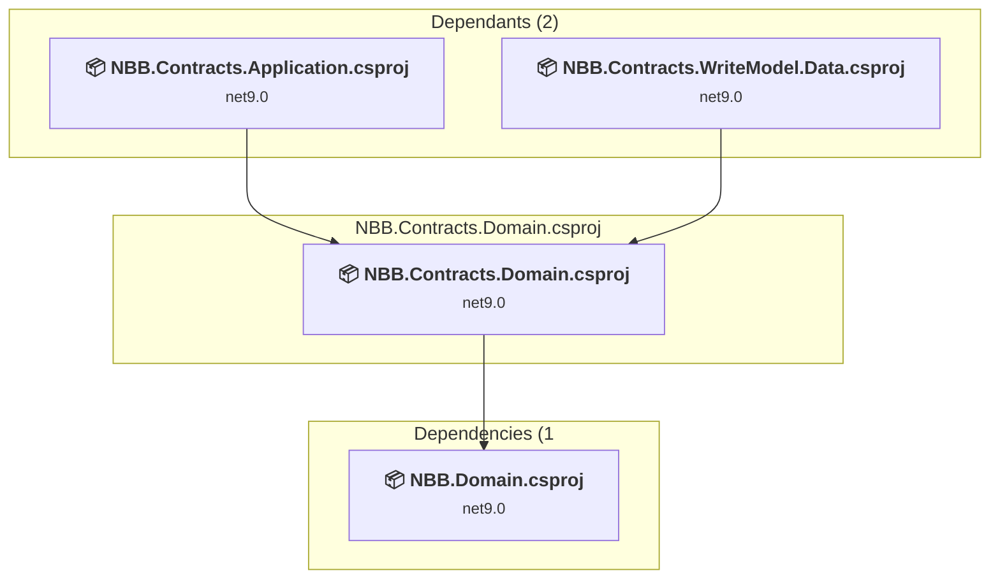

### API Compatibility

| Category | Count | Impact |
| :--- | :---: | :--- |
| 🔴 Binary Incompatible | 0 | High - Require code changes |
| 🟡 Source Incompatible | 0 | Medium - Needs re-compilation and potential conflicting API error fixing |
| 🔵 Behavioral change | 0 | Low - Behavioral changes that may require testing at runtime |
| ✅ Compatible | 337 |  |
| ***Total APIs Analyzed*** | ***337*** |  |

<a id="samplesmicroservicesnbbcontractsnbbcontractsmigrationsnbbcontractsmigrationscsproj"></a>
### samples\MicroServices\NBB.Contracts\NBB.Contracts.Migrations\NBB.Contracts.Migrations.csproj

#### Project Info

- **Current Target Framework:** net9.0
- **Proposed Target Framework:** net10.0
- **SDK-style**: True
- **Project Kind:** DotNetCoreApp
- **Dependencies**: 2
- **Dependants**: 1
- **Number of Files**: 6
- **Number of Files with Incidents**: 1
- **Lines of Code**: 292
- **Estimated LOC to modify**: 0+ (at least 0.0% of the project)

#### Dependency Graph

Legend:
📦 SDK-style project
⚙️ Classic project

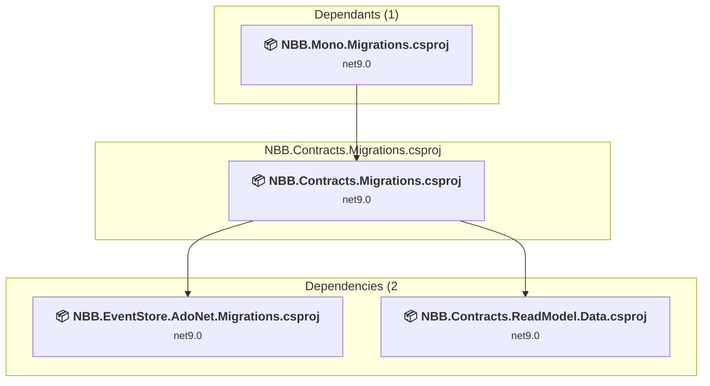

### API Compatibility

| Category | Count | Impact |
| :--- | :---: | :--- |
| 🔴 Binary Incompatible | 0 | High - Require code changes |
| 🟡 Source Incompatible | 0 | Medium - Needs re-compilation and potential conflicting API error fixing |
| 🔵 Behavioral change | 0 | Low - Behavioral changes that may require testing at runtime |
| ✅ Compatible | 264 |  |
| ***Total APIs Analyzed*** | ***264*** |  |

<a id="samplesmicroservicesnbbcontractsnbbcontractspublishedlanguagenbbcontractspublishedlanguagecsproj"></a>
### samples\MicroServices\NBB.Contracts\NBB.Contracts.PublishedLanguage\NBB.Contracts.PublishedLanguage.csproj

#### Project Info

- **Current Target Framework:** net9.0
- **Proposed Target Framework:** net10.0
- **SDK-style**: True
- **Project Kind:** ClassLibrary
- **Dependencies**: 0
- **Dependants**: 4
- **Number of Files**: 2
- **Number of Files with Incidents**: 1
- **Lines of Code**: 24
- **Estimated LOC to modify**: 0+ (at least 0.0% of the project)

#### Dependency Graph

Legend:
📦 SDK-style project
⚙️ Classic project

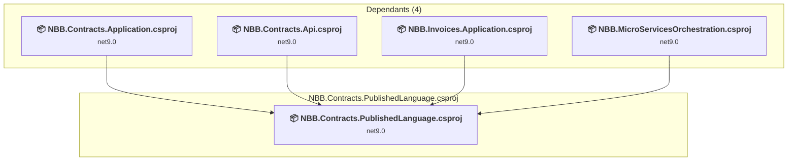

### API Compatibility

| Category | Count | Impact |
| :--- | :---: | :--- |
| 🔴 Binary Incompatible | 0 | High - Require code changes |
| 🟡 Source Incompatible | 0 | Medium - Needs re-compilation and potential conflicting API error fixing |
| 🔵 Behavioral change | 0 | Low - Behavioral changes that may require testing at runtime |
| ✅ Compatible | 115 |  |
| ***Total APIs Analyzed*** | ***115*** |  |

<a id="samplesmicroservicesnbbcontractsnbbcontractsreadmodeldatanbbcontractsreadmodeldatacsproj"></a>
### samples\MicroServices\NBB.Contracts\NBB.Contracts.ReadModel.Data\NBB.Contracts.ReadModel.Data.csproj

#### Project Info

- **Current Target Framework:** net9.0
- **Proposed Target Framework:** net10.0
- **SDK-style**: True
- **Project Kind:** ClassLibrary
- **Dependencies**: 2
- **Dependants**: 4
- **Number of Files**: 2
- **Number of Files with Incidents**: 1
- **Lines of Code**: 77
- **Estimated LOC to modify**: 0+ (at least 0.0% of the project)

#### Dependency Graph

Legend:
📦 SDK-style project
⚙️ Classic project

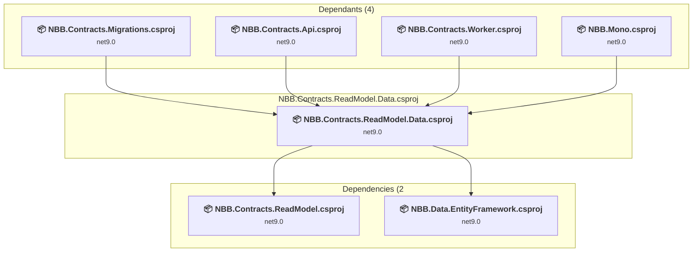

### API Compatibility

| Category | Count | Impact |
| :--- | :---: | :--- |
| 🔴 Binary Incompatible | 0 | High - Require code changes |
| 🟡 Source Incompatible | 0 | Medium - Needs re-compilation and potential conflicting API error fixing |
| 🔵 Behavioral change | 0 | Low - Behavioral changes that may require testing at runtime |
| ✅ Compatible | 70 |  |
| ***Total APIs Analyzed*** | ***70*** |  |

<a id="samplesmicroservicesnbbcontractsnbbcontractsreadmodelnbbcontractsreadmodelcsproj"></a>
### samples\MicroServices\NBB.Contracts\NBB.Contracts.ReadModel\NBB.Contracts.ReadModel.csproj

#### Project Info

- **Current Target Framework:** net9.0
- **Proposed Target Framework:** net10.0
- **SDK-style**: True
- **Project Kind:** ClassLibrary
- **Dependencies**: 0
- **Dependants**: 2
- **Number of Files**: 2
- **Number of Files with Incidents**: 1
- **Lines of Code**: 69
- **Estimated LOC to modify**: 0+ (at least 0.0% of the project)

#### Dependency Graph

Legend:
📦 SDK-style project
⚙️ Classic project

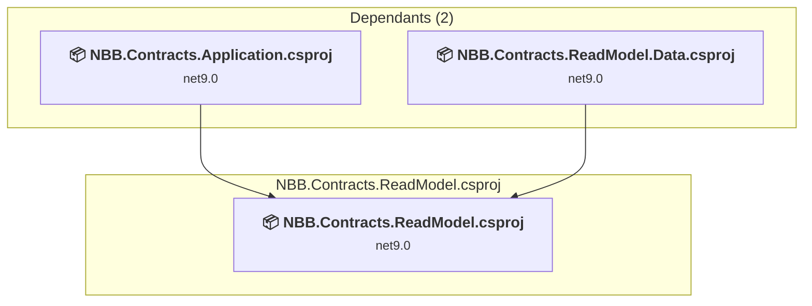

### API Compatibility

| Category | Count | Impact |
| :--- | :---: | :--- |
| 🔴 Binary Incompatible | 0 | High - Require code changes |
| 🟡 Source Incompatible | 0 | Medium - Needs re-compilation and potential conflicting API error fixing |
| 🔵 Behavioral change | 0 | Low - Behavioral changes that may require testing at runtime |
| ✅ Compatible | 98 |  |
| ***Total APIs Analyzed*** | ***98*** |  |

<a id="samplesmicroservicesnbbcontractsnbbcontractsworkernbbcontractsworkercsproj"></a>
### samples\MicroServices\NBB.Contracts\NBB.Contracts.Worker\NBB.Contracts.Worker.csproj

#### Project Info

- **Current Target Framework:** net9.0
- **Proposed Target Framework:** net10.0
- **SDK-style**: True
- **Project Kind:** DotNetCoreApp
- **Dependencies**: 12
- **Dependants**: 0
- **Number of Files**: 2
- **Number of Files with Incidents**: 2
- **Lines of Code**: 148
- **Estimated LOC to modify**: 4+ (at least 2.7% of the project)

#### Dependency Graph

Legend:
📦 SDK-style project
⚙️ Classic project

```mermaid
flowchart TB
    subgraph current["NBB.Contracts.Worker.csproj"]
        MAIN["<b>📦&nbsp;NBB.Contracts.Worker.csproj</b><br/><small>net9.0</small>"]
        click MAIN "#samplesmicroservicesnbbcontractsnbbcontractsworkernbbcontractsworkercsproj"
    end
    subgraph downstream["Dependencies (12"]
        P51["<b>📦&nbsp;NBB.Contracts.WriteModel.Data.csproj</b><br/><small>net9.0</small>"]
        P114["<b>📦&nbsp;NBB.Messaging.Rusi.csproj</b><br/><small>net9.0</small>"]
        P62["<b>📦&nbsp;NBB.Messaging.OpenTelemetry.csproj</b><br/><small>net9.0</small>"]
        P10["<b>📦&nbsp;NBB.Contracts.Application.csproj</b><br/><small>net9.0</small>"]
        P54["<b>📦&nbsp;NBB.Messaging.Host.csproj</b><br/><small>net9.0</small>"]
        P96["<b>📦&nbsp;NBB.Tools.Serilog.OpenTelemetryTracingSink.csproj</b><br/><small>net9.0</small>"]
        P49["<b>📦&nbsp;NBB.Correlation.Serilog.csproj</b><br/><small>net9.0</small>"]
        P50["<b>📦&nbsp;NBB.Contracts.ReadModel.Data.csproj</b><br/><small>net9.0</small>"]
        P99["<b>📦&nbsp;NBB.Messaging.BackwardCompatibility.csproj</b><br/><small>net9.0</small>"]
        P36["<b>📦&nbsp;NBB.EventStore.AdoNet.csproj</b><br/><small>net9.0</small>"]
        P34["<b>📦&nbsp;NBB.EventStore.csproj</b><br/><small>net9.0</small>"]
        P37["<b>📦&nbsp;NBB.Messaging.Nats.csproj</b><br/><small>net9.0</small>"]
        click P51 "#samplesmicroservicesnbbcontractsnbbcontractswritemodeldatanbbcontractswritemodeldatacsproj"
        click P114 "#srcmessagingnbbmessagingrusinbbmessagingrusicsproj"
        click P62 "#srcmessagingnbbmessagingopentelemetrynbbmessagingopentelemetrycsproj"
        click P10 "#samplesmicroservicesnbbcontractsnbbcontractsapplicationnbbcontractsapplicationcsproj"
        click P54 "#srcmessagingnbbmessaginghostnbbmessaginghostcsproj"
        click P96 "#srctoolsserilognbbtoolsserilogopentelemetrytracingsinknbbtoolsserilogopentelemetrytracingsinkcsproj"
        click P49 "#srccorrelationnbbcorrelationserilognbbcorrelationserilogcsproj"
        click P50 "#samplesmicroservicesnbbcontractsnbbcontractsreadmodeldatanbbcontractsreadmodeldatacsproj"
        click P99 "#srcmessagingnbbmessagingbackwardcompatibilitynbbmessagingbackwardcompatibilitycsproj"
        click P36 "#srceventstorenbbeventstoreadonetnbbeventstoreadonetcsproj"
        click P34 "#srceventstorenbbeventstorenbbeventstorecsproj"
        click P37 "#srcmessagingnbbmessagingnatsnbbmessagingnatscsproj"
    end
    MAIN --> P51
    MAIN --> P114
    MAIN --> P62
    MAIN --> P10
    MAIN --> P54
    MAIN --> P96
    MAIN --> P49
    MAIN --> P50
    MAIN --> P99
    MAIN --> P36
    MAIN --> P34
    MAIN --> P37

```

### API Compatibility

| Category | Count | Impact |
| :--- | :---: | :--- |
| 🔴 Binary Incompatible | 4 | High - Require code changes |
| 🟡 Source Incompatible | 0 | Medium - Needs re-compilation and potential conflicting API error fixing |
| 🔵 Behavioral change | 0 | Low - Behavioral changes that may require testing at runtime |
| ✅ Compatible | 179 |  |
| ***Total APIs Analyzed*** | ***183*** |  |

<a id="samplesmicroservicesnbbcontractsnbbcontractswritemodeldatanbbcontractswritemodeldatacsproj"></a>
### samples\MicroServices\NBB.Contracts\NBB.Contracts.WriteModel.Data\NBB.Contracts.WriteModel.Data.csproj

#### Project Info

- **Current Target Framework:** net9.0
- **Proposed Target Framework:** net10.0
- **SDK-style**: True
- **Project Kind:** ClassLibrary
- **Dependencies**: 2
- **Dependants**: 2
- **Number of Files**: 1
- **Number of Files with Incidents**: 1
- **Lines of Code**: 17
- **Estimated LOC to modify**: 0+ (at least 0.0% of the project)

#### Dependency Graph

Legend:
📦 SDK-style project
⚙️ Classic project

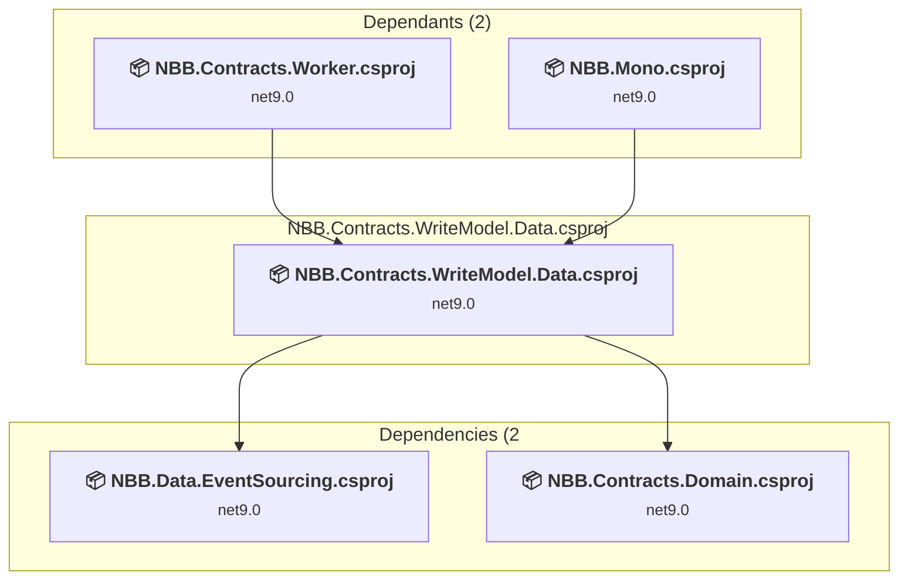

### API Compatibility

| Category | Count | Impact |
| :--- | :---: | :--- |
| 🔴 Binary Incompatible | 0 | High - Require code changes |
| 🟡 Source Incompatible | 0 | Medium - Needs re-compilation and potential conflicting API error fixing |
| 🔵 Behavioral change | 0 | Low - Behavioral changes that may require testing at runtime |
| ✅ Compatible | 4 |  |
| ***Total APIs Analyzed*** | ***4*** |  |

<a id="samplesmicroservicesnbbinvoicesfsharpnbbinvoicesfsharpapinbbinvoicesfsharpapifsproj"></a>
### samples\MicroServices\NBB.Invoices.FSharp\NBB.Invoices.FSharp.Api\NBB.Invoices.FSharp.Api.fsproj

#### Project Info

- **Current Target Framework:** net9.0
- **Proposed Target Framework:** net10.0
- **SDK-style**: True
- **Project Kind:** AspNetCore
- **Dependencies**: 4
- **Dependants**: 0
- **Number of Files**: 5
- **Number of Files with Incidents**: 1
- **Lines of Code**: 167
- **Estimated LOC to modify**: 0+ (at least 0.0% of the project)

#### Dependency Graph

Legend:
📦 SDK-style project
⚙️ Classic project

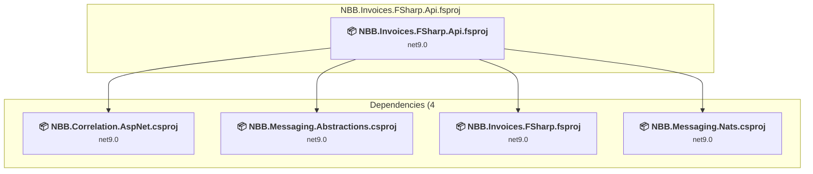

### API Compatibility

| Category | Count | Impact |
| :--- | :---: | :--- |
| 🔴 Binary Incompatible | 0 | High - Require code changes |
| 🟡 Source Incompatible | 0 | Medium - Needs re-compilation and potential conflicting API error fixing |
| 🔵 Behavioral change | 0 | Low - Behavioral changes that may require testing at runtime |
| ✅ Compatible | 0 |  |
| ***Total APIs Analyzed*** | ***0*** |  |

<a id="samplesmicroservicesnbbinvoicesfsharpnbbinvoicesfsharpworkernbbinvoicesfsharpworkerfsproj"></a>
### samples\MicroServices\NBB.Invoices.FSharp\NBB.Invoices.FSharp.Worker\NBB.Invoices.FSharp.Worker.fsproj

#### Project Info

- **Current Target Framework:** net9.0
- **Proposed Target Framework:** net10.0
- **SDK-style**: True
- **Project Kind:** DotNetCoreApp
- **Dependencies**: 6
- **Dependants**: 0
- **Number of Files**: 2
- **Number of Files with Incidents**: 1
- **Lines of Code**: 70
- **Estimated LOC to modify**: 0+ (at least 0.0% of the project)

#### Dependency Graph

Legend:
📦 SDK-style project
⚙️ Classic project

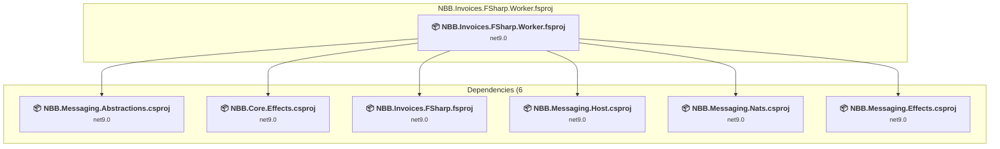

### API Compatibility

| Category | Count | Impact |
| :--- | :---: | :--- |
| 🔴 Binary Incompatible | 0 | High - Require code changes |
| 🟡 Source Incompatible | 0 | Medium - Needs re-compilation and potential conflicting API error fixing |
| 🔵 Behavioral change | 0 | Low - Behavioral changes that may require testing at runtime |
| ✅ Compatible | 0 |  |
| ***Total APIs Analyzed*** | ***0*** |  |

<a id="samplesmicroservicesnbbinvoicesfsharpnbbinvoicesfsharpnbbinvoicesfsharpfsproj"></a>
### samples\MicroServices\NBB.Invoices.FSharp\NBB.Invoices.FSharp\NBB.Invoices.FSharp.fsproj

#### Project Info

- **Current Target Framework:** net9.0
- **Proposed Target Framework:** net10.0
- **SDK-style**: True
- **Project Kind:** ClassLibrary
- **Dependencies**: 4
- **Dependants**: 2
- **Number of Files**: 6
- **Number of Files with Incidents**: 1
- **Lines of Code**: 251
- **Estimated LOC to modify**: 0+ (at least 0.0% of the project)

#### Dependency Graph

Legend:
📦 SDK-style project
⚙️ Classic project

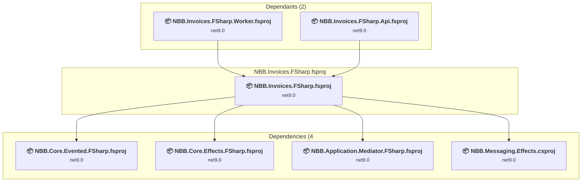

### API Compatibility

| Category | Count | Impact |
| :--- | :---: | :--- |
| 🔴 Binary Incompatible | 0 | High - Require code changes |
| 🟡 Source Incompatible | 0 | Medium - Needs re-compilation and potential conflicting API error fixing |
| 🔵 Behavioral change | 0 | Low - Behavioral changes that may require testing at runtime |
| ✅ Compatible | 0 |  |
| ***Total APIs Analyzed*** | ***0*** |  |

<a id="samplesmicroservicesnbbinvoicesnbbinvoicesapinbbinvoicesapicsproj"></a>
### samples\MicroServices\NBB.Invoices\NBB.Invoices.Api\NBB.Invoices.Api.csproj

#### Project Info

- **Current Target Framework:** net9.0
- **Proposed Target Framework:** net10.0
- **SDK-style**: True
- **Project Kind:** AspNetCore
- **Dependencies**: 5
- **Dependants**: 1
- **Number of Files**: 4
- **Number of Files with Incidents**: 1
- **Lines of Code**: 135
- **Estimated LOC to modify**: 0+ (at least 0.0% of the project)

#### Dependency Graph

Legend:
📦 SDK-style project
⚙️ Classic project

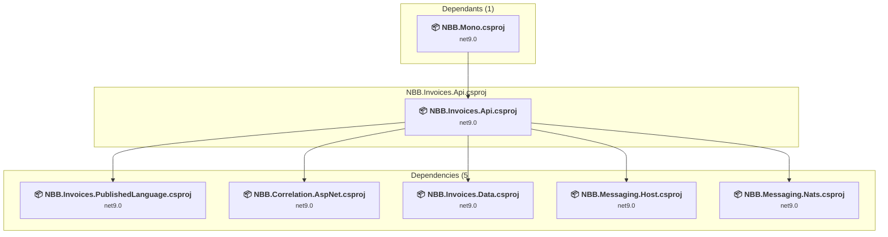

### API Compatibility

| Category | Count | Impact |
| :--- | :---: | :--- |
| 🔴 Binary Incompatible | 0 | High - Require code changes |
| 🟡 Source Incompatible | 0 | Medium - Needs re-compilation and potential conflicting API error fixing |
| 🔵 Behavioral change | 0 | Low - Behavioral changes that may require testing at runtime |
| ✅ Compatible | 120 |  |
| ***Total APIs Analyzed*** | ***120*** |  |

<a id="samplesmicroservicesnbbinvoicesnbbinvoicesapplicationnbbinvoicesapplicationcsproj"></a>
### samples\MicroServices\NBB.Invoices\NBB.Invoices.Application\NBB.Invoices.Application.csproj

#### Project Info

- **Current Target Framework:** net9.0
- **Proposed Target Framework:** net10.0
- **SDK-style**: True
- **Project Kind:** ClassLibrary
- **Dependencies**: 7
- **Dependants**: 2
- **Number of Files**: 4
- **Number of Files with Incidents**: 1
- **Lines of Code**: 154
- **Estimated LOC to modify**: 0+ (at least 0.0% of the project)

#### Dependency Graph

Legend:
📦 SDK-style project
⚙️ Classic project

```mermaid
flowchart TB
    subgraph upstream["Dependants (2)"]
        P20["<b>📦&nbsp;NBB.Invoices.Worker.csproj</b><br/><small>net9.0</small>"]
        P39["<b>📦&nbsp;NBB.Mono.csproj</b><br/><small>net9.0</small>"]
        click P20 "#samplesmicroservicesnbbinvoicesnbbinvoicesworkernbbinvoicesworkercsproj"
        click P39 "#samplesmonolithnbbmononbbmonocsproj"
    end
    subgraph current["NBB.Invoices.Application.csproj"]
        MAIN["<b>📦&nbsp;NBB.Invoices.Application.csproj</b><br/><small>net9.0</small>"]
        click MAIN "#samplesmicroservicesnbbinvoicesnbbinvoicesapplicationnbbinvoicesapplicationcsproj"
    end
    subgraph downstream["Dependencies (7"]
        P16["<b>📦&nbsp;NBB.Invoices.PublishedLanguage.csproj</b><br/><small>net9.0</small>"]
        P18["<b>📦&nbsp;NBB.Payments.PublishedLanguage.csproj</b><br/><small>net9.0</small>"]
        P52["<b>📦&nbsp;NBB.Data.Abstractions.csproj</b><br/><small>net9.0</small>"]
        P1["<b>📦&nbsp;NBB.Messaging.Abstractions.csproj</b><br/><small>net9.0</small>"]
        P13["<b>📦&nbsp;NBB.Invoices.Domain.csproj</b><br/><small>net9.0</small>"]
        P9["<b>📦&nbsp;NBB.Contracts.PublishedLanguage.csproj</b><br/><small>net9.0</small>"]
        P6["<b>📦&nbsp;NBB.Application.MediatR.csproj</b><br/><small>net9.0</small>"]
        click P16 "#samplesmicroservicesnbbinvoicesnbbinvoicespublishedlanguagenbbinvoicespublishedlanguagecsproj"
        click P18 "#samplesmicroservicesnbbpaymentsnbbpaymentspublishedlanguagenbbpaymentspublishedlanguagecsproj"
        click P52 "#srcdatanbbdataabstractionsnbbdataabstractionscsproj"
        click P1 "#srcmessagingnbbmessagingabstractionsnbbmessagingabstractionscsproj"
        click P13 "#samplesmicroservicesnbbinvoicesnbbinvoicesdomainnbbinvoicesdomaincsproj"
        click P9 "#samplesmicroservicesnbbcontractsnbbcontractspublishedlanguagenbbcontractspublishedlanguagecsproj"
        click P6 "#srcapplicationnbbapplicationmediatrnbbapplicationmediatrcsproj"
    end
    P20 --> MAIN
    P39 --> MAIN
    MAIN --> P16
    MAIN --> P18
    MAIN --> P52
    MAIN --> P1
    MAIN --> P13
    MAIN --> P9
    MAIN --> P6

```

### API Compatibility

| Category | Count | Impact |
| :--- | :---: | :--- |
| 🔴 Binary Incompatible | 0 | High - Require code changes |
| 🟡 Source Incompatible | 0 | Medium - Needs re-compilation and potential conflicting API error fixing |
| 🔵 Behavioral change | 0 | Low - Behavioral changes that may require testing at runtime |
| ✅ Compatible | 73 |  |
| ***Total APIs Analyzed*** | ***73*** |  |

<a id="samplesmicroservicesnbbinvoicesnbbinvoicesdatanbbinvoicesdatacsproj"></a>
### samples\MicroServices\NBB.Invoices\NBB.Invoices.Data\NBB.Invoices.Data.csproj

#### Project Info

- **Current Target Framework:** net9.0
- **Proposed Target Framework:** net10.0
- **SDK-style**: True
- **Project Kind:** ClassLibrary
- **Dependencies**: 3
- **Dependants**: 3
- **Number of Files**: 2
- **Number of Files with Incidents**: 1
- **Lines of Code**: 104
- **Estimated LOC to modify**: 0+ (at least 0.0% of the project)

#### Dependency Graph

Legend:
📦 SDK-style project
⚙️ Classic project

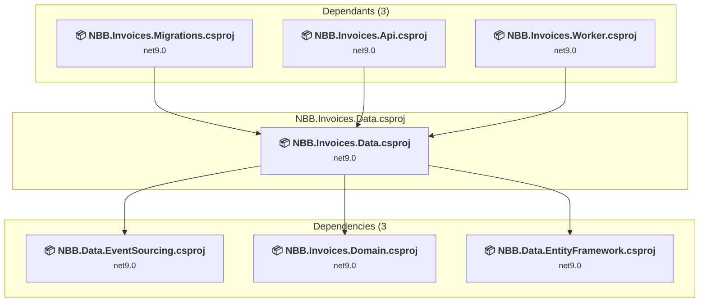

### API Compatibility

| Category | Count | Impact |
| :--- | :---: | :--- |
| 🔴 Binary Incompatible | 0 | High - Require code changes |
| 🟡 Source Incompatible | 0 | Medium - Needs re-compilation and potential conflicting API error fixing |
| 🔵 Behavioral change | 0 | Low - Behavioral changes that may require testing at runtime |
| ✅ Compatible | 87 |  |
| ***Total APIs Analyzed*** | ***87*** |  |

<a id="samplesmicroservicesnbbinvoicesnbbinvoicesdomainnbbinvoicesdomaincsproj"></a>
### samples\MicroServices\NBB.Invoices\NBB.Invoices.Domain\NBB.Invoices.Domain.csproj

#### Project Info

- **Current Target Framework:** net9.0
- **Proposed Target Framework:** net10.0
- **SDK-style**: True
- **Project Kind:** ClassLibrary
- **Dependencies**: 1
- **Dependants**: 2
- **Number of Files**: 4
- **Number of Files with Incidents**: 1
- **Lines of Code**: 153
- **Estimated LOC to modify**: 0+ (at least 0.0% of the project)

#### Dependency Graph

Legend:
📦 SDK-style project
⚙️ Classic project

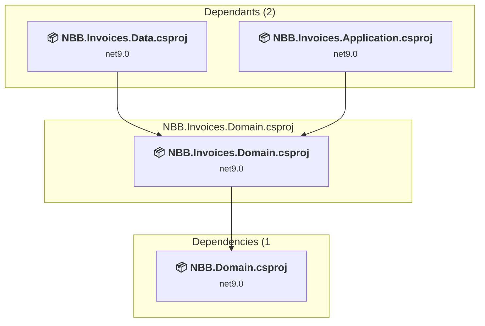

### API Compatibility

| Category | Count | Impact |
| :--- | :---: | :--- |
| 🔴 Binary Incompatible | 0 | High - Require code changes |
| 🟡 Source Incompatible | 0 | Medium - Needs re-compilation and potential conflicting API error fixing |
| 🔵 Behavioral change | 0 | Low - Behavioral changes that may require testing at runtime |
| ✅ Compatible | 216 |  |
| ***Total APIs Analyzed*** | ***216*** |  |

<a id="samplesmicroservicesnbbinvoicesnbbinvoicesmigrationsnbbinvoicesmigrationscsproj"></a>
### samples\MicroServices\NBB.Invoices\NBB.Invoices.Migrations\NBB.Invoices.Migrations.csproj

#### Project Info

- **Current Target Framework:** net9.0
- **Proposed Target Framework:** net10.0
- **SDK-style**: True
- **Project Kind:** DotNetCoreApp
- **Dependencies**: 2
- **Dependants**: 1
- **Number of Files**: 6
- **Number of Files with Incidents**: 1
- **Lines of Code**: 215
- **Estimated LOC to modify**: 0+ (at least 0.0% of the project)

#### Dependency Graph

Legend:
📦 SDK-style project
⚙️ Classic project

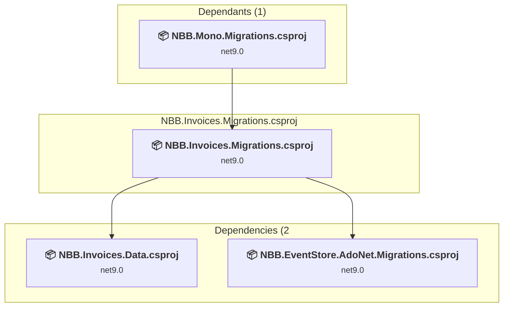

### API Compatibility

| Category | Count | Impact |
| :--- | :---: | :--- |
| 🔴 Binary Incompatible | 0 | High - Require code changes |
| 🟡 Source Incompatible | 0 | Medium - Needs re-compilation and potential conflicting API error fixing |
| 🔵 Behavioral change | 0 | Low - Behavioral changes that may require testing at runtime |
| ✅ Compatible | 174 |  |
| ***Total APIs Analyzed*** | ***174*** |  |

<a id="samplesmicroservicesnbbinvoicesnbbinvoicespublishedlanguagenbbinvoicespublishedlanguagecsproj"></a>
### samples\MicroServices\NBB.Invoices\NBB.Invoices.PublishedLanguage\NBB.Invoices.PublishedLanguage.csproj

#### Project Info

- **Current Target Framework:** net9.0
- **Proposed Target Framework:** net10.0
- **SDK-style**: True
- **Project Kind:** ClassLibrary
- **Dependencies**: 0
- **Dependants**: 4
- **Number of Files**: 2
- **Number of Files with Incidents**: 1
- **Lines of Code**: 32
- **Estimated LOC to modify**: 0+ (at least 0.0% of the project)

#### Dependency Graph

Legend:
📦 SDK-style project
⚙️ Classic project

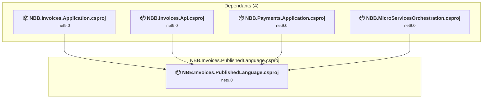

### API Compatibility

| Category | Count | Impact |
| :--- | :---: | :--- |
| 🔴 Binary Incompatible | 0 | High - Require code changes |
| 🟡 Source Incompatible | 0 | Medium - Needs re-compilation and potential conflicting API error fixing |
| 🔵 Behavioral change | 0 | Low - Behavioral changes that may require testing at runtime |
| ✅ Compatible | 149 |  |
| ***Total APIs Analyzed*** | ***149*** |  |

<a id="samplesmicroservicesnbbinvoicesnbbinvoicesworkernbbinvoicesworkercsproj"></a>
### samples\MicroServices\NBB.Invoices\NBB.Invoices.Worker\NBB.Invoices.Worker.csproj

#### Project Info

- **Current Target Framework:** net9.0
- **Proposed Target Framework:** net10.0
- **SDK-style**: True
- **Project Kind:** DotNetCoreApp
- **Dependencies**: 7
- **Dependants**: 0
- **Number of Files**: 1
- **Number of Files with Incidents**: 2
- **Lines of Code**: 90
- **Estimated LOC to modify**: 5+ (at least 5.6% of the project)

#### Dependency Graph

Legend:
📦 SDK-style project
⚙️ Classic project

```mermaid
flowchart TB
    subgraph current["NBB.Invoices.Worker.csproj"]
        MAIN["<b>📦&nbsp;NBB.Invoices.Worker.csproj</b><br/><small>net9.0</small>"]
        click MAIN "#samplesmicroservicesnbbinvoicesnbbinvoicesworkernbbinvoicesworkercsproj"
    end
    subgraph downstream["Dependencies (7"]
        P17["<b>📦&nbsp;NBB.Invoices.Application.csproj</b><br/><small>net9.0</small>"]
        P14["<b>📦&nbsp;NBB.Invoices.Data.csproj</b><br/><small>net9.0</small>"]
        P54["<b>📦&nbsp;NBB.Messaging.Host.csproj</b><br/><small>net9.0</small>"]
        P49["<b>📦&nbsp;NBB.Correlation.Serilog.csproj</b><br/><small>net9.0</small>"]
        P36["<b>📦&nbsp;NBB.EventStore.AdoNet.csproj</b><br/><small>net9.0</small>"]
        P34["<b>📦&nbsp;NBB.EventStore.csproj</b><br/><small>net9.0</small>"]
        P37["<b>📦&nbsp;NBB.Messaging.Nats.csproj</b><br/><small>net9.0</small>"]
        click P17 "#samplesmicroservicesnbbinvoicesnbbinvoicesapplicationnbbinvoicesapplicationcsproj"
        click P14 "#samplesmicroservicesnbbinvoicesnbbinvoicesdatanbbinvoicesdatacsproj"
        click P54 "#srcmessagingnbbmessaginghostnbbmessaginghostcsproj"
        click P49 "#srccorrelationnbbcorrelationserilognbbcorrelationserilogcsproj"
        click P36 "#srceventstorenbbeventstoreadonetnbbeventstoreadonetcsproj"
        click P34 "#srceventstorenbbeventstorenbbeventstorecsproj"
        click P37 "#srcmessagingnbbmessagingnatsnbbmessagingnatscsproj"
    end
    MAIN --> P17
    MAIN --> P14
    MAIN --> P54
    MAIN --> P49
    MAIN --> P36
    MAIN --> P34
    MAIN --> P37

```

### API Compatibility

| Category | Count | Impact |
| :--- | :---: | :--- |
| 🔴 Binary Incompatible | 4 | High - Require code changes |
| 🟡 Source Incompatible | 0 | Medium - Needs re-compilation and potential conflicting API error fixing |
| 🔵 Behavioral change | 1 | Low - Behavioral changes that may require testing at runtime |
| ✅ Compatible | 96 |  |
| ***Total APIs Analyzed*** | ***101*** |  |

<a id="samplesmicroservicesnbbmicroservicesorchestrationnbbmicroservicesorchestrationcsproj"></a>
### samples\MicroServices\NBB.MicroServicesOrchestration\NBB.MicroServicesOrchestration.csproj

#### Project Info

- **Current Target Framework:** net9.0
- **Proposed Target Framework:** net10.0
- **SDK-style**: True
- **Project Kind:** DotNetCoreApp
- **Dependencies**: 10
- **Dependants**: 1
- **Number of Files**: 2
- **Number of Files with Incidents**: 3
- **Lines of Code**: 152
- **Estimated LOC to modify**: 4+ (at least 2.6% of the project)

#### Dependency Graph

Legend:
📦 SDK-style project
⚙️ Classic project

```mermaid
flowchart TB
    subgraph upstream["Dependants (1)"]
        P39["<b>📦&nbsp;NBB.Mono.csproj</b><br/><small>net9.0</small>"]
        click P39 "#samplesmonolithnbbmononbbmonocsproj"
    end
    subgraph current["NBB.MicroServicesOrchestration.csproj"]
        MAIN["<b>📦&nbsp;NBB.MicroServicesOrchestration.csproj</b><br/><small>net9.0</small>"]
        click MAIN "#samplesmicroservicesnbbmicroservicesorchestrationnbbmicroservicesorchestrationcsproj"
    end
    subgraph downstream["Dependencies (10"]
        P9["<b>📦&nbsp;NBB.Contracts.PublishedLanguage.csproj</b><br/><small>net9.0</small>"]
        P54["<b>📦&nbsp;NBB.Messaging.Host.csproj</b><br/><small>net9.0</small>"]
        P16["<b>📦&nbsp;NBB.Invoices.PublishedLanguage.csproj</b><br/><small>net9.0</small>"]
        P18["<b>📦&nbsp;NBB.Payments.PublishedLanguage.csproj</b><br/><small>net9.0</small>"]
        P34["<b>📦&nbsp;NBB.EventStore.csproj</b><br/><small>net9.0</small>"]
        P49["<b>📦&nbsp;NBB.Correlation.Serilog.csproj</b><br/><small>net9.0</small>"]
        P37["<b>📦&nbsp;NBB.Messaging.Nats.csproj</b><br/><small>net9.0</small>"]
        P65["<b>📦&nbsp;NBB.ProcessManager.Runtime.csproj</b><br/><small>net9.0</small>"]
        P36["<b>📦&nbsp;NBB.EventStore.AdoNet.csproj</b><br/><small>net9.0</small>"]
        P64["<b>📦&nbsp;NBB.ProcessManager.Definition.csproj</b><br/><small>net9.0</small>"]
        click P9 "#samplesmicroservicesnbbcontractsnbbcontractspublishedlanguagenbbcontractspublishedlanguagecsproj"
        click P54 "#srcmessagingnbbmessaginghostnbbmessaginghostcsproj"
        click P16 "#samplesmicroservicesnbbinvoicesnbbinvoicespublishedlanguagenbbinvoicespublishedlanguagecsproj"
        click P18 "#samplesmicroservicesnbbpaymentsnbbpaymentspublishedlanguagenbbpaymentspublishedlanguagecsproj"
        click P34 "#srceventstorenbbeventstorenbbeventstorecsproj"
        click P49 "#srccorrelationnbbcorrelationserilognbbcorrelationserilogcsproj"
        click P37 "#srcmessagingnbbmessagingnatsnbbmessagingnatscsproj"
        click P65 "#srcorchestrationnbbprocessmanagerruntimenbbprocessmanagerruntimecsproj"
        click P36 "#srceventstorenbbeventstoreadonetnbbeventstoreadonetcsproj"
        click P64 "#srcorchestrationnbbprocessmanagerdefinitionnbbprocessmanagerdefinitioncsproj"
    end
    P39 --> MAIN
    MAIN --> P9
    MAIN --> P54
    MAIN --> P16
    MAIN --> P18
    MAIN --> P34
    MAIN --> P49
    MAIN --> P37
    MAIN --> P65
    MAIN --> P36
    MAIN --> P64

```

### API Compatibility

| Category | Count | Impact |
| :--- | :---: | :--- |
| 🔴 Binary Incompatible | 1 | High - Require code changes |
| 🟡 Source Incompatible | 2 | Medium - Needs re-compilation and potential conflicting API error fixing |
| 🔵 Behavioral change | 1 | Low - Behavioral changes that may require testing at runtime |
| ✅ Compatible | 255 |  |
| ***Total APIs Analyzed*** | ***259*** |  |

<a id="samplesmicroservicesnbbpaymentsnbbpaymentsapinbbpaymentsapicsproj"></a>
### samples\MicroServices\NBB.Payments\NBB.Payments.Api\NBB.Payments.Api.csproj

#### Project Info

- **Current Target Framework:** net9.0
- **Proposed Target Framework:** net10.0
- **SDK-style**: True
- **Project Kind:** AspNetCore
- **Dependencies**: 4
- **Dependants**: 1
- **Number of Files**: 4
- **Number of Files with Incidents**: 1
- **Lines of Code**: 119
- **Estimated LOC to modify**: 0+ (at least 0.0% of the project)

#### Dependency Graph

Legend:
📦 SDK-style project
⚙️ Classic project

```mermaid
flowchart TB
    subgraph upstream["Dependants (1)"]
        P39["<b>📦&nbsp;NBB.Mono.csproj</b><br/><small>net9.0</small>"]
        click P39 "#samplesmonolithnbbmononbbmonocsproj"
    end
    subgraph current["NBB.Payments.Api.csproj"]
        MAIN["<b>📦&nbsp;NBB.Payments.Api.csproj</b><br/><small>net9.0</small>"]
        click MAIN "#samplesmicroservicesnbbpaymentsnbbpaymentsapinbbpaymentsapicsproj"
    end
    subgraph downstream["Dependencies (4"]
        P48["<b>📦&nbsp;NBB.Correlation.AspNet.csproj</b><br/><small>net9.0</small>"]
        P22["<b>📦&nbsp;NBB.Payments.Data.csproj</b><br/><small>net9.0</small>"]
        P18["<b>📦&nbsp;NBB.Payments.PublishedLanguage.csproj</b><br/><small>net9.0</small>"]
        P37["<b>📦&nbsp;NBB.Messaging.Nats.csproj</b><br/><small>net9.0</small>"]
        click P48 "#srccorrelationnbbcorrelationaspnetnbbcorrelationaspnetcsproj"
        click P22 "#samplesmicroservicesnbbpaymentsnbbpaymentsdatanbbpaymentsdatacsproj"
        click P18 "#samplesmicroservicesnbbpaymentsnbbpaymentspublishedlanguagenbbpaymentspublishedlanguagecsproj"
        click P37 "#srcmessagingnbbmessagingnatsnbbmessagingnatscsproj"
    end
    P39 --> MAIN
    MAIN --> P48
    MAIN --> P22
    MAIN --> P18
    MAIN --> P37

```

### API Compatibility

| Category | Count | Impact |
| :--- | :---: | :--- |
| 🔴 Binary Incompatible | 0 | High - Require code changes |
| 🟡 Source Incompatible | 0 | Medium - Needs re-compilation and potential conflicting API error fixing |
| 🔵 Behavioral change | 0 | Low - Behavioral changes that may require testing at runtime |
| ✅ Compatible | 110 |  |
| ***Total APIs Analyzed*** | ***110*** |  |

<a id="samplesmicroservicesnbbpaymentsnbbpaymentsapplicationnbbpaymentsapplicationcsproj"></a>
### samples\MicroServices\NBB.Payments\NBB.Payments.Application\NBB.Payments.Application.csproj

#### Project Info

- **Current Target Framework:** net9.0
- **Proposed Target Framework:** net10.0
- **SDK-style**: True
- **Project Kind:** ClassLibrary
- **Dependencies**: 6
- **Dependants**: 2
- **Number of Files**: 3
- **Number of Files with Incidents**: 1
- **Lines of Code**: 107
- **Estimated LOC to modify**: 0+ (at least 0.0% of the project)

#### Dependency Graph

Legend:
📦 SDK-style project
⚙️ Classic project

```mermaid
flowchart TB
    subgraph upstream["Dependants (2)"]
        P26["<b>📦&nbsp;NBB.Payments.Worker.csproj</b><br/><small>net9.0</small>"]
        P39["<b>📦&nbsp;NBB.Mono.csproj</b><br/><small>net9.0</small>"]
        click P26 "#samplesmicroservicesnbbpaymentsnbbpaymentsworkernbbpaymentsworkercsproj"
        click P39 "#samplesmonolithnbbmononbbmonocsproj"
    end
    subgraph current["NBB.Payments.Application.csproj"]
        MAIN["<b>📦&nbsp;NBB.Payments.Application.csproj</b><br/><small>net9.0</small>"]
        click MAIN "#samplesmicroservicesnbbpaymentsnbbpaymentsapplicationnbbpaymentsapplicationcsproj"
    end
    subgraph downstream["Dependencies (6"]
        P16["<b>📦&nbsp;NBB.Invoices.PublishedLanguage.csproj</b><br/><small>net9.0</small>"]
        P1["<b>📦&nbsp;NBB.Messaging.Abstractions.csproj</b><br/><small>net9.0</small>"]
        P22["<b>📦&nbsp;NBB.Payments.Data.csproj</b><br/><small>net9.0</small>"]
        P18["<b>📦&nbsp;NBB.Payments.PublishedLanguage.csproj</b><br/><small>net9.0</small>"]
        P6["<b>📦&nbsp;NBB.Application.MediatR.csproj</b><br/><small>net9.0</small>"]
        P21["<b>📦&nbsp;NBB.Payments.Domain.csproj</b><br/><small>net9.0</small>"]
        click P16 "#samplesmicroservicesnbbinvoicesnbbinvoicespublishedlanguagenbbinvoicespublishedlanguagecsproj"
        click P1 "#srcmessagingnbbmessagingabstractionsnbbmessagingabstractionscsproj"
        click P22 "#samplesmicroservicesnbbpaymentsnbbpaymentsdatanbbpaymentsdatacsproj"
        click P18 "#samplesmicroservicesnbbpaymentsnbbpaymentspublishedlanguagenbbpaymentspublishedlanguagecsproj"
        click P6 "#srcapplicationnbbapplicationmediatrnbbapplicationmediatrcsproj"
        click P21 "#samplesmicroservicesnbbpaymentsnbbpaymentsdomainnbbpaymentsdomaincsproj"
    end
    P26 --> MAIN
    P39 --> MAIN
    MAIN --> P16
    MAIN --> P1
    MAIN --> P22
    MAIN --> P18
    MAIN --> P6
    MAIN --> P21

```

### API Compatibility

| Category | Count | Impact |
| :--- | :---: | :--- |
| 🔴 Binary Incompatible | 0 | High - Require code changes |
| 🟡 Source Incompatible | 0 | Medium - Needs re-compilation and potential conflicting API error fixing |
| 🔵 Behavioral change | 0 | Low - Behavioral changes that may require testing at runtime |
| ✅ Compatible | 68 |  |
| ***Total APIs Analyzed*** | ***68*** |  |

<a id="samplesmicroservicesnbbpaymentsnbbpaymentsdatanbbpaymentsdatacsproj"></a>
### samples\MicroServices\NBB.Payments\NBB.Payments.Data\NBB.Payments.Data.csproj

#### Project Info

- **Current Target Framework:** net9.0
- **Proposed Target Framework:** net10.0
- **SDK-style**: True
- **Project Kind:** ClassLibrary
- **Dependencies**: 2
- **Dependants**: 3
- **Number of Files**: 2
- **Number of Files with Incidents**: 1
- **Lines of Code**: 108
- **Estimated LOC to modify**: 0+ (at least 0.0% of the project)

#### Dependency Graph

Legend:
📦 SDK-style project
⚙️ Classic project

```mermaid
flowchart TB
    subgraph upstream["Dependants (3)"]
        P23["<b>📦&nbsp;NBB.Payments.Migrations.csproj</b><br/><small>net9.0</small>"]
        P24["<b>📦&nbsp;NBB.Payments.Application.csproj</b><br/><small>net9.0</small>"]
        P25["<b>📦&nbsp;NBB.Payments.Api.csproj</b><br/><small>net9.0</small>"]
        click P23 "#samplesmicroservicesnbbpaymentsnbbpaymentsmigrationsnbbpaymentsmigrationscsproj"
        click P24 "#samplesmicroservicesnbbpaymentsnbbpaymentsapplicationnbbpaymentsapplicationcsproj"
        click P25 "#samplesmicroservicesnbbpaymentsnbbpaymentsapinbbpaymentsapicsproj"
    end
    subgraph current["NBB.Payments.Data.csproj"]
        MAIN["<b>📦&nbsp;NBB.Payments.Data.csproj</b><br/><small>net9.0</small>"]
        click MAIN "#samplesmicroservicesnbbpaymentsnbbpaymentsdatanbbpaymentsdatacsproj"
    end
    subgraph downstream["Dependencies (2"]
        P3["<b>📦&nbsp;NBB.Data.EntityFramework.csproj</b><br/><small>net9.0</small>"]
        P21["<b>📦&nbsp;NBB.Payments.Domain.csproj</b><br/><small>net9.0</small>"]
        click P3 "#srcdatanbbdataentityframeworknbbdataentityframeworkcsproj"
        click P21 "#samplesmicroservicesnbbpaymentsnbbpaymentsdomainnbbpaymentsdomaincsproj"
    end
    P23 --> MAIN
    P24 --> MAIN
    P25 --> MAIN
    MAIN --> P3
    MAIN --> P21

```

### API Compatibility

| Category | Count | Impact |
| :--- | :---: | :--- |
| 🔴 Binary Incompatible | 0 | High - Require code changes |
| 🟡 Source Incompatible | 0 | Medium - Needs re-compilation and potential conflicting API error fixing |
| 🔵 Behavioral change | 0 | Low - Behavioral changes that may require testing at runtime |
| ✅ Compatible | 105 |  |
| ***Total APIs Analyzed*** | ***105*** |  |

<a id="samplesmicroservicesnbbpaymentsnbbpaymentsdomainnbbpaymentsdomaincsproj"></a>
### samples\MicroServices\NBB.Payments\NBB.Payments.Domain\NBB.Payments.Domain.csproj

#### Project Info

- **Current Target Framework:** net9.0
- **Proposed Target Framework:** net10.0
- **SDK-style**: True
- **Project Kind:** ClassLibrary
- **Dependencies**: 1
- **Dependants**: 2
- **Number of Files**: 3
- **Number of Files with Incidents**: 1
- **Lines of Code**: 93
- **Estimated LOC to modify**: 0+ (at least 0.0% of the project)

#### Dependency Graph

Legend:
📦 SDK-style project
⚙️ Classic project

```mermaid
flowchart TB
    subgraph upstream["Dependants (2)"]
        P22["<b>📦&nbsp;NBB.Payments.Data.csproj</b><br/><small>net9.0</small>"]
        P24["<b>📦&nbsp;NBB.Payments.Application.csproj</b><br/><small>net9.0</small>"]
        click P22 "#samplesmicroservicesnbbpaymentsnbbpaymentsdatanbbpaymentsdatacsproj"
        click P24 "#samplesmicroservicesnbbpaymentsnbbpaymentsapplicationnbbpaymentsapplicationcsproj"
    end
    subgraph current["NBB.Payments.Domain.csproj"]
        MAIN["<b>📦&nbsp;NBB.Payments.Domain.csproj</b><br/><small>net9.0</small>"]
        click MAIN "#samplesmicroservicesnbbpaymentsnbbpaymentsdomainnbbpaymentsdomaincsproj"
    end
    subgraph downstream["Dependencies (1"]
        P5["<b>📦&nbsp;NBB.Domain.csproj</b><br/><small>net9.0</small>"]
        click P5 "#srcdomainnbbdomainnbbdomaincsproj"
    end
    P22 --> MAIN
    P24 --> MAIN
    MAIN --> P5

```

### API Compatibility

| Category | Count | Impact |
| :--- | :---: | :--- |
| 🔴 Binary Incompatible | 0 | High - Require code changes |
| 🟡 Source Incompatible | 0 | Medium - Needs re-compilation and potential conflicting API error fixing |
| 🔵 Behavioral change | 0 | Low - Behavioral changes that may require testing at runtime |
| ✅ Compatible | 204 |  |
| ***Total APIs Analyzed*** | ***204*** |  |

<a id="samplesmicroservicesnbbpaymentsnbbpaymentsmigrationsnbbpaymentsmigrationscsproj"></a>
### samples\MicroServices\NBB.Payments\NBB.Payments.Migrations\NBB.Payments.Migrations.csproj

#### Project Info

- **Current Target Framework:** net9.0
- **Proposed Target Framework:** net10.0
- **SDK-style**: True
- **Project Kind:** DotNetCoreApp
- **Dependencies**: 2
- **Dependants**: 1
- **Number of Files**: 6
- **Number of Files with Incidents**: 1
- **Lines of Code**: 292
- **Estimated LOC to modify**: 0+ (at least 0.0% of the project)

#### Dependency Graph

Legend:
📦 SDK-style project
⚙️ Classic project

```mermaid
flowchart TB
    subgraph upstream["Dependants (1)"]
        P46["<b>📦&nbsp;NBB.Mono.Migrations.csproj</b><br/><small>net9.0</small>"]
        click P46 "#samplesmonolithnbbmonomigrationsnbbmonomigrationscsproj"
    end
    subgraph current["NBB.Payments.Migrations.csproj"]
        MAIN["<b>📦&nbsp;NBB.Payments.Migrations.csproj</b><br/><small>net9.0</small>"]
        click MAIN "#samplesmicroservicesnbbpaymentsnbbpaymentsmigrationsnbbpaymentsmigrationscsproj"
    end
    subgraph downstream["Dependencies (2"]
        P22["<b>📦&nbsp;NBB.Payments.Data.csproj</b><br/><small>net9.0</small>"]
        P44["<b>📦&nbsp;NBB.EventStore.AdoNet.Migrations.csproj</b><br/><small>net9.0</small>"]
        click P22 "#samplesmicroservicesnbbpaymentsnbbpaymentsdatanbbpaymentsdatacsproj"
        click P44 "#srceventstorenbbeventstoreadonetmigrationsnbbeventstoreadonetmigrationscsproj"
    end
    P46 --> MAIN
    MAIN --> P22
    MAIN --> P44

```

### API Compatibility

| Category | Count | Impact |
| :--- | :---: | :--- |
| 🔴 Binary Incompatible | 0 | High - Require code changes |
| 🟡 Source Incompatible | 0 | Medium - Needs re-compilation and potential conflicting API error fixing |
| 🔵 Behavioral change | 0 | Low - Behavioral changes that may require testing at runtime |
| ✅ Compatible | 260 |  |
| ***Total APIs Analyzed*** | ***260*** |  |

<a id="samplesmicroservicesnbbpaymentsnbbpaymentspublishedlanguagenbbpaymentspublishedlanguagecsproj"></a>
### samples\MicroServices\NBB.Payments\NBB.Payments.PublishedLanguage\NBB.Payments.PublishedLanguage.csproj

#### Project Info

- **Current Target Framework:** net9.0
- **Proposed Target Framework:** net10.0
- **SDK-style**: True
- **Project Kind:** ClassLibrary
- **Dependencies**: 0
- **Dependants**: 4
- **Number of Files**: 2
- **Number of Files with Incidents**: 1
- **Lines of Code**: 23
- **Estimated LOC to modify**: 0+ (at least 0.0% of the project)

#### Dependency Graph

Legend:
📦 SDK-style project
⚙️ Classic project

```mermaid
flowchart TB
    subgraph upstream["Dependants (4)"]
        P17["<b>📦&nbsp;NBB.Invoices.Application.csproj</b><br/><small>net9.0</small>"]
        P24["<b>📦&nbsp;NBB.Payments.Application.csproj</b><br/><small>net9.0</small>"]
        P25["<b>📦&nbsp;NBB.Payments.Api.csproj</b><br/><small>net9.0</small>"]
        P100["<b>📦&nbsp;NBB.MicroServicesOrchestration.csproj</b><br/><small>net9.0</small>"]
        click P17 "#samplesmicroservicesnbbinvoicesnbbinvoicesapplicationnbbinvoicesapplicationcsproj"
        click P24 "#samplesmicroservicesnbbpaymentsnbbpaymentsapplicationnbbpaymentsapplicationcsproj"
        click P25 "#samplesmicroservicesnbbpaymentsnbbpaymentsapinbbpaymentsapicsproj"
        click P100 "#samplesmicroservicesnbbmicroservicesorchestrationnbbmicroservicesorchestrationcsproj"
    end
    subgraph current["NBB.Payments.PublishedLanguage.csproj"]
        MAIN["<b>📦&nbsp;NBB.Payments.PublishedLanguage.csproj</b><br/><small>net9.0</small>"]
        click MAIN "#samplesmicroservicesnbbpaymentsnbbpaymentspublishedlanguagenbbpaymentspublishedlanguagecsproj"
    end
    P17 --> MAIN
    P24 --> MAIN
    P25 --> MAIN
    P100 --> MAIN

```

### API Compatibility

| Category | Count | Impact |
| :--- | :---: | :--- |
| 🔴 Binary Incompatible | 0 | High - Require code changes |
| 🟡 Source Incompatible | 0 | Medium - Needs re-compilation and potential conflicting API error fixing |
| 🔵 Behavioral change | 0 | Low - Behavioral changes that may require testing at runtime |
| ✅ Compatible | 157 |  |
| ***Total APIs Analyzed*** | ***157*** |  |

<a id="samplesmicroservicesnbbpaymentsnbbpaymentsworkernbbpaymentsworkercsproj"></a>
### samples\MicroServices\NBB.Payments\NBB.Payments.Worker\NBB.Payments.Worker.csproj

#### Project Info

- **Current Target Framework:** net9.0
- **Proposed Target Framework:** net10.0
- **SDK-style**: True
- **Project Kind:** DotNetCoreApp
- **Dependencies**: 6
- **Dependants**: 0
- **Number of Files**: 1
- **Number of Files with Incidents**: 2
- **Lines of Code**: 89
- **Estimated LOC to modify**: 5+ (at least 5.6% of the project)

#### Dependency Graph

Legend:
📦 SDK-style project
⚙️ Classic project

```mermaid
flowchart TB
    subgraph current["NBB.Payments.Worker.csproj"]
        MAIN["<b>📦&nbsp;NBB.Payments.Worker.csproj</b><br/><small>net9.0</small>"]
        click MAIN "#samplesmicroservicesnbbpaymentsnbbpaymentsworkernbbpaymentsworkercsproj"
    end
    subgraph downstream["Dependencies (6"]
        P24["<b>📦&nbsp;NBB.Payments.Application.csproj</b><br/><small>net9.0</small>"]
        P54["<b>📦&nbsp;NBB.Messaging.Host.csproj</b><br/><small>net9.0</small>"]
        P49["<b>📦&nbsp;NBB.Correlation.Serilog.csproj</b><br/><small>net9.0</small>"]
        P36["<b>📦&nbsp;NBB.EventStore.AdoNet.csproj</b><br/><small>net9.0</small>"]
        P34["<b>📦&nbsp;NBB.EventStore.csproj</b><br/><small>net9.0</small>"]
        P37["<b>📦&nbsp;NBB.Messaging.Nats.csproj</b><br/><small>net9.0</small>"]
        click P24 "#samplesmicroservicesnbbpaymentsnbbpaymentsapplicationnbbpaymentsapplicationcsproj"
        click P54 "#srcmessagingnbbmessaginghostnbbmessaginghostcsproj"
        click P49 "#srccorrelationnbbcorrelationserilognbbcorrelationserilogcsproj"
        click P36 "#srceventstorenbbeventstoreadonetnbbeventstoreadonetcsproj"
        click P34 "#srceventstorenbbeventstorenbbeventstorecsproj"
        click P37 "#srcmessagingnbbmessagingnatsnbbmessagingnatscsproj"
    end
    MAIN --> P24
    MAIN --> P54
    MAIN --> P49
    MAIN --> P36
    MAIN --> P34
    MAIN --> P37

```

### API Compatibility

| Category | Count | Impact |
| :--- | :---: | :--- |
| 🔴 Binary Incompatible | 4 | High - Require code changes |
| 🟡 Source Incompatible | 0 | Medium - Needs re-compilation and potential conflicting API error fixing |
| 🔵 Behavioral change | 1 | Low - Behavioral changes that may require testing at runtime |
| ✅ Compatible | 98 |  |
| ***Total APIs Analyzed*** | ***103*** |  |

<a id="samplesmonolithnbbmonomigrationsnbbmonomigrationscsproj"></a>
### samples\Monolith\NBB.Mono.Migrations\NBB.Mono.Migrations.csproj

#### Project Info

- **Current Target Framework:** net9.0
- **Proposed Target Framework:** net10.0
- **SDK-style**: True
- **Project Kind:** DotNetCoreApp
- **Dependencies**: 4
- **Dependants**: 0
- **Number of Files**: 2
- **Number of Files with Incidents**: 1
- **Lines of Code**: 22
- **Estimated LOC to modify**: 0+ (at least 0.0% of the project)

#### Dependency Graph

Legend:
📦 SDK-style project
⚙️ Classic project

```mermaid
flowchart TB
    subgraph current["NBB.Mono.Migrations.csproj"]
        MAIN["<b>📦&nbsp;NBB.Mono.Migrations.csproj</b><br/><small>net9.0</small>"]
        click MAIN "#samplesmonolithnbbmonomigrationsnbbmonomigrationscsproj"
    end
    subgraph downstream["Dependencies (4"]
        P23["<b>📦&nbsp;NBB.Payments.Migrations.csproj</b><br/><small>net9.0</small>"]
        P44["<b>📦&nbsp;NBB.EventStore.AdoNet.Migrations.csproj</b><br/><small>net9.0</small>"]
        P15["<b>📦&nbsp;NBB.Invoices.Migrations.csproj</b><br/><small>net9.0</small>"]
        P8["<b>📦&nbsp;NBB.Contracts.Migrations.csproj</b><br/><small>net9.0</small>"]
        click P23 "#samplesmicroservicesnbbpaymentsnbbpaymentsmigrationsnbbpaymentsmigrationscsproj"
        click P44 "#srceventstorenbbeventstoreadonetmigrationsnbbeventstoreadonetmigrationscsproj"
        click P15 "#samplesmicroservicesnbbinvoicesnbbinvoicesmigrationsnbbinvoicesmigrationscsproj"
        click P8 "#samplesmicroservicesnbbcontractsnbbcontractsmigrationsnbbcontractsmigrationscsproj"
    end
    MAIN --> P23
    MAIN --> P44
    MAIN --> P15
    MAIN --> P8

```

### API Compatibility

| Category | Count | Impact |
| :--- | :---: | :--- |
| 🔴 Binary Incompatible | 0 | High - Require code changes |
| 🟡 Source Incompatible | 0 | Medium - Needs re-compilation and potential conflicting API error fixing |
| 🔵 Behavioral change | 0 | Low - Behavioral changes that may require testing at runtime |
| ✅ Compatible | 13 |  |
| ***Total APIs Analyzed*** | ***13*** |  |

<a id="samplesmonolithnbbmononbbmonocsproj"></a>
### samples\Monolith\NBB.Mono\NBB.Mono.csproj

#### Project Info

- **Current Target Framework:** net9.0
- **Proposed Target Framework:** net10.0
- **SDK-style**: True
- **Project Kind:** AspNetCore
- **Dependencies**: 15
- **Dependants**: 0
- **Number of Files**: 4
- **Number of Files with Incidents**: 2
- **Lines of Code**: 158
- **Estimated LOC to modify**: 1+ (at least 0.6% of the project)

#### Dependency Graph

Legend:
📦 SDK-style project
⚙️ Classic project

```mermaid
flowchart TB
    subgraph current["NBB.Mono.csproj"]
        MAIN["<b>📦&nbsp;NBB.Mono.csproj</b><br/><small>net9.0</small>"]
        click MAIN "#samplesmonolithnbbmononbbmonocsproj"
    end
    subgraph downstream["Dependencies (15"]
        P48["<b>📦&nbsp;NBB.Correlation.AspNet.csproj</b><br/><small>net9.0</small>"]
        P19["<b>📦&nbsp;NBB.Invoices.Api.csproj</b><br/><small>net9.0</small>"]
        P34["<b>📦&nbsp;NBB.EventStore.csproj</b><br/><small>net9.0</small>"]
        P17["<b>📦&nbsp;NBB.Invoices.Application.csproj</b><br/><small>net9.0</small>"]
        P49["<b>📦&nbsp;NBB.Correlation.Serilog.csproj</b><br/><small>net9.0</small>"]
        P51["<b>📦&nbsp;NBB.Contracts.WriteModel.Data.csproj</b><br/><small>net9.0</small>"]
        P50["<b>📦&nbsp;NBB.Contracts.ReadModel.Data.csproj</b><br/><small>net9.0</small>"]
        P24["<b>📦&nbsp;NBB.Payments.Application.csproj</b><br/><small>net9.0</small>"]
        P10["<b>📦&nbsp;NBB.Contracts.Application.csproj</b><br/><small>net9.0</small>"]
        P36["<b>📦&nbsp;NBB.EventStore.AdoNet.csproj</b><br/><small>net9.0</small>"]
        P11["<b>📦&nbsp;NBB.Contracts.Api.csproj</b><br/><small>net9.0</small>"]
        P40["<b>📦&nbsp;NBB.Messaging.InProcessMessaging.csproj</b><br/><small>net9.0</small>"]
        P25["<b>📦&nbsp;NBB.Payments.Api.csproj</b><br/><small>net9.0</small>"]
        P53["<b>📦&nbsp;NBB.Core.DependencyInjection.csproj</b><br/><small>net9.0</small>"]
        P100["<b>📦&nbsp;NBB.MicroServicesOrchestration.csproj</b><br/><small>net9.0</small>"]
        click P48 "#srccorrelationnbbcorrelationaspnetnbbcorrelationaspnetcsproj"
        click P19 "#samplesmicroservicesnbbinvoicesnbbinvoicesapinbbinvoicesapicsproj"
        click P34 "#srceventstorenbbeventstorenbbeventstorecsproj"
        click P17 "#samplesmicroservicesnbbinvoicesnbbinvoicesapplicationnbbinvoicesapplicationcsproj"
        click P49 "#srccorrelationnbbcorrelationserilognbbcorrelationserilogcsproj"
        click P51 "#samplesmicroservicesnbbcontractsnbbcontractswritemodeldatanbbcontractswritemodeldatacsproj"
        click P50 "#samplesmicroservicesnbbcontractsnbbcontractsreadmodeldatanbbcontractsreadmodeldatacsproj"
        click P24 "#samplesmicroservicesnbbpaymentsnbbpaymentsapplicationnbbpaymentsapplicationcsproj"
        click P10 "#samplesmicroservicesnbbcontractsnbbcontractsapplicationnbbcontractsapplicationcsproj"
        click P36 "#srceventstorenbbeventstoreadonetnbbeventstoreadonetcsproj"
        click P11 "#samplesmicroservicesnbbcontractsnbbcontractsapinbbcontractsapicsproj"
        click P40 "#srcmessagingnbbmessaginginprocessmessagingnbbmessaginginprocessmessagingcsproj"
        click P25 "#samplesmicroservicesnbbpaymentsnbbpaymentsapinbbpaymentsapicsproj"
        click P53 "#srccorenbbcoredependencyinjectionnbbcoredependencyinjectioncsproj"
        click P100 "#samplesmicroservicesnbbmicroservicesorchestrationnbbmicroservicesorchestrationcsproj"
    end
    MAIN --> P48
    MAIN --> P19
    MAIN --> P34
    MAIN --> P17
    MAIN --> P49
    MAIN --> P51
    MAIN --> P50
    MAIN --> P24
    MAIN --> P10
    MAIN --> P36
    MAIN --> P11
    MAIN --> P40
    MAIN --> P25
    MAIN --> P53
    MAIN --> P100

```

### API Compatibility

| Category | Count | Impact |
| :--- | :---: | :--- |
| 🔴 Binary Incompatible | 1 | High - Require code changes |
| 🟡 Source Incompatible | 0 | Medium - Needs re-compilation and potential conflicting API error fixing |
| 🔵 Behavioral change | 0 | Low - Behavioral changes that may require testing at runtime |
| ✅ Compatible | 202 |  |
| ***Total APIs Analyzed*** | ***203*** |  |

<a id="samplesmultitenancynbbtodoapinbbtodoapicsproj"></a>
### samples\MultiTenancy\NBB.Todo.Api\NBB.Todo.Api.csproj

#### Project Info

- **Current Target Framework:** net9.0
- **Proposed Target Framework:** net10.0
- **SDK-style**: True
- **Project Kind:** AspNetCore
- **Dependencies**: 13
- **Dependants**: 0
- **Number of Files**: 5
- **Number of Files with Incidents**: 2
- **Lines of Code**: 279
- **Estimated LOC to modify**: 4+ (at least 1.4% of the project)

#### Dependency Graph

Legend:
📦 SDK-style project
⚙️ Classic project

```mermaid
flowchart TB
    subgraph current["NBB.Todo.Api.csproj"]
        MAIN["<b>📦&nbsp;NBB.Todo.Api.csproj</b><br/><small>net9.0</small>"]
        click MAIN "#samplesmultitenancynbbtodoapinbbtodoapicsproj"
    end
    subgraph downstream["Dependencies (13"]
        P48["<b>📦&nbsp;NBB.Correlation.AspNet.csproj</b><br/><small>net9.0</small>"]
        P62["<b>📦&nbsp;NBB.Messaging.OpenTelemetry.csproj</b><br/><small>net9.0</small>"]
        P121["<b>📦&nbsp;NBB.Tools.Serilog.Enrichers.TenantId.csproj</b><br/><small>net9.0</small>"]
        P97["<b>📦&nbsp;NBB.EventStore.AdoNet.MultiTenancy.csproj</b><br/><small>net9.0</small>"]
        P81["<b>📦&nbsp;NBB.MultiTenancy.Identification.Http.csproj</b><br/><small>net9.0</small>"]
        P96["<b>📦&nbsp;NBB.Tools.Serilog.OpenTelemetryTracingSink.csproj</b><br/><small>net9.0</small>"]
        P105["<b>📦&nbsp;NBB.Todo.Data.csproj</b><br/><small>net9.0</small>"]
        P49["<b>📦&nbsp;NBB.Correlation.Serilog.csproj</b><br/><small>net9.0</small>"]
        P1["<b>📦&nbsp;NBB.Messaging.Abstractions.csproj</b><br/><small>net9.0</small>"]
        P37["<b>📦&nbsp;NBB.Messaging.Nats.csproj</b><br/><small>net9.0</small>"]
        P91["<b>📦&nbsp;NBB.MultiTenancy.AspNet.csproj</b><br/><small>net9.0</small>"]
        P107["<b>📦&nbsp;NBB.Todo.PublishedLanguage.csproj</b><br/><small>net9.0</small>"]
        P85["<b>📦&nbsp;NBB.Messaging.MultiTenancy.csproj</b><br/><small>net9.0</small>"]
        click P48 "#srccorrelationnbbcorrelationaspnetnbbcorrelationaspnetcsproj"
        click P62 "#srcmessagingnbbmessagingopentelemetrynbbmessagingopentelemetrycsproj"
        click P121 "#srctoolsserilognbbtoolsserilogenricherstenantidnbbtoolsserilogenricherstenantidcsproj"
        click P97 "#srceventstorenbbeventstoreadonetmultitenancynbbeventstoreadonetmultitenancycsproj"
        click P81 "#srcmultitenancynbbmultitenancyidentificationhttpnbbmultitenancyidentificationhttpcsproj"
        click P96 "#srctoolsserilognbbtoolsserilogopentelemetrytracingsinknbbtoolsserilogopentelemetrytracingsinkcsproj"
        click P105 "#samplesmultitenancynbbtododatanbbtododatacsproj"
        click P49 "#srccorrelationnbbcorrelationserilognbbcorrelationserilogcsproj"
        click P1 "#srcmessagingnbbmessagingabstractionsnbbmessagingabstractionscsproj"
        click P37 "#srcmessagingnbbmessagingnatsnbbmessagingnatscsproj"
        click P91 "#srcmultitenancynbbmultitenancyaspnetnbbmultitenancyaspnetcsproj"
        click P107 "#samplesmultitenancynbbtodopublishedlanguagenbbtodopublishedlanguagecsproj"
        click P85 "#srcmessagingnbbmessagingmultitenancynbbmessagingmultitenancycsproj"
    end
    MAIN --> P48
    MAIN --> P62
    MAIN --> P121
    MAIN --> P97
    MAIN --> P81
    MAIN --> P96
    MAIN --> P105
    MAIN --> P49
    MAIN --> P1
    MAIN --> P37
    MAIN --> P91
    MAIN --> P107
    MAIN --> P85

```

### API Compatibility

| Category | Count | Impact |
| :--- | :---: | :--- |
| 🔴 Binary Incompatible | 4 | High - Require code changes |
| 🟡 Source Incompatible | 0 | Medium - Needs re-compilation and potential conflicting API error fixing |
| 🔵 Behavioral change | 0 | Low - Behavioral changes that may require testing at runtime |
| ✅ Compatible | 361 |  |
| ***Total APIs Analyzed*** | ***365*** |  |

<a id="samplesmultitenancynbbtododatanbbtododatacsproj"></a>
### samples\MultiTenancy\NBB.Todo.Data\NBB.Todo.Data.csproj

#### Project Info

- **Current Target Framework:** net9.0
- **Proposed Target Framework:** net10.0
- **SDK-style**: True
- **Project Kind:** ClassLibrary
- **Dependencies**: 3
- **Dependants**: 3
- **Number of Files**: 4
- **Number of Files with Incidents**: 1
- **Lines of Code**: 99
- **Estimated LOC to modify**: 0+ (at least 0.0% of the project)

#### Dependency Graph

Legend:
📦 SDK-style project
⚙️ Classic project

```mermaid
flowchart TB
    subgraph upstream["Dependants (3)"]
        P103["<b>📦&nbsp;NBB.Todo.Api.csproj</b><br/><small>net9.0</small>"]
        P104["<b>📦&nbsp;NBB.Todo.Worker.csproj</b><br/><small>net9.0</small>"]
        P106["<b>📦&nbsp;NBB.Todo.Migrations.csproj</b><br/><small>net9.0</small>"]
        click P103 "#samplesmultitenancynbbtodoapinbbtodoapicsproj"
        click P104 "#samplesmultitenancynbbtodoworkernbbtodoworkercsproj"
        click P106 "#samplesmultitenancynbbtodomigrationsnbbtodomigrationscsproj"
    end
    subgraph current["NBB.Todo.Data.csproj"]
        MAIN["<b>📦&nbsp;NBB.Todo.Data.csproj</b><br/><small>net9.0</small>"]
        click MAIN "#samplesmultitenancynbbtododatanbbtododatacsproj"
    end
    subgraph downstream["Dependencies (3"]
        P3["<b>📦&nbsp;NBB.Data.EntityFramework.csproj</b><br/><small>net9.0</small>"]
        P75["<b>📦&nbsp;NBB.MultiTenancy.Abstractions.csproj</b><br/><small>net9.0</small>"]
        P76["<b>📦&nbsp;NBB.Data.EntityFramework.MultiTenancy.csproj</b><br/><small>net9.0</small>"]
        click P3 "#srcdatanbbdataentityframeworknbbdataentityframeworkcsproj"
        click P75 "#srcmultitenancynbbmultitenancyabstractionsnbbmultitenancyabstractionscsproj"
        click P76 "#srcdatanbbdataentityframeworkmultitenancynbbdataentityframeworkmultitenancycsproj"
    end
    P103 --> MAIN
    P104 --> MAIN
    P106 --> MAIN
    MAIN --> P3
    MAIN --> P75
    MAIN --> P76

```

### API Compatibility

| Category | Count | Impact |
| :--- | :---: | :--- |
| 🔴 Binary Incompatible | 0 | High - Require code changes |
| 🟡 Source Incompatible | 0 | Medium - Needs re-compilation and potential conflicting API error fixing |
| 🔵 Behavioral change | 0 | Low - Behavioral changes that may require testing at runtime |
| ✅ Compatible | 63 |  |
| ***Total APIs Analyzed*** | ***63*** |  |

<a id="samplesmultitenancynbbtodomigrationsnbbtodomigrationscsproj"></a>
### samples\MultiTenancy\NBB.Todo.Migrations\NBB.Todo.Migrations.csproj

#### Project Info

- **Current Target Framework:** net9.0
- **Proposed Target Framework:** net10.0
- **SDK-style**: True
- **Project Kind:** DotNetCoreApp
- **Dependencies**: 1
- **Dependants**: 0
- **Number of Files**: 7
- **Number of Files with Incidents**: 2
- **Lines of Code**: 261
- **Estimated LOC to modify**: 1+ (at least 0.4% of the project)

#### Dependency Graph

Legend:
📦 SDK-style project
⚙️ Classic project

```mermaid
flowchart TB
    subgraph current["NBB.Todo.Migrations.csproj"]
        MAIN["<b>📦&nbsp;NBB.Todo.Migrations.csproj</b><br/><small>net9.0</small>"]
        click MAIN "#samplesmultitenancynbbtodomigrationsnbbtodomigrationscsproj"
    end
    subgraph downstream["Dependencies (1"]
        P105["<b>📦&nbsp;NBB.Todo.Data.csproj</b><br/><small>net9.0</small>"]
        click P105 "#samplesmultitenancynbbtododatanbbtododatacsproj"
    end
    MAIN --> P105

```

### API Compatibility

| Category | Count | Impact |
| :--- | :---: | :--- |
| 🔴 Binary Incompatible | 1 | High - Require code changes |
| 🟡 Source Incompatible | 0 | Medium - Needs re-compilation and potential conflicting API error fixing |
| 🔵 Behavioral change | 0 | Low - Behavioral changes that may require testing at runtime |
| ✅ Compatible | 244 |  |
| ***Total APIs Analyzed*** | ***245*** |  |

<a id="samplesmultitenancynbbtodopublishedlanguagenbbtodopublishedlanguagecsproj"></a>
### samples\MultiTenancy\NBB.Todo.PublishedLanguage\NBB.Todo.PublishedLanguage.csproj

#### Project Info

- **Current Target Framework:** net9.0
- **Proposed Target Framework:** net10.0
- **SDK-style**: True
- **Project Kind:** ClassLibrary
- **Dependencies**: 0
- **Dependants**: 2
- **Number of Files**: 1
- **Number of Files with Incidents**: 1
- **Lines of Code**: 12
- **Estimated LOC to modify**: 0+ (at least 0.0% of the project)

#### Dependency Graph

Legend:
📦 SDK-style project
⚙️ Classic project

```mermaid
flowchart TB
    subgraph upstream["Dependants (2)"]
        P103["<b>📦&nbsp;NBB.Todo.Api.csproj</b><br/><small>net9.0</small>"]
        P104["<b>📦&nbsp;NBB.Todo.Worker.csproj</b><br/><small>net9.0</small>"]
        click P103 "#samplesmultitenancynbbtodoapinbbtodoapicsproj"
        click P104 "#samplesmultitenancynbbtodoworkernbbtodoworkercsproj"
    end
    subgraph current["NBB.Todo.PublishedLanguage.csproj"]
        MAIN["<b>📦&nbsp;NBB.Todo.PublishedLanguage.csproj</b><br/><small>net9.0</small>"]
        click MAIN "#samplesmultitenancynbbtodopublishedlanguagenbbtodopublishedlanguagecsproj"
    end
    P103 --> MAIN
    P104 --> MAIN

```

### API Compatibility

| Category | Count | Impact |
| :--- | :---: | :--- |
| 🔴 Binary Incompatible | 0 | High - Require code changes |
| 🟡 Source Incompatible | 0 | Medium - Needs re-compilation and potential conflicting API error fixing |
| 🔵 Behavioral change | 0 | Low - Behavioral changes that may require testing at runtime |
| ✅ Compatible | 54 |  |
| ***Total APIs Analyzed*** | ***54*** |  |

<a id="samplesmultitenancynbbtodoworkernbbtodoworkercsproj"></a>
### samples\MultiTenancy\NBB.Todo.Worker\NBB.Todo.Worker.csproj

#### Project Info

- **Current Target Framework:** net9.0
- **Proposed Target Framework:** net10.0
- **SDK-style**: True
- **Project Kind:** DotNetCoreApp
- **Dependencies**: 13
- **Dependants**: 0
- **Number of Files**: 2
- **Number of Files with Incidents**: 2
- **Lines of Code**: 185
- **Estimated LOC to modify**: 5+ (at least 2.7% of the project)

#### Dependency Graph

Legend:
📦 SDK-style project
⚙️ Classic project

```mermaid
flowchart TB
    subgraph current["NBB.Todo.Worker.csproj"]
        MAIN["<b>📦&nbsp;NBB.Todo.Worker.csproj</b><br/><small>net9.0</small>"]
        click MAIN "#samplesmultitenancynbbtodoworkernbbtodoworkercsproj"
    end
    subgraph downstream["Dependencies (13"]
        P54["<b>📦&nbsp;NBB.Messaging.Host.csproj</b><br/><small>net9.0</small>"]
        P62["<b>📦&nbsp;NBB.Messaging.OpenTelemetry.csproj</b><br/><small>net9.0</small>"]
        P121["<b>📦&nbsp;NBB.Tools.Serilog.Enrichers.TenantId.csproj</b><br/><small>net9.0</small>"]
        P81["<b>📦&nbsp;NBB.MultiTenancy.Identification.Http.csproj</b><br/><small>net9.0</small>"]
        P96["<b>📦&nbsp;NBB.Tools.Serilog.OpenTelemetryTracingSink.csproj</b><br/><small>net9.0</small>"]
        P105["<b>📦&nbsp;NBB.Todo.Data.csproj</b><br/><small>net9.0</small>"]
        P49["<b>📦&nbsp;NBB.Correlation.Serilog.csproj</b><br/><small>net9.0</small>"]
        P1["<b>📦&nbsp;NBB.Messaging.Abstractions.csproj</b><br/><small>net9.0</small>"]
        P37["<b>📦&nbsp;NBB.Messaging.Nats.csproj</b><br/><small>net9.0</small>"]
        P83["<b>📦&nbsp;NBB.MultiTenancy.Identification.Messaging.csproj</b><br/><small>net9.0</small>"]
        P47["<b>📦&nbsp;NBB.Correlation.csproj</b><br/><small>net9.0</small>"]
        P107["<b>📦&nbsp;NBB.Todo.PublishedLanguage.csproj</b><br/><small>net9.0</small>"]
        P85["<b>📦&nbsp;NBB.Messaging.MultiTenancy.csproj</b><br/><small>net9.0</small>"]
        click P54 "#srcmessagingnbbmessaginghostnbbmessaginghostcsproj"
        click P62 "#srcmessagingnbbmessagingopentelemetrynbbmessagingopentelemetrycsproj"
        click P121 "#srctoolsserilognbbtoolsserilogenricherstenantidnbbtoolsserilogenricherstenantidcsproj"
        click P81 "#srcmultitenancynbbmultitenancyidentificationhttpnbbmultitenancyidentificationhttpcsproj"
        click P96 "#srctoolsserilognbbtoolsserilogopentelemetrytracingsinknbbtoolsserilogopentelemetrytracingsinkcsproj"
        click P105 "#samplesmultitenancynbbtododatanbbtododatacsproj"
        click P49 "#srccorrelationnbbcorrelationserilognbbcorrelationserilogcsproj"
        click P1 "#srcmessagingnbbmessagingabstractionsnbbmessagingabstractionscsproj"
        click P37 "#srcmessagingnbbmessagingnatsnbbmessagingnatscsproj"
        click P83 "#srcmultitenancynbbmultitenancyidentificationmessagingnbbmultitenancyidentificationmessagingcsproj"
        click P47 "#srccorrelationnbbcorrelationnbbcorrelationcsproj"
        click P107 "#samplesmultitenancynbbtodopublishedlanguagenbbtodopublishedlanguagecsproj"
        click P85 "#srcmessagingnbbmessagingmultitenancynbbmessagingmultitenancycsproj"
    end
    MAIN --> P54
    MAIN --> P62
    MAIN --> P121
    MAIN --> P81
    MAIN --> P96
    MAIN --> P105
    MAIN --> P49
    MAIN --> P1
    MAIN --> P37
    MAIN --> P83
    MAIN --> P47
    MAIN --> P107
    MAIN --> P85

```

### API Compatibility

| Category | Count | Impact |
| :--- | :---: | :--- |
| 🔴 Binary Incompatible | 5 | High - Require code changes |
| 🟡 Source Incompatible | 0 | Medium - Needs re-compilation and potential conflicting API error fixing |
| 🔵 Behavioral change | 0 | Low - Behavioral changes that may require testing at runtime |
| ✅ Compatible | 219 |  |
| ***Total APIs Analyzed*** | ***224*** |  |

<a id="samplesorchestrationprocessmanagersampleprocessmanagersamplecsproj"></a>
### samples\Orchestration\ProcessManagerSample\ProcessManagerSample.csproj

#### Project Info

- **Current Target Framework:** net9.0
- **Proposed Target Framework:** net10.0
- **SDK-style**: True
- **Project Kind:** DotNetCoreApp
- **Dependencies**: 9
- **Dependants**: 0
- **Number of Files**: 10
- **Number of Files with Incidents**: 3
- **Lines of Code**: 448
- **Estimated LOC to modify**: 6+ (at least 1.3% of the project)

#### Dependency Graph

Legend:
📦 SDK-style project
⚙️ Classic project

```mermaid
flowchart TB
    subgraph current["ProcessManagerSample.csproj"]
        MAIN["<b>📦&nbsp;ProcessManagerSample.csproj</b><br/><small>net9.0</small>"]
        click MAIN "#samplesorchestrationprocessmanagersampleprocessmanagersamplecsproj"
    end
    subgraph downstream["Dependencies (9"]
        P54["<b>📦&nbsp;NBB.Messaging.Host.csproj</b><br/><small>net9.0</small>"]
        P37["<b>📦&nbsp;NBB.Messaging.Nats.csproj</b><br/><small>net9.0</small>"]
        P65["<b>📦&nbsp;NBB.ProcessManager.Runtime.csproj</b><br/><small>net9.0</small>"]
        P71["<b>📦&nbsp;NBB.Application.MediatR.Effects.csproj</b><br/><small>net9.0</small>"]
        P6["<b>📦&nbsp;NBB.Application.MediatR.csproj</b><br/><small>net9.0</small>"]
        P40["<b>📦&nbsp;NBB.Messaging.InProcessMessaging.csproj</b><br/><small>net9.0</small>"]
        P59["<b>📦&nbsp;NBB.EventStore.InMemory.csproj</b><br/><small>net9.0</small>"]
        P32["<b>📦&nbsp;NBB.Core.Abstractions.csproj</b><br/><small>net9.0</small>"]
        P69["<b>📦&nbsp;NBB.Messaging.Effects.csproj</b><br/><small>net9.0</small>"]
        click P54 "#srcmessagingnbbmessaginghostnbbmessaginghostcsproj"
        click P37 "#srcmessagingnbbmessagingnatsnbbmessagingnatscsproj"
        click P65 "#srcorchestrationnbbprocessmanagerruntimenbbprocessmanagerruntimecsproj"
        click P71 "#srcapplicationnbbapplicationmediatreffectsnbbapplicationmediatreffectscsproj"
        click P6 "#srcapplicationnbbapplicationmediatrnbbapplicationmediatrcsproj"
        click P40 "#srcmessagingnbbmessaginginprocessmessagingnbbmessaginginprocessmessagingcsproj"
        click P59 "#srceventstorenbbeventstoreinmemorynbbeventstoreinmemorycsproj"
        click P32 "#srccorenbbcoreabstractionsnbbcoreabstractionscsproj"
        click P69 "#srcmessagingnbbmessagingeffectsnbbmessagingeffectscsproj"
    end
    MAIN --> P54
    MAIN --> P37
    MAIN --> P65
    MAIN --> P71
    MAIN --> P6
    MAIN --> P40
    MAIN --> P59
    MAIN --> P32
    MAIN --> P69

```

### API Compatibility

| Category | Count | Impact |
| :--- | :---: | :--- |
| 🔴 Binary Incompatible | 2 | High - Require code changes |
| 🟡 Source Incompatible | 4 | Medium - Needs re-compilation and potential conflicting API error fixing |
| 🔵 Behavioral change | 0 | Low - Behavioral changes that may require testing at runtime |
| ✅ Compatible | 733 |  |
| ***Total APIs Analyzed*** | ***739*** |  |

<a id="srcapplicationnbbapplicationdatacontractsschemanbbapplicationdatacontractsschemacsproj"></a>
### src\Application\NBB.Application.DataContracts.Schema\NBB.Application.DataContracts.Schema.csproj

#### Project Info

- **Current Target Framework:** net9.0
- **Proposed Target Framework:** net10.0
- **SDK-style**: True
- **Project Kind:** ClassLibrary
- **Dependencies**: 1
- **Dependants**: 0
- **Number of Files**: 6
- **Number of Files with Incidents**: 1
- **Lines of Code**: 225
- **Estimated LOC to modify**: 0+ (at least 0.0% of the project)

#### Dependency Graph

Legend:
📦 SDK-style project
⚙️ Classic project

```mermaid
flowchart TB
    subgraph current["NBB.Application.DataContracts.Schema.csproj"]
        MAIN["<b>📦&nbsp;NBB.Application.DataContracts.Schema.csproj</b><br/><small>net9.0</small>"]
        click MAIN "#srcapplicationnbbapplicationdatacontractsschemanbbapplicationdatacontractsschemacsproj"
    end
    subgraph downstream["Dependencies (1"]
        P6["<b>📦&nbsp;NBB.Application.MediatR.csproj</b><br/><small>net9.0</small>"]
        click P6 "#srcapplicationnbbapplicationmediatrnbbapplicationmediatrcsproj"
    end
    MAIN --> P6

```

### API Compatibility

| Category | Count | Impact |
| :--- | :---: | :--- |
| 🔴 Binary Incompatible | 0 | High - Require code changes |
| 🟡 Source Incompatible | 0 | Medium - Needs re-compilation and potential conflicting API error fixing |
| 🔵 Behavioral change | 0 | Low - Behavioral changes that may require testing at runtime |
| ✅ Compatible | 216 |  |
| ***Total APIs Analyzed*** | ***216*** |  |

<a id="srcapplicationnbbapplicationdatacontractsnbbapplicationdatacontractscsproj"></a>
### src\Application\NBB.Application.DataContracts\NBB.Application.DataContracts.csproj

#### Project Info

- **Current Target Framework:** net9.0
- **Proposed Target Framework:** net10.0
- **SDK-style**: True
- **Project Kind:** ClassLibrary
- **Dependencies**: 0
- **Dependants**: 0
- **Number of Files**: 2
- **Number of Files with Incidents**: 1
- **Lines of Code**: 81
- **Estimated LOC to modify**: 0+ (at least 0.0% of the project)

#### Dependency Graph

Legend:
📦 SDK-style project
⚙️ Classic project

```mermaid
flowchart TB
    subgraph current["NBB.Application.DataContracts.csproj"]
        MAIN["<b>📦&nbsp;NBB.Application.DataContracts.csproj</b><br/><small>net9.0</small>"]
        click MAIN "#srcapplicationnbbapplicationdatacontractsnbbapplicationdatacontractscsproj"
    end

```

### API Compatibility

| Category | Count | Impact |
| :--- | :---: | :--- |
| 🔴 Binary Incompatible | 0 | High - Require code changes |
| 🟡 Source Incompatible | 0 | Medium - Needs re-compilation and potential conflicting API error fixing |
| 🔵 Behavioral change | 0 | Low - Behavioral changes that may require testing at runtime |
| ✅ Compatible | 81 |  |
| ***Total APIs Analyzed*** | ***81*** |  |

<a id="srcapplicationnbbapplicationmediatorfsharpnbbapplicationmediatorfsharpfsproj"></a>
### src\Application\NBB.Application.Mediator.FSharp\NBB.Application.Mediator.FSharp.fsproj

#### Project Info

- **Current Target Framework:** net9.0
- **Proposed Target Framework:** net10.0
- **SDK-style**: True
- **Project Kind:** ClassLibrary
- **Dependencies**: 1
- **Dependants**: 2
- **Number of Files**: 7
- **Number of Files with Incidents**: 1
- **Lines of Code**: 281
- **Estimated LOC to modify**: 0+ (at least 0.0% of the project)

#### Dependency Graph

Legend:
📦 SDK-style project
⚙️ Classic project

```mermaid
flowchart TB
    subgraph upstream["Dependants (2)"]
        P93["<b>📦&nbsp;NBB.Application.Mediator.FSharp.Tests.fsproj</b><br/><small>net9.0</small>"]
        P108["<b>📦&nbsp;NBB.Invoices.FSharp.fsproj</b><br/><small>net9.0</small>"]
        click P93 "#testunittestsapplicationnbbapplicationmediatorfsharptestsnbbapplicationmediatorfsharptestsfsproj"
        click P108 "#samplesmicroservicesnbbinvoicesfsharpnbbinvoicesfsharpnbbinvoicesfsharpfsproj"
    end
    subgraph current["NBB.Application.Mediator.FSharp.fsproj"]
        MAIN["<b>📦&nbsp;NBB.Application.Mediator.FSharp.fsproj</b><br/><small>net9.0</small>"]
        click MAIN "#srcapplicationnbbapplicationmediatorfsharpnbbapplicationmediatorfsharpfsproj"
    end
    subgraph downstream["Dependencies (1"]
        P79["<b>📦&nbsp;NBB.Core.Effects.FSharp.fsproj</b><br/><small>net9.0</small>"]
        click P79 "#srccorenbbcoreeffectsfsharpnbbcoreeffectsfsharpfsproj"
    end
    P93 --> MAIN
    P108 --> MAIN
    MAIN --> P79

```

### API Compatibility

| Category | Count | Impact |
| :--- | :---: | :--- |
| 🔴 Binary Incompatible | 0 | High - Require code changes |
| 🟡 Source Incompatible | 0 | Medium - Needs re-compilation and potential conflicting API error fixing |
| 🔵 Behavioral change | 0 | Low - Behavioral changes that may require testing at runtime |
| ✅ Compatible | 0 |  |
| ***Total APIs Analyzed*** | ***0*** |  |

<a id="srcapplicationnbbapplicationmediatreffectsnbbapplicationmediatreffectscsproj"></a>
### src\Application\NBB.Application.MediatR.Effects\NBB.Application.MediatR.Effects.csproj

#### Project Info

- **Current Target Framework:** net9.0
- **Proposed Target Framework:** net10.0
- **SDK-style**: True
- **Project Kind:** ClassLibrary
- **Dependencies**: 1
- **Dependants**: 6
- **Number of Files**: 2
- **Number of Files with Incidents**: 1
- **Lines of Code**: 134
- **Estimated LOC to modify**: 0+ (at least 0.0% of the project)

#### Dependency Graph

Legend:
📦 SDK-style project
⚙️ Classic project

```mermaid
flowchart TB
    subgraph upstream["Dependants (6)"]
        P64["<b>📦&nbsp;NBB.ProcessManager.Definition.csproj</b><br/><small>net9.0</small>"]
        P65["<b>📦&nbsp;NBB.ProcessManager.Runtime.csproj</b><br/><small>net9.0</small>"]
        P68["<b>📦&nbsp;NBB.Http.Effects.csproj</b><br/><small>net9.0</small>"]
        P72["<b>📦&nbsp;NBB.Application.Effects.Tests.csproj</b><br/><small>net9.0</small>"]
        P95["<b>📦&nbsp;ProcessManagerSample.csproj</b><br/><small>net9.0</small>"]
        P112["<b>📦&nbsp;NBB.ProjectR.csproj</b><br/><small>net9.0</small>"]
        click P64 "#srcorchestrationnbbprocessmanagerdefinitionnbbprocessmanagerdefinitioncsproj"
        click P65 "#srcorchestrationnbbprocessmanagerruntimenbbprocessmanagerruntimecsproj"
        click P68 "#srchttpnbbhttpeffectsnbbhttpeffectscsproj"
        click P72 "#testunittestsapplicationnbbapplicationeffectstestsnbbapplicationeffectstestscsproj"
        click P95 "#samplesorchestrationprocessmanagersampleprocessmanagersamplecsproj"
        click P112 "#srcprojectionsnbbprojectrnbbprojectrcsproj"
    end
    subgraph current["NBB.Application.MediatR.Effects.csproj"]
        MAIN["<b>📦&nbsp;NBB.Application.MediatR.Effects.csproj</b><br/><small>net9.0</small>"]
        click MAIN "#srcapplicationnbbapplicationmediatreffectsnbbapplicationmediatreffectscsproj"
    end
    subgraph downstream["Dependencies (1"]
        P67["<b>📦&nbsp;NBB.Core.Effects.csproj</b><br/><small>net9.0</small>"]
        click P67 "#srccorenbbcoreeffectsnbbcoreeffectscsproj"
    end
    P64 --> MAIN
    P65 --> MAIN
    P68 --> MAIN
    P72 --> MAIN
    P95 --> MAIN
    P112 --> MAIN
    MAIN --> P67

```

### API Compatibility

| Category | Count | Impact |
| :--- | :---: | :--- |
| 🔴 Binary Incompatible | 0 | High - Require code changes |
| 🟡 Source Incompatible | 0 | Medium - Needs re-compilation and potential conflicting API error fixing |
| 🔵 Behavioral change | 0 | Low - Behavioral changes that may require testing at runtime |
| ✅ Compatible | 14 |  |
| ***Total APIs Analyzed*** | ***14*** |  |

<a id="srcapplicationnbbapplicationmediatrnbbapplicationmediatrcsproj"></a>
### src\Application\NBB.Application.MediatR\NBB.Application.MediatR.csproj

#### Project Info

- **Current Target Framework:** net9.0
- **Proposed Target Framework:** net10.0
- **SDK-style**: True
- **Project Kind:** ClassLibrary
- **Dependencies**: 1
- **Dependants**: 8
- **Number of Files**: 1
- **Number of Files with Incidents**: 1
- **Lines of Code**: 45
- **Estimated LOC to modify**: 0+ (at least 0.0% of the project)

#### Dependency Graph

Legend:
📦 SDK-style project
⚙️ Classic project

```mermaid
flowchart TB
    subgraph upstream["Dependants (8)"]
        P10["<b>📦&nbsp;NBB.Contracts.Application.csproj</b><br/><small>net9.0</small>"]
        P17["<b>📦&nbsp;NBB.Invoices.Application.csproj</b><br/><small>net9.0</small>"]
        P24["<b>📦&nbsp;NBB.Payments.Application.csproj</b><br/><small>net9.0</small>"]
        P38["<b>📦&nbsp;NBB.Messaging.Abstractions.Tests.csproj</b><br/><small>net9.0</small>"]
        P55["<b>📦&nbsp;NBB.Messaging.DataContracts.Tests.csproj</b><br/><small>net9.0</small>"]
        P61["<b>📦&nbsp;NBB.Application.DataContracts.Schema.csproj</b><br/><small>net9.0</small>"]
        P66["<b>📦&nbsp;NBB.ProcessManager.Tests.csproj</b><br/><small>net9.0</small>"]
        P95["<b>📦&nbsp;ProcessManagerSample.csproj</b><br/><small>net9.0</small>"]
        click P10 "#samplesmicroservicesnbbcontractsnbbcontractsapplicationnbbcontractsapplicationcsproj"
        click P17 "#samplesmicroservicesnbbinvoicesnbbinvoicesapplicationnbbinvoicesapplicationcsproj"
        click P24 "#samplesmicroservicesnbbpaymentsnbbpaymentsapplicationnbbpaymentsapplicationcsproj"
        click P38 "#testunittestsmessagingnbbmessagingabstractionstestsnbbmessagingabstractionstestscsproj"
        click P55 "#testunittestsmessagingnbbmessagingdatacontractstestsnbbmessagingdatacontractstestscsproj"
        click P61 "#srcapplicationnbbapplicationdatacontractsschemanbbapplicationdatacontractsschemacsproj"
        click P66 "#testunittestsorchestrationnbbprocessmanagertestsnbbprocessmanagertestscsproj"
        click P95 "#samplesorchestrationprocessmanagersampleprocessmanagersamplecsproj"
    end
    subgraph current["NBB.Application.MediatR.csproj"]
        MAIN["<b>📦&nbsp;NBB.Application.MediatR.csproj</b><br/><small>net9.0</small>"]
        click MAIN "#srcapplicationnbbapplicationmediatrnbbapplicationmediatrcsproj"
    end
    subgraph downstream["Dependencies (1"]
        P32["<b>📦&nbsp;NBB.Core.Abstractions.csproj</b><br/><small>net9.0</small>"]
        click P32 "#srccorenbbcoreabstractionsnbbcoreabstractionscsproj"
    end
    P10 --> MAIN
    P17 --> MAIN
    P24 --> MAIN
    P38 --> MAIN
    P55 --> MAIN
    P61 --> MAIN
    P66 --> MAIN
    P95 --> MAIN
    MAIN --> P32

```

### API Compatibility

| Category | Count | Impact |
| :--- | :---: | :--- |
| 🔴 Binary Incompatible | 0 | High - Require code changes |
| 🟡 Source Incompatible | 0 | Medium - Needs re-compilation and potential conflicting API error fixing |
| 🔵 Behavioral change | 0 | Low - Behavioral changes that may require testing at runtime |
| ✅ Compatible | 37 |  |
| ***Total APIs Analyzed*** | ***37*** |  |

<a id="srccorenbbcoreabstractionsnbbcoreabstractionscsproj"></a>
### src\Core\NBB.Core.Abstractions\NBB.Core.Abstractions.csproj

#### Project Info

- **Current Target Framework:** net9.0
- **Proposed Target Framework:** net10.0
- **SDK-style**: True
- **Project Kind:** ClassLibrary
- **Dependencies**: 0
- **Dependants**: 10
- **Number of Files**: 14
- **Number of Files with Incidents**: 1
- **Lines of Code**: 475
- **Estimated LOC to modify**: 0+ (at least 0.0% of the project)

#### Dependency Graph

Legend:
📦 SDK-style project
⚙️ Classic project

```mermaid
flowchart TB
    subgraph upstream["Dependants (10)"]
        P1["<b>📦&nbsp;NBB.Messaging.Abstractions.csproj</b><br/><small>net9.0</small>"]
        P2["<b>📦&nbsp;NBB.Domain.Abstractions.csproj</b><br/><small>net9.0</small>"]
        P6["<b>📦&nbsp;NBB.Application.MediatR.csproj</b><br/><small>net9.0</small>"]
        P33["<b>📦&nbsp;NBB.EventStore.Abstractions.csproj</b><br/><small>net9.0</small>"]
        P52["<b>📦&nbsp;NBB.Data.Abstractions.csproj</b><br/><small>net9.0</small>"]
        P54["<b>📦&nbsp;NBB.Messaging.Host.csproj</b><br/><small>net9.0</small>"]
        P65["<b>📦&nbsp;NBB.ProcessManager.Runtime.csproj</b><br/><small>net9.0</small>"]
        P93["<b>📦&nbsp;NBB.Application.Mediator.FSharp.Tests.fsproj</b><br/><small>net9.0</small>"]
        P95["<b>📦&nbsp;ProcessManagerSample.csproj</b><br/><small>net9.0</small>"]
        P112["<b>📦&nbsp;NBB.ProjectR.csproj</b><br/><small>net9.0</small>"]
        click P1 "#srcmessagingnbbmessagingabstractionsnbbmessagingabstractionscsproj"
        click P2 "#srcdomainnbbdomainabstractionsnbbdomainabstractionscsproj"
        click P6 "#srcapplicationnbbapplicationmediatrnbbapplicationmediatrcsproj"
        click P33 "#srceventstorenbbeventstoreabstractionsnbbeventstoreabstractionscsproj"
        click P52 "#srcdatanbbdataabstractionsnbbdataabstractionscsproj"
        click P54 "#srcmessagingnbbmessaginghostnbbmessaginghostcsproj"
        click P65 "#srcorchestrationnbbprocessmanagerruntimenbbprocessmanagerruntimecsproj"
        click P93 "#testunittestsapplicationnbbapplicationmediatorfsharptestsnbbapplicationmediatorfsharptestsfsproj"
        click P95 "#samplesorchestrationprocessmanagersampleprocessmanagersamplecsproj"
        click P112 "#srcprojectionsnbbprojectrnbbprojectrcsproj"
    end
    subgraph current["NBB.Core.Abstractions.csproj"]
        MAIN["<b>📦&nbsp;NBB.Core.Abstractions.csproj</b><br/><small>net9.0</small>"]
        click MAIN "#srccorenbbcoreabstractionsnbbcoreabstractionscsproj"
    end
    P1 --> MAIN
    P2 --> MAIN
    P6 --> MAIN
    P33 --> MAIN
    P52 --> MAIN
    P54 --> MAIN
    P65 --> MAIN
    P93 --> MAIN
    P95 --> MAIN
    P112 --> MAIN

```

### API Compatibility

| Category | Count | Impact |
| :--- | :---: | :--- |
| 🔴 Binary Incompatible | 0 | High - Require code changes |
| 🟡 Source Incompatible | 0 | Medium - Needs re-compilation and potential conflicting API error fixing |
| 🔵 Behavioral change | 0 | Low - Behavioral changes that may require testing at runtime |
| ✅ Compatible | 323 |  |
| ***Total APIs Analyzed*** | ***323*** |  |

<a id="srccorenbbcoreconfigurationnbbcoreconfigurationcsproj"></a>
### src\Core\NBB.Core.Configuration\NBB.Core.Configuration.csproj

#### Project Info

- **Current Target Framework:** net9.0
- **Proposed Target Framework:** net10.0
- **SDK-style**: True
- **Project Kind:** ClassLibrary
- **Dependencies**: 0
- **Dependants**: 1
- **Number of Files**: 3
- **Number of Files with Incidents**: 1
- **Lines of Code**: 211
- **Estimated LOC to modify**: 0+ (at least 0.0% of the project)

#### Dependency Graph

Legend:
📦 SDK-style project
⚙️ Classic project

```mermaid
flowchart TB
    subgraph upstream["Dependants (1)"]
        P124["<b>📦&nbsp;NBB.Core.Configuration.Tests.csproj</b><br/><small>net9.0</small>"]
        click P124 "#testunittestscorenbbcoreconfigurationtestsnbbcoreconfigurationtestscsproj"
    end
    subgraph current["NBB.Core.Configuration.csproj"]
        MAIN["<b>📦&nbsp;NBB.Core.Configuration.csproj</b><br/><small>net9.0</small>"]
        click MAIN "#srccorenbbcoreconfigurationnbbcoreconfigurationcsproj"
    end
    P124 --> MAIN

```

### API Compatibility

| Category | Count | Impact |
| :--- | :---: | :--- |
| 🔴 Binary Incompatible | 0 | High - Require code changes |
| 🟡 Source Incompatible | 0 | Medium - Needs re-compilation and potential conflicting API error fixing |
| 🔵 Behavioral change | 0 | Low - Behavioral changes that may require testing at runtime |
| ✅ Compatible | 122 |  |
| ***Total APIs Analyzed*** | ***122*** |  |

<a id="srccorenbbcoredependencyinjectionnbbcoredependencyinjectioncsproj"></a>
### src\Core\NBB.Core.DependencyInjection\NBB.Core.DependencyInjection.csproj

#### Project Info

- **Current Target Framework:** net9.0
- **Proposed Target Framework:** net10.0
- **SDK-style**: True
- **Project Kind:** ClassLibrary
- **Dependencies**: 0
- **Dependants**: 3
- **Number of Files**: 4
- **Number of Files with Incidents**: 1
- **Lines of Code**: 898
- **Estimated LOC to modify**: 0+ (at least 0.0% of the project)

#### Dependency Graph

Legend:
📦 SDK-style project
⚙️ Classic project

```mermaid
flowchart TB
    subgraph upstream["Dependants (3)"]
        P39["<b>📦&nbsp;NBB.Mono.csproj</b><br/><small>net9.0</small>"]
        P75["<b>📦&nbsp;NBB.MultiTenancy.Abstractions.csproj</b><br/><small>net9.0</small>"]
        P85["<b>📦&nbsp;NBB.Messaging.MultiTenancy.csproj</b><br/><small>net9.0</small>"]
        click P39 "#samplesmonolithnbbmononbbmonocsproj"
        click P75 "#srcmultitenancynbbmultitenancyabstractionsnbbmultitenancyabstractionscsproj"
        click P85 "#srcmessagingnbbmessagingmultitenancynbbmessagingmultitenancycsproj"
    end
    subgraph current["NBB.Core.DependencyInjection.csproj"]
        MAIN["<b>📦&nbsp;NBB.Core.DependencyInjection.csproj</b><br/><small>net9.0</small>"]
        click MAIN "#srccorenbbcoredependencyinjectionnbbcoredependencyinjectioncsproj"
    end
    P39 --> MAIN
    P75 --> MAIN
    P85 --> MAIN

```

### API Compatibility

| Category | Count | Impact |
| :--- | :---: | :--- |
| 🔴 Binary Incompatible | 0 | High - Require code changes |
| 🟡 Source Incompatible | 0 | Medium - Needs re-compilation and potential conflicting API error fixing |
| 🔵 Behavioral change | 0 | Low - Behavioral changes that may require testing at runtime |
| ✅ Compatible | 676 |  |
| ***Total APIs Analyzed*** | ***676*** |  |

<a id="srccorenbbcoreeffectsfsharpnbbcoreeffectsfsharpfsproj"></a>
### src\Core\NBB.Core.Effects.FSharp\NBB.Core.Effects.FSharp.fsproj

#### Project Info

- **Current Target Framework:** net9.0
- **Proposed Target Framework:** net10.0
- **SDK-style**: True
- **Project Kind:** ClassLibrary
- **Dependencies**: 2
- **Dependants**: 4
- **Number of Files**: 5
- **Number of Files with Incidents**: 1
- **Lines of Code**: 419
- **Estimated LOC to modify**: 0+ (at least 0.0% of the project)

#### Dependency Graph

Legend:
📦 SDK-style project
⚙️ Classic project

```mermaid
flowchart TB
    subgraph upstream["Dependants (4)"]
        P88["<b>📦&nbsp;NBB.Core.Effects.FSharp.Tests.fsproj</b><br/><small>net9.0</small>"]
        P92["<b>📦&nbsp;NBB.Application.Mediator.FSharp.fsproj</b><br/><small>net9.0</small>"]
        P94["<b>📦&nbsp;EffectsBenchmarks.fsproj</b><br/><small>net9.0</small>"]
        P108["<b>📦&nbsp;NBB.Invoices.FSharp.fsproj</b><br/><small>net9.0</small>"]
        click P88 "#testunittestscorenbbcoreeffectsfsharptestsnbbcoreeffectsfsharptestsfsproj"
        click P92 "#srcapplicationnbbapplicationmediatorfsharpnbbapplicationmediatorfsharpfsproj"
        click P94 "#testbenchmarkseffectsbenchmarkseffectsbenchmarkseffectsbenchmarksfsproj"
        click P108 "#samplesmicroservicesnbbinvoicesfsharpnbbinvoicesfsharpnbbinvoicesfsharpfsproj"
    end
    subgraph current["NBB.Core.Effects.FSharp.fsproj"]
        MAIN["<b>📦&nbsp;NBB.Core.Effects.FSharp.fsproj</b><br/><small>net9.0</small>"]
        click MAIN "#srccorenbbcoreeffectsfsharpnbbcoreeffectsfsharpfsproj"
    end
    subgraph downstream["Dependencies (2"]
        P67["<b>📦&nbsp;NBB.Core.Effects.csproj</b><br/><small>net9.0</small>"]
        P90["<b>📦&nbsp;NBB.Core.FSharp.fsproj</b><br/><small>net9.0</small>"]
        click P67 "#srccorenbbcoreeffectsnbbcoreeffectscsproj"
        click P90 "#srccorenbbcorefsharpnbbcorefsharpfsproj"
    end
    P88 --> MAIN
    P92 --> MAIN
    P94 --> MAIN
    P108 --> MAIN
    MAIN --> P67
    MAIN --> P90

```

### API Compatibility

| Category | Count | Impact |
| :--- | :---: | :--- |
| 🔴 Binary Incompatible | 0 | High - Require code changes |
| 🟡 Source Incompatible | 0 | Medium - Needs re-compilation and potential conflicting API error fixing |
| 🔵 Behavioral change | 0 | Low - Behavioral changes that may require testing at runtime |
| ✅ Compatible | 0 |  |
| ***Total APIs Analyzed*** | ***0*** |  |

<a id="srccorenbbcoreeffectsnbbcoreeffectscsproj"></a>
### src\Core\NBB.Core.Effects\NBB.Core.Effects.csproj

#### Project Info

- **Current Target Framework:** net9.0
- **Proposed Target Framework:** net10.0
- **SDK-style**: True
- **Project Kind:** ClassLibrary
- **Dependencies**: 0
- **Dependants**: 11
- **Number of Files**: 19
- **Number of Files with Incidents**: 1
- **Lines of Code**: 857
- **Estimated LOC to modify**: 0+ (at least 0.0% of the project)

#### Dependency Graph

Legend:
📦 SDK-style project
⚙️ Classic project

```mermaid
flowchart TB
    subgraph upstream["Dependants (11)"]
        P54["<b>📦&nbsp;NBB.Messaging.Host.csproj</b><br/><small>net9.0</small>"]
        P64["<b>📦&nbsp;NBB.ProcessManager.Definition.csproj</b><br/><small>net9.0</small>"]
        P65["<b>📦&nbsp;NBB.ProcessManager.Runtime.csproj</b><br/><small>net9.0</small>"]
        P68["<b>📦&nbsp;NBB.Http.Effects.csproj</b><br/><small>net9.0</small>"]
        P69["<b>📦&nbsp;NBB.Messaging.Effects.csproj</b><br/><small>net9.0</small>"]
        P71["<b>📦&nbsp;NBB.Application.MediatR.Effects.csproj</b><br/><small>net9.0</small>"]
        P73["<b>📦&nbsp;NBB.Core.Effects.Tests.csproj</b><br/><small>net9.0</small>"]
        P79["<b>📦&nbsp;NBB.Core.Effects.FSharp.fsproj</b><br/><small>net9.0</small>"]
        P109["<b>📦&nbsp;NBB.Invoices.FSharp.Worker.fsproj</b><br/><small>net9.0</small>"]
        P111["<b>📦&nbsp;NBB.EventStore.Effects.csproj</b><br/><small>net9.0</small>"]
        P112["<b>📦&nbsp;NBB.ProjectR.csproj</b><br/><small>net9.0</small>"]
        click P54 "#srcmessagingnbbmessaginghostnbbmessaginghostcsproj"
        click P64 "#srcorchestrationnbbprocessmanagerdefinitionnbbprocessmanagerdefinitioncsproj"
        click P65 "#srcorchestrationnbbprocessmanagerruntimenbbprocessmanagerruntimecsproj"
        click P68 "#srchttpnbbhttpeffectsnbbhttpeffectscsproj"
        click P69 "#srcmessagingnbbmessagingeffectsnbbmessagingeffectscsproj"
        click P71 "#srcapplicationnbbapplicationmediatreffectsnbbapplicationmediatreffectscsproj"
        click P73 "#testunittestscorenbbcoreeffectstestsnbbcoreeffectstestscsproj"
        click P79 "#srccorenbbcoreeffectsfsharpnbbcoreeffectsfsharpfsproj"
        click P109 "#samplesmicroservicesnbbinvoicesfsharpnbbinvoicesfsharpworkernbbinvoicesfsharpworkerfsproj"
        click P111 "#srceventstorenbbeventstoreeffectsnbbeventstoreeffectscsproj"
        click P112 "#srcprojectionsnbbprojectrnbbprojectrcsproj"
    end
    subgraph current["NBB.Core.Effects.csproj"]
        MAIN["<b>📦&nbsp;NBB.Core.Effects.csproj</b><br/><small>net9.0</small>"]
        click MAIN "#srccorenbbcoreeffectsnbbcoreeffectscsproj"
    end
    P54 --> MAIN
    P64 --> MAIN
    P65 --> MAIN
    P68 --> MAIN
    P69 --> MAIN
    P71 --> MAIN
    P73 --> MAIN
    P79 --> MAIN
    P109 --> MAIN
    P111 --> MAIN
    P112 --> MAIN

```

### API Compatibility

| Category | Count | Impact |
| :--- | :---: | :--- |
| 🔴 Binary Incompatible | 0 | High - Require code changes |
| 🟡 Source Incompatible | 0 | Medium - Needs re-compilation and potential conflicting API error fixing |
| 🔵 Behavioral change | 0 | Low - Behavioral changes that may require testing at runtime |
| ✅ Compatible | 269 |  |
| ***Total APIs Analyzed*** | ***269*** |  |

<a id="srccorenbbcoreeventedfsharpnbbcoreeventedfsharpfsproj"></a>
### src\Core\NBB.Core.Evented.FSharp\NBB.Core.Evented.FSharp.fsproj

#### Project Info

- **Current Target Framework:** net9.0
- **Proposed Target Framework:** net10.0
- **SDK-style**: True
- **Project Kind:** ClassLibrary
- **Dependencies**: 0
- **Dependants**: 2
- **Number of Files**: 1
- **Number of Files with Incidents**: 1
- **Lines of Code**: 71
- **Estimated LOC to modify**: 0+ (at least 0.0% of the project)

#### Dependency Graph

Legend:
📦 SDK-style project
⚙️ Classic project

```mermaid
flowchart TB
    subgraph upstream["Dependants (2)"]
        P89["<b>📦&nbsp;NBB.Core.Evented.FSharp.Tests.fsproj</b><br/><small>net9.0</small>"]
        P108["<b>📦&nbsp;NBB.Invoices.FSharp.fsproj</b><br/><small>net9.0</small>"]
        click P89 "#testunittestscorenbbcoreeventedfsharptestsnbbcoreeventedfsharptestsfsproj"
        click P108 "#samplesmicroservicesnbbinvoicesfsharpnbbinvoicesfsharpnbbinvoicesfsharpfsproj"
    end
    subgraph current["NBB.Core.Evented.FSharp.fsproj"]
        MAIN["<b>📦&nbsp;NBB.Core.Evented.FSharp.fsproj</b><br/><small>net9.0</small>"]
        click MAIN "#srccorenbbcoreeventedfsharpnbbcoreeventedfsharpfsproj"
    end
    P89 --> MAIN
    P108 --> MAIN

```

### API Compatibility

| Category | Count | Impact |
| :--- | :---: | :--- |
| 🔴 Binary Incompatible | 0 | High - Require code changes |
| 🟡 Source Incompatible | 0 | Medium - Needs re-compilation and potential conflicting API error fixing |
| 🔵 Behavioral change | 0 | Low - Behavioral changes that may require testing at runtime |
| ✅ Compatible | 0 |  |
| ***Total APIs Analyzed*** | ***0*** |  |

<a id="srccorenbbcorefsharpnbbcorefsharpfsproj"></a>
### src\Core\NBB.Core.FSharp\NBB.Core.FSharp.fsproj

#### Project Info

- **Current Target Framework:** net9.0
- **Proposed Target Framework:** net10.0
- **SDK-style**: True
- **Project Kind:** ClassLibrary
- **Dependencies**: 0
- **Dependants**: 2
- **Number of Files**: 4
- **Number of Files with Incidents**: 1
- **Lines of Code**: 252
- **Estimated LOC to modify**: 0+ (at least 0.0% of the project)

#### Dependency Graph

Legend:
📦 SDK-style project
⚙️ Classic project

```mermaid
flowchart TB
    subgraph upstream["Dependants (2)"]
        P79["<b>📦&nbsp;NBB.Core.Effects.FSharp.fsproj</b><br/><small>net9.0</small>"]
        P101["<b>📦&nbsp;NBB.Core.FSharp.Tests.fsproj</b><br/><small>net9.0</small>"]
        click P79 "#srccorenbbcoreeffectsfsharpnbbcoreeffectsfsharpfsproj"
        click P101 "#testunittestsnbbcorefsharptestsnbbcorefsharptestsfsproj"
    end
    subgraph current["NBB.Core.FSharp.fsproj"]
        MAIN["<b>📦&nbsp;NBB.Core.FSharp.fsproj</b><br/><small>net9.0</small>"]
        click MAIN "#srccorenbbcorefsharpnbbcorefsharpfsproj"
    end
    P79 --> MAIN
    P101 --> MAIN

```

### API Compatibility

| Category | Count | Impact |
| :--- | :---: | :--- |
| 🔴 Binary Incompatible | 0 | High - Require code changes |
| 🟡 Source Incompatible | 0 | Medium - Needs re-compilation and potential conflicting API error fixing |
| 🔵 Behavioral change | 0 | Low - Behavioral changes that may require testing at runtime |
| ✅ Compatible | 0 |  |
| ***Total APIs Analyzed*** | ***0*** |  |

<a id="srccorenbbcorepipelinenbbcorepipelinecsproj"></a>
### src\Core\NBB.Core.Pipeline\NBB.Core.Pipeline.csproj

#### Project Info

- **Current Target Framework:** net9.0
- **Proposed Target Framework:** net10.0
- **SDK-style**: True
- **Project Kind:** ClassLibrary
- **Dependencies**: 0
- **Dependants**: 5
- **Number of Files**: 6
- **Number of Files with Incidents**: 1
- **Lines of Code**: 182
- **Estimated LOC to modify**: 0+ (at least 0.0% of the project)

#### Dependency Graph

Legend:
📦 SDK-style project
⚙️ Classic project

```mermaid
flowchart TB
    subgraph upstream["Dependants (5)"]
        P1["<b>📦&nbsp;NBB.Messaging.Abstractions.csproj</b><br/><small>net9.0</small>"]
        P54["<b>📦&nbsp;NBB.Messaging.Host.csproj</b><br/><small>net9.0</small>"]
        P58["<b>📦&nbsp;NBB.Core.Pipeline.Tests.csproj</b><br/><small>net9.0</small>"]
        P62["<b>📦&nbsp;NBB.Messaging.OpenTelemetry.csproj</b><br/><small>net9.0</small>"]
        P85["<b>📦&nbsp;NBB.Messaging.MultiTenancy.csproj</b><br/><small>net9.0</small>"]
        click P1 "#srcmessagingnbbmessagingabstractionsnbbmessagingabstractionscsproj"
        click P54 "#srcmessagingnbbmessaginghostnbbmessaginghostcsproj"
        click P58 "#testunittestscorenbbcorepipelinetestsnbbcorepipelinetestscsproj"
        click P62 "#srcmessagingnbbmessagingopentelemetrynbbmessagingopentelemetrycsproj"
        click P85 "#srcmessagingnbbmessagingmultitenancynbbmessagingmultitenancycsproj"
    end
    subgraph current["NBB.Core.Pipeline.csproj"]
        MAIN["<b>📦&nbsp;NBB.Core.Pipeline.csproj</b><br/><small>net9.0</small>"]
        click MAIN "#srccorenbbcorepipelinenbbcorepipelinecsproj"
    end
    P1 --> MAIN
    P54 --> MAIN
    P58 --> MAIN
    P62 --> MAIN
    P85 --> MAIN

```

### API Compatibility

| Category | Count | Impact |
| :--- | :---: | :--- |
| 🔴 Binary Incompatible | 0 | High - Require code changes |
| 🟡 Source Incompatible | 0 | Medium - Needs re-compilation and potential conflicting API error fixing |
| 🔵 Behavioral change | 0 | Low - Behavioral changes that may require testing at runtime |
| ✅ Compatible | 44 |  |
| ***Total APIs Analyzed*** | ***44*** |  |

<a id="srccorrelationnbbcorrelationaspnetnbbcorrelationaspnetcsproj"></a>
### src\Correlation\NBB.Correlation.AspNet\NBB.Correlation.AspNet.csproj

#### Project Info

- **Current Target Framework:** net9.0
- **Proposed Target Framework:** net10.0
- **SDK-style**: True
- **Project Kind:** ClassLibrary
- **Dependencies**: 1
- **Dependants**: 6
- **Number of Files**: 2
- **Number of Files with Incidents**: 1
- **Lines of Code**: 46
- **Estimated LOC to modify**: 0+ (at least 0.0% of the project)

#### Dependency Graph

Legend:
📦 SDK-style project
⚙️ Classic project

```mermaid
flowchart TB
    subgraph upstream["Dependants (6)"]
        P11["<b>📦&nbsp;NBB.Contracts.Api.csproj</b><br/><small>net9.0</small>"]
        P19["<b>📦&nbsp;NBB.Invoices.Api.csproj</b><br/><small>net9.0</small>"]
        P25["<b>📦&nbsp;NBB.Payments.Api.csproj</b><br/><small>net9.0</small>"]
        P39["<b>📦&nbsp;NBB.Mono.csproj</b><br/><small>net9.0</small>"]
        P103["<b>📦&nbsp;NBB.Todo.Api.csproj</b><br/><small>net9.0</small>"]
        P110["<b>📦&nbsp;NBB.Invoices.FSharp.Api.fsproj</b><br/><small>net9.0</small>"]
        click P11 "#samplesmicroservicesnbbcontractsnbbcontractsapinbbcontractsapicsproj"
        click P19 "#samplesmicroservicesnbbinvoicesnbbinvoicesapinbbinvoicesapicsproj"
        click P25 "#samplesmicroservicesnbbpaymentsnbbpaymentsapinbbpaymentsapicsproj"
        click P39 "#samplesmonolithnbbmononbbmonocsproj"
        click P103 "#samplesmultitenancynbbtodoapinbbtodoapicsproj"
        click P110 "#samplesmicroservicesnbbinvoicesfsharpnbbinvoicesfsharpapinbbinvoicesfsharpapifsproj"
    end
    subgraph current["NBB.Correlation.AspNet.csproj"]
        MAIN["<b>📦&nbsp;NBB.Correlation.AspNet.csproj</b><br/><small>net9.0</small>"]
        click MAIN "#srccorrelationnbbcorrelationaspnetnbbcorrelationaspnetcsproj"
    end
    subgraph downstream["Dependencies (1"]
        P47["<b>📦&nbsp;NBB.Correlation.csproj</b><br/><small>net9.0</small>"]
        click P47 "#srccorrelationnbbcorrelationnbbcorrelationcsproj"
    end
    P11 --> MAIN
    P19 --> MAIN
    P25 --> MAIN
    P39 --> MAIN
    P103 --> MAIN
    P110 --> MAIN
    MAIN --> P47

```

### API Compatibility

| Category | Count | Impact |
| :--- | :---: | :--- |
| 🔴 Binary Incompatible | 0 | High - Require code changes |
| 🟡 Source Incompatible | 0 | Medium - Needs re-compilation and potential conflicting API error fixing |
| 🔵 Behavioral change | 0 | Low - Behavioral changes that may require testing at runtime |
| ✅ Compatible | 31 |  |
| ***Total APIs Analyzed*** | ***31*** |  |

<a id="srccorrelationnbbcorrelationserilogsqlservernbbcorrelationserilogsqlservercsproj"></a>
### src\Correlation\NBB.Correlation.Serilog.SqlServer\NBB.Correlation.Serilog.SqlServer.csproj

#### Project Info

- **Current Target Framework:** net9.0
- **Proposed Target Framework:** net10.0
- **SDK-style**: True
- **Project Kind:** ClassLibrary
- **Dependencies**: 1
- **Dependants**: 0
- **Number of Files**: 1
- **Number of Files with Incidents**: 2
- **Lines of Code**: 165
- **Estimated LOC to modify**: 2+ (at least 1.2% of the project)

#### Dependency Graph

Legend:
📦 SDK-style project
⚙️ Classic project

```mermaid
flowchart TB
    subgraph current["NBB.Correlation.Serilog.SqlServer.csproj"]
        MAIN["<b>📦&nbsp;NBB.Correlation.Serilog.SqlServer.csproj</b><br/><small>net9.0</small>"]
        click MAIN "#srccorrelationnbbcorrelationserilogsqlservernbbcorrelationserilogsqlservercsproj"
    end
    subgraph downstream["Dependencies (1"]
        P47["<b>📦&nbsp;NBB.Correlation.csproj</b><br/><small>net9.0</small>"]
        click P47 "#srccorrelationnbbcorrelationnbbcorrelationcsproj"
    end
    MAIN --> P47

```

### API Compatibility

| Category | Count | Impact |
| :--- | :---: | :--- |
| 🔴 Binary Incompatible | 0 | High - Require code changes |
| 🟡 Source Incompatible | 2 | Medium - Needs re-compilation and potential conflicting API error fixing |
| 🔵 Behavioral change | 0 | Low - Behavioral changes that may require testing at runtime |
| ✅ Compatible | 120 |  |
| ***Total APIs Analyzed*** | ***122*** |  |

<a id="srccorrelationnbbcorrelationserilognbbcorrelationserilogcsproj"></a>
### src\Correlation\NBB.Correlation.Serilog\NBB.Correlation.Serilog.csproj

#### Project Info

- **Current Target Framework:** net9.0
- **Proposed Target Framework:** net10.0
- **SDK-style**: True
- **Project Kind:** ClassLibrary
- **Dependencies**: 1
- **Dependants**: 8
- **Number of Files**: 1
- **Number of Files with Incidents**: 1
- **Lines of Code**: 17
- **Estimated LOC to modify**: 0+ (at least 0.0% of the project)

#### Dependency Graph

Legend:
📦 SDK-style project
⚙️ Classic project

```mermaid
flowchart TB
    subgraph upstream["Dependants (8)"]
        P11["<b>📦&nbsp;NBB.Contracts.Api.csproj</b><br/><small>net9.0</small>"]
        P12["<b>📦&nbsp;NBB.Contracts.Worker.csproj</b><br/><small>net9.0</small>"]
        P20["<b>📦&nbsp;NBB.Invoices.Worker.csproj</b><br/><small>net9.0</small>"]
        P26["<b>📦&nbsp;NBB.Payments.Worker.csproj</b><br/><small>net9.0</small>"]
        P39["<b>📦&nbsp;NBB.Mono.csproj</b><br/><small>net9.0</small>"]
        P100["<b>📦&nbsp;NBB.MicroServicesOrchestration.csproj</b><br/><small>net9.0</small>"]
        P103["<b>📦&nbsp;NBB.Todo.Api.csproj</b><br/><small>net9.0</small>"]
        P104["<b>📦&nbsp;NBB.Todo.Worker.csproj</b><br/><small>net9.0</small>"]
        click P11 "#samplesmicroservicesnbbcontractsnbbcontractsapinbbcontractsapicsproj"
        click P12 "#samplesmicroservicesnbbcontractsnbbcontractsworkernbbcontractsworkercsproj"
        click P20 "#samplesmicroservicesnbbinvoicesnbbinvoicesworkernbbinvoicesworkercsproj"
        click P26 "#samplesmicroservicesnbbpaymentsnbbpaymentsworkernbbpaymentsworkercsproj"
        click P39 "#samplesmonolithnbbmononbbmonocsproj"
        click P100 "#samplesmicroservicesnbbmicroservicesorchestrationnbbmicroservicesorchestrationcsproj"
        click P103 "#samplesmultitenancynbbtodoapinbbtodoapicsproj"
        click P104 "#samplesmultitenancynbbtodoworkernbbtodoworkercsproj"
    end
    subgraph current["NBB.Correlation.Serilog.csproj"]
        MAIN["<b>📦&nbsp;NBB.Correlation.Serilog.csproj</b><br/><small>net9.0</small>"]
        click MAIN "#srccorrelationnbbcorrelationserilognbbcorrelationserilogcsproj"
    end
    subgraph downstream["Dependencies (1"]
        P47["<b>📦&nbsp;NBB.Correlation.csproj</b><br/><small>net9.0</small>"]
        click P47 "#srccorrelationnbbcorrelationnbbcorrelationcsproj"
    end
    P11 --> MAIN
    P12 --> MAIN
    P20 --> MAIN
    P26 --> MAIN
    P39 --> MAIN
    P100 --> MAIN
    P103 --> MAIN
    P104 --> MAIN
    MAIN --> P47

```

### API Compatibility

| Category | Count | Impact |
| :--- | :---: | :--- |
| 🔴 Binary Incompatible | 0 | High - Require code changes |
| 🟡 Source Incompatible | 0 | Medium - Needs re-compilation and potential conflicting API error fixing |
| 🔵 Behavioral change | 0 | Low - Behavioral changes that may require testing at runtime |
| ✅ Compatible | 9 |  |
| ***Total APIs Analyzed*** | ***9*** |  |

<a id="srccorrelationnbbcorrelationnbbcorrelationcsproj"></a>
### src\Correlation\NBB.Correlation\NBB.Correlation.csproj

#### Project Info

- **Current Target Framework:** net9.0
- **Proposed Target Framework:** net10.0
- **SDK-style**: True
- **Project Kind:** ClassLibrary
- **Dependencies**: 0
- **Dependants**: 10
- **Number of Files**: 2
- **Number of Files with Incidents**: 1
- **Lines of Code**: 74
- **Estimated LOC to modify**: 0+ (at least 0.0% of the project)

#### Dependency Graph

Legend:
📦 SDK-style project
⚙️ Classic project

```mermaid
flowchart TB
    subgraph upstream["Dependants (10)"]
        P1["<b>📦&nbsp;NBB.Messaging.Abstractions.csproj</b><br/><small>net9.0</small>"]
        P4["<b>📦&nbsp;NBB.Data.EventSourcing.csproj</b><br/><small>net9.0</small>"]
        P34["<b>📦&nbsp;NBB.EventStore.csproj</b><br/><small>net9.0</small>"]
        P42["<b>📦&nbsp;NBB.SQLStreamStore.csproj</b><br/><small>net9.0</small>"]
        P48["<b>📦&nbsp;NBB.Correlation.AspNet.csproj</b><br/><small>net9.0</small>"]
        P49["<b>📦&nbsp;NBB.Correlation.Serilog.csproj</b><br/><small>net9.0</small>"]
        P54["<b>📦&nbsp;NBB.Messaging.Host.csproj</b><br/><small>net9.0</small>"]
        P62["<b>📦&nbsp;NBB.Messaging.OpenTelemetry.csproj</b><br/><small>net9.0</small>"]
        P63["<b>📦&nbsp;NBB.Correlation.Serilog.SqlServer.csproj</b><br/><small>net9.0</small>"]
        P104["<b>📦&nbsp;NBB.Todo.Worker.csproj</b><br/><small>net9.0</small>"]
        click P1 "#srcmessagingnbbmessagingabstractionsnbbmessagingabstractionscsproj"
        click P4 "#srcdatanbbdataeventsourcingnbbdataeventsourcingcsproj"
        click P34 "#srceventstorenbbeventstorenbbeventstorecsproj"
        click P42 "#srceventstorenbbsqlstreamstorenbbsqlstreamstorecsproj"
        click P48 "#srccorrelationnbbcorrelationaspnetnbbcorrelationaspnetcsproj"
        click P49 "#srccorrelationnbbcorrelationserilognbbcorrelationserilogcsproj"
        click P54 "#srcmessagingnbbmessaginghostnbbmessaginghostcsproj"
        click P62 "#srcmessagingnbbmessagingopentelemetrynbbmessagingopentelemetrycsproj"
        click P63 "#srccorrelationnbbcorrelationserilogsqlservernbbcorrelationserilogsqlservercsproj"
        click P104 "#samplesmultitenancynbbtodoworkernbbtodoworkercsproj"
    end
    subgraph current["NBB.Correlation.csproj"]
        MAIN["<b>📦&nbsp;NBB.Correlation.csproj</b><br/><small>net9.0</small>"]
        click MAIN "#srccorrelationnbbcorrelationnbbcorrelationcsproj"
    end
    P1 --> MAIN
    P4 --> MAIN
    P34 --> MAIN
    P42 --> MAIN
    P48 --> MAIN
    P49 --> MAIN
    P54 --> MAIN
    P62 --> MAIN
    P63 --> MAIN
    P104 --> MAIN

```

### API Compatibility

| Category | Count | Impact |
| :--- | :---: | :--- |
| 🔴 Binary Incompatible | 0 | High - Require code changes |
| 🟡 Source Incompatible | 0 | Medium - Needs re-compilation and potential conflicting API error fixing |
| 🔵 Behavioral change | 0 | Low - Behavioral changes that may require testing at runtime |
| ✅ Compatible | 60 |  |
| ***Total APIs Analyzed*** | ***60*** |  |

<a id="srcdatanbbdataabstractionsnbbdataabstractionscsproj"></a>
### src\Data\NBB.Data.Abstractions\NBB.Data.Abstractions.csproj

#### Project Info

- **Current Target Framework:** net9.0
- **Proposed Target Framework:** net10.0
- **SDK-style**: True
- **Project Kind:** ClassLibrary
- **Dependencies**: 1
- **Dependants**: 5
- **Number of Files**: 4
- **Number of Files with Incidents**: 1
- **Lines of Code**: 73
- **Estimated LOC to modify**: 0+ (at least 0.0% of the project)

#### Dependency Graph

Legend:
📦 SDK-style project
⚙️ Classic project

```mermaid
flowchart TB
    subgraph upstream["Dependants (5)"]
        P3["<b>📦&nbsp;NBB.Data.EntityFramework.csproj</b><br/><small>net9.0</small>"]
        P4["<b>📦&nbsp;NBB.Data.EventSourcing.csproj</b><br/><small>net9.0</small>"]
        P10["<b>📦&nbsp;NBB.Contracts.Application.csproj</b><br/><small>net9.0</small>"]
        P17["<b>📦&nbsp;NBB.Invoices.Application.csproj</b><br/><small>net9.0</small>"]
        P76["<b>📦&nbsp;NBB.Data.EntityFramework.MultiTenancy.csproj</b><br/><small>net9.0</small>"]
        click P3 "#srcdatanbbdataentityframeworknbbdataentityframeworkcsproj"
        click P4 "#srcdatanbbdataeventsourcingnbbdataeventsourcingcsproj"
        click P10 "#samplesmicroservicesnbbcontractsnbbcontractsapplicationnbbcontractsapplicationcsproj"
        click P17 "#samplesmicroservicesnbbinvoicesnbbinvoicesapplicationnbbinvoicesapplicationcsproj"
        click P76 "#srcdatanbbdataentityframeworkmultitenancynbbdataentityframeworkmultitenancycsproj"
    end
    subgraph current["NBB.Data.Abstractions.csproj"]
        MAIN["<b>📦&nbsp;NBB.Data.Abstractions.csproj</b><br/><small>net9.0</small>"]
        click MAIN "#srcdatanbbdataabstractionsnbbdataabstractionscsproj"
    end
    subgraph downstream["Dependencies (1"]
        P32["<b>📦&nbsp;NBB.Core.Abstractions.csproj</b><br/><small>net9.0</small>"]
        click P32 "#srccorenbbcoreabstractionsnbbcoreabstractionscsproj"
    end
    P3 --> MAIN
    P4 --> MAIN
    P10 --> MAIN
    P17 --> MAIN
    P76 --> MAIN
    MAIN --> P32

```

### API Compatibility

| Category | Count | Impact |
| :--- | :---: | :--- |
| 🔴 Binary Incompatible | 0 | High - Require code changes |
| 🟡 Source Incompatible | 0 | Medium - Needs re-compilation and potential conflicting API error fixing |
| 🔵 Behavioral change | 0 | Low - Behavioral changes that may require testing at runtime |
| ✅ Compatible | 22 |  |
| ***Total APIs Analyzed*** | ***22*** |  |

<a id="srcdatanbbdataentityframeworkmultitenancynbbdataentityframeworkmultitenancycsproj"></a>
### src\Data\NBB.Data.EntityFramework.MultiTenancy\NBB.Data.EntityFramework.MultiTenancy.csproj

#### Project Info

- **Current Target Framework:** net9.0
- **Proposed Target Framework:** net10.0
- **SDK-style**: True
- **Project Kind:** ClassLibrary
- **Dependencies**: 3
- **Dependants**: 2
- **Number of Files**: 7
- **Number of Files with Incidents**: 1
- **Lines of Code**: 252
- **Estimated LOC to modify**: 0+ (at least 0.0% of the project)

#### Dependency Graph

Legend:
📦 SDK-style project
⚙️ Classic project

```mermaid
flowchart TB
    subgraph upstream["Dependants (2)"]
        P77["<b>📦&nbsp;NBB.Data.EntityFramework.MultiTenancy.Tests.csproj</b><br/><small>net9.0</small>"]
        P105["<b>📦&nbsp;NBB.Todo.Data.csproj</b><br/><small>net9.0</small>"]
        click P77 "#testunittestsdatanbbdataentityframeworkmultitenancytestsnbbdataentityframeworkmultitenancytestscsproj"
        click P105 "#samplesmultitenancynbbtododatanbbtododatacsproj"
    end
    subgraph current["NBB.Data.EntityFramework.MultiTenancy.csproj"]
        MAIN["<b>📦&nbsp;NBB.Data.EntityFramework.MultiTenancy.csproj</b><br/><small>net9.0</small>"]
        click MAIN "#srcdatanbbdataentityframeworkmultitenancynbbdataentityframeworkmultitenancycsproj"
    end
    subgraph downstream["Dependencies (3"]
        P52["<b>📦&nbsp;NBB.Data.Abstractions.csproj</b><br/><small>net9.0</small>"]
        P3["<b>📦&nbsp;NBB.Data.EntityFramework.csproj</b><br/><small>net9.0</small>"]
        P75["<b>📦&nbsp;NBB.MultiTenancy.Abstractions.csproj</b><br/><small>net9.0</small>"]
        click P52 "#srcdatanbbdataabstractionsnbbdataabstractionscsproj"
        click P3 "#srcdatanbbdataentityframeworknbbdataentityframeworkcsproj"
        click P75 "#srcmultitenancynbbmultitenancyabstractionsnbbmultitenancyabstractionscsproj"
    end
    P77 --> MAIN
    P105 --> MAIN
    MAIN --> P52
    MAIN --> P3
    MAIN --> P75

```

### API Compatibility

| Category | Count | Impact |
| :--- | :---: | :--- |
| 🔴 Binary Incompatible | 0 | High - Require code changes |
| 🟡 Source Incompatible | 0 | Medium - Needs re-compilation and potential conflicting API error fixing |
| 🔵 Behavioral change | 0 | Low - Behavioral changes that may require testing at runtime |
| ✅ Compatible | 191 |  |
| ***Total APIs Analyzed*** | ***191*** |  |

<a id="srcdatanbbdataentityframeworknbbdataentityframeworkcsproj"></a>
### src\Data\NBB.Data.EntityFramework\NBB.Data.EntityFramework.csproj

#### Project Info

- **Current Target Framework:** net9.0
- **Proposed Target Framework:** net10.0
- **SDK-style**: True
- **Project Kind:** ClassLibrary
- **Dependencies**: 1
- **Dependants**: 7
- **Number of Files**: 8
- **Number of Files with Incidents**: 1
- **Lines of Code**: 428
- **Estimated LOC to modify**: 0+ (at least 0.0% of the project)

#### Dependency Graph

Legend:
📦 SDK-style project
⚙️ Classic project

```mermaid
flowchart TB
    subgraph upstream["Dependants (7)"]
        P14["<b>📦&nbsp;NBB.Invoices.Data.csproj</b><br/><small>net9.0</small>"]
        P22["<b>📦&nbsp;NBB.Payments.Data.csproj</b><br/><small>net9.0</small>"]
        P27["<b>📦&nbsp;NBB.Data.EntityFramework.Tests.csproj</b><br/><small>net9.0</small>"]
        P50["<b>📦&nbsp;NBB.Contracts.ReadModel.Data.csproj</b><br/><small>net9.0</small>"]
        P76["<b>📦&nbsp;NBB.Data.EntityFramework.MultiTenancy.csproj</b><br/><small>net9.0</small>"]
        P77["<b>📦&nbsp;NBB.Data.EntityFramework.MultiTenancy.Tests.csproj</b><br/><small>net9.0</small>"]
        P105["<b>📦&nbsp;NBB.Todo.Data.csproj</b><br/><small>net9.0</small>"]
        click P14 "#samplesmicroservicesnbbinvoicesnbbinvoicesdatanbbinvoicesdatacsproj"
        click P22 "#samplesmicroservicesnbbpaymentsnbbpaymentsdatanbbpaymentsdatacsproj"
        click P27 "#testunittestsdatanbbdataentityframeworktestsnbbdataentityframeworktestscsproj"
        click P50 "#samplesmicroservicesnbbcontractsnbbcontractsreadmodeldatanbbcontractsreadmodeldatacsproj"
        click P76 "#srcdatanbbdataentityframeworkmultitenancynbbdataentityframeworkmultitenancycsproj"
        click P77 "#testunittestsdatanbbdataentityframeworkmultitenancytestsnbbdataentityframeworkmultitenancytestscsproj"
        click P105 "#samplesmultitenancynbbtododatanbbtododatacsproj"
    end
    subgraph current["NBB.Data.EntityFramework.csproj"]
        MAIN["<b>📦&nbsp;NBB.Data.EntityFramework.csproj</b><br/><small>net9.0</small>"]
        click MAIN "#srcdatanbbdataentityframeworknbbdataentityframeworkcsproj"
    end
    subgraph downstream["Dependencies (1"]
        P52["<b>📦&nbsp;NBB.Data.Abstractions.csproj</b><br/><small>net9.0</small>"]
        click P52 "#srcdatanbbdataabstractionsnbbdataabstractionscsproj"
    end
    P14 --> MAIN
    P22 --> MAIN
    P27 --> MAIN
    P50 --> MAIN
    P76 --> MAIN
    P77 --> MAIN
    P105 --> MAIN
    MAIN --> P52

```

### API Compatibility

| Category | Count | Impact |
| :--- | :---: | :--- |
| 🔴 Binary Incompatible | 0 | High - Require code changes |
| 🟡 Source Incompatible | 0 | Medium - Needs re-compilation and potential conflicting API error fixing |
| 🔵 Behavioral change | 0 | Low - Behavioral changes that may require testing at runtime |
| ✅ Compatible | 477 |  |
| ***Total APIs Analyzed*** | ***477*** |  |

<a id="srcdatanbbdataeventsourcingnbbdataeventsourcingcsproj"></a>
### src\Data\NBB.Data.EventSourcing\NBB.Data.EventSourcing.csproj

#### Project Info

- **Current Target Framework:** net9.0
- **Proposed Target Framework:** net10.0
- **SDK-style**: True
- **Project Kind:** ClassLibrary
- **Dependencies**: 4
- **Dependants**: 4
- **Number of Files**: 4
- **Number of Files with Incidents**: 1
- **Lines of Code**: 177
- **Estimated LOC to modify**: 0+ (at least 0.0% of the project)

#### Dependency Graph

Legend:
📦 SDK-style project
⚙️ Classic project

```mermaid
flowchart TB
    subgraph upstream["Dependants (4)"]
        P14["<b>📦&nbsp;NBB.Invoices.Data.csproj</b><br/><small>net9.0</small>"]
        P28["<b>📦&nbsp;NBB.Data.EventSourcing.Tests.csproj</b><br/><small>net9.0</small>"]
        P35["<b>📦&nbsp;EventStoreBenchmarks.csproj</b><br/><small>net9.0</small>"]
        P51["<b>📦&nbsp;NBB.Contracts.WriteModel.Data.csproj</b><br/><small>net9.0</small>"]
        click P14 "#samplesmicroservicesnbbinvoicesnbbinvoicesdatanbbinvoicesdatacsproj"
        click P28 "#testunittestsdatanbbdataeventsourcingtestsnbbdataeventsourcingtestscsproj"
        click P35 "#testbenchmarkseventstorebenchmarkseventstorebenchmarkscsproj"
        click P51 "#samplesmicroservicesnbbcontractsnbbcontractswritemodeldatanbbcontractswritemodeldatacsproj"
    end
    subgraph current["NBB.Data.EventSourcing.csproj"]
        MAIN["<b>📦&nbsp;NBB.Data.EventSourcing.csproj</b><br/><small>net9.0</small>"]
        click MAIN "#srcdatanbbdataeventsourcingnbbdataeventsourcingcsproj"
    end
    subgraph downstream["Dependencies (4"]
        P52["<b>📦&nbsp;NBB.Data.Abstractions.csproj</b><br/><small>net9.0</small>"]
        P2["<b>📦&nbsp;NBB.Domain.Abstractions.csproj</b><br/><small>net9.0</small>"]
        P33["<b>📦&nbsp;NBB.EventStore.Abstractions.csproj</b><br/><small>net9.0</small>"]
        P47["<b>📦&nbsp;NBB.Correlation.csproj</b><br/><small>net9.0</small>"]
        click P52 "#srcdatanbbdataabstractionsnbbdataabstractionscsproj"
        click P2 "#srcdomainnbbdomainabstractionsnbbdomainabstractionscsproj"
        click P33 "#srceventstorenbbeventstoreabstractionsnbbeventstoreabstractionscsproj"
        click P47 "#srccorrelationnbbcorrelationnbbcorrelationcsproj"
    end
    P14 --> MAIN
    P28 --> MAIN
    P35 --> MAIN
    P51 --> MAIN
    MAIN --> P52
    MAIN --> P2
    MAIN --> P33
    MAIN --> P47

```

### API Compatibility

| Category | Count | Impact |
| :--- | :---: | :--- |
| 🔴 Binary Incompatible | 0 | High - Require code changes |
| 🟡 Source Incompatible | 0 | Medium - Needs re-compilation and potential conflicting API error fixing |
| 🔵 Behavioral change | 0 | Low - Behavioral changes that may require testing at runtime |
| ✅ Compatible | 124 |  |
| ***Total APIs Analyzed*** | ***124*** |  |

<a id="srcdomainnbbdomainabstractionsnbbdomainabstractionscsproj"></a>
### src\Domain\NBB.Domain.Abstractions\NBB.Domain.Abstractions.csproj

#### Project Info

- **Current Target Framework:** net9.0
- **Proposed Target Framework:** net10.0
- **SDK-style**: True
- **Project Kind:** ClassLibrary
- **Dependencies**: 1
- **Dependants**: 4
- **Number of Files**: 6
- **Number of Files with Incidents**: 1
- **Lines of Code**: 120
- **Estimated LOC to modify**: 0+ (at least 0.0% of the project)

#### Dependency Graph

Legend:
📦 SDK-style project
⚙️ Classic project

```mermaid
flowchart TB
    subgraph upstream["Dependants (4)"]
        P4["<b>📦&nbsp;NBB.Data.EventSourcing.csproj</b><br/><small>net9.0</small>"]
        P5["<b>📦&nbsp;NBB.Domain.csproj</b><br/><small>net9.0</small>"]
        P27["<b>📦&nbsp;NBB.Data.EntityFramework.Tests.csproj</b><br/><small>net9.0</small>"]
        P77["<b>📦&nbsp;NBB.Data.EntityFramework.MultiTenancy.Tests.csproj</b><br/><small>net9.0</small>"]
        click P4 "#srcdatanbbdataeventsourcingnbbdataeventsourcingcsproj"
        click P5 "#srcdomainnbbdomainnbbdomaincsproj"
        click P27 "#testunittestsdatanbbdataentityframeworktestsnbbdataentityframeworktestscsproj"
        click P77 "#testunittestsdatanbbdataentityframeworkmultitenancytestsnbbdataentityframeworkmultitenancytestscsproj"
    end
    subgraph current["NBB.Domain.Abstractions.csproj"]
        MAIN["<b>📦&nbsp;NBB.Domain.Abstractions.csproj</b><br/><small>net9.0</small>"]
        click MAIN "#srcdomainnbbdomainabstractionsnbbdomainabstractionscsproj"
    end
    subgraph downstream["Dependencies (1"]
        P32["<b>📦&nbsp;NBB.Core.Abstractions.csproj</b><br/><small>net9.0</small>"]
        click P32 "#srccorenbbcoreabstractionsnbbcoreabstractionscsproj"
    end
    P4 --> MAIN
    P5 --> MAIN
    P27 --> MAIN
    P77 --> MAIN
    MAIN --> P32

```

### API Compatibility

| Category | Count | Impact |
| :--- | :---: | :--- |
| 🔴 Binary Incompatible | 0 | High - Require code changes |
| 🟡 Source Incompatible | 0 | Medium - Needs re-compilation and potential conflicting API error fixing |
| 🔵 Behavioral change | 0 | Low - Behavioral changes that may require testing at runtime |
| ✅ Compatible | 27 |  |
| ***Total APIs Analyzed*** | ***27*** |  |

<a id="srcdomainnbbdomainnbbdomaincsproj"></a>
### src\Domain\NBB.Domain\NBB.Domain.csproj

#### Project Info

- **Current Target Framework:** net9.0
- **Proposed Target Framework:** net10.0
- **SDK-style**: True
- **Project Kind:** ClassLibrary
- **Dependencies**: 1
- **Dependants**: 5
- **Number of Files**: 9
- **Number of Files with Incidents**: 1
- **Lines of Code**: 414
- **Estimated LOC to modify**: 0+ (at least 0.0% of the project)

#### Dependency Graph

Legend:
📦 SDK-style project
⚙️ Classic project

```mermaid
flowchart TB
    subgraph upstream["Dependants (5)"]
        P7["<b>📦&nbsp;NBB.Contracts.Domain.csproj</b><br/><small>net9.0</small>"]
        P13["<b>📦&nbsp;NBB.Invoices.Domain.csproj</b><br/><small>net9.0</small>"]
        P21["<b>📦&nbsp;NBB.Payments.Domain.csproj</b><br/><small>net9.0</small>"]
        P30["<b>📦&nbsp;NBB.Domain.Tests.csproj</b><br/><small>net9.0</small>"]
        P35["<b>📦&nbsp;EventStoreBenchmarks.csproj</b><br/><small>net9.0</small>"]
        click P7 "#samplesmicroservicesnbbcontractsnbbcontractsdomainnbbcontractsdomaincsproj"
        click P13 "#samplesmicroservicesnbbinvoicesnbbinvoicesdomainnbbinvoicesdomaincsproj"
        click P21 "#samplesmicroservicesnbbpaymentsnbbpaymentsdomainnbbpaymentsdomaincsproj"
        click P30 "#testunittestsdomainnbbdomaintestsnbbdomaintestscsproj"
        click P35 "#testbenchmarkseventstorebenchmarkseventstorebenchmarkscsproj"
    end
    subgraph current["NBB.Domain.csproj"]
        MAIN["<b>📦&nbsp;NBB.Domain.csproj</b><br/><small>net9.0</small>"]
        click MAIN "#srcdomainnbbdomainnbbdomaincsproj"
    end
    subgraph downstream["Dependencies (1"]
        P2["<b>📦&nbsp;NBB.Domain.Abstractions.csproj</b><br/><small>net9.0</small>"]
        click P2 "#srcdomainnbbdomainabstractionsnbbdomainabstractionscsproj"
    end
    P7 --> MAIN
    P13 --> MAIN
    P21 --> MAIN
    P30 --> MAIN
    P35 --> MAIN
    MAIN --> P2

```

### API Compatibility

| Category | Count | Impact |
| :--- | :---: | :--- |
| 🔴 Binary Incompatible | 0 | High - Require code changes |
| 🟡 Source Incompatible | 0 | Medium - Needs re-compilation and potential conflicting API error fixing |
| 🔵 Behavioral change | 0 | Low - Behavioral changes that may require testing at runtime |
| ✅ Compatible | 341 |  |
| ***Total APIs Analyzed*** | ***341*** |  |

<a id="srceventstorenbbeventstoreabstractionsnbbeventstoreabstractionscsproj"></a>
### src\EventStore\NBB.EventStore.Abstractions\NBB.EventStore.Abstractions.csproj

#### Project Info

- **Current Target Framework:** net9.0
- **Proposed Target Framework:** net10.0
- **SDK-style**: True
- **Project Kind:** ClassLibrary
- **Dependencies**: 1
- **Dependants**: 7
- **Number of Files**: 6
- **Number of Files with Incidents**: 1
- **Lines of Code**: 136
- **Estimated LOC to modify**: 0+ (at least 0.0% of the project)

#### Dependency Graph

Legend:
📦 SDK-style project
⚙️ Classic project

```mermaid
flowchart TB
    subgraph upstream["Dependants (7)"]
        P4["<b>📦&nbsp;NBB.Data.EventSourcing.csproj</b><br/><small>net9.0</small>"]
        P10["<b>📦&nbsp;NBB.Contracts.Application.csproj</b><br/><small>net9.0</small>"]
        P34["<b>📦&nbsp;NBB.EventStore.csproj</b><br/><small>net9.0</small>"]
        P42["<b>📦&nbsp;NBB.SQLStreamStore.csproj</b><br/><small>net9.0</small>"]
        P64["<b>📦&nbsp;NBB.ProcessManager.Definition.csproj</b><br/><small>net9.0</small>"]
        P111["<b>📦&nbsp;NBB.EventStore.Effects.csproj</b><br/><small>net9.0</small>"]
        P112["<b>📦&nbsp;NBB.ProjectR.csproj</b><br/><small>net9.0</small>"]
        click P4 "#srcdatanbbdataeventsourcingnbbdataeventsourcingcsproj"
        click P10 "#samplesmicroservicesnbbcontractsnbbcontractsapplicationnbbcontractsapplicationcsproj"
        click P34 "#srceventstorenbbeventstorenbbeventstorecsproj"
        click P42 "#srceventstorenbbsqlstreamstorenbbsqlstreamstorecsproj"
        click P64 "#srcorchestrationnbbprocessmanagerdefinitionnbbprocessmanagerdefinitioncsproj"
        click P111 "#srceventstorenbbeventstoreeffectsnbbeventstoreeffectscsproj"
        click P112 "#srcprojectionsnbbprojectrnbbprojectrcsproj"
    end
    subgraph current["NBB.EventStore.Abstractions.csproj"]
        MAIN["<b>📦&nbsp;NBB.EventStore.Abstractions.csproj</b><br/><small>net9.0</small>"]
        click MAIN "#srceventstorenbbeventstoreabstractionsnbbeventstoreabstractionscsproj"
    end
    subgraph downstream["Dependencies (1"]
        P32["<b>📦&nbsp;NBB.Core.Abstractions.csproj</b><br/><small>net9.0</small>"]
        click P32 "#srccorenbbcoreabstractionsnbbcoreabstractionscsproj"
    end
    P4 --> MAIN
    P10 --> MAIN
    P34 --> MAIN
    P42 --> MAIN
    P64 --> MAIN
    P111 --> MAIN
    P112 --> MAIN
    MAIN --> P32

```

### API Compatibility

| Category | Count | Impact |
| :--- | :---: | :--- |
| 🔴 Binary Incompatible | 0 | High - Require code changes |
| 🟡 Source Incompatible | 0 | Medium - Needs re-compilation and potential conflicting API error fixing |
| 🔵 Behavioral change | 0 | Low - Behavioral changes that may require testing at runtime |
| ✅ Compatible | 87 |  |
| ***Total APIs Analyzed*** | ***87*** |  |

<a id="srceventstorenbbeventstoreadonetmigrationsnbbeventstoreadonetmigrationscsproj"></a>
### src\EventStore\NBB.EventStore.AdoNet.Migrations\NBB.EventStore.AdoNet.Migrations.csproj

#### Project Info

- **Current Target Framework:** net9.0
- **Proposed Target Framework:** net10.0
- **SDK-style**: True
- **Project Kind:** DotNetCoreApp
- **Dependencies**: 2
- **Dependants**: 6
- **Number of Files**: 2
- **Number of Files with Incidents**: 2
- **Lines of Code**: 94
- **Estimated LOC to modify**: 2+ (at least 2.1% of the project)

#### Dependency Graph

Legend:
📦 SDK-style project
⚙️ Classic project

```mermaid
flowchart TB
    subgraph upstream["Dependants (6)"]
        P8["<b>📦&nbsp;NBB.Contracts.Migrations.csproj</b><br/><small>net9.0</small>"]
        P15["<b>📦&nbsp;NBB.Invoices.Migrations.csproj</b><br/><small>net9.0</small>"]
        P23["<b>📦&nbsp;NBB.Payments.Migrations.csproj</b><br/><small>net9.0</small>"]
        P35["<b>📦&nbsp;EventStoreBenchmarks.csproj</b><br/><small>net9.0</small>"]
        P45["<b>📦&nbsp;NBB.EventStore.IntegrationTests.csproj</b><br/><small>net9.0</small>"]
        P46["<b>📦&nbsp;NBB.Mono.Migrations.csproj</b><br/><small>net9.0</small>"]
        click P8 "#samplesmicroservicesnbbcontractsnbbcontractsmigrationsnbbcontractsmigrationscsproj"
        click P15 "#samplesmicroservicesnbbinvoicesnbbinvoicesmigrationsnbbinvoicesmigrationscsproj"
        click P23 "#samplesmicroservicesnbbpaymentsnbbpaymentsmigrationsnbbpaymentsmigrationscsproj"
        click P35 "#testbenchmarkseventstorebenchmarkseventstorebenchmarkscsproj"
        click P45 "#testintegrationnbbeventstoreintegrationtestsnbbeventstoreintegrationtestscsproj"
        click P46 "#samplesmonolithnbbmonomigrationsnbbmonomigrationscsproj"
    end
    subgraph current["NBB.EventStore.AdoNet.Migrations.csproj"]
        MAIN["<b>📦&nbsp;NBB.EventStore.AdoNet.Migrations.csproj</b><br/><small>net9.0</small>"]
        click MAIN "#srceventstorenbbeventstoreadonetmigrationsnbbeventstoreadonetmigrationscsproj"
    end
    subgraph downstream["Dependencies (2"]
        P36["<b>📦&nbsp;NBB.EventStore.AdoNet.csproj</b><br/><small>net9.0</small>"]
        P97["<b>📦&nbsp;NBB.EventStore.AdoNet.MultiTenancy.csproj</b><br/><small>net9.0</small>"]
        click P36 "#srceventstorenbbeventstoreadonetnbbeventstoreadonetcsproj"
        click P97 "#srceventstorenbbeventstoreadonetmultitenancynbbeventstoreadonetmultitenancycsproj"
    end
    P8 --> MAIN
    P15 --> MAIN
    P23 --> MAIN
    P35 --> MAIN
    P45 --> MAIN
    P46 --> MAIN
    MAIN --> P36
    MAIN --> P97

```

### API Compatibility

| Category | Count | Impact |
| :--- | :---: | :--- |
| 🔴 Binary Incompatible | 2 | High - Require code changes |
| 🟡 Source Incompatible | 0 | Medium - Needs re-compilation and potential conflicting API error fixing |
| 🔵 Behavioral change | 0 | Low - Behavioral changes that may require testing at runtime |
| ✅ Compatible | 133 |  |
| ***Total APIs Analyzed*** | ***135*** |  |

<a id="srceventstorenbbeventstoreadonetmultitenancynbbeventstoreadonetmultitenancycsproj"></a>
### src\EventStore\NBB.EventStore.AdoNet.Multitenancy\NBB.EventStore.AdoNet.MultiTenancy.csproj

#### Project Info

- **Current Target Framework:** net9.0
- **Proposed Target Framework:** net10.0
- **SDK-style**: True
- **Project Kind:** ClassLibrary
- **Dependencies**: 2
- **Dependants**: 3
- **Number of Files**: 12
- **Number of Files with Incidents**: 1
- **Lines of Code**: 106
- **Estimated LOC to modify**: 0+ (at least 0.0% of the project)

#### Dependency Graph

Legend:
📦 SDK-style project
⚙️ Classic project

```mermaid
flowchart TB
    subgraph upstream["Dependants (3)"]
        P44["<b>📦&nbsp;NBB.EventStore.AdoNet.Migrations.csproj</b><br/><small>net9.0</small>"]
        P45["<b>📦&nbsp;NBB.EventStore.IntegrationTests.csproj</b><br/><small>net9.0</small>"]
        P103["<b>📦&nbsp;NBB.Todo.Api.csproj</b><br/><small>net9.0</small>"]
        click P44 "#srceventstorenbbeventstoreadonetmigrationsnbbeventstoreadonetmigrationscsproj"
        click P45 "#testintegrationnbbeventstoreintegrationtestsnbbeventstoreintegrationtestscsproj"
        click P103 "#samplesmultitenancynbbtodoapinbbtodoapicsproj"
    end
    subgraph current["NBB.EventStore.AdoNet.MultiTenancy.csproj"]
        MAIN["<b>📦&nbsp;NBB.EventStore.AdoNet.MultiTenancy.csproj</b><br/><small>net9.0</small>"]
        click MAIN "#srceventstorenbbeventstoreadonetmultitenancynbbeventstoreadonetmultitenancycsproj"
    end
    subgraph downstream["Dependencies (2"]
        P36["<b>📦&nbsp;NBB.EventStore.AdoNet.csproj</b><br/><small>net9.0</small>"]
        P75["<b>📦&nbsp;NBB.MultiTenancy.Abstractions.csproj</b><br/><small>net9.0</small>"]
        click P36 "#srceventstorenbbeventstoreadonetnbbeventstoreadonetcsproj"
        click P75 "#srcmultitenancynbbmultitenancyabstractionsnbbmultitenancyabstractionscsproj"
    end
    P44 --> MAIN
    P45 --> MAIN
    P103 --> MAIN
    MAIN --> P36
    MAIN --> P75

```

### API Compatibility

| Category | Count | Impact |
| :--- | :---: | :--- |
| 🔴 Binary Incompatible | 0 | High - Require code changes |
| 🟡 Source Incompatible | 0 | Medium - Needs re-compilation and potential conflicting API error fixing |
| 🔵 Behavioral change | 0 | Low - Behavioral changes that may require testing at runtime |
| ✅ Compatible | 66 |  |
| ***Total APIs Analyzed*** | ***66*** |  |

<a id="srceventstorenbbeventstoreadonetnbbeventstoreadonetcsproj"></a>
### src\EventStore\NBB.EventStore.AdoNet\NBB.EventStore.AdoNet.csproj

#### Project Info

- **Current Target Framework:** net9.0
- **Proposed Target Framework:** net10.0
- **SDK-style**: True
- **Project Kind:** ClassLibrary
- **Dependencies**: 1
- **Dependants**: 9
- **Number of Files**: 13
- **Number of Files with Incidents**: 1
- **Lines of Code**: 481
- **Estimated LOC to modify**: 0+ (at least 0.0% of the project)

#### Dependency Graph

Legend:
📦 SDK-style project
⚙️ Classic project

```mermaid
flowchart TB
    subgraph upstream["Dependants (9)"]
        P12["<b>📦&nbsp;NBB.Contracts.Worker.csproj</b><br/><small>net9.0</small>"]
        P20["<b>📦&nbsp;NBB.Invoices.Worker.csproj</b><br/><small>net9.0</small>"]
        P26["<b>📦&nbsp;NBB.Payments.Worker.csproj</b><br/><small>net9.0</small>"]
        P35["<b>📦&nbsp;EventStoreBenchmarks.csproj</b><br/><small>net9.0</small>"]
        P39["<b>📦&nbsp;NBB.Mono.csproj</b><br/><small>net9.0</small>"]
        P44["<b>📦&nbsp;NBB.EventStore.AdoNet.Migrations.csproj</b><br/><small>net9.0</small>"]
        P97["<b>📦&nbsp;NBB.EventStore.AdoNet.MultiTenancy.csproj</b><br/><small>net9.0</small>"]
        P100["<b>📦&nbsp;NBB.MicroServicesOrchestration.csproj</b><br/><small>net9.0</small>"]
        P118["<b>📦&nbsp;NBB.EventStore.AdoNet.Tests.csproj</b><br/><small>net9.0</small>"]
        click P12 "#samplesmicroservicesnbbcontractsnbbcontractsworkernbbcontractsworkercsproj"
        click P20 "#samplesmicroservicesnbbinvoicesnbbinvoicesworkernbbinvoicesworkercsproj"
        click P26 "#samplesmicroservicesnbbpaymentsnbbpaymentsworkernbbpaymentsworkercsproj"
        click P35 "#testbenchmarkseventstorebenchmarkseventstorebenchmarkscsproj"
        click P39 "#samplesmonolithnbbmononbbmonocsproj"
        click P44 "#srceventstorenbbeventstoreadonetmigrationsnbbeventstoreadonetmigrationscsproj"
        click P97 "#srceventstorenbbeventstoreadonetmultitenancynbbeventstoreadonetmultitenancycsproj"
        click P100 "#samplesmicroservicesnbbmicroservicesorchestrationnbbmicroservicesorchestrationcsproj"
        click P118 "#testunittestseventstorenbbeventstoreadonettestsnbbeventstoreadonettestscsproj"
    end
    subgraph current["NBB.EventStore.AdoNet.csproj"]
        MAIN["<b>📦&nbsp;NBB.EventStore.AdoNet.csproj</b><br/><small>net9.0</small>"]
        click MAIN "#srceventstorenbbeventstoreadonetnbbeventstoreadonetcsproj"
    end
    subgraph downstream["Dependencies (1"]
        P34["<b>📦&nbsp;NBB.EventStore.csproj</b><br/><small>net9.0</small>"]
        click P34 "#srceventstorenbbeventstorenbbeventstorecsproj"
    end
    P12 --> MAIN
    P20 --> MAIN
    P26 --> MAIN
    P35 --> MAIN
    P39 --> MAIN
    P44 --> MAIN
    P97 --> MAIN
    P100 --> MAIN
    P118 --> MAIN
    MAIN --> P34

```

### API Compatibility

| Category | Count | Impact |
| :--- | :---: | :--- |
| 🔴 Binary Incompatible | 0 | High - Require code changes |
| 🟡 Source Incompatible | 0 | Medium - Needs re-compilation and potential conflicting API error fixing |
| 🔵 Behavioral change | 0 | Low - Behavioral changes that may require testing at runtime |
| ✅ Compatible | 624 |  |
| ***Total APIs Analyzed*** | ***624*** |  |

<a id="srceventstorenbbeventstoreeffectsnbbeventstoreeffectscsproj"></a>
### src\EventStore\NBB.EventStore.Effects\NBB.EventStore.Effects.csproj

#### Project Info

- **Current Target Framework:** net9.0
- **Proposed Target Framework:** net10.0
- **SDK-style**: True
- **Project Kind:** ClassLibrary
- **Dependencies**: 2
- **Dependants**: 0
- **Number of Files**: 1
- **Number of Files with Incidents**: 1
- **Lines of Code**: 94
- **Estimated LOC to modify**: 0+ (at least 0.0% of the project)

#### Dependency Graph

Legend:
📦 SDK-style project
⚙️ Classic project

```mermaid
flowchart TB
    subgraph current["NBB.EventStore.Effects.csproj"]
        MAIN["<b>📦&nbsp;NBB.EventStore.Effects.csproj</b><br/><small>net9.0</small>"]
        click MAIN "#srceventstorenbbeventstoreeffectsnbbeventstoreeffectscsproj"
    end
    subgraph downstream["Dependencies (2"]
        P33["<b>📦&nbsp;NBB.EventStore.Abstractions.csproj</b><br/><small>net9.0</small>"]
        P67["<b>📦&nbsp;NBB.Core.Effects.csproj</b><br/><small>net9.0</small>"]
        click P33 "#srceventstorenbbeventstoreabstractionsnbbeventstoreabstractionscsproj"
        click P67 "#srccorenbbcoreeffectsnbbcoreeffectscsproj"
    end
    MAIN --> P33
    MAIN --> P67

```

### API Compatibility

| Category | Count | Impact |
| :--- | :---: | :--- |
| 🔴 Binary Incompatible | 0 | High - Require code changes |
| 🟡 Source Incompatible | 0 | Medium - Needs re-compilation and potential conflicting API error fixing |
| 🔵 Behavioral change | 0 | Low - Behavioral changes that may require testing at runtime |
| ✅ Compatible | 17 |  |
| ***Total APIs Analyzed*** | ***17*** |  |

<a id="srceventstorenbbeventstoreinmemorynbbeventstoreinmemorycsproj"></a>
### src\EventStore\NBB.EventStore.InMemory\NBB.EventStore.InMemory.csproj

#### Project Info

- **Current Target Framework:** net9.0
- **Proposed Target Framework:** net10.0
- **SDK-style**: True
- **Project Kind:** ClassLibrary
- **Dependencies**: 1
- **Dependants**: 5
- **Number of Files**: 3
- **Number of Files with Incidents**: 1
- **Lines of Code**: 120
- **Estimated LOC to modify**: 0+ (at least 0.0% of the project)

#### Dependency Graph

Legend:
📦 SDK-style project
⚙️ Classic project

```mermaid
flowchart TB
    subgraph upstream["Dependants (5)"]
        P45["<b>📦&nbsp;NBB.EventStore.IntegrationTests.csproj</b><br/><small>net9.0</small>"]
        P60["<b>📦&nbsp;NBB.EventStore.InMemory.Tests.csproj</b><br/><small>net9.0</small>"]
        P66["<b>📦&nbsp;NBB.ProcessManager.Tests.csproj</b><br/><small>net9.0</small>"]
        P95["<b>📦&nbsp;ProcessManagerSample.csproj</b><br/><small>net9.0</small>"]
        P113["<b>📦&nbsp;NBB.ProjectR.Tests.csproj</b><br/><small>net9.0</small>"]
        click P45 "#testintegrationnbbeventstoreintegrationtestsnbbeventstoreintegrationtestscsproj"
        click P60 "#testunittestseventstorenbbeventstoreinmemorytestsnbbeventstoreinmemorytestscsproj"
        click P66 "#testunittestsorchestrationnbbprocessmanagertestsnbbprocessmanagertestscsproj"
        click P95 "#samplesorchestrationprocessmanagersampleprocessmanagersamplecsproj"
        click P113 "#testunittestsprojectionsnbbprojectrtestsnbbprojectrtestscsproj"
    end
    subgraph current["NBB.EventStore.InMemory.csproj"]
        MAIN["<b>📦&nbsp;NBB.EventStore.InMemory.csproj</b><br/><small>net9.0</small>"]
        click MAIN "#srceventstorenbbeventstoreinmemorynbbeventstoreinmemorycsproj"
    end
    subgraph downstream["Dependencies (1"]
        P34["<b>📦&nbsp;NBB.EventStore.csproj</b><br/><small>net9.0</small>"]
        click P34 "#srceventstorenbbeventstorenbbeventstorecsproj"
    end
    P45 --> MAIN
    P60 --> MAIN
    P66 --> MAIN
    P95 --> MAIN
    P113 --> MAIN
    MAIN --> P34

```

### API Compatibility

| Category | Count | Impact |
| :--- | :---: | :--- |
| 🔴 Binary Incompatible | 0 | High - Require code changes |
| 🟡 Source Incompatible | 0 | Medium - Needs re-compilation and potential conflicting API error fixing |
| 🔵 Behavioral change | 0 | Low - Behavioral changes that may require testing at runtime |
| ✅ Compatible | 87 |  |
| ***Total APIs Analyzed*** | ***87*** |  |

<a id="srceventstorenbbeventstorenbbeventstorecsproj"></a>
### src\EventStore\NBB.EventStore\NBB.EventStore.csproj

#### Project Info

- **Current Target Framework:** net9.0
- **Proposed Target Framework:** net10.0
- **SDK-style**: True
- **Project Kind:** ClassLibrary
- **Dependencies**: 2
- **Dependants**: 10
- **Number of Files**: 10
- **Number of Files with Incidents**: 1
- **Lines of Code**: 406
- **Estimated LOC to modify**: 0+ (at least 0.0% of the project)

#### Dependency Graph

Legend:
📦 SDK-style project
⚙️ Classic project

```mermaid
flowchart TB
    subgraph upstream["Dependants (10)"]
        P12["<b>📦&nbsp;NBB.Contracts.Worker.csproj</b><br/><small>net9.0</small>"]
        P20["<b>📦&nbsp;NBB.Invoices.Worker.csproj</b><br/><small>net9.0</small>"]
        P26["<b>📦&nbsp;NBB.Payments.Worker.csproj</b><br/><small>net9.0</small>"]
        P29["<b>📦&nbsp;NBB.EventStore.Tests.csproj</b><br/><small>net9.0</small>"]
        P35["<b>📦&nbsp;EventStoreBenchmarks.csproj</b><br/><small>net9.0</small>"]
        P36["<b>📦&nbsp;NBB.EventStore.AdoNet.csproj</b><br/><small>net9.0</small>"]
        P39["<b>📦&nbsp;NBB.Mono.csproj</b><br/><small>net9.0</small>"]
        P45["<b>📦&nbsp;NBB.EventStore.IntegrationTests.csproj</b><br/><small>net9.0</small>"]
        P59["<b>📦&nbsp;NBB.EventStore.InMemory.csproj</b><br/><small>net9.0</small>"]
        P100["<b>📦&nbsp;NBB.MicroServicesOrchestration.csproj</b><br/><small>net9.0</small>"]
        click P12 "#samplesmicroservicesnbbcontractsnbbcontractsworkernbbcontractsworkercsproj"
        click P20 "#samplesmicroservicesnbbinvoicesnbbinvoicesworkernbbinvoicesworkercsproj"
        click P26 "#samplesmicroservicesnbbpaymentsnbbpaymentsworkernbbpaymentsworkercsproj"
        click P29 "#testunittestseventstorenbbeventstoretestsnbbeventstoretestscsproj"
        click P35 "#testbenchmarkseventstorebenchmarkseventstorebenchmarkscsproj"
        click P36 "#srceventstorenbbeventstoreadonetnbbeventstoreadonetcsproj"
        click P39 "#samplesmonolithnbbmononbbmonocsproj"
        click P45 "#testintegrationnbbeventstoreintegrationtestsnbbeventstoreintegrationtestscsproj"
        click P59 "#srceventstorenbbeventstoreinmemorynbbeventstoreinmemorycsproj"
        click P100 "#samplesmicroservicesnbbmicroservicesorchestrationnbbmicroservicesorchestrationcsproj"
    end
    subgraph current["NBB.EventStore.csproj"]
        MAIN["<b>📦&nbsp;NBB.EventStore.csproj</b><br/><small>net9.0</small>"]
        click MAIN "#srceventstorenbbeventstorenbbeventstorecsproj"
    end
    subgraph downstream["Dependencies (2"]
        P47["<b>📦&nbsp;NBB.Correlation.csproj</b><br/><small>net9.0</small>"]
        P33["<b>📦&nbsp;NBB.EventStore.Abstractions.csproj</b><br/><small>net9.0</small>"]
        click P47 "#srccorrelationnbbcorrelationnbbcorrelationcsproj"
        click P33 "#srceventstorenbbeventstoreabstractionsnbbeventstoreabstractionscsproj"
    end
    P12 --> MAIN
    P20 --> MAIN
    P26 --> MAIN
    P29 --> MAIN
    P35 --> MAIN
    P36 --> MAIN
    P39 --> MAIN
    P45 --> MAIN
    P59 --> MAIN
    P100 --> MAIN
    MAIN --> P47
    MAIN --> P33

```

### API Compatibility

| Category | Count | Impact |
| :--- | :---: | :--- |
| 🔴 Binary Incompatible | 0 | High - Require code changes |
| 🟡 Source Incompatible | 0 | Medium - Needs re-compilation and potential conflicting API error fixing |
| 🔵 Behavioral change | 0 | Low - Behavioral changes that may require testing at runtime |
| ✅ Compatible | 430 |  |
| ***Total APIs Analyzed*** | ***430*** |  |

<a id="srceventstorenbbsqlstreamstoremigrationsnbbsqlstreamstoremigrationscsproj"></a>
### src\EventStore\NBB.SQLStreamStore.Migrations\NBB.SQLStreamStore.Migrations.csproj

#### Project Info

- **Current Target Framework:** net9.0
- **Proposed Target Framework:** net10.0
- **SDK-style**: True
- **Project Kind:** DotNetCoreApp
- **Dependencies**: 0
- **Dependants**: 1
- **Number of Files**: 2
- **Number of Files with Incidents**: 1
- **Lines of Code**: 71
- **Estimated LOC to modify**: 0+ (at least 0.0% of the project)

#### Dependency Graph

Legend:
📦 SDK-style project
⚙️ Classic project

```mermaid
flowchart TB
    subgraph upstream["Dependants (1)"]
        P35["<b>📦&nbsp;EventStoreBenchmarks.csproj</b><br/><small>net9.0</small>"]
        click P35 "#testbenchmarkseventstorebenchmarkseventstorebenchmarkscsproj"
    end
    subgraph current["NBB.SQLStreamStore.Migrations.csproj"]
        MAIN["<b>📦&nbsp;NBB.SQLStreamStore.Migrations.csproj</b><br/><small>net9.0</small>"]
        click MAIN "#srceventstorenbbsqlstreamstoremigrationsnbbsqlstreamstoremigrationscsproj"
    end
    P35 --> MAIN

```

### API Compatibility

| Category | Count | Impact |
| :--- | :---: | :--- |
| 🔴 Binary Incompatible | 0 | High - Require code changes |
| 🟡 Source Incompatible | 0 | Medium - Needs re-compilation and potential conflicting API error fixing |
| 🔵 Behavioral change | 0 | Low - Behavioral changes that may require testing at runtime |
| ✅ Compatible | 49 |  |
| ***Total APIs Analyzed*** | ***49*** |  |

<a id="srceventstorenbbsqlstreamstorenbbsqlstreamstorecsproj"></a>
### src\EventStore\NBB.SQLStreamStore\NBB.SQLStreamStore.csproj

#### Project Info

- **Current Target Framework:** net9.0
- **Proposed Target Framework:** net10.0
- **SDK-style**: True
- **Project Kind:** ClassLibrary
- **Dependencies**: 2
- **Dependants**: 1
- **Number of Files**: 5
- **Number of Files with Incidents**: 1
- **Lines of Code**: 214
- **Estimated LOC to modify**: 0+ (at least 0.0% of the project)

#### Dependency Graph

Legend:
📦 SDK-style project
⚙️ Classic project

```mermaid
flowchart TB
    subgraph upstream["Dependants (1)"]
        P35["<b>📦&nbsp;EventStoreBenchmarks.csproj</b><br/><small>net9.0</small>"]
        click P35 "#testbenchmarkseventstorebenchmarkseventstorebenchmarkscsproj"
    end
    subgraph current["NBB.SQLStreamStore.csproj"]
        MAIN["<b>📦&nbsp;NBB.SQLStreamStore.csproj</b><br/><small>net9.0</small>"]
        click MAIN "#srceventstorenbbsqlstreamstorenbbsqlstreamstorecsproj"
    end
    subgraph downstream["Dependencies (2"]
        P47["<b>📦&nbsp;NBB.Correlation.csproj</b><br/><small>net9.0</small>"]
        P33["<b>📦&nbsp;NBB.EventStore.Abstractions.csproj</b><br/><small>net9.0</small>"]
        click P47 "#srccorrelationnbbcorrelationnbbcorrelationcsproj"
        click P33 "#srceventstorenbbeventstoreabstractionsnbbeventstoreabstractionscsproj"
    end
    P35 --> MAIN
    MAIN --> P47
    MAIN --> P33

```

### API Compatibility

| Category | Count | Impact |
| :--- | :---: | :--- |
| 🔴 Binary Incompatible | 0 | High - Require code changes |
| 🟡 Source Incompatible | 0 | Medium - Needs re-compilation and potential conflicting API error fixing |
| 🔵 Behavioral change | 0 | Low - Behavioral changes that may require testing at runtime |
| ✅ Compatible | 225 |  |
| ***Total APIs Analyzed*** | ***225*** |  |

<a id="srchttpnbbhttpeffectsnbbhttpeffectscsproj"></a>
### src\Http\NBB.Http.Effects\NBB.Http.Effects.csproj

#### Project Info

- **Current Target Framework:** net9.0
- **Proposed Target Framework:** net10.0
- **SDK-style**: True
- **Project Kind:** ClassLibrary
- **Dependencies**: 2
- **Dependants**: 3
- **Number of Files**: 3
- **Number of Files with Incidents**: 2
- **Lines of Code**: 71
- **Estimated LOC to modify**: 1+ (at least 1.4% of the project)

#### Dependency Graph

Legend:
📦 SDK-style project
⚙️ Classic project

```mermaid
flowchart TB
    subgraph upstream["Dependants (3)"]
        P64["<b>📦&nbsp;NBB.ProcessManager.Definition.csproj</b><br/><small>net9.0</small>"]
        P65["<b>📦&nbsp;NBB.ProcessManager.Runtime.csproj</b><br/><small>net9.0</small>"]
        P74["<b>📦&nbsp;NBB.Http.Effects.Tests.csproj</b><br/><small>net9.0</small>"]
        click P64 "#srcorchestrationnbbprocessmanagerdefinitionnbbprocessmanagerdefinitioncsproj"
        click P65 "#srcorchestrationnbbprocessmanagerruntimenbbprocessmanagerruntimecsproj"
        click P74 "#testunittestshttpnbbhttpeffectstestsnbbhttpeffectstestscsproj"
    end
    subgraph current["NBB.Http.Effects.csproj"]
        MAIN["<b>📦&nbsp;NBB.Http.Effects.csproj</b><br/><small>net9.0</small>"]
        click MAIN "#srchttpnbbhttpeffectsnbbhttpeffectscsproj"
    end
    subgraph downstream["Dependencies (2"]
        P67["<b>📦&nbsp;NBB.Core.Effects.csproj</b><br/><small>net9.0</small>"]
        P71["<b>📦&nbsp;NBB.Application.MediatR.Effects.csproj</b><br/><small>net9.0</small>"]
        click P67 "#srccorenbbcoreeffectsnbbcoreeffectscsproj"
        click P71 "#srcapplicationnbbapplicationmediatreffectsnbbapplicationmediatreffectscsproj"
    end
    P64 --> MAIN
    P65 --> MAIN
    P74 --> MAIN
    MAIN --> P67
    MAIN --> P71

```

### API Compatibility

| Category | Count | Impact |
| :--- | :---: | :--- |
| 🔴 Binary Incompatible | 0 | High - Require code changes |
| 🟡 Source Incompatible | 0 | Medium - Needs re-compilation and potential conflicting API error fixing |
| 🔵 Behavioral change | 1 | Low - Behavioral changes that may require testing at runtime |
| ✅ Compatible | 8 |  |
| ***Total APIs Analyzed*** | ***9*** |  |

<a id="srcmessagingnbbmessagingabstractionsnbbmessagingabstractionscsproj"></a>
### src\Messaging\NBB.Messaging.Abstractions\NBB.Messaging.Abstractions.csproj

#### Project Info

- **Current Target Framework:** net9.0
- **Proposed Target Framework:** net10.0
- **SDK-style**: True
- **Project Kind:** ClassLibrary
- **Dependencies**: 4
- **Dependants**: 21
- **Number of Files**: 26
- **Number of Files with Incidents**: 3
- **Lines of Code**: 1382
- **Estimated LOC to modify**: 2+ (at least 0.1% of the project)

#### Dependency Graph

Legend:
📦 SDK-style project
⚙️ Classic project

```mermaid
flowchart TB
    subgraph upstream["Dependants (21)"]
        P10["<b>📦&nbsp;NBB.Contracts.Application.csproj</b><br/><small>net9.0</small>"]
        P17["<b>📦&nbsp;NBB.Invoices.Application.csproj</b><br/><small>net9.0</small>"]
        P24["<b>📦&nbsp;NBB.Payments.Application.csproj</b><br/><small>net9.0</small>"]
        P35["<b>📦&nbsp;EventStoreBenchmarks.csproj</b><br/><small>net9.0</small>"]
        P37["<b>📦&nbsp;NBB.Messaging.Nats.csproj</b><br/><small>net9.0</small>"]
        P38["<b>📦&nbsp;NBB.Messaging.Abstractions.Tests.csproj</b><br/><small>net9.0</small>"]
        P40["<b>📦&nbsp;NBB.Messaging.InProcessMessaging.csproj</b><br/><small>net9.0</small>"]
        P54["<b>📦&nbsp;NBB.Messaging.Host.csproj</b><br/><small>net9.0</small>"]
        P62["<b>📦&nbsp;NBB.Messaging.OpenTelemetry.csproj</b><br/><small>net9.0</small>"]
        P64["<b>📦&nbsp;NBB.ProcessManager.Definition.csproj</b><br/><small>net9.0</small>"]
        P69["<b>📦&nbsp;NBB.Messaging.Effects.csproj</b><br/><small>net9.0</small>"]
        P85["<b>📦&nbsp;NBB.Messaging.MultiTenancy.csproj</b><br/><small>net9.0</small>"]
        P99["<b>📦&nbsp;NBB.Messaging.BackwardCompatibility.csproj</b><br/><small>net9.0</small>"]
        P103["<b>📦&nbsp;NBB.Todo.Api.csproj</b><br/><small>net9.0</small>"]
        P104["<b>📦&nbsp;NBB.Todo.Worker.csproj</b><br/><small>net9.0</small>"]
        P109["<b>📦&nbsp;NBB.Invoices.FSharp.Worker.fsproj</b><br/><small>net9.0</small>"]
        P110["<b>📦&nbsp;NBB.Invoices.FSharp.Api.fsproj</b><br/><small>net9.0</small>"]
        P113["<b>📦&nbsp;NBB.ProjectR.Tests.csproj</b><br/><small>net9.0</small>"]
        P114["<b>📦&nbsp;NBB.Messaging.Rusi.csproj</b><br/><small>net9.0</small>"]
        P116["<b>📦&nbsp;NBB.Messaging.Noop.csproj</b><br/><small>net9.0</small>"]
        P126["<b>📦&nbsp;NBB.Messaging.JetStream.csproj</b><br/><small>net9.0</small>"]
        click P10 "#samplesmicroservicesnbbcontractsnbbcontractsapplicationnbbcontractsapplicationcsproj"
        click P17 "#samplesmicroservicesnbbinvoicesnbbinvoicesapplicationnbbinvoicesapplicationcsproj"
        click P24 "#samplesmicroservicesnbbpaymentsnbbpaymentsapplicationnbbpaymentsapplicationcsproj"
        click P35 "#testbenchmarkseventstorebenchmarkseventstorebenchmarkscsproj"
        click P37 "#srcmessagingnbbmessagingnatsnbbmessagingnatscsproj"
        click P38 "#testunittestsmessagingnbbmessagingabstractionstestsnbbmessagingabstractionstestscsproj"
        click P40 "#srcmessagingnbbmessaginginprocessmessagingnbbmessaginginprocessmessagingcsproj"
        click P54 "#srcmessagingnbbmessaginghostnbbmessaginghostcsproj"
        click P62 "#srcmessagingnbbmessagingopentelemetrynbbmessagingopentelemetrycsproj"
        click P64 "#srcorchestrationnbbprocessmanagerdefinitionnbbprocessmanagerdefinitioncsproj"
        click P69 "#srcmessagingnbbmessagingeffectsnbbmessagingeffectscsproj"
        click P85 "#srcmessagingnbbmessagingmultitenancynbbmessagingmultitenancycsproj"
        click P99 "#srcmessagingnbbmessagingbackwardcompatibilitynbbmessagingbackwardcompatibilitycsproj"
        click P103 "#samplesmultitenancynbbtodoapinbbtodoapicsproj"
        click P104 "#samplesmultitenancynbbtodoworkernbbtodoworkercsproj"
        click P109 "#samplesmicroservicesnbbinvoicesfsharpnbbinvoicesfsharpworkernbbinvoicesfsharpworkerfsproj"
        click P110 "#samplesmicroservicesnbbinvoicesfsharpnbbinvoicesfsharpapinbbinvoicesfsharpapifsproj"
        click P113 "#testunittestsprojectionsnbbprojectrtestsnbbprojectrtestscsproj"
        click P114 "#srcmessagingnbbmessagingrusinbbmessagingrusicsproj"
        click P116 "#srcmessagingnbbmessagingnoopnbbmessagingnoopcsproj"
        click P126 "#srcmessagingnbbmessagingjetstreamnbbmessagingjetstreamcsproj"
    end
    subgraph current["NBB.Messaging.Abstractions.csproj"]
        MAIN["<b>📦&nbsp;NBB.Messaging.Abstractions.csproj</b><br/><small>net9.0</small>"]
        click MAIN "#srcmessagingnbbmessagingabstractionsnbbmessagingabstractionscsproj"
    end
    subgraph downstream["Dependencies (4"]
        P57["<b>📦&nbsp;NBB.Core.Pipeline.csproj</b><br/><small>net9.0</small>"]
        P47["<b>📦&nbsp;NBB.Correlation.csproj</b><br/><small>net9.0</small>"]
        P32["<b>📦&nbsp;NBB.Core.Abstractions.csproj</b><br/><small>net9.0</small>"]
        P102["<b>📦&nbsp;NBB.Messaging.DataContracts.csproj</b><br/><small>net9.0</small>"]
        click P57 "#srccorenbbcorepipelinenbbcorepipelinecsproj"
        click P47 "#srccorrelationnbbcorrelationnbbcorrelationcsproj"
        click P32 "#srccorenbbcoreabstractionsnbbcoreabstractionscsproj"
        click P102 "#srcmessagingnbbmessagingdatacontractsnbbmessagingdatacontractscsproj"
    end
    P10 --> MAIN
    P17 --> MAIN
    P24 --> MAIN
    P35 --> MAIN
    P37 --> MAIN
    P38 --> MAIN
    P40 --> MAIN
    P54 --> MAIN
    P62 --> MAIN
    P64 --> MAIN
    P69 --> MAIN
    P85 --> MAIN
    P99 --> MAIN
    P103 --> MAIN
    P104 --> MAIN
    P109 --> MAIN
    P110 --> MAIN
    P113 --> MAIN
    P114 --> MAIN
    P116 --> MAIN
    P126 --> MAIN
    MAIN --> P57
    MAIN --> P47
    MAIN --> P32
    MAIN --> P102

```

### API Compatibility

| Category | Count | Impact |
| :--- | :---: | :--- |
| 🔴 Binary Incompatible | 0 | High - Require code changes |
| 🟡 Source Incompatible | 1 | Medium - Needs re-compilation and potential conflicting API error fixing |
| 🔵 Behavioral change | 1 | Low - Behavioral changes that may require testing at runtime |
| ✅ Compatible | 920 |  |
| ***Total APIs Analyzed*** | ***922*** |  |

<a id="srcmessagingnbbmessagingbackwardcompatibilitynbbmessagingbackwardcompatibilitycsproj"></a>
### src\Messaging\NBB.Messaging.BackwardCompatibility\NBB.Messaging.BackwardCompatibility.csproj

#### Project Info

- **Current Target Framework:** net9.0
- **Proposed Target Framework:** net10.0
- **SDK-style**: True
- **Project Kind:** ClassLibrary
- **Dependencies**: 1
- **Dependants**: 2
- **Number of Files**: 2
- **Number of Files with Incidents**: 2
- **Lines of Code**: 69
- **Estimated LOC to modify**: 1+ (at least 1.4% of the project)

#### Dependency Graph

Legend:
📦 SDK-style project
⚙️ Classic project

```mermaid
flowchart TB
    subgraph upstream["Dependants (2)"]
        P11["<b>📦&nbsp;NBB.Contracts.Api.csproj</b><br/><small>net9.0</small>"]
        P12["<b>📦&nbsp;NBB.Contracts.Worker.csproj</b><br/><small>net9.0</small>"]
        click P11 "#samplesmicroservicesnbbcontractsnbbcontractsapinbbcontractsapicsproj"
        click P12 "#samplesmicroservicesnbbcontractsnbbcontractsworkernbbcontractsworkercsproj"
    end
    subgraph current["NBB.Messaging.BackwardCompatibility.csproj"]
        MAIN["<b>📦&nbsp;NBB.Messaging.BackwardCompatibility.csproj</b><br/><small>net9.0</small>"]
        click MAIN "#srcmessagingnbbmessagingbackwardcompatibilitynbbmessagingbackwardcompatibilitycsproj"
    end
    subgraph downstream["Dependencies (1"]
        P1["<b>📦&nbsp;NBB.Messaging.Abstractions.csproj</b><br/><small>net9.0</small>"]
        click P1 "#srcmessagingnbbmessagingabstractionsnbbmessagingabstractionscsproj"
    end
    P11 --> MAIN
    P12 --> MAIN
    MAIN --> P1

```

### API Compatibility

| Category | Count | Impact |
| :--- | :---: | :--- |
| 🔴 Binary Incompatible | 1 | High - Require code changes |
| 🟡 Source Incompatible | 0 | Medium - Needs re-compilation and potential conflicting API error fixing |
| 🔵 Behavioral change | 0 | Low - Behavioral changes that may require testing at runtime |
| ✅ Compatible | 41 |  |
| ***Total APIs Analyzed*** | ***42*** |  |

<a id="srcmessagingnbbmessagingdatacontractsnbbmessagingdatacontractscsproj"></a>
### src\Messaging\NBB.Messaging.DataContracts\NBB.Messaging.DataContracts.csproj

#### Project Info

- **Current Target Framework:** net9.0
- **Proposed Target Framework:** net10.0
- **SDK-style**: True
- **Project Kind:** ClassLibrary
- **Dependencies**: 0
- **Dependants**: 2
- **Number of Files**: 2
- **Number of Files with Incidents**: 1
- **Lines of Code**: 36
- **Estimated LOC to modify**: 0+ (at least 0.0% of the project)

#### Dependency Graph

Legend:
📦 SDK-style project
⚙️ Classic project

```mermaid
flowchart TB
    subgraph upstream["Dependants (2)"]
        P1["<b>📦&nbsp;NBB.Messaging.Abstractions.csproj</b><br/><small>net9.0</small>"]
        P55["<b>📦&nbsp;NBB.Messaging.DataContracts.Tests.csproj</b><br/><small>net9.0</small>"]
        click P1 "#srcmessagingnbbmessagingabstractionsnbbmessagingabstractionscsproj"
        click P55 "#testunittestsmessagingnbbmessagingdatacontractstestsnbbmessagingdatacontractstestscsproj"
    end
    subgraph current["NBB.Messaging.DataContracts.csproj"]
        MAIN["<b>📦&nbsp;NBB.Messaging.DataContracts.csproj</b><br/><small>net9.0</small>"]
        click MAIN "#srcmessagingnbbmessagingdatacontractsnbbmessagingdatacontractscsproj"
    end
    P1 --> MAIN
    P55 --> MAIN

```

### API Compatibility

| Category | Count | Impact |
| :--- | :---: | :--- |
| 🔴 Binary Incompatible | 0 | High - Require code changes |
| 🟡 Source Incompatible | 0 | Medium - Needs re-compilation and potential conflicting API error fixing |
| 🔵 Behavioral change | 0 | Low - Behavioral changes that may require testing at runtime |
| ✅ Compatible | 18 |  |
| ***Total APIs Analyzed*** | ***18*** |  |

<a id="srcmessagingnbbmessagingeffectsnbbmessagingeffectscsproj"></a>
### src\Messaging\NBB.Messaging.Effects\NBB.Messaging.Effects.csproj

#### Project Info

- **Current Target Framework:** net9.0
- **Proposed Target Framework:** net10.0
- **SDK-style**: True
- **Project Kind:** ClassLibrary
- **Dependencies**: 2
- **Dependants**: 7
- **Number of Files**: 3
- **Number of Files with Incidents**: 1
- **Lines of Code**: 62
- **Estimated LOC to modify**: 0+ (at least 0.0% of the project)

#### Dependency Graph

Legend:
📦 SDK-style project
⚙️ Classic project

```mermaid
flowchart TB
    subgraph upstream["Dependants (7)"]
        P64["<b>📦&nbsp;NBB.ProcessManager.Definition.csproj</b><br/><small>net9.0</small>"]
        P65["<b>📦&nbsp;NBB.ProcessManager.Runtime.csproj</b><br/><small>net9.0</small>"]
        P70["<b>📦&nbsp;NBB.Messaging.Effects.Tests.csproj</b><br/><small>net9.0</small>"]
        P95["<b>📦&nbsp;ProcessManagerSample.csproj</b><br/><small>net9.0</small>"]
        P108["<b>📦&nbsp;NBB.Invoices.FSharp.fsproj</b><br/><small>net9.0</small>"]
        P109["<b>📦&nbsp;NBB.Invoices.FSharp.Worker.fsproj</b><br/><small>net9.0</small>"]
        P112["<b>📦&nbsp;NBB.ProjectR.csproj</b><br/><small>net9.0</small>"]
        click P64 "#srcorchestrationnbbprocessmanagerdefinitionnbbprocessmanagerdefinitioncsproj"
        click P65 "#srcorchestrationnbbprocessmanagerruntimenbbprocessmanagerruntimecsproj"
        click P70 "#testunittestsmessagingnbbmessagingeffectstestsnbbmessagingeffectstestscsproj"
        click P95 "#samplesorchestrationprocessmanagersampleprocessmanagersamplecsproj"
        click P108 "#samplesmicroservicesnbbinvoicesfsharpnbbinvoicesfsharpnbbinvoicesfsharpfsproj"
        click P109 "#samplesmicroservicesnbbinvoicesfsharpnbbinvoicesfsharpworkernbbinvoicesfsharpworkerfsproj"
        click P112 "#srcprojectionsnbbprojectrnbbprojectrcsproj"
    end
    subgraph current["NBB.Messaging.Effects.csproj"]
        MAIN["<b>📦&nbsp;NBB.Messaging.Effects.csproj</b><br/><small>net9.0</small>"]
        click MAIN "#srcmessagingnbbmessagingeffectsnbbmessagingeffectscsproj"
    end
    subgraph downstream["Dependencies (2"]
        P1["<b>📦&nbsp;NBB.Messaging.Abstractions.csproj</b><br/><small>net9.0</small>"]
        P67["<b>📦&nbsp;NBB.Core.Effects.csproj</b><br/><small>net9.0</small>"]
        click P1 "#srcmessagingnbbmessagingabstractionsnbbmessagingabstractionscsproj"
        click P67 "#srccorenbbcoreeffectsnbbcoreeffectscsproj"
    end
    P64 --> MAIN
    P65 --> MAIN
    P70 --> MAIN
    P95 --> MAIN
    P108 --> MAIN
    P109 --> MAIN
    P112 --> MAIN
    MAIN --> P1
    MAIN --> P67

```

### API Compatibility

| Category | Count | Impact |
| :--- | :---: | :--- |
| 🔴 Binary Incompatible | 0 | High - Require code changes |
| 🟡 Source Incompatible | 0 | Medium - Needs re-compilation and potential conflicting API error fixing |
| 🔵 Behavioral change | 0 | Low - Behavioral changes that may require testing at runtime |
| ✅ Compatible | 6 |  |
| ***Total APIs Analyzed*** | ***6*** |  |

<a id="srcmessagingnbbmessaginghostnbbmessaginghostcsproj"></a>
### src\Messaging\NBB.Messaging.Host\NBB.Messaging.Host.csproj

#### Project Info

- **Current Target Framework:** net9.0
- **Proposed Target Framework:** net10.0
- **SDK-style**: True
- **Project Kind:** ClassLibrary
- **Dependencies**: 5
- **Dependants**: 9
- **Number of Files**: 33
- **Number of Files with Incidents**: 4
- **Lines of Code**: 1749
- **Estimated LOC to modify**: 5+ (at least 0.3% of the project)

#### Dependency Graph

Legend:
📦 SDK-style project
⚙️ Classic project

```mermaid
flowchart TB
    subgraph upstream["Dependants (9)"]
        P12["<b>📦&nbsp;NBB.Contracts.Worker.csproj</b><br/><small>net9.0</small>"]
        P19["<b>📦&nbsp;NBB.Invoices.Api.csproj</b><br/><small>net9.0</small>"]
        P20["<b>📦&nbsp;NBB.Invoices.Worker.csproj</b><br/><small>net9.0</small>"]
        P26["<b>📦&nbsp;NBB.Payments.Worker.csproj</b><br/><small>net9.0</small>"]
        P56["<b>📦&nbsp;NBB.Messaging.Host.Tests.csproj</b><br/><small>net9.0</small>"]
        P95["<b>📦&nbsp;ProcessManagerSample.csproj</b><br/><small>net9.0</small>"]
        P100["<b>📦&nbsp;NBB.MicroServicesOrchestration.csproj</b><br/><small>net9.0</small>"]
        P104["<b>📦&nbsp;NBB.Todo.Worker.csproj</b><br/><small>net9.0</small>"]
        P109["<b>📦&nbsp;NBB.Invoices.FSharp.Worker.fsproj</b><br/><small>net9.0</small>"]
        click P12 "#samplesmicroservicesnbbcontractsnbbcontractsworkernbbcontractsworkercsproj"
        click P19 "#samplesmicroservicesnbbinvoicesnbbinvoicesapinbbinvoicesapicsproj"
        click P20 "#samplesmicroservicesnbbinvoicesnbbinvoicesworkernbbinvoicesworkercsproj"
        click P26 "#samplesmicroservicesnbbpaymentsnbbpaymentsworkernbbpaymentsworkercsproj"
        click P56 "#testunittestsmessagingnbbmessaginghosttestsnbbmessaginghosttestscsproj"
        click P95 "#samplesorchestrationprocessmanagersampleprocessmanagersamplecsproj"
        click P100 "#samplesmicroservicesnbbmicroservicesorchestrationnbbmicroservicesorchestrationcsproj"
        click P104 "#samplesmultitenancynbbtodoworkernbbtodoworkercsproj"
        click P109 "#samplesmicroservicesnbbinvoicesfsharpnbbinvoicesfsharpworkernbbinvoicesfsharpworkerfsproj"
    end
    subgraph current["NBB.Messaging.Host.csproj"]
        MAIN["<b>📦&nbsp;NBB.Messaging.Host.csproj</b><br/><small>net9.0</small>"]
        click MAIN "#srcmessagingnbbmessaginghostnbbmessaginghostcsproj"
    end
    subgraph downstream["Dependencies (5"]
        P1["<b>📦&nbsp;NBB.Messaging.Abstractions.csproj</b><br/><small>net9.0</small>"]
        P57["<b>📦&nbsp;NBB.Core.Pipeline.csproj</b><br/><small>net9.0</small>"]
        P47["<b>📦&nbsp;NBB.Correlation.csproj</b><br/><small>net9.0</small>"]
        P32["<b>📦&nbsp;NBB.Core.Abstractions.csproj</b><br/><small>net9.0</small>"]
        P67["<b>📦&nbsp;NBB.Core.Effects.csproj</b><br/><small>net9.0</small>"]
        click P1 "#srcmessagingnbbmessagingabstractionsnbbmessagingabstractionscsproj"
        click P57 "#srccorenbbcorepipelinenbbcorepipelinecsproj"
        click P47 "#srccorrelationnbbcorrelationnbbcorrelationcsproj"
        click P32 "#srccorenbbcoreabstractionsnbbcoreabstractionscsproj"
        click P67 "#srccorenbbcoreeffectsnbbcoreeffectscsproj"
    end
    P12 --> MAIN
    P19 --> MAIN
    P20 --> MAIN
    P26 --> MAIN
    P56 --> MAIN
    P95 --> MAIN
    P100 --> MAIN
    P104 --> MAIN
    P109 --> MAIN
    MAIN --> P1
    MAIN --> P57
    MAIN --> P47
    MAIN --> P32
    MAIN --> P67

```

### API Compatibility

| Category | Count | Impact |
| :--- | :---: | :--- |
| 🔴 Binary Incompatible | 2 | High - Require code changes |
| 🟡 Source Incompatible | 3 | Medium - Needs re-compilation and potential conflicting API error fixing |
| 🔵 Behavioral change | 0 | Low - Behavioral changes that may require testing at runtime |
| ✅ Compatible | 1053 |  |
| ***Total APIs Analyzed*** | ***1058*** |  |

<a id="srcmessagingnbbmessaginginprocessmessagingnbbmessaginginprocessmessagingcsproj"></a>
### src\Messaging\NBB.Messaging.InProcessMessaging\NBB.Messaging.InProcessMessaging.csproj

#### Project Info

- **Current Target Framework:** net9.0
- **Proposed Target Framework:** net10.0
- **SDK-style**: True
- **Project Kind:** ClassLibrary
- **Dependencies**: 1
- **Dependants**: 5
- **Number of Files**: 4
- **Number of Files with Incidents**: 1
- **Lines of Code**: 197
- **Estimated LOC to modify**: 0+ (at least 0.0% of the project)

#### Dependency Graph

Legend:
📦 SDK-style project
⚙️ Classic project

```mermaid
flowchart TB
    subgraph upstream["Dependants (5)"]
        P39["<b>📦&nbsp;NBB.Mono.csproj</b><br/><small>net9.0</small>"]
        P41["<b>📦&nbsp;NBB.Messaging.InProcessMessaging.Tests.csproj</b><br/><small>net9.0</small>"]
        P45["<b>📦&nbsp;NBB.EventStore.IntegrationTests.csproj</b><br/><small>net9.0</small>"]
        P95["<b>📦&nbsp;ProcessManagerSample.csproj</b><br/><small>net9.0</small>"]
        P113["<b>📦&nbsp;NBB.ProjectR.Tests.csproj</b><br/><small>net9.0</small>"]
        click P39 "#samplesmonolithnbbmononbbmonocsproj"
        click P41 "#testunittestsmessagingnbbmessaginginprocessmessagingtestsnbbmessaginginprocessmessagingtestscsproj"
        click P45 "#testintegrationnbbeventstoreintegrationtestsnbbeventstoreintegrationtestscsproj"
        click P95 "#samplesorchestrationprocessmanagersampleprocessmanagersamplecsproj"
        click P113 "#testunittestsprojectionsnbbprojectrtestsnbbprojectrtestscsproj"
    end
    subgraph current["NBB.Messaging.InProcessMessaging.csproj"]
        MAIN["<b>📦&nbsp;NBB.Messaging.InProcessMessaging.csproj</b><br/><small>net9.0</small>"]
        click MAIN "#srcmessagingnbbmessaginginprocessmessagingnbbmessaginginprocessmessagingcsproj"
    end
    subgraph downstream["Dependencies (1"]
        P1["<b>📦&nbsp;NBB.Messaging.Abstractions.csproj</b><br/><small>net9.0</small>"]
        click P1 "#srcmessagingnbbmessagingabstractionsnbbmessagingabstractionscsproj"
    end
    P39 --> MAIN
    P41 --> MAIN
    P45 --> MAIN
    P95 --> MAIN
    P113 --> MAIN
    MAIN --> P1

```

### API Compatibility

| Category | Count | Impact |
| :--- | :---: | :--- |
| 🔴 Binary Incompatible | 0 | High - Require code changes |
| 🟡 Source Incompatible | 0 | Medium - Needs re-compilation and potential conflicting API error fixing |
| 🔵 Behavioral change | 0 | Low - Behavioral changes that may require testing at runtime |
| ✅ Compatible | 151 |  |
| ***Total APIs Analyzed*** | ***151*** |  |

<a id="srcmessagingnbbmessagingjetstreamnbbmessagingjetstreamcsproj"></a>
### src\Messaging\NBB.Messaging.JetStream\NBB.Messaging.JetStream.csproj

#### Project Info

- **Current Target Framework:** net9.0
- **Proposed Target Framework:** net10.0
- **SDK-style**: True
- **Project Kind:** ClassLibrary
- **Dependencies**: 1
- **Dependants**: 0
- **Number of Files**: 4
- **Number of Files with Incidents**: 3
- **Lines of Code**: 221
- **Estimated LOC to modify**: 2+ (at least 0.9% of the project)

#### Dependency Graph

Legend:
📦 SDK-style project
⚙️ Classic project

```mermaid
flowchart TB
    subgraph current["NBB.Messaging.JetStream.csproj"]
        MAIN["<b>📦&nbsp;NBB.Messaging.JetStream.csproj</b><br/><small>net9.0</small>"]
        click MAIN "#srcmessagingnbbmessagingjetstreamnbbmessagingjetstreamcsproj"
    end
    subgraph downstream["Dependencies (1"]
        P1["<b>📦&nbsp;NBB.Messaging.Abstractions.csproj</b><br/><small>net9.0</small>"]
        click P1 "#srcmessagingnbbmessagingabstractionsnbbmessagingabstractionscsproj"
    end
    MAIN --> P1

```

### API Compatibility

| Category | Count | Impact |
| :--- | :---: | :--- |
| 🔴 Binary Incompatible | 1 | High - Require code changes |
| 🟡 Source Incompatible | 1 | Medium - Needs re-compilation and potential conflicting API error fixing |
| 🔵 Behavioral change | 0 | Low - Behavioral changes that may require testing at runtime |
| ✅ Compatible | 228 |  |
| ***Total APIs Analyzed*** | ***230*** |  |

<a id="srcmessagingnbbmessagingmultitenancynbbmessagingmultitenancycsproj"></a>
### src\Messaging\NBB.Messaging.MultiTenancy\NBB.Messaging.MultiTenancy.csproj

#### Project Info

- **Current Target Framework:** net9.0
- **Proposed Target Framework:** net10.0
- **SDK-style**: True
- **Project Kind:** ClassLibrary
- **Dependencies**: 5
- **Dependants**: 4
- **Number of Files**: 4
- **Number of Files with Incidents**: 2
- **Lines of Code**: 196
- **Estimated LOC to modify**: 1+ (at least 0.5% of the project)

#### Dependency Graph

Legend:
📦 SDK-style project
⚙️ Classic project

```mermaid
flowchart TB
    subgraph upstream["Dependants (4)"]
        P83["<b>📦&nbsp;NBB.MultiTenancy.Identification.Messaging.csproj</b><br/><small>net9.0</small>"]
        P86["<b>📦&nbsp;NBB.Messaging.MultiTenancy.Tests.csproj</b><br/><small>net9.0</small>"]
        P103["<b>📦&nbsp;NBB.Todo.Api.csproj</b><br/><small>net9.0</small>"]
        P104["<b>📦&nbsp;NBB.Todo.Worker.csproj</b><br/><small>net9.0</small>"]
        click P83 "#srcmultitenancynbbmultitenancyidentificationmessagingnbbmultitenancyidentificationmessagingcsproj"
        click P86 "#testunittestsmessagingnbbmessagingmultitenancytestsnbbmessagingmultitenancytestscsproj"
        click P103 "#samplesmultitenancynbbtodoapinbbtodoapicsproj"
        click P104 "#samplesmultitenancynbbtodoworkernbbtodoworkercsproj"
    end
    subgraph current["NBB.Messaging.MultiTenancy.csproj"]
        MAIN["<b>📦&nbsp;NBB.Messaging.MultiTenancy.csproj</b><br/><small>net9.0</small>"]
        click MAIN "#srcmessagingnbbmessagingmultitenancynbbmessagingmultitenancycsproj"
    end
    subgraph downstream["Dependencies (5"]
        P78["<b>📦&nbsp;NBB.MultiTenancy.Identification.csproj</b><br/><small>net9.0</small>"]
        P1["<b>📦&nbsp;NBB.Messaging.Abstractions.csproj</b><br/><small>net9.0</small>"]
        P57["<b>📦&nbsp;NBB.Core.Pipeline.csproj</b><br/><small>net9.0</small>"]
        P53["<b>📦&nbsp;NBB.Core.DependencyInjection.csproj</b><br/><small>net9.0</small>"]
        P75["<b>📦&nbsp;NBB.MultiTenancy.Abstractions.csproj</b><br/><small>net9.0</small>"]
        click P78 "#srcmultitenancynbbmultitenancyidentificationnbbmultitenancyidentificationcsproj"
        click P1 "#srcmessagingnbbmessagingabstractionsnbbmessagingabstractionscsproj"
        click P57 "#srccorenbbcorepipelinenbbcorepipelinecsproj"
        click P53 "#srccorenbbcoredependencyinjectionnbbcoredependencyinjectioncsproj"
        click P75 "#srcmultitenancynbbmultitenancyabstractionsnbbmultitenancyabstractionscsproj"
    end
    P83 --> MAIN
    P86 --> MAIN
    P103 --> MAIN
    P104 --> MAIN
    MAIN --> P78
    MAIN --> P1
    MAIN --> P57
    MAIN --> P53
    MAIN --> P75

```

### API Compatibility

| Category | Count | Impact |
| :--- | :---: | :--- |
| 🔴 Binary Incompatible | 1 | High - Require code changes |
| 🟡 Source Incompatible | 0 | Medium - Needs re-compilation and potential conflicting API error fixing |
| 🔵 Behavioral change | 0 | Low - Behavioral changes that may require testing at runtime |
| ✅ Compatible | 91 |  |
| ***Total APIs Analyzed*** | ***92*** |  |

<a id="srcmessagingnbbmessagingnatsnbbmessagingnatscsproj"></a>
### src\Messaging\NBB.Messaging.Nats\NBB.Messaging.Nats.csproj

#### Project Info

- **Current Target Framework:** net9.0
- **Proposed Target Framework:** net10.0
- **SDK-style**: True
- **Project Kind:** ClassLibrary
- **Dependencies**: 1
- **Dependants**: 13
- **Number of Files**: 4
- **Number of Files with Incidents**: 2
- **Lines of Code**: 306
- **Estimated LOC to modify**: 1+ (at least 0.3% of the project)

#### Dependency Graph

Legend:
📦 SDK-style project
⚙️ Classic project

```mermaid
flowchart TB
    subgraph upstream["Dependants (13)"]
        P11["<b>📦&nbsp;NBB.Contracts.Api.csproj</b><br/><small>net9.0</small>"]
        P12["<b>📦&nbsp;NBB.Contracts.Worker.csproj</b><br/><small>net9.0</small>"]
        P19["<b>📦&nbsp;NBB.Invoices.Api.csproj</b><br/><small>net9.0</small>"]
        P20["<b>📦&nbsp;NBB.Invoices.Worker.csproj</b><br/><small>net9.0</small>"]
        P25["<b>📦&nbsp;NBB.Payments.Api.csproj</b><br/><small>net9.0</small>"]
        P26["<b>📦&nbsp;NBB.Payments.Worker.csproj</b><br/><small>net9.0</small>"]
        P35["<b>📦&nbsp;EventStoreBenchmarks.csproj</b><br/><small>net9.0</small>"]
        P95["<b>📦&nbsp;ProcessManagerSample.csproj</b><br/><small>net9.0</small>"]
        P100["<b>📦&nbsp;NBB.MicroServicesOrchestration.csproj</b><br/><small>net9.0</small>"]
        P103["<b>📦&nbsp;NBB.Todo.Api.csproj</b><br/><small>net9.0</small>"]
        P104["<b>📦&nbsp;NBB.Todo.Worker.csproj</b><br/><small>net9.0</small>"]
        P109["<b>📦&nbsp;NBB.Invoices.FSharp.Worker.fsproj</b><br/><small>net9.0</small>"]
        P110["<b>📦&nbsp;NBB.Invoices.FSharp.Api.fsproj</b><br/><small>net9.0</small>"]
        click P11 "#samplesmicroservicesnbbcontractsnbbcontractsapinbbcontractsapicsproj"
        click P12 "#samplesmicroservicesnbbcontractsnbbcontractsworkernbbcontractsworkercsproj"
        click P19 "#samplesmicroservicesnbbinvoicesnbbinvoicesapinbbinvoicesapicsproj"
        click P20 "#samplesmicroservicesnbbinvoicesnbbinvoicesworkernbbinvoicesworkercsproj"
        click P25 "#samplesmicroservicesnbbpaymentsnbbpaymentsapinbbpaymentsapicsproj"
        click P26 "#samplesmicroservicesnbbpaymentsnbbpaymentsworkernbbpaymentsworkercsproj"
        click P35 "#testbenchmarkseventstorebenchmarkseventstorebenchmarkscsproj"
        click P95 "#samplesorchestrationprocessmanagersampleprocessmanagersamplecsproj"
        click P100 "#samplesmicroservicesnbbmicroservicesorchestrationnbbmicroservicesorchestrationcsproj"
        click P103 "#samplesmultitenancynbbtodoapinbbtodoapicsproj"
        click P104 "#samplesmultitenancynbbtodoworkernbbtodoworkercsproj"
        click P109 "#samplesmicroservicesnbbinvoicesfsharpnbbinvoicesfsharpworkernbbinvoicesfsharpworkerfsproj"
        click P110 "#samplesmicroservicesnbbinvoicesfsharpnbbinvoicesfsharpapinbbinvoicesfsharpapifsproj"
    end
    subgraph current["NBB.Messaging.Nats.csproj"]
        MAIN["<b>📦&nbsp;NBB.Messaging.Nats.csproj</b><br/><small>net9.0</small>"]
        click MAIN "#srcmessagingnbbmessagingnatsnbbmessagingnatscsproj"
    end
    subgraph downstream["Dependencies (1"]
        P1["<b>📦&nbsp;NBB.Messaging.Abstractions.csproj</b><br/><small>net9.0</small>"]
        click P1 "#srcmessagingnbbmessagingabstractionsnbbmessagingabstractionscsproj"
    end
    P11 --> MAIN
    P12 --> MAIN
    P19 --> MAIN
    P20 --> MAIN
    P25 --> MAIN
    P26 --> MAIN
    P35 --> MAIN
    P95 --> MAIN
    P100 --> MAIN
    P103 --> MAIN
    P104 --> MAIN
    P109 --> MAIN
    P110 --> MAIN
    MAIN --> P1

```

### API Compatibility

| Category | Count | Impact |
| :--- | :---: | :--- |
| 🔴 Binary Incompatible | 1 | High - Require code changes |
| 🟡 Source Incompatible | 0 | Medium - Needs re-compilation and potential conflicting API error fixing |
| 🔵 Behavioral change | 0 | Low - Behavioral changes that may require testing at runtime |
| ✅ Compatible | 236 |  |
| ***Total APIs Analyzed*** | ***237*** |  |

<a id="srcmessagingnbbmessagingnoopnbbmessagingnoopcsproj"></a>
### src\Messaging\NBB.Messaging.Noop\NBB.Messaging.Noop.csproj

#### Project Info

- **Current Target Framework:** net9.0
- **Proposed Target Framework:** net10.0
- **SDK-style**: True
- **Project Kind:** ClassLibrary
- **Dependencies**: 1
- **Dependants**: 0
- **Number of Files**: 4
- **Number of Files with Incidents**: 1
- **Lines of Code**: 100
- **Estimated LOC to modify**: 0+ (at least 0.0% of the project)

#### Dependency Graph

Legend:
📦 SDK-style project
⚙️ Classic project

```mermaid
flowchart TB
    subgraph current["NBB.Messaging.Noop.csproj"]
        MAIN["<b>📦&nbsp;NBB.Messaging.Noop.csproj</b><br/><small>net9.0</small>"]
        click MAIN "#srcmessagingnbbmessagingnoopnbbmessagingnoopcsproj"
    end
    subgraph downstream["Dependencies (1"]
        P1["<b>📦&nbsp;NBB.Messaging.Abstractions.csproj</b><br/><small>net9.0</small>"]
        click P1 "#srcmessagingnbbmessagingabstractionsnbbmessagingabstractionscsproj"
    end
    MAIN --> P1

```

### API Compatibility

| Category | Count | Impact |
| :--- | :---: | :--- |
| 🔴 Binary Incompatible | 0 | High - Require code changes |
| 🟡 Source Incompatible | 0 | Medium - Needs re-compilation and potential conflicting API error fixing |
| 🔵 Behavioral change | 0 | Low - Behavioral changes that may require testing at runtime |
| ✅ Compatible | 40 |  |
| ***Total APIs Analyzed*** | ***40*** |  |

<a id="srcmessagingnbbmessagingopentelemetrynbbmessagingopentelemetrycsproj"></a>
### src\Messaging\NBB.Messaging.OpenTelemetry\NBB.Messaging.OpenTelemetry.csproj

#### Project Info

- **Current Target Framework:** net9.0
- **Proposed Target Framework:** net10.0
- **SDK-style**: True
- **Project Kind:** ClassLibrary
- **Dependencies**: 3
- **Dependants**: 4
- **Number of Files**: 4
- **Number of Files with Incidents**: 4
- **Lines of Code**: 194
- **Estimated LOC to modify**: 4+ (at least 2.1% of the project)

#### Dependency Graph

Legend:
📦 SDK-style project
⚙️ Classic project

```mermaid
flowchart TB
    subgraph upstream["Dependants (4)"]
        P11["<b>📦&nbsp;NBB.Contracts.Api.csproj</b><br/><small>net9.0</small>"]
        P12["<b>📦&nbsp;NBB.Contracts.Worker.csproj</b><br/><small>net9.0</small>"]
        P103["<b>📦&nbsp;NBB.Todo.Api.csproj</b><br/><small>net9.0</small>"]
        P104["<b>📦&nbsp;NBB.Todo.Worker.csproj</b><br/><small>net9.0</small>"]
        click P11 "#samplesmicroservicesnbbcontractsnbbcontractsapinbbcontractsapicsproj"
        click P12 "#samplesmicroservicesnbbcontractsnbbcontractsworkernbbcontractsworkercsproj"
        click P103 "#samplesmultitenancynbbtodoapinbbtodoapicsproj"
        click P104 "#samplesmultitenancynbbtodoworkernbbtodoworkercsproj"
    end
    subgraph current["NBB.Messaging.OpenTelemetry.csproj"]
        MAIN["<b>📦&nbsp;NBB.Messaging.OpenTelemetry.csproj</b><br/><small>net9.0</small>"]
        click MAIN "#srcmessagingnbbmessagingopentelemetrynbbmessagingopentelemetrycsproj"
    end
    subgraph downstream["Dependencies (3"]
        P1["<b>📦&nbsp;NBB.Messaging.Abstractions.csproj</b><br/><small>net9.0</small>"]
        P57["<b>📦&nbsp;NBB.Core.Pipeline.csproj</b><br/><small>net9.0</small>"]
        P47["<b>📦&nbsp;NBB.Correlation.csproj</b><br/><small>net9.0</small>"]
        click P1 "#srcmessagingnbbmessagingabstractionsnbbmessagingabstractionscsproj"
        click P57 "#srccorenbbcorepipelinenbbcorepipelinecsproj"
        click P47 "#srccorrelationnbbcorrelationnbbcorrelationcsproj"
    end
    P11 --> MAIN
    P12 --> MAIN
    P103 --> MAIN
    P104 --> MAIN
    MAIN --> P1
    MAIN --> P57
    MAIN --> P47

```

### API Compatibility

| Category | Count | Impact |
| :--- | :---: | :--- |
| 🔴 Binary Incompatible | 2 | High - Require code changes |
| 🟡 Source Incompatible | 0 | Medium - Needs re-compilation and potential conflicting API error fixing |
| 🔵 Behavioral change | 2 | Low - Behavioral changes that may require testing at runtime |
| ✅ Compatible | 164 |  |
| ***Total APIs Analyzed*** | ***168*** |  |

<a id="srcmessagingnbbmessagingrusinbbmessagingrusicsproj"></a>
### src\Messaging\NBB.Messaging.Rusi\NBB.Messaging.Rusi.csproj

#### Project Info

- **Current Target Framework:** net9.0
- **Proposed Target Framework:** net10.0
- **SDK-style**: True
- **Project Kind:** ClassLibrary
- **Dependencies**: 1
- **Dependants**: 4
- **Number of Files**: 3
- **Number of Files with Incidents**: 4
- **Lines of Code**: 223
- **Estimated LOC to modify**: 8+ (at least 3.6% of the project)

#### Dependency Graph

Legend:
📦 SDK-style project
⚙️ Classic project

```mermaid
flowchart TB
    subgraph upstream["Dependants (4)"]
        P11["<b>📦&nbsp;NBB.Contracts.Api.csproj</b><br/><small>net9.0</small>"]
        P12["<b>📦&nbsp;NBB.Contracts.Worker.csproj</b><br/><small>net9.0</small>"]
        P115["<b>📦&nbsp;NBB.Messaging.Rusi.Tests.csproj</b><br/><small>net9.0</small>"]
        P125["<b>📦&nbsp;NBB.Messaging.Rusi.IntegrationTests.csproj</b><br/><small>net9.0</small>"]
        click P11 "#samplesmicroservicesnbbcontractsnbbcontractsapinbbcontractsapicsproj"
        click P12 "#samplesmicroservicesnbbcontractsnbbcontractsworkernbbcontractsworkercsproj"
        click P115 "#testunittestsmessagingnbbmessagingrusitestsnbbmessagingrusitestscsproj"
        click P125 "#testintegrationnbbmessagingrusiintegrationtestsnbbmessagingrusiintegrationtestscsproj"
    end
    subgraph current["NBB.Messaging.Rusi.csproj"]
        MAIN["<b>📦&nbsp;NBB.Messaging.Rusi.csproj</b><br/><small>net9.0</small>"]
        click MAIN "#srcmessagingnbbmessagingrusinbbmessagingrusicsproj"
    end
    subgraph downstream["Dependencies (1"]
        P1["<b>📦&nbsp;NBB.Messaging.Abstractions.csproj</b><br/><small>net9.0</small>"]
        click P1 "#srcmessagingnbbmessagingabstractionsnbbmessagingabstractionscsproj"
    end
    P11 --> MAIN
    P12 --> MAIN
    P115 --> MAIN
    P125 --> MAIN
    MAIN --> P1

```

### API Compatibility

| Category | Count | Impact |
| :--- | :---: | :--- |
| 🔴 Binary Incompatible | 0 | High - Require code changes |
| 🟡 Source Incompatible | 5 | Medium - Needs re-compilation and potential conflicting API error fixing |
| 🔵 Behavioral change | 3 | Low - Behavioral changes that may require testing at runtime |
| ✅ Compatible | 1866 |  |
| ***Total APIs Analyzed*** | ***1874*** |  |

<a id="srcmultitenancynbbmultitenancyabstractionsnbbmultitenancyabstractionscsproj"></a>
### src\MultiTenancy\NBB.MultiTenancy.Abstractions\NBB.MultiTenancy.Abstractions.csproj

#### Project Info

- **Current Target Framework:** net9.0
- **Proposed Target Framework:** net10.0
- **SDK-style**: True
- **Project Kind:** ClassLibrary
- **Dependencies**: 1
- **Dependants**: 9
- **Number of Files**: 21
- **Number of Files with Incidents**: 6
- **Lines of Code**: 833
- **Estimated LOC to modify**: 7+ (at least 0.8% of the project)

#### Dependency Graph

Legend:
📦 SDK-style project
⚙️ Classic project

```mermaid
flowchart TB
    subgraph upstream["Dependants (9)"]
        P76["<b>📦&nbsp;NBB.Data.EntityFramework.MultiTenancy.csproj</b><br/><small>net9.0</small>"]
        P78["<b>📦&nbsp;NBB.MultiTenancy.Identification.csproj</b><br/><small>net9.0</small>"]
        P85["<b>📦&nbsp;NBB.Messaging.MultiTenancy.csproj</b><br/><small>net9.0</small>"]
        P91["<b>📦&nbsp;NBB.MultiTenancy.AspNet.csproj</b><br/><small>net9.0</small>"]
        P97["<b>📦&nbsp;NBB.EventStore.AdoNet.MultiTenancy.csproj</b><br/><small>net9.0</small>"]
        P105["<b>📦&nbsp;NBB.Todo.Data.csproj</b><br/><small>net9.0</small>"]
        P117["<b>📦&nbsp;NBB.MultiTenancy.Abstractions.Tests.csproj</b><br/><small>net9.0</small>"]
        P118["<b>📦&nbsp;NBB.EventStore.AdoNet.Tests.csproj</b><br/><small>net9.0</small>"]
        P121["<b>📦&nbsp;NBB.Tools.Serilog.Enrichers.TenantId.csproj</b><br/><small>net9.0</small>"]
        click P76 "#srcdatanbbdataentityframeworkmultitenancynbbdataentityframeworkmultitenancycsproj"
        click P78 "#srcmultitenancynbbmultitenancyidentificationnbbmultitenancyidentificationcsproj"
        click P85 "#srcmessagingnbbmessagingmultitenancynbbmessagingmultitenancycsproj"
        click P91 "#srcmultitenancynbbmultitenancyaspnetnbbmultitenancyaspnetcsproj"
        click P97 "#srceventstorenbbeventstoreadonetmultitenancynbbeventstoreadonetmultitenancycsproj"
        click P105 "#samplesmultitenancynbbtododatanbbtododatacsproj"
        click P117 "#testunittestsmultitenancynbbmultitenancyconfigurationtestsnbbmultitenancyabstractionstestscsproj"
        click P118 "#testunittestseventstorenbbeventstoreadonettestsnbbeventstoreadonettestscsproj"
        click P121 "#srctoolsserilognbbtoolsserilogenricherstenantidnbbtoolsserilogenricherstenantidcsproj"
    end
    subgraph current["NBB.MultiTenancy.Abstractions.csproj"]
        MAIN["<b>📦&nbsp;NBB.MultiTenancy.Abstractions.csproj</b><br/><small>net9.0</small>"]
        click MAIN "#srcmultitenancynbbmultitenancyabstractionsnbbmultitenancyabstractionscsproj"
    end
    subgraph downstream["Dependencies (1"]
        P53["<b>📦&nbsp;NBB.Core.DependencyInjection.csproj</b><br/><small>net9.0</small>"]
        click P53 "#srccorenbbcoredependencyinjectionnbbcoredependencyinjectioncsproj"
    end
    P76 --> MAIN
    P78 --> MAIN
    P85 --> MAIN
    P91 --> MAIN
    P97 --> MAIN
    P105 --> MAIN
    P117 --> MAIN
    P118 --> MAIN
    P121 --> MAIN
    MAIN --> P53

```

### API Compatibility

| Category | Count | Impact |
| :--- | :---: | :--- |
| 🔴 Binary Incompatible | 6 | High - Require code changes |
| 🟡 Source Incompatible | 1 | Medium - Needs re-compilation and potential conflicting API error fixing |
| 🔵 Behavioral change | 0 | Low - Behavioral changes that may require testing at runtime |
| ✅ Compatible | 626 |  |
| ***Total APIs Analyzed*** | ***633*** |  |

<a id="srcmultitenancynbbmultitenancyaspnetnbbmultitenancyaspnetcsproj"></a>
### src\MultiTenancy\NBB.MultiTenancy.AspNet\NBB.MultiTenancy.AspNet.csproj

#### Project Info

- **Current Target Framework:** net9.0
- **Proposed Target Framework:** net10.0
- **SDK-style**: True
- **Project Kind:** ClassLibrary
- **Dependencies**: 2
- **Dependants**: 1
- **Number of Files**: 2
- **Number of Files with Incidents**: 1
- **Lines of Code**: 62
- **Estimated LOC to modify**: 0+ (at least 0.0% of the project)

#### Dependency Graph

Legend:
📦 SDK-style project
⚙️ Classic project

```mermaid
flowchart TB
    subgraph upstream["Dependants (1)"]
        P103["<b>📦&nbsp;NBB.Todo.Api.csproj</b><br/><small>net9.0</small>"]
        click P103 "#samplesmultitenancynbbtodoapinbbtodoapicsproj"
    end
    subgraph current["NBB.MultiTenancy.AspNet.csproj"]
        MAIN["<b>📦&nbsp;NBB.MultiTenancy.AspNet.csproj</b><br/><small>net9.0</small>"]
        click MAIN "#srcmultitenancynbbmultitenancyaspnetnbbmultitenancyaspnetcsproj"
    end
    subgraph downstream["Dependencies (2"]
        P78["<b>📦&nbsp;NBB.MultiTenancy.Identification.csproj</b><br/><small>net9.0</small>"]
        P75["<b>📦&nbsp;NBB.MultiTenancy.Abstractions.csproj</b><br/><small>net9.0</small>"]
        click P78 "#srcmultitenancynbbmultitenancyidentificationnbbmultitenancyidentificationcsproj"
        click P75 "#srcmultitenancynbbmultitenancyabstractionsnbbmultitenancyabstractionscsproj"
    end
    P103 --> MAIN
    MAIN --> P78
    MAIN --> P75

```

### API Compatibility

| Category | Count | Impact |
| :--- | :---: | :--- |
| 🔴 Binary Incompatible | 0 | High - Require code changes |
| 🟡 Source Incompatible | 0 | Medium - Needs re-compilation and potential conflicting API error fixing |
| 🔵 Behavioral change | 0 | Low - Behavioral changes that may require testing at runtime |
| ✅ Compatible | 27 |  |
| ***Total APIs Analyzed*** | ***27*** |  |

<a id="srcmultitenancynbbmultitenancyidentificationhttpnbbmultitenancyidentificationhttpcsproj"></a>
### src\MultiTenancy\NBB.MultiTenancy.Identification.Http\NBB.MultiTenancy.Identification.Http.csproj

#### Project Info

- **Current Target Framework:** net9.0
- **Proposed Target Framework:** net10.0
- **SDK-style**: True
- **Project Kind:** ClassLibrary
- **Dependencies**: 1
- **Dependants**: 3
- **Number of Files**: 8
- **Number of Files with Incidents**: 3
- **Lines of Code**: 289
- **Estimated LOC to modify**: 7+ (at least 2.4% of the project)

#### Dependency Graph

Legend:
📦 SDK-style project
⚙️ Classic project

```mermaid
flowchart TB
    subgraph upstream["Dependants (3)"]
        P82["<b>📦&nbsp;NBB.MultiTenancy.Identification.Http.Tests.csproj</b><br/><small>net9.0</small>"]
        P103["<b>📦&nbsp;NBB.Todo.Api.csproj</b><br/><small>net9.0</small>"]
        P104["<b>📦&nbsp;NBB.Todo.Worker.csproj</b><br/><small>net9.0</small>"]
        click P82 "#testunittestsmultitenancynbbmultitenancyidentificationhttptestsnbbmultitenancyidentificationhttptestscsproj"
        click P103 "#samplesmultitenancynbbtodoapinbbtodoapicsproj"
        click P104 "#samplesmultitenancynbbtodoworkernbbtodoworkercsproj"
    end
    subgraph current["NBB.MultiTenancy.Identification.Http.csproj"]
        MAIN["<b>📦&nbsp;NBB.MultiTenancy.Identification.Http.csproj</b><br/><small>net9.0</small>"]
        click MAIN "#srcmultitenancynbbmultitenancyidentificationhttpnbbmultitenancyidentificationhttpcsproj"
    end
    subgraph downstream["Dependencies (1"]
        P78["<b>📦&nbsp;NBB.MultiTenancy.Identification.csproj</b><br/><small>net9.0</small>"]
        click P78 "#srcmultitenancynbbmultitenancyidentificationnbbmultitenancyidentificationcsproj"
    end
    P82 --> MAIN
    P103 --> MAIN
    P104 --> MAIN
    MAIN --> P78

```

### API Compatibility

| Category | Count | Impact |
| :--- | :---: | :--- |
| 🔴 Binary Incompatible | 5 | High - Require code changes |
| 🟡 Source Incompatible | 0 | Medium - Needs re-compilation and potential conflicting API error fixing |
| 🔵 Behavioral change | 2 | Low - Behavioral changes that may require testing at runtime |
| ✅ Compatible | 352 |  |
| ***Total APIs Analyzed*** | ***359*** |  |

#### Project Technologies and Features

| Technology | Issues | Percentage | Migration Path |
| :--- | :---: | :---: | :--- |
| IdentityModel & Claims-based Security | 5 | 71.4% | Windows Identity Foundation (WIF), SAML, and claims-based authentication APIs that have been replaced by modern identity libraries. WIF was the original identity framework for .NET Framework. Migrate to Microsoft.IdentityModel.* packages (modern identity stack). |

<a id="srcmultitenancynbbmultitenancyidentificationmessagingnbbmultitenancyidentificationmessagingcsproj"></a>
### src\MultiTenancy\NBB.MultiTenancy.Identification.Messaging\NBB.MultiTenancy.Identification.Messaging.csproj

#### Project Info

- **Current Target Framework:** net9.0
- **Proposed Target Framework:** net10.0
- **SDK-style**: True
- **Project Kind:** ClassLibrary
- **Dependencies**: 2
- **Dependants**: 2
- **Number of Files**: 2
- **Number of Files with Incidents**: 1
- **Lines of Code**: 55
- **Estimated LOC to modify**: 0+ (at least 0.0% of the project)

#### Dependency Graph

Legend:
📦 SDK-style project
⚙️ Classic project

```mermaid
flowchart TB
    subgraph upstream["Dependants (2)"]
        P84["<b>📦&nbsp;NBB.MultiTenancy.Identification.Messaging.Tests.csproj</b><br/><small>net9.0</small>"]
        P104["<b>📦&nbsp;NBB.Todo.Worker.csproj</b><br/><small>net9.0</small>"]
        click P84 "#testunittestsmultitenancynbbmultitenancyidentificationmessagingtestsnbbmultitenancyidentificationmessagingtestscsproj"
        click P104 "#samplesmultitenancynbbtodoworkernbbtodoworkercsproj"
    end
    subgraph current["NBB.MultiTenancy.Identification.Messaging.csproj"]
        MAIN["<b>📦&nbsp;NBB.MultiTenancy.Identification.Messaging.csproj</b><br/><small>net9.0</small>"]
        click MAIN "#srcmultitenancynbbmultitenancyidentificationmessagingnbbmultitenancyidentificationmessagingcsproj"
    end
    subgraph downstream["Dependencies (2"]
        P85["<b>📦&nbsp;NBB.Messaging.MultiTenancy.csproj</b><br/><small>net9.0</small>"]
        P78["<b>📦&nbsp;NBB.MultiTenancy.Identification.csproj</b><br/><small>net9.0</small>"]
        click P85 "#srcmessagingnbbmessagingmultitenancynbbmessagingmultitenancycsproj"
        click P78 "#srcmultitenancynbbmultitenancyidentificationnbbmultitenancyidentificationcsproj"
    end
    P84 --> MAIN
    P104 --> MAIN
    MAIN --> P85
    MAIN --> P78

```

### API Compatibility

| Category | Count | Impact |
| :--- | :---: | :--- |
| 🔴 Binary Incompatible | 0 | High - Require code changes |
| 🟡 Source Incompatible | 0 | Medium - Needs re-compilation and potential conflicting API error fixing |
| 🔵 Behavioral change | 0 | Low - Behavioral changes that may require testing at runtime |
| ✅ Compatible | 36 |  |
| ***Total APIs Analyzed*** | ***36*** |  |

<a id="srcmultitenancynbbmultitenancyidentificationnbbmultitenancyidentificationcsproj"></a>
### src\MultiTenancy\NBB.MultiTenancy.Identification\NBB.MultiTenancy.Identification.csproj

#### Project Info

- **Current Target Framework:** net9.0
- **Proposed Target Framework:** net10.0
- **SDK-style**: True
- **Project Kind:** ClassLibrary
- **Dependencies**: 1
- **Dependants**: 5
- **Number of Files**: 12
- **Number of Files with Incidents**: 1
- **Lines of Code**: 418
- **Estimated LOC to modify**: 0+ (at least 0.0% of the project)

#### Dependency Graph

Legend:
📦 SDK-style project
⚙️ Classic project

```mermaid
flowchart TB
    subgraph upstream["Dependants (5)"]
        P80["<b>📦&nbsp;NBB.MultiTenancy.Identification.Tests.csproj</b><br/><small>net9.0</small>"]
        P81["<b>📦&nbsp;NBB.MultiTenancy.Identification.Http.csproj</b><br/><small>net9.0</small>"]
        P83["<b>📦&nbsp;NBB.MultiTenancy.Identification.Messaging.csproj</b><br/><small>net9.0</small>"]
        P85["<b>📦&nbsp;NBB.Messaging.MultiTenancy.csproj</b><br/><small>net9.0</small>"]
        P91["<b>📦&nbsp;NBB.MultiTenancy.AspNet.csproj</b><br/><small>net9.0</small>"]
        click P80 "#testunittestsmultitenancynbbmultitenancyidentificationtestsnbbmultitenancyidentificationtestscsproj"
        click P81 "#srcmultitenancynbbmultitenancyidentificationhttpnbbmultitenancyidentificationhttpcsproj"
        click P83 "#srcmultitenancynbbmultitenancyidentificationmessagingnbbmultitenancyidentificationmessagingcsproj"
        click P85 "#srcmessagingnbbmessagingmultitenancynbbmessagingmultitenancycsproj"
        click P91 "#srcmultitenancynbbmultitenancyaspnetnbbmultitenancyaspnetcsproj"
    end
    subgraph current["NBB.MultiTenancy.Identification.csproj"]
        MAIN["<b>📦&nbsp;NBB.MultiTenancy.Identification.csproj</b><br/><small>net9.0</small>"]
        click MAIN "#srcmultitenancynbbmultitenancyidentificationnbbmultitenancyidentificationcsproj"
    end
    subgraph downstream["Dependencies (1"]
        P75["<b>📦&nbsp;NBB.MultiTenancy.Abstractions.csproj</b><br/><small>net9.0</small>"]
        click P75 "#srcmultitenancynbbmultitenancyabstractionsnbbmultitenancyabstractionscsproj"
    end
    P80 --> MAIN
    P81 --> MAIN
    P83 --> MAIN
    P85 --> MAIN
    P91 --> MAIN
    MAIN --> P75

```

### API Compatibility

| Category | Count | Impact |
| :--- | :---: | :--- |
| 🔴 Binary Incompatible | 0 | High - Require code changes |
| 🟡 Source Incompatible | 0 | Medium - Needs re-compilation and potential conflicting API error fixing |
| 🔵 Behavioral change | 0 | Low - Behavioral changes that may require testing at runtime |
| ✅ Compatible | 214 |  |
| ***Total APIs Analyzed*** | ***214*** |  |

<a id="srcorchestrationnbbprocessmanagerdefinitionnbbprocessmanagerdefinitioncsproj"></a>
### src\Orchestration\NBB.ProcessManager.Definition\NBB.ProcessManager.Definition.csproj

#### Project Info

- **Current Target Framework:** net9.0
- **Proposed Target Framework:** net10.0
- **SDK-style**: True
- **Project Kind:** ClassLibrary
- **Dependencies**: 6
- **Dependants**: 2
- **Number of Files**: 15
- **Number of Files with Incidents**: 2
- **Lines of Code**: 874
- **Estimated LOC to modify**: 1+ (at least 0.1% of the project)

#### Dependency Graph

Legend:
📦 SDK-style project
⚙️ Classic project

```mermaid
flowchart TB
    subgraph upstream["Dependants (2)"]
        P65["<b>📦&nbsp;NBB.ProcessManager.Runtime.csproj</b><br/><small>net9.0</small>"]
        P100["<b>📦&nbsp;NBB.MicroServicesOrchestration.csproj</b><br/><small>net9.0</small>"]
        click P65 "#srcorchestrationnbbprocessmanagerruntimenbbprocessmanagerruntimecsproj"
        click P100 "#samplesmicroservicesnbbmicroservicesorchestrationnbbmicroservicesorchestrationcsproj"
    end
    subgraph current["NBB.ProcessManager.Definition.csproj"]
        MAIN["<b>📦&nbsp;NBB.ProcessManager.Definition.csproj</b><br/><small>net9.0</small>"]
        click MAIN "#srcorchestrationnbbprocessmanagerdefinitionnbbprocessmanagerdefinitioncsproj"
    end
    subgraph downstream["Dependencies (6"]
        P1["<b>📦&nbsp;NBB.Messaging.Abstractions.csproj</b><br/><small>net9.0</small>"]
        P33["<b>📦&nbsp;NBB.EventStore.Abstractions.csproj</b><br/><small>net9.0</small>"]
        P68["<b>📦&nbsp;NBB.Http.Effects.csproj</b><br/><small>net9.0</small>"]
        P67["<b>📦&nbsp;NBB.Core.Effects.csproj</b><br/><small>net9.0</small>"]
        P69["<b>📦&nbsp;NBB.Messaging.Effects.csproj</b><br/><small>net9.0</small>"]
        P71["<b>📦&nbsp;NBB.Application.MediatR.Effects.csproj</b><br/><small>net9.0</small>"]
        click P1 "#srcmessagingnbbmessagingabstractionsnbbmessagingabstractionscsproj"
        click P33 "#srceventstorenbbeventstoreabstractionsnbbeventstoreabstractionscsproj"
        click P68 "#srchttpnbbhttpeffectsnbbhttpeffectscsproj"
        click P67 "#srccorenbbcoreeffectsnbbcoreeffectscsproj"
        click P69 "#srcmessagingnbbmessagingeffectsnbbmessagingeffectscsproj"
        click P71 "#srcapplicationnbbapplicationmediatreffectsnbbapplicationmediatreffectscsproj"
    end
    P65 --> MAIN
    P100 --> MAIN
    MAIN --> P1
    MAIN --> P33
    MAIN --> P68
    MAIN --> P67
    MAIN --> P69
    MAIN --> P71

```

### API Compatibility

| Category | Count | Impact |
| :--- | :---: | :--- |
| 🔴 Binary Incompatible | 1 | High - Require code changes |
| 🟡 Source Incompatible | 0 | Medium - Needs re-compilation and potential conflicting API error fixing |
| 🔵 Behavioral change | 0 | Low - Behavioral changes that may require testing at runtime |
| ✅ Compatible | 628 |  |
| ***Total APIs Analyzed*** | ***629*** |  |

<a id="srcorchestrationnbbprocessmanagerruntimenbbprocessmanagerruntimecsproj"></a>
### src\Orchestration\NBB.ProcessManager.Runtime\NBB.ProcessManager.Runtime.csproj

#### Project Info

- **Current Target Framework:** net9.0
- **Proposed Target Framework:** net10.0
- **SDK-style**: True
- **Project Kind:** ClassLibrary
- **Dependencies**: 6
- **Dependants**: 3
- **Number of Files**: 18
- **Number of Files with Incidents**: 1
- **Lines of Code**: 861
- **Estimated LOC to modify**: 0+ (at least 0.0% of the project)

#### Dependency Graph

Legend:
📦 SDK-style project
⚙️ Classic project

```mermaid
flowchart TB
    subgraph upstream["Dependants (3)"]
        P66["<b>📦&nbsp;NBB.ProcessManager.Tests.csproj</b><br/><small>net9.0</small>"]
        P95["<b>📦&nbsp;ProcessManagerSample.csproj</b><br/><small>net9.0</small>"]
        P100["<b>📦&nbsp;NBB.MicroServicesOrchestration.csproj</b><br/><small>net9.0</small>"]
        click P66 "#testunittestsorchestrationnbbprocessmanagertestsnbbprocessmanagertestscsproj"
        click P95 "#samplesorchestrationprocessmanagersampleprocessmanagersamplecsproj"
        click P100 "#samplesmicroservicesnbbmicroservicesorchestrationnbbmicroservicesorchestrationcsproj"
    end
    subgraph current["NBB.ProcessManager.Runtime.csproj"]
        MAIN["<b>📦&nbsp;NBB.ProcessManager.Runtime.csproj</b><br/><small>net9.0</small>"]
        click MAIN "#srcorchestrationnbbprocessmanagerruntimenbbprocessmanagerruntimecsproj"
    end
    subgraph downstream["Dependencies (6"]
        P64["<b>📦&nbsp;NBB.ProcessManager.Definition.csproj</b><br/><small>net9.0</small>"]
        P68["<b>📦&nbsp;NBB.Http.Effects.csproj</b><br/><small>net9.0</small>"]
        P32["<b>📦&nbsp;NBB.Core.Abstractions.csproj</b><br/><small>net9.0</small>"]
        P67["<b>📦&nbsp;NBB.Core.Effects.csproj</b><br/><small>net9.0</small>"]
        P69["<b>📦&nbsp;NBB.Messaging.Effects.csproj</b><br/><small>net9.0</small>"]
        P71["<b>📦&nbsp;NBB.Application.MediatR.Effects.csproj</b><br/><small>net9.0</small>"]
        click P64 "#srcorchestrationnbbprocessmanagerdefinitionnbbprocessmanagerdefinitioncsproj"
        click P68 "#srchttpnbbhttpeffectsnbbhttpeffectscsproj"
        click P32 "#srccorenbbcoreabstractionsnbbcoreabstractionscsproj"
        click P67 "#srccorenbbcoreeffectsnbbcoreeffectscsproj"
        click P69 "#srcmessagingnbbmessagingeffectsnbbmessagingeffectscsproj"
        click P71 "#srcapplicationnbbapplicationmediatreffectsnbbapplicationmediatreffectscsproj"
    end
    P66 --> MAIN
    P95 --> MAIN
    P100 --> MAIN
    MAIN --> P64
    MAIN --> P68
    MAIN --> P32
    MAIN --> P67
    MAIN --> P69
    MAIN --> P71

```

### API Compatibility

| Category | Count | Impact |
| :--- | :---: | :--- |
| 🔴 Binary Incompatible | 0 | High - Require code changes |
| 🟡 Source Incompatible | 0 | Medium - Needs re-compilation and potential conflicting API error fixing |
| 🔵 Behavioral change | 0 | Low - Behavioral changes that may require testing at runtime |
| ✅ Compatible | 720 |  |
| ***Total APIs Analyzed*** | ***720*** |  |

<a id="srcprojectionsnbbprojectrnbbprojectrcsproj"></a>
### src\Projections\NBB.ProjectR\NBB.ProjectR.csproj

#### Project Info

- **Current Target Framework:** net9.0
- **Proposed Target Framework:** net10.0
- **SDK-style**: True
- **Project Kind:** ClassLibrary
- **Dependencies**: 5
- **Dependants**: 1
- **Number of Files**: 6
- **Number of Files with Incidents**: 1
- **Lines of Code**: 263
- **Estimated LOC to modify**: 0+ (at least 0.0% of the project)

#### Dependency Graph

Legend:
📦 SDK-style project
⚙️ Classic project

```mermaid
flowchart TB
    subgraph upstream["Dependants (1)"]
        P113["<b>📦&nbsp;NBB.ProjectR.Tests.csproj</b><br/><small>net9.0</small>"]
        click P113 "#testunittestsprojectionsnbbprojectrtestsnbbprojectrtestscsproj"
    end
    subgraph current["NBB.ProjectR.csproj"]
        MAIN["<b>📦&nbsp;NBB.ProjectR.csproj</b><br/><small>net9.0</small>"]
        click MAIN "#srcprojectionsnbbprojectrnbbprojectrcsproj"
    end
    subgraph downstream["Dependencies (5"]
        P33["<b>📦&nbsp;NBB.EventStore.Abstractions.csproj</b><br/><small>net9.0</small>"]
        P32["<b>📦&nbsp;NBB.Core.Abstractions.csproj</b><br/><small>net9.0</small>"]
        P67["<b>📦&nbsp;NBB.Core.Effects.csproj</b><br/><small>net9.0</small>"]
        P69["<b>📦&nbsp;NBB.Messaging.Effects.csproj</b><br/><small>net9.0</small>"]
        P71["<b>📦&nbsp;NBB.Application.MediatR.Effects.csproj</b><br/><small>net9.0</small>"]
        click P33 "#srceventstorenbbeventstoreabstractionsnbbeventstoreabstractionscsproj"
        click P32 "#srccorenbbcoreabstractionsnbbcoreabstractionscsproj"
        click P67 "#srccorenbbcoreeffectsnbbcoreeffectscsproj"
        click P69 "#srcmessagingnbbmessagingeffectsnbbmessagingeffectscsproj"
        click P71 "#srcapplicationnbbapplicationmediatreffectsnbbapplicationmediatreffectscsproj"
    end
    P113 --> MAIN
    MAIN --> P33
    MAIN --> P32
    MAIN --> P67
    MAIN --> P69
    MAIN --> P71

```

### API Compatibility

| Category | Count | Impact |
| :--- | :---: | :--- |
| 🔴 Binary Incompatible | 0 | High - Require code changes |
| 🟡 Source Incompatible | 0 | Medium - Needs re-compilation and potential conflicting API error fixing |
| 🔵 Behavioral change | 0 | Low - Behavioral changes that may require testing at runtime |
| ✅ Compatible | 225 |  |
| ***Total APIs Analyzed*** | ***225*** |  |

<a id="srctoolsserilognbbtoolsserilogenrichersserviceidentifiernbbtoolsserilogenrichersserviceidentifiercsproj"></a>
### src\Tools\Serilog\NBB.Tools.Serilog.Enrichers.ServiceIdentifier\NBB.Tools.Serilog.Enrichers.ServiceIdentifier.csproj

#### Project Info

- **Current Target Framework:** net9.0
- **Proposed Target Framework:** net10.0
- **SDK-style**: True
- **Project Kind:** ClassLibrary
- **Dependencies**: 0
- **Dependants**: 1
- **Number of Files**: 1
- **Number of Files with Incidents**: 1
- **Lines of Code**: 31
- **Estimated LOC to modify**: 0+ (at least 0.0% of the project)

#### Dependency Graph

Legend:
📦 SDK-style project
⚙️ Classic project

```mermaid
flowchart TB
    subgraph upstream["Dependants (1)"]
        P120["<b>📦&nbsp;NBB.Tools.Serilog.Enrichers.ServiceIdentifier.Tests.csproj</b><br/><small>net9.0</small>"]
        click P120 "#testunitteststoolsnbbtoolsserilogenrichersserviceidentifiertestsnbbtoolsserilogenrichersserviceidentifiertestscsproj"
    end
    subgraph current["NBB.Tools.Serilog.Enrichers.ServiceIdentifier.csproj"]
        MAIN["<b>📦&nbsp;NBB.Tools.Serilog.Enrichers.ServiceIdentifier.csproj</b><br/><small>net9.0</small>"]
        click MAIN "#srctoolsserilognbbtoolsserilogenrichersserviceidentifiernbbtoolsserilogenrichersserviceidentifiercsproj"
    end
    P120 --> MAIN

```

### API Compatibility

| Category | Count | Impact |
| :--- | :---: | :--- |
| 🔴 Binary Incompatible | 0 | High - Require code changes |
| 🟡 Source Incompatible | 0 | Medium - Needs re-compilation and potential conflicting API error fixing |
| 🔵 Behavioral change | 0 | Low - Behavioral changes that may require testing at runtime |
| ✅ Compatible | 37 |  |
| ***Total APIs Analyzed*** | ***37*** |  |

<a id="srctoolsserilognbbtoolsserilogenricherstenantidnbbtoolsserilogenricherstenantidcsproj"></a>
### src\Tools\Serilog\NBB.Tools.Serilog.Enrichers.TenantId\NBB.Tools.Serilog.Enrichers.TenantId.csproj

#### Project Info

- **Current Target Framework:** net9.0
- **Proposed Target Framework:** net10.0
- **SDK-style**: True
- **Project Kind:** ClassLibrary
- **Dependencies**: 1
- **Dependants**: 3
- **Number of Files**: 1
- **Number of Files with Incidents**: 1
- **Lines of Code**: 41
- **Estimated LOC to modify**: 0+ (at least 0.0% of the project)

#### Dependency Graph

Legend:
📦 SDK-style project
⚙️ Classic project

```mermaid
flowchart TB
    subgraph upstream["Dependants (3)"]
        P103["<b>📦&nbsp;NBB.Todo.Api.csproj</b><br/><small>net9.0</small>"]
        P104["<b>📦&nbsp;NBB.Todo.Worker.csproj</b><br/><small>net9.0</small>"]
        P122["<b>📦&nbsp;NBB.Tools.Serilog.Enrichers.TenantId.Tests.csproj</b><br/><small>net9.0</small>"]
        click P103 "#samplesmultitenancynbbtodoapinbbtodoapicsproj"
        click P104 "#samplesmultitenancynbbtodoworkernbbtodoworkercsproj"
        click P122 "#testunitteststoolsnbbtoolsserilogenricherstenantidtestsnbbtoolsserilogenricherstenantidtestscsproj"
    end
    subgraph current["NBB.Tools.Serilog.Enrichers.TenantId.csproj"]
        MAIN["<b>📦&nbsp;NBB.Tools.Serilog.Enrichers.TenantId.csproj</b><br/><small>net9.0</small>"]
        click MAIN "#srctoolsserilognbbtoolsserilogenricherstenantidnbbtoolsserilogenricherstenantidcsproj"
    end
    subgraph downstream["Dependencies (1"]
        P75["<b>📦&nbsp;NBB.MultiTenancy.Abstractions.csproj</b><br/><small>net9.0</small>"]
        click P75 "#srcmultitenancynbbmultitenancyabstractionsnbbmultitenancyabstractionscsproj"
    end
    P103 --> MAIN
    P104 --> MAIN
    P122 --> MAIN
    MAIN --> P75

```

### API Compatibility

| Category | Count | Impact |
| :--- | :---: | :--- |
| 🔴 Binary Incompatible | 0 | High - Require code changes |
| 🟡 Source Incompatible | 0 | Medium - Needs re-compilation and potential conflicting API error fixing |
| 🔵 Behavioral change | 0 | Low - Behavioral changes that may require testing at runtime |
| ✅ Compatible | 31 |  |
| ***Total APIs Analyzed*** | ***31*** |  |

<a id="srctoolsserilognbbtoolsserilogopentelemetrytracingsinknbbtoolsserilogopentelemetrytracingsinkcsproj"></a>
### src\Tools\Serilog\NBB.Tools.Serilog.OpenTelemetryTracingSink\NBB.Tools.Serilog.OpenTelemetryTracingSink.csproj

#### Project Info

- **Current Target Framework:** net9.0
- **Proposed Target Framework:** net10.0
- **SDK-style**: True
- **Project Kind:** ClassLibrary
- **Dependencies**: 0
- **Dependants**: 4
- **Number of Files**: 3
- **Number of Files with Incidents**: 1
- **Lines of Code**: 128
- **Estimated LOC to modify**: 0+ (at least 0.0% of the project)

#### Dependency Graph

Legend:
📦 SDK-style project
⚙️ Classic project

```mermaid
flowchart TB
    subgraph upstream["Dependants (4)"]
        P11["<b>📦&nbsp;NBB.Contracts.Api.csproj</b><br/><small>net9.0</small>"]
        P12["<b>📦&nbsp;NBB.Contracts.Worker.csproj</b><br/><small>net9.0</small>"]
        P103["<b>📦&nbsp;NBB.Todo.Api.csproj</b><br/><small>net9.0</small>"]
        P104["<b>📦&nbsp;NBB.Todo.Worker.csproj</b><br/><small>net9.0</small>"]
        click P11 "#samplesmicroservicesnbbcontractsnbbcontractsapinbbcontractsapicsproj"
        click P12 "#samplesmicroservicesnbbcontractsnbbcontractsworkernbbcontractsworkercsproj"
        click P103 "#samplesmultitenancynbbtodoapinbbtodoapicsproj"
        click P104 "#samplesmultitenancynbbtodoworkernbbtodoworkercsproj"
    end
    subgraph current["NBB.Tools.Serilog.OpenTelemetryTracingSink.csproj"]
        MAIN["<b>📦&nbsp;NBB.Tools.Serilog.OpenTelemetryTracingSink.csproj</b><br/><small>net9.0</small>"]
        click MAIN "#srctoolsserilognbbtoolsserilogopentelemetrytracingsinknbbtoolsserilogopentelemetrytracingsinkcsproj"
    end
    P11 --> MAIN
    P12 --> MAIN
    P103 --> MAIN
    P104 --> MAIN

```

### API Compatibility

| Category | Count | Impact |
| :--- | :---: | :--- |
| 🔴 Binary Incompatible | 0 | High - Require code changes |
| 🟡 Source Incompatible | 0 | Medium - Needs re-compilation and potential conflicting API error fixing |
| 🔵 Behavioral change | 0 | Low - Behavioral changes that may require testing at runtime |
| ✅ Compatible | 83 |  |
| ***Total APIs Analyzed*** | ***83*** |  |

<a id="testbenchmarkseffectsbenchmarkseffectsbenchmarkseffectsbenchmarksfsproj"></a>
### test\Benchmarks\EffectsBenchmarks\EffectsBenchmarks\EffectsBenchmarks.fsproj

#### Project Info

- **Current Target Framework:** net9.0
- **Proposed Target Framework:** net10.0
- **SDK-style**: True
- **Project Kind:** DotNetCoreApp
- **Dependencies**: 1
- **Dependants**: 0
- **Number of Files**: 2
- **Number of Files with Incidents**: 1
- **Lines of Code**: 62
- **Estimated LOC to modify**: 0+ (at least 0.0% of the project)

#### Dependency Graph

Legend:
📦 SDK-style project
⚙️ Classic project

```mermaid
flowchart TB
    subgraph current["EffectsBenchmarks.fsproj"]
        MAIN["<b>📦&nbsp;EffectsBenchmarks.fsproj</b><br/><small>net9.0</small>"]
        click MAIN "#testbenchmarkseffectsbenchmarkseffectsbenchmarkseffectsbenchmarksfsproj"
    end
    subgraph downstream["Dependencies (1"]
        P79["<b>📦&nbsp;NBB.Core.Effects.FSharp.fsproj</b><br/><small>net9.0</small>"]
        click P79 "#srccorenbbcoreeffectsfsharpnbbcoreeffectsfsharpfsproj"
    end
    MAIN --> P79

```

### API Compatibility

| Category | Count | Impact |
| :--- | :---: | :--- |
| 🔴 Binary Incompatible | 0 | High - Require code changes |
| 🟡 Source Incompatible | 0 | Medium - Needs re-compilation and potential conflicting API error fixing |
| 🔵 Behavioral change | 0 | Low - Behavioral changes that may require testing at runtime |
| ✅ Compatible | 0 |  |
| ***Total APIs Analyzed*** | ***0*** |  |

<a id="testbenchmarkseventstorebenchmarkseventstorebenchmarkscsproj"></a>
### test\Benchmarks\EventStoreBenchmarks\EventStoreBenchmarks.csproj

#### Project Info

- **Current Target Framework:** net9.0
- **Proposed Target Framework:** net10.0
- **SDK-style**: True
- **Project Kind:** DotNetCoreApp
- **Dependencies**: 9
- **Dependants**: 0
- **Number of Files**: 5
- **Number of Files with Incidents**: 2
- **Lines of Code**: 680
- **Estimated LOC to modify**: 1+ (at least 0.1% of the project)

#### Dependency Graph

Legend:
📦 SDK-style project
⚙️ Classic project

```mermaid
flowchart TB
    subgraph current["EventStoreBenchmarks.csproj"]
        MAIN["<b>📦&nbsp;EventStoreBenchmarks.csproj</b><br/><small>net9.0</small>"]
        click MAIN "#testbenchmarkseventstorebenchmarkseventstorebenchmarkscsproj"
    end
    subgraph downstream["Dependencies (9"]
        P34["<b>📦&nbsp;NBB.EventStore.csproj</b><br/><small>net9.0</small>"]
        P1["<b>📦&nbsp;NBB.Messaging.Abstractions.csproj</b><br/><small>net9.0</small>"]
        P5["<b>📦&nbsp;NBB.Domain.csproj</b><br/><small>net9.0</small>"]
        P37["<b>📦&nbsp;NBB.Messaging.Nats.csproj</b><br/><small>net9.0</small>"]
        P43["<b>📦&nbsp;NBB.SQLStreamStore.Migrations.csproj</b><br/><small>net9.0</small>"]
        P42["<b>📦&nbsp;NBB.SQLStreamStore.csproj</b><br/><small>net9.0</small>"]
        P4["<b>📦&nbsp;NBB.Data.EventSourcing.csproj</b><br/><small>net9.0</small>"]
        P44["<b>📦&nbsp;NBB.EventStore.AdoNet.Migrations.csproj</b><br/><small>net9.0</small>"]
        P36["<b>📦&nbsp;NBB.EventStore.AdoNet.csproj</b><br/><small>net9.0</small>"]
        click P34 "#srceventstorenbbeventstorenbbeventstorecsproj"
        click P1 "#srcmessagingnbbmessagingabstractionsnbbmessagingabstractionscsproj"
        click P5 "#srcdomainnbbdomainnbbdomaincsproj"
        click P37 "#srcmessagingnbbmessagingnatsnbbmessagingnatscsproj"
        click P43 "#srceventstorenbbsqlstreamstoremigrationsnbbsqlstreamstoremigrationscsproj"
        click P42 "#srceventstorenbbsqlstreamstorenbbsqlstreamstorecsproj"
        click P4 "#srcdatanbbdataeventsourcingnbbdataeventsourcingcsproj"
        click P44 "#srceventstorenbbeventstoreadonetmigrationsnbbeventstoreadonetmigrationscsproj"
        click P36 "#srceventstorenbbeventstoreadonetnbbeventstoreadonetcsproj"
    end
    MAIN --> P34
    MAIN --> P1
    MAIN --> P5
    MAIN --> P37
    MAIN --> P43
    MAIN --> P42
    MAIN --> P4
    MAIN --> P44
    MAIN --> P36

```

### API Compatibility

| Category | Count | Impact |
| :--- | :---: | :--- |
| 🔴 Binary Incompatible | 1 | High - Require code changes |
| 🟡 Source Incompatible | 0 | Medium - Needs re-compilation and potential conflicting API error fixing |
| 🔵 Behavioral change | 0 | Low - Behavioral changes that may require testing at runtime |
| ✅ Compatible | 629 |  |
| ***Total APIs Analyzed*** | ***630*** |  |

<a id="testintegrationnbbeventstoreintegrationtestsnbbeventstoreintegrationtestscsproj"></a>
### test\Integration\NBB.EventStore.IntegrationTests\NBB.EventStore.IntegrationTests.csproj

#### Project Info

- **Current Target Framework:** net9.0
- **Proposed Target Framework:** net10.0
- **SDK-style**: True
- **Project Kind:** DotNetCoreApp
- **Dependencies**: 5
- **Dependants**: 0
- **Number of Files**: 6
- **Number of Files with Incidents**: 4
- **Lines of Code**: 356
- **Estimated LOC to modify**: 5+ (at least 1.4% of the project)

#### Dependency Graph

Legend:
📦 SDK-style project
⚙️ Classic project

```mermaid
flowchart TB
    subgraph current["NBB.EventStore.IntegrationTests.csproj"]
        MAIN["<b>📦&nbsp;NBB.EventStore.IntegrationTests.csproj</b><br/><small>net9.0</small>"]
        click MAIN "#testintegrationnbbeventstoreintegrationtestsnbbeventstoreintegrationtestscsproj"
    end
    subgraph downstream["Dependencies (5"]
        P97["<b>📦&nbsp;NBB.EventStore.AdoNet.MultiTenancy.csproj</b><br/><small>net9.0</small>"]
        P34["<b>📦&nbsp;NBB.EventStore.csproj</b><br/><small>net9.0</small>"]
        P44["<b>📦&nbsp;NBB.EventStore.AdoNet.Migrations.csproj</b><br/><small>net9.0</small>"]
        P40["<b>📦&nbsp;NBB.Messaging.InProcessMessaging.csproj</b><br/><small>net9.0</small>"]
        P59["<b>📦&nbsp;NBB.EventStore.InMemory.csproj</b><br/><small>net9.0</small>"]
        click P97 "#srceventstorenbbeventstoreadonetmultitenancynbbeventstoreadonetmultitenancycsproj"
        click P34 "#srceventstorenbbeventstorenbbeventstorecsproj"
        click P44 "#srceventstorenbbeventstoreadonetmigrationsnbbeventstoreadonetmigrationscsproj"
        click P40 "#srcmessagingnbbmessaginginprocessmessagingnbbmessaginginprocessmessagingcsproj"
        click P59 "#srceventstorenbbeventstoreinmemorynbbeventstoreinmemorycsproj"
    end
    MAIN --> P97
    MAIN --> P34
    MAIN --> P44
    MAIN --> P40
    MAIN --> P59

```

### API Compatibility

| Category | Count | Impact |
| :--- | :---: | :--- |
| 🔴 Binary Incompatible | 2 | High - Require code changes |
| 🟡 Source Incompatible | 0 | Medium - Needs re-compilation and potential conflicting API error fixing |
| 🔵 Behavioral change | 3 | Low - Behavioral changes that may require testing at runtime |
| ✅ Compatible | 481 |  |
| ***Total APIs Analyzed*** | ***486*** |  |

<a id="testintegrationnbbmessagingrusiintegrationtestsnbbmessagingrusiintegrationtestscsproj"></a>
### test\Integration\NBB.Messaging.Rusi.IntegrationTests\NBB.Messaging.Rusi.IntegrationTests.csproj

#### Project Info

- **Current Target Framework:** net9.0
- **Proposed Target Framework:** net10.0
- **SDK-style**: True
- **Project Kind:** DotNetCoreApp
- **Dependencies**: 1
- **Dependants**: 0
- **Number of Files**: 5
- **Number of Files with Incidents**: 1
- **Lines of Code**: 46
- **Estimated LOC to modify**: 0+ (at least 0.0% of the project)

#### Dependency Graph

Legend:
📦 SDK-style project
⚙️ Classic project

```mermaid
flowchart TB
    subgraph current["NBB.Messaging.Rusi.IntegrationTests.csproj"]
        MAIN["<b>📦&nbsp;NBB.Messaging.Rusi.IntegrationTests.csproj</b><br/><small>net9.0</small>"]
        click MAIN "#testintegrationnbbmessagingrusiintegrationtestsnbbmessagingrusiintegrationtestscsproj"
    end
    subgraph downstream["Dependencies (1"]
        P114["<b>📦&nbsp;NBB.Messaging.Rusi.csproj</b><br/><small>net9.0</small>"]
        click P114 "#srcmessagingnbbmessagingrusinbbmessagingrusicsproj"
    end
    MAIN --> P114

```

### API Compatibility

| Category | Count | Impact |
| :--- | :---: | :--- |
| 🔴 Binary Incompatible | 0 | High - Require code changes |
| 🟡 Source Incompatible | 0 | Medium - Needs re-compilation and potential conflicting API error fixing |
| 🔵 Behavioral change | 0 | Low - Behavioral changes that may require testing at runtime |
| ✅ Compatible | 83 |  |
| ***Total APIs Analyzed*** | ***83*** |  |

<a id="testunittestsapplicationnbbapplicationeffectstestsnbbapplicationeffectstestscsproj"></a>
### test\UnitTests\Application\NBB.Application.Effects.Tests\NBB.Application.Effects.Tests.csproj

#### Project Info

- **Current Target Framework:** net9.0
- **Proposed Target Framework:** net10.0
- **SDK-style**: True
- **Project Kind:** DotNetCoreApp
- **Dependencies**: 1
- **Dependants**: 0
- **Number of Files**: 3
- **Number of Files with Incidents**: 1
- **Lines of Code**: 56
- **Estimated LOC to modify**: 0+ (at least 0.0% of the project)

#### Dependency Graph

Legend:
📦 SDK-style project
⚙️ Classic project

```mermaid
flowchart TB
    subgraph current["NBB.Application.Effects.Tests.csproj"]
        MAIN["<b>📦&nbsp;NBB.Application.Effects.Tests.csproj</b><br/><small>net9.0</small>"]
        click MAIN "#testunittestsapplicationnbbapplicationeffectstestsnbbapplicationeffectstestscsproj"
    end
    subgraph downstream["Dependencies (1"]
        P71["<b>📦&nbsp;NBB.Application.MediatR.Effects.csproj</b><br/><small>net9.0</small>"]
        click P71 "#srcapplicationnbbapplicationmediatreffectsnbbapplicationmediatreffectscsproj"
    end
    MAIN --> P71

```

### API Compatibility

| Category | Count | Impact |
| :--- | :---: | :--- |
| 🔴 Binary Incompatible | 0 | High - Require code changes |
| 🟡 Source Incompatible | 0 | Medium - Needs re-compilation and potential conflicting API error fixing |
| 🔵 Behavioral change | 0 | Low - Behavioral changes that may require testing at runtime |
| ✅ Compatible | 50 |  |
| ***Total APIs Analyzed*** | ***50*** |  |

<a id="testunittestsapplicationnbbapplicationmediatorfsharptestsnbbapplicationmediatorfsharptestsfsproj"></a>
### test\UnitTests\Application\NBB.Application.Mediator.FSharp.Tests\NBB.Application.Mediator.FSharp.Tests.fsproj

#### Project Info

- **Current Target Framework:** net9.0
- **Proposed Target Framework:** net10.0
- **SDK-style**: True
- **Project Kind:** DotNetCoreApp
- **Dependencies**: 2
- **Dependants**: 0
- **Number of Files**: 10
- **Number of Files with Incidents**: 1
- **Lines of Code**: 744
- **Estimated LOC to modify**: 0+ (at least 0.0% of the project)

#### Dependency Graph

Legend:
📦 SDK-style project
⚙️ Classic project

```mermaid
flowchart TB
    subgraph current["NBB.Application.Mediator.FSharp.Tests.fsproj"]
        MAIN["<b>📦&nbsp;NBB.Application.Mediator.FSharp.Tests.fsproj</b><br/><small>net9.0</small>"]
        click MAIN "#testunittestsapplicationnbbapplicationmediatorfsharptestsnbbapplicationmediatorfsharptestsfsproj"
    end
    subgraph downstream["Dependencies (2"]
        P92["<b>📦&nbsp;NBB.Application.Mediator.FSharp.fsproj</b><br/><small>net9.0</small>"]
        P32["<b>📦&nbsp;NBB.Core.Abstractions.csproj</b><br/><small>net9.0</small>"]
        click P92 "#srcapplicationnbbapplicationmediatorfsharpnbbapplicationmediatorfsharpfsproj"
        click P32 "#srccorenbbcoreabstractionsnbbcoreabstractionscsproj"
    end
    MAIN --> P92
    MAIN --> P32

```

### API Compatibility

| Category | Count | Impact |
| :--- | :---: | :--- |
| 🔴 Binary Incompatible | 0 | High - Require code changes |
| 🟡 Source Incompatible | 0 | Medium - Needs re-compilation and potential conflicting API error fixing |
| 🔵 Behavioral change | 0 | Low - Behavioral changes that may require testing at runtime |
| ✅ Compatible | 0 |  |
| ***Total APIs Analyzed*** | ***0*** |  |

<a id="testunittestscorenbbcoreconfigurationtestsnbbcoreconfigurationtestscsproj"></a>
### test\UnitTests\Core\NBB.Core.Configuration.Tests\NBB.Core.Configuration.Tests.csproj

#### Project Info

- **Current Target Framework:** net9.0
- **Proposed Target Framework:** net10.0
- **SDK-style**: True
- **Project Kind:** DotNetCoreApp
- **Dependencies**: 1
- **Dependants**: 0
- **Number of Files**: 3
- **Number of Files with Incidents**: 1
- **Lines of Code**: 139
- **Estimated LOC to modify**: 0+ (at least 0.0% of the project)

#### Dependency Graph

Legend:
📦 SDK-style project
⚙️ Classic project

```mermaid
flowchart TB
    subgraph current["NBB.Core.Configuration.Tests.csproj"]
        MAIN["<b>📦&nbsp;NBB.Core.Configuration.Tests.csproj</b><br/><small>net9.0</small>"]
        click MAIN "#testunittestscorenbbcoreconfigurationtestsnbbcoreconfigurationtestscsproj"
    end
    subgraph downstream["Dependencies (1"]
        P123["<b>📦&nbsp;NBB.Core.Configuration.csproj</b><br/><small>net9.0</small>"]
        click P123 "#srccorenbbcoreconfigurationnbbcoreconfigurationcsproj"
    end
    MAIN --> P123

```

### API Compatibility

| Category | Count | Impact |
| :--- | :---: | :--- |
| 🔴 Binary Incompatible | 0 | High - Require code changes |
| 🟡 Source Incompatible | 0 | Medium - Needs re-compilation and potential conflicting API error fixing |
| 🔵 Behavioral change | 0 | Low - Behavioral changes that may require testing at runtime |
| ✅ Compatible | 161 |  |
| ***Total APIs Analyzed*** | ***161*** |  |

<a id="testunittestscorenbbcoreeffectsfsharptestsnbbcoreeffectsfsharptestsfsproj"></a>
### test\UnitTests\Core\NBB.Core.Effects.FSharp.Tests\NBB.Core.Effects.FSharp.Tests.fsproj

#### Project Info

- **Current Target Framework:** net9.0
- **Proposed Target Framework:** net10.0
- **SDK-style**: True
- **Project Kind:** DotNetCoreApp
- **Dependencies**: 1
- **Dependants**: 0
- **Number of Files**: 6
- **Number of Files with Incidents**: 1
- **Lines of Code**: 293
- **Estimated LOC to modify**: 0+ (at least 0.0% of the project)

#### Dependency Graph

Legend:
📦 SDK-style project
⚙️ Classic project

```mermaid
flowchart TB
    subgraph current["NBB.Core.Effects.FSharp.Tests.fsproj"]
        MAIN["<b>📦&nbsp;NBB.Core.Effects.FSharp.Tests.fsproj</b><br/><small>net9.0</small>"]
        click MAIN "#testunittestscorenbbcoreeffectsfsharptestsnbbcoreeffectsfsharptestsfsproj"
    end
    subgraph downstream["Dependencies (1"]
        P79["<b>📦&nbsp;NBB.Core.Effects.FSharp.fsproj</b><br/><small>net9.0</small>"]
        click P79 "#srccorenbbcoreeffectsfsharpnbbcoreeffectsfsharpfsproj"
    end
    MAIN --> P79

```

### API Compatibility

| Category | Count | Impact |
| :--- | :---: | :--- |
| 🔴 Binary Incompatible | 0 | High - Require code changes |
| 🟡 Source Incompatible | 0 | Medium - Needs re-compilation and potential conflicting API error fixing |
| 🔵 Behavioral change | 0 | Low - Behavioral changes that may require testing at runtime |
| ✅ Compatible | 0 |  |
| ***Total APIs Analyzed*** | ***0*** |  |

<a id="testunittestscorenbbcoreeffectstestsnbbcoreeffectstestscsproj"></a>
### test\UnitTests\Core\NBB.Core.Effects.Tests\NBB.Core.Effects.Tests.csproj

#### Project Info

- **Current Target Framework:** net9.0
- **Proposed Target Framework:** net10.0
- **SDK-style**: True
- **Project Kind:** DotNetCoreApp
- **Dependencies**: 1
- **Dependants**: 0
- **Number of Files**: 6
- **Number of Files with Incidents**: 1
- **Lines of Code**: 303
- **Estimated LOC to modify**: 0+ (at least 0.0% of the project)

#### Dependency Graph

Legend:
📦 SDK-style project
⚙️ Classic project

```mermaid
flowchart TB
    subgraph current["NBB.Core.Effects.Tests.csproj"]
        MAIN["<b>📦&nbsp;NBB.Core.Effects.Tests.csproj</b><br/><small>net9.0</small>"]
        click MAIN "#testunittestscorenbbcoreeffectstestsnbbcoreeffectstestscsproj"
    end
    subgraph downstream["Dependencies (1"]
        P67["<b>📦&nbsp;NBB.Core.Effects.csproj</b><br/><small>net9.0</small>"]
        click P67 "#srccorenbbcoreeffectsnbbcoreeffectscsproj"
    end
    MAIN --> P67

```

### API Compatibility

| Category | Count | Impact |
| :--- | :---: | :--- |
| 🔴 Binary Incompatible | 0 | High - Require code changes |
| 🟡 Source Incompatible | 0 | Medium - Needs re-compilation and potential conflicting API error fixing |
| 🔵 Behavioral change | 0 | Low - Behavioral changes that may require testing at runtime |
| ✅ Compatible | 188 |  |
| ***Total APIs Analyzed*** | ***188*** |  |

<a id="testunittestscorenbbcoreeventedfsharptestsnbbcoreeventedfsharptestsfsproj"></a>
### test\UnitTests\Core\NBB.Core.Evented.FSharp.Tests\NBB.Core.Evented.FSharp.Tests.fsproj

#### Project Info

- **Current Target Framework:** net9.0
- **Proposed Target Framework:** net10.0
- **SDK-style**: True
- **Project Kind:** DotNetCoreApp
- **Dependencies**: 1
- **Dependants**: 0
- **Number of Files**: 6
- **Number of Files with Incidents**: 1
- **Lines of Code**: 150
- **Estimated LOC to modify**: 0+ (at least 0.0% of the project)

#### Dependency Graph

Legend:
📦 SDK-style project
⚙️ Classic project

```mermaid
flowchart TB
    subgraph current["NBB.Core.Evented.FSharp.Tests.fsproj"]
        MAIN["<b>📦&nbsp;NBB.Core.Evented.FSharp.Tests.fsproj</b><br/><small>net9.0</small>"]
        click MAIN "#testunittestscorenbbcoreeventedfsharptestsnbbcoreeventedfsharptestsfsproj"
    end
    subgraph downstream["Dependencies (1"]
        P87["<b>📦&nbsp;NBB.Core.Evented.FSharp.fsproj</b><br/><small>net9.0</small>"]
        click P87 "#srccorenbbcoreeventedfsharpnbbcoreeventedfsharpfsproj"
    end
    MAIN --> P87

```

### API Compatibility

| Category | Count | Impact |
| :--- | :---: | :--- |
| 🔴 Binary Incompatible | 0 | High - Require code changes |
| 🟡 Source Incompatible | 0 | Medium - Needs re-compilation and potential conflicting API error fixing |
| 🔵 Behavioral change | 0 | Low - Behavioral changes that may require testing at runtime |
| ✅ Compatible | 0 |  |
| ***Total APIs Analyzed*** | ***0*** |  |

<a id="testunittestscorenbbcorepipelinetestsnbbcorepipelinetestscsproj"></a>
### test\UnitTests\Core\NBB.Core.Pipeline.Tests\NBB.Core.Pipeline.Tests.csproj

#### Project Info

- **Current Target Framework:** net9.0
- **Proposed Target Framework:** net10.0
- **SDK-style**: True
- **Project Kind:** DotNetCoreApp
- **Dependencies**: 1
- **Dependants**: 0
- **Number of Files**: 3
- **Number of Files with Incidents**: 1
- **Lines of Code**: 322
- **Estimated LOC to modify**: 0+ (at least 0.0% of the project)

#### Dependency Graph

Legend:
📦 SDK-style project
⚙️ Classic project

```mermaid
flowchart TB
    subgraph current["NBB.Core.Pipeline.Tests.csproj"]
        MAIN["<b>📦&nbsp;NBB.Core.Pipeline.Tests.csproj</b><br/><small>net9.0</small>"]
        click MAIN "#testunittestscorenbbcorepipelinetestsnbbcorepipelinetestscsproj"
    end
    subgraph downstream["Dependencies (1"]
        P57["<b>📦&nbsp;NBB.Core.Pipeline.csproj</b><br/><small>net9.0</small>"]
        click P57 "#srccorenbbcorepipelinenbbcorepipelinecsproj"
    end
    MAIN --> P57

```

### API Compatibility

| Category | Count | Impact |
| :--- | :---: | :--- |
| 🔴 Binary Incompatible | 0 | High - Require code changes |
| 🟡 Source Incompatible | 0 | Medium - Needs re-compilation and potential conflicting API error fixing |
| 🔵 Behavioral change | 0 | Low - Behavioral changes that may require testing at runtime |
| ✅ Compatible | 206 |  |
| ***Total APIs Analyzed*** | ***206*** |  |

<a id="testunittestsdatanbbdataentityframeworkmultitenancytestsnbbdataentityframeworkmultitenancytestscsproj"></a>
### test\UnitTests\Data\NBB.Data.EntityFramework.MultiTenancy.Tests\NBB.Data.EntityFramework.MultiTenancy.Tests.csproj

#### Project Info

- **Current Target Framework:** net9.0
- **Proposed Target Framework:** net10.0
- **SDK-style**: True
- **Project Kind:** DotNetCoreApp
- **Dependencies**: 3
- **Dependants**: 0
- **Number of Files**: 8
- **Number of Files with Incidents**: 1
- **Lines of Code**: 287
- **Estimated LOC to modify**: 0+ (at least 0.0% of the project)

#### Dependency Graph

Legend:
📦 SDK-style project
⚙️ Classic project

```mermaid
flowchart TB
    subgraph current["NBB.Data.EntityFramework.MultiTenancy.Tests.csproj"]
        MAIN["<b>📦&nbsp;NBB.Data.EntityFramework.MultiTenancy.Tests.csproj</b><br/><small>net9.0</small>"]
        click MAIN "#testunittestsdatanbbdataentityframeworkmultitenancytestsnbbdataentityframeworkmultitenancytestscsproj"
    end
    subgraph downstream["Dependencies (3"]
        P3["<b>📦&nbsp;NBB.Data.EntityFramework.csproj</b><br/><small>net9.0</small>"]
        P2["<b>📦&nbsp;NBB.Domain.Abstractions.csproj</b><br/><small>net9.0</small>"]
        P76["<b>📦&nbsp;NBB.Data.EntityFramework.MultiTenancy.csproj</b><br/><small>net9.0</small>"]
        click P3 "#srcdatanbbdataentityframeworknbbdataentityframeworkcsproj"
        click P2 "#srcdomainnbbdomainabstractionsnbbdomainabstractionscsproj"
        click P76 "#srcdatanbbdataentityframeworkmultitenancynbbdataentityframeworkmultitenancycsproj"
    end
    MAIN --> P3
    MAIN --> P2
    MAIN --> P76

```

### API Compatibility

| Category | Count | Impact |
| :--- | :---: | :--- |
| 🔴 Binary Incompatible | 0 | High - Require code changes |
| 🟡 Source Incompatible | 0 | Medium - Needs re-compilation and potential conflicting API error fixing |
| 🔵 Behavioral change | 0 | Low - Behavioral changes that may require testing at runtime |
| ✅ Compatible | 312 |  |
| ***Total APIs Analyzed*** | ***312*** |  |

<a id="testunittestsdatanbbdataentityframeworktestsnbbdataentityframeworktestscsproj"></a>
### test\UnitTests\Data\NBB.Data.EntityFramework.Tests\NBB.Data.EntityFramework.Tests.csproj

#### Project Info

- **Current Target Framework:** net9.0
- **Proposed Target Framework:** net10.0
- **SDK-style**: True
- **Project Kind:** DotNetCoreApp
- **Dependencies**: 2
- **Dependants**: 0
- **Number of Files**: 3
- **Number of Files with Incidents**: 1
- **Lines of Code**: 40
- **Estimated LOC to modify**: 0+ (at least 0.0% of the project)

#### Dependency Graph

Legend:
📦 SDK-style project
⚙️ Classic project

```mermaid
flowchart TB
    subgraph current["NBB.Data.EntityFramework.Tests.csproj"]
        MAIN["<b>📦&nbsp;NBB.Data.EntityFramework.Tests.csproj</b><br/><small>net9.0</small>"]
        click MAIN "#testunittestsdatanbbdataentityframeworktestsnbbdataentityframeworktestscsproj"
    end
    subgraph downstream["Dependencies (2"]
        P3["<b>📦&nbsp;NBB.Data.EntityFramework.csproj</b><br/><small>net9.0</small>"]
        P2["<b>📦&nbsp;NBB.Domain.Abstractions.csproj</b><br/><small>net9.0</small>"]
        click P3 "#srcdatanbbdataentityframeworknbbdataentityframeworkcsproj"
        click P2 "#srcdomainnbbdomainabstractionsnbbdomainabstractionscsproj"
    end
    MAIN --> P3
    MAIN --> P2

```

### API Compatibility

| Category | Count | Impact |
| :--- | :---: | :--- |
| 🔴 Binary Incompatible | 0 | High - Require code changes |
| 🟡 Source Incompatible | 0 | Medium - Needs re-compilation and potential conflicting API error fixing |
| 🔵 Behavioral change | 0 | Low - Behavioral changes that may require testing at runtime |
| ✅ Compatible | 31 |  |
| ***Total APIs Analyzed*** | ***31*** |  |

<a id="testunittestsdatanbbdataeventsourcingtestsnbbdataeventsourcingtestscsproj"></a>
### test\UnitTests\Data\NBB.Data.EventSourcing.Tests\NBB.Data.EventSourcing.Tests.csproj

#### Project Info

- **Current Target Framework:** net9.0
- **Proposed Target Framework:** net10.0
- **SDK-style**: True
- **Project Kind:** DotNetCoreApp
- **Dependencies**: 1
- **Dependants**: 0
- **Number of Files**: 3
- **Number of Files with Incidents**: 1
- **Lines of Code**: 356
- **Estimated LOC to modify**: 0+ (at least 0.0% of the project)

#### Dependency Graph

Legend:
📦 SDK-style project
⚙️ Classic project

```mermaid
flowchart TB
    subgraph current["NBB.Data.EventSourcing.Tests.csproj"]
        MAIN["<b>📦&nbsp;NBB.Data.EventSourcing.Tests.csproj</b><br/><small>net9.0</small>"]
        click MAIN "#testunittestsdatanbbdataeventsourcingtestsnbbdataeventsourcingtestscsproj"
    end
    subgraph downstream["Dependencies (1"]
        P4["<b>📦&nbsp;NBB.Data.EventSourcing.csproj</b><br/><small>net9.0</small>"]
        click P4 "#srcdatanbbdataeventsourcingnbbdataeventsourcingcsproj"
    end
    MAIN --> P4

```

### API Compatibility

| Category | Count | Impact |
| :--- | :---: | :--- |
| 🔴 Binary Incompatible | 0 | High - Require code changes |
| 🟡 Source Incompatible | 0 | Medium - Needs re-compilation and potential conflicting API error fixing |
| 🔵 Behavioral change | 0 | Low - Behavioral changes that may require testing at runtime |
| ✅ Compatible | 412 |  |
| ***Total APIs Analyzed*** | ***412*** |  |

<a id="testunittestsdomainnbbdomaintestsnbbdomaintestscsproj"></a>
### test\UnitTests\Domain\NBB.Domain.Tests\NBB.Domain.Tests.csproj

#### Project Info

- **Current Target Framework:** net9.0
- **Proposed Target Framework:** net10.0
- **SDK-style**: True
- **Project Kind:** DotNetCoreApp
- **Dependencies**: 1
- **Dependants**: 0
- **Number of Files**: 8
- **Number of Files with Incidents**: 1
- **Lines of Code**: 423
- **Estimated LOC to modify**: 0+ (at least 0.0% of the project)

#### Dependency Graph

Legend:
📦 SDK-style project
⚙️ Classic project

```mermaid
flowchart TB
    subgraph current["NBB.Domain.Tests.csproj"]
        MAIN["<b>📦&nbsp;NBB.Domain.Tests.csproj</b><br/><small>net9.0</small>"]
        click MAIN "#testunittestsdomainnbbdomaintestsnbbdomaintestscsproj"
    end
    subgraph downstream["Dependencies (1"]
        P5["<b>📦&nbsp;NBB.Domain.csproj</b><br/><small>net9.0</small>"]
        click P5 "#srcdomainnbbdomainnbbdomaincsproj"
    end
    MAIN --> P5

```

### API Compatibility

| Category | Count | Impact |
| :--- | :---: | :--- |
| 🔴 Binary Incompatible | 0 | High - Require code changes |
| 🟡 Source Incompatible | 0 | Medium - Needs re-compilation and potential conflicting API error fixing |
| 🔵 Behavioral change | 0 | Low - Behavioral changes that may require testing at runtime |
| ✅ Compatible | 295 |  |
| ***Total APIs Analyzed*** | ***295*** |  |

<a id="testunittestseventstorenbbeventstoreadonettestsnbbeventstoreadonettestscsproj"></a>
### test\UnitTests\EventStore\NBB.EventStore.AdoNet.Tests\NBB.EventStore.AdoNet.Tests.csproj

#### Project Info

- **Current Target Framework:** net9.0
- **Proposed Target Framework:** net10.0
- **SDK-style**: True
- **Project Kind:** DotNetCoreApp
- **Dependencies**: 2
- **Dependants**: 0
- **Number of Files**: 3
- **Number of Files with Incidents**: 1
- **Lines of Code**: 142
- **Estimated LOC to modify**: 0+ (at least 0.0% of the project)

#### Dependency Graph

Legend:
📦 SDK-style project
⚙️ Classic project

```mermaid
flowchart TB
    subgraph current["NBB.EventStore.AdoNet.Tests.csproj"]
        MAIN["<b>📦&nbsp;NBB.EventStore.AdoNet.Tests.csproj</b><br/><small>net9.0</small>"]
        click MAIN "#testunittestseventstorenbbeventstoreadonettestsnbbeventstoreadonettestscsproj"
    end
    subgraph downstream["Dependencies (2"]
        P75["<b>📦&nbsp;NBB.MultiTenancy.Abstractions.csproj</b><br/><small>net9.0</small>"]
        P36["<b>📦&nbsp;NBB.EventStore.AdoNet.csproj</b><br/><small>net9.0</small>"]
        click P75 "#srcmultitenancynbbmultitenancyabstractionsnbbmultitenancyabstractionscsproj"
        click P36 "#srceventstorenbbeventstoreadonetnbbeventstoreadonetcsproj"
    end
    MAIN --> P75
    MAIN --> P36

```

### API Compatibility

| Category | Count | Impact |
| :--- | :---: | :--- |
| 🔴 Binary Incompatible | 0 | High - Require code changes |
| 🟡 Source Incompatible | 0 | Medium - Needs re-compilation and potential conflicting API error fixing |
| 🔵 Behavioral change | 0 | Low - Behavioral changes that may require testing at runtime |
| ✅ Compatible | 202 |  |
| ***Total APIs Analyzed*** | ***202*** |  |

<a id="testunittestseventstorenbbeventstoreinmemorytestsnbbeventstoreinmemorytestscsproj"></a>
### test\UnitTests\EventStore\NBB.EventStore.InMemory.Tests\NBB.EventStore.InMemory.Tests.csproj

#### Project Info

- **Current Target Framework:** net9.0
- **Proposed Target Framework:** net10.0
- **SDK-style**: True
- **Project Kind:** DotNetCoreApp
- **Dependencies**: 1
- **Dependants**: 0
- **Number of Files**: 3
- **Number of Files with Incidents**: 1
- **Lines of Code**: 142
- **Estimated LOC to modify**: 0+ (at least 0.0% of the project)

#### Dependency Graph

Legend:
📦 SDK-style project
⚙️ Classic project

```mermaid
flowchart TB
    subgraph current["NBB.EventStore.InMemory.Tests.csproj"]
        MAIN["<b>📦&nbsp;NBB.EventStore.InMemory.Tests.csproj</b><br/><small>net9.0</small>"]
        click MAIN "#testunittestseventstorenbbeventstoreinmemorytestsnbbeventstoreinmemorytestscsproj"
    end
    subgraph downstream["Dependencies (1"]
        P59["<b>📦&nbsp;NBB.EventStore.InMemory.csproj</b><br/><small>net9.0</small>"]
        click P59 "#srceventstorenbbeventstoreinmemorynbbeventstoreinmemorycsproj"
    end
    MAIN --> P59

```

### API Compatibility

| Category | Count | Impact |
| :--- | :---: | :--- |
| 🔴 Binary Incompatible | 0 | High - Require code changes |
| 🟡 Source Incompatible | 0 | Medium - Needs re-compilation and potential conflicting API error fixing |
| 🔵 Behavioral change | 0 | Low - Behavioral changes that may require testing at runtime |
| ✅ Compatible | 227 |  |
| ***Total APIs Analyzed*** | ***227*** |  |

<a id="testunittestseventstorenbbeventstoretestsnbbeventstoretestscsproj"></a>
### test\UnitTests\EventStore\NBB.EventStore.Tests\NBB.EventStore.Tests.csproj

#### Project Info

- **Current Target Framework:** net9.0
- **Proposed Target Framework:** net10.0
- **SDK-style**: True
- **Project Kind:** DotNetCoreApp
- **Dependencies**: 1
- **Dependants**: 0
- **Number of Files**: 5
- **Number of Files with Incidents**: 1
- **Lines of Code**: 145
- **Estimated LOC to modify**: 0+ (at least 0.0% of the project)

#### Dependency Graph

Legend:
📦 SDK-style project
⚙️ Classic project

```mermaid
flowchart TB
    subgraph current["NBB.EventStore.Tests.csproj"]
        MAIN["<b>📦&nbsp;NBB.EventStore.Tests.csproj</b><br/><small>net9.0</small>"]
        click MAIN "#testunittestseventstorenbbeventstoretestsnbbeventstoretestscsproj"
    end
    subgraph downstream["Dependencies (1"]
        P34["<b>📦&nbsp;NBB.EventStore.csproj</b><br/><small>net9.0</small>"]
        click P34 "#srceventstorenbbeventstorenbbeventstorecsproj"
    end
    MAIN --> P34

```

### API Compatibility

| Category | Count | Impact |
| :--- | :---: | :--- |
| 🔴 Binary Incompatible | 0 | High - Require code changes |
| 🟡 Source Incompatible | 0 | Medium - Needs re-compilation and potential conflicting API error fixing |
| 🔵 Behavioral change | 0 | Low - Behavioral changes that may require testing at runtime |
| ✅ Compatible | 127 |  |
| ***Total APIs Analyzed*** | ***127*** |  |

<a id="testunittestshttpnbbhttpeffectstestsnbbhttpeffectstestscsproj"></a>
### test\UnitTests\Http\NBB.Http.Effects.Tests\NBB.Http.Effects.Tests.csproj

#### Project Info

- **Current Target Framework:** net9.0
- **Proposed Target Framework:** net10.0
- **SDK-style**: True
- **Project Kind:** DotNetCoreApp
- **Dependencies**: 1
- **Dependants**: 0
- **Number of Files**: 3
- **Number of Files with Incidents**: 2
- **Lines of Code**: 78
- **Estimated LOC to modify**: 2+ (at least 2.6% of the project)

#### Dependency Graph

Legend:
📦 SDK-style project
⚙️ Classic project

```mermaid
flowchart TB
    subgraph current["NBB.Http.Effects.Tests.csproj"]
        MAIN["<b>📦&nbsp;NBB.Http.Effects.Tests.csproj</b><br/><small>net9.0</small>"]
        click MAIN "#testunittestshttpnbbhttpeffectstestsnbbhttpeffectstestscsproj"
    end
    subgraph downstream["Dependencies (1"]
        P68["<b>📦&nbsp;NBB.Http.Effects.csproj</b><br/><small>net9.0</small>"]
        click P68 "#srchttpnbbhttpeffectsnbbhttpeffectscsproj"
    end
    MAIN --> P68

```

### API Compatibility

| Category | Count | Impact |
| :--- | :---: | :--- |
| 🔴 Binary Incompatible | 0 | High - Require code changes |
| 🟡 Source Incompatible | 0 | Medium - Needs re-compilation and potential conflicting API error fixing |
| 🔵 Behavioral change | 2 | Low - Behavioral changes that may require testing at runtime |
| ✅ Compatible | 75 |  |
| ***Total APIs Analyzed*** | ***77*** |  |

<a id="testunittestsmessagingnbbmessagingabstractionstestsnbbmessagingabstractionstestscsproj"></a>
### test\UnitTests\Messaging\NBB.Messaging.Abstractions.Tests\NBB.Messaging.Abstractions.Tests.csproj

#### Project Info

- **Current Target Framework:** net9.0
- **Proposed Target Framework:** net10.0
- **SDK-style**: True
- **Project Kind:** DotNetCoreApp
- **Dependencies**: 2
- **Dependants**: 0
- **Number of Files**: 5
- **Number of Files with Incidents**: 1
- **Lines of Code**: 607
- **Estimated LOC to modify**: 0+ (at least 0.0% of the project)

#### Dependency Graph

Legend:
📦 SDK-style project
⚙️ Classic project

```mermaid
flowchart TB
    subgraph current["NBB.Messaging.Abstractions.Tests.csproj"]
        MAIN["<b>📦&nbsp;NBB.Messaging.Abstractions.Tests.csproj</b><br/><small>net9.0</small>"]
        click MAIN "#testunittestsmessagingnbbmessagingabstractionstestsnbbmessagingabstractionstestscsproj"
    end
    subgraph downstream["Dependencies (2"]
        P1["<b>📦&nbsp;NBB.Messaging.Abstractions.csproj</b><br/><small>net9.0</small>"]
        P6["<b>📦&nbsp;NBB.Application.MediatR.csproj</b><br/><small>net9.0</small>"]
        click P1 "#srcmessagingnbbmessagingabstractionsnbbmessagingabstractionscsproj"
        click P6 "#srcapplicationnbbapplicationmediatrnbbapplicationmediatrcsproj"
    end
    MAIN --> P1
    MAIN --> P6

```

### API Compatibility

| Category | Count | Impact |
| :--- | :---: | :--- |
| 🔴 Binary Incompatible | 0 | High - Require code changes |
| 🟡 Source Incompatible | 0 | Medium - Needs re-compilation and potential conflicting API error fixing |
| 🔵 Behavioral change | 0 | Low - Behavioral changes that may require testing at runtime |
| ✅ Compatible | 501 |  |
| ***Total APIs Analyzed*** | ***501*** |  |

<a id="testunittestsmessagingnbbmessagingdatacontractstestsnbbmessagingdatacontractstestscsproj"></a>
### test\UnitTests\Messaging\NBB.Messaging.DataContracts.Tests\NBB.Messaging.DataContracts.Tests.csproj

#### Project Info

- **Current Target Framework:** net9.0
- **Proposed Target Framework:** net10.0
- **SDK-style**: True
- **Project Kind:** DotNetCoreApp
- **Dependencies**: 2
- **Dependants**: 0
- **Number of Files**: 3
- **Number of Files with Incidents**: 1
- **Lines of Code**: 36
- **Estimated LOC to modify**: 0+ (at least 0.0% of the project)

#### Dependency Graph

Legend:
📦 SDK-style project
⚙️ Classic project

```mermaid
flowchart TB
    subgraph current["NBB.Messaging.DataContracts.Tests.csproj"]
        MAIN["<b>📦&nbsp;NBB.Messaging.DataContracts.Tests.csproj</b><br/><small>net9.0</small>"]
        click MAIN "#testunittestsmessagingnbbmessagingdatacontractstestsnbbmessagingdatacontractstestscsproj"
    end
    subgraph downstream["Dependencies (2"]
        P102["<b>📦&nbsp;NBB.Messaging.DataContracts.csproj</b><br/><small>net9.0</small>"]
        P6["<b>📦&nbsp;NBB.Application.MediatR.csproj</b><br/><small>net9.0</small>"]
        click P102 "#srcmessagingnbbmessagingdatacontractsnbbmessagingdatacontractscsproj"
        click P6 "#srcapplicationnbbapplicationmediatrnbbapplicationmediatrcsproj"
    end
    MAIN --> P102
    MAIN --> P6

```

### API Compatibility

| Category | Count | Impact |
| :--- | :---: | :--- |
| 🔴 Binary Incompatible | 0 | High - Require code changes |
| 🟡 Source Incompatible | 0 | Medium - Needs re-compilation and potential conflicting API error fixing |
| 🔵 Behavioral change | 0 | Low - Behavioral changes that may require testing at runtime |
| ✅ Compatible | 19 |  |
| ***Total APIs Analyzed*** | ***19*** |  |

<a id="testunittestsmessagingnbbmessagingeffectstestsnbbmessagingeffectstestscsproj"></a>
### test\UnitTests\Messaging\NBB.Messaging.Effects.Tests\NBB.Messaging.Effects.Tests.csproj

#### Project Info

- **Current Target Framework:** net9.0
- **Proposed Target Framework:** net10.0
- **SDK-style**: True
- **Project Kind:** DotNetCoreApp
- **Dependencies**: 1
- **Dependants**: 0
- **Number of Files**: 3
- **Number of Files with Incidents**: 1
- **Lines of Code**: 52
- **Estimated LOC to modify**: 0+ (at least 0.0% of the project)

#### Dependency Graph

Legend:
📦 SDK-style project
⚙️ Classic project

```mermaid
flowchart TB
    subgraph current["NBB.Messaging.Effects.Tests.csproj"]
        MAIN["<b>📦&nbsp;NBB.Messaging.Effects.Tests.csproj</b><br/><small>net9.0</small>"]
        click MAIN "#testunittestsmessagingnbbmessagingeffectstestsnbbmessagingeffectstestscsproj"
    end
    subgraph downstream["Dependencies (1"]
        P69["<b>📦&nbsp;NBB.Messaging.Effects.csproj</b><br/><small>net9.0</small>"]
        click P69 "#srcmessagingnbbmessagingeffectsnbbmessagingeffectscsproj"
    end
    MAIN --> P69

```

### API Compatibility

| Category | Count | Impact |
| :--- | :---: | :--- |
| 🔴 Binary Incompatible | 0 | High - Require code changes |
| 🟡 Source Incompatible | 0 | Medium - Needs re-compilation and potential conflicting API error fixing |
| 🔵 Behavioral change | 0 | Low - Behavioral changes that may require testing at runtime |
| ✅ Compatible | 51 |  |
| ***Total APIs Analyzed*** | ***51*** |  |

<a id="testunittestsmessagingnbbmessaginghosttestsnbbmessaginghosttestscsproj"></a>
### test\UnitTests\Messaging\NBB.Messaging.Host.Tests\NBB.Messaging.Host.Tests.csproj

#### Project Info

- **Current Target Framework:** net9.0
- **Proposed Target Framework:** net10.0
- **SDK-style**: True
- **Project Kind:** DotNetCoreApp
- **Dependencies**: 1
- **Dependants**: 0
- **Number of Files**: 11
- **Number of Files with Incidents**: 1
- **Lines of Code**: 1126
- **Estimated LOC to modify**: 0+ (at least 0.0% of the project)

#### Dependency Graph

Legend:
📦 SDK-style project
⚙️ Classic project

```mermaid
flowchart TB
    subgraph current["NBB.Messaging.Host.Tests.csproj"]
        MAIN["<b>📦&nbsp;NBB.Messaging.Host.Tests.csproj</b><br/><small>net9.0</small>"]
        click MAIN "#testunittestsmessagingnbbmessaginghosttestsnbbmessaginghosttestscsproj"
    end
    subgraph downstream["Dependencies (1"]
        P54["<b>📦&nbsp;NBB.Messaging.Host.csproj</b><br/><small>net9.0</small>"]
        click P54 "#srcmessagingnbbmessaginghostnbbmessaginghostcsproj"
    end
    MAIN --> P54

```

### API Compatibility

| Category | Count | Impact |
| :--- | :---: | :--- |
| 🔴 Binary Incompatible | 0 | High - Require code changes |
| 🟡 Source Incompatible | 0 | Medium - Needs re-compilation and potential conflicting API error fixing |
| 🔵 Behavioral change | 0 | Low - Behavioral changes that may require testing at runtime |
| ✅ Compatible | 1664 |  |
| ***Total APIs Analyzed*** | ***1664*** |  |

<a id="testunittestsmessagingnbbmessaginginprocessmessagingtestsnbbmessaginginprocessmessagingtestscsproj"></a>
### test\UnitTests\Messaging\NBB.Messaging.InProcessMessaging.Tests\NBB.Messaging.InProcessMessaging.Tests.csproj

#### Project Info

- **Current Target Framework:** net9.0
- **Proposed Target Framework:** net10.0
- **SDK-style**: True
- **Project Kind:** DotNetCoreApp
- **Dependencies**: 1
- **Dependants**: 0
- **Number of Files**: 4
- **Number of Files with Incidents**: 1
- **Lines of Code**: 103
- **Estimated LOC to modify**: 0+ (at least 0.0% of the project)

#### Dependency Graph

Legend:
📦 SDK-style project
⚙️ Classic project

```mermaid
flowchart TB
    subgraph current["NBB.Messaging.InProcessMessaging.Tests.csproj"]
        MAIN["<b>📦&nbsp;NBB.Messaging.InProcessMessaging.Tests.csproj</b><br/><small>net9.0</small>"]
        click MAIN "#testunittestsmessagingnbbmessaginginprocessmessagingtestsnbbmessaginginprocessmessagingtestscsproj"
    end
    subgraph downstream["Dependencies (1"]
        P40["<b>📦&nbsp;NBB.Messaging.InProcessMessaging.csproj</b><br/><small>net9.0</small>"]
        click P40 "#srcmessagingnbbmessaginginprocessmessagingnbbmessaginginprocessmessagingcsproj"
    end
    MAIN --> P40

```

### API Compatibility

| Category | Count | Impact |
| :--- | :---: | :--- |
| 🔴 Binary Incompatible | 0 | High - Require code changes |
| 🟡 Source Incompatible | 0 | Medium - Needs re-compilation and potential conflicting API error fixing |
| 🔵 Behavioral change | 0 | Low - Behavioral changes that may require testing at runtime |
| ✅ Compatible | 65 |  |
| ***Total APIs Analyzed*** | ***65*** |  |

<a id="testunittestsmessagingnbbmessagingmultitenancytestsnbbmessagingmultitenancytestscsproj"></a>
### test\UnitTests\Messaging\NBB.Messaging.MultiTenancy.Tests\NBB.Messaging.MultiTenancy.Tests.csproj

#### Project Info

- **Current Target Framework:** net9.0
- **Proposed Target Framework:** net10.0
- **SDK-style**: True
- **Project Kind:** DotNetCoreApp
- **Dependencies**: 1
- **Dependants**: 0
- **Number of Files**: 3
- **Number of Files with Incidents**: 1
- **Lines of Code**: 69
- **Estimated LOC to modify**: 0+ (at least 0.0% of the project)

#### Dependency Graph

Legend:
📦 SDK-style project
⚙️ Classic project

```mermaid
flowchart TB
    subgraph current["NBB.Messaging.MultiTenancy.Tests.csproj"]
        MAIN["<b>📦&nbsp;NBB.Messaging.MultiTenancy.Tests.csproj</b><br/><small>net9.0</small>"]
        click MAIN "#testunittestsmessagingnbbmessagingmultitenancytestsnbbmessagingmultitenancytestscsproj"
    end
    subgraph downstream["Dependencies (1"]
        P85["<b>📦&nbsp;NBB.Messaging.MultiTenancy.csproj</b><br/><small>net9.0</small>"]
        click P85 "#srcmessagingnbbmessagingmultitenancynbbmessagingmultitenancycsproj"
    end
    MAIN --> P85

```

### API Compatibility

| Category | Count | Impact |
| :--- | :---: | :--- |
| 🔴 Binary Incompatible | 0 | High - Require code changes |
| 🟡 Source Incompatible | 0 | Medium - Needs re-compilation and potential conflicting API error fixing |
| 🔵 Behavioral change | 0 | Low - Behavioral changes that may require testing at runtime |
| ✅ Compatible | 92 |  |
| ***Total APIs Analyzed*** | ***92*** |  |

<a id="testunittestsmessagingnbbmessagingrusitestsnbbmessagingrusitestscsproj"></a>
### test\UnitTests\Messaging\NBB.Messaging.Rusi.Tests\NBB.Messaging.Rusi.Tests.csproj

#### Project Info

- **Current Target Framework:** net9.0
- **Proposed Target Framework:** net10.0
- **SDK-style**: True
- **Project Kind:** DotNetCoreApp
- **Dependencies**: 1
- **Dependants**: 0
- **Number of Files**: 4
- **Number of Files with Incidents**: 1
- **Lines of Code**: 142
- **Estimated LOC to modify**: 0+ (at least 0.0% of the project)

#### Dependency Graph

Legend:
📦 SDK-style project
⚙️ Classic project

```mermaid
flowchart TB
    subgraph current["NBB.Messaging.Rusi.Tests.csproj"]
        MAIN["<b>📦&nbsp;NBB.Messaging.Rusi.Tests.csproj</b><br/><small>net9.0</small>"]
        click MAIN "#testunittestsmessagingnbbmessagingrusitestsnbbmessagingrusitestscsproj"
    end
    subgraph downstream["Dependencies (1"]
        P114["<b>📦&nbsp;NBB.Messaging.Rusi.csproj</b><br/><small>net9.0</small>"]
        click P114 "#srcmessagingnbbmessagingrusinbbmessagingrusicsproj"
    end
    MAIN --> P114

```

### API Compatibility

| Category | Count | Impact |
| :--- | :---: | :--- |
| 🔴 Binary Incompatible | 0 | High - Require code changes |
| 🟡 Source Incompatible | 0 | Medium - Needs re-compilation and potential conflicting API error fixing |
| 🔵 Behavioral change | 0 | Low - Behavioral changes that may require testing at runtime |
| ✅ Compatible | 196 |  |
| ***Total APIs Analyzed*** | ***196*** |  |

<a id="testunittestsmultitenancynbbmultitenancyconfigurationtestsnbbmultitenancyabstractionstestscsproj"></a>
### test\UnitTests\MultiTenancy\NBB.MultiTenancy.Configuration.Tests\NBB.MultiTenancy.Abstractions.Tests.csproj

#### Project Info

- **Current Target Framework:** net9.0
- **Proposed Target Framework:** net10.0
- **SDK-style**: True
- **Project Kind:** DotNetCoreApp
- **Dependencies**: 1
- **Dependants**: 0
- **Number of Files**: 7
- **Number of Files with Incidents**: 2
- **Lines of Code**: 1027
- **Estimated LOC to modify**: 2+ (at least 0.2% of the project)

#### Dependency Graph

Legend:
📦 SDK-style project
⚙️ Classic project

```mermaid
flowchart TB
    subgraph current["NBB.MultiTenancy.Abstractions.Tests.csproj"]
        MAIN["<b>📦&nbsp;NBB.MultiTenancy.Abstractions.Tests.csproj</b><br/><small>net9.0</small>"]
        click MAIN "#testunittestsmultitenancynbbmultitenancyconfigurationtestsnbbmultitenancyabstractionstestscsproj"
    end
    subgraph downstream["Dependencies (1"]
        P75["<b>📦&nbsp;NBB.MultiTenancy.Abstractions.csproj</b><br/><small>net9.0</small>"]
        click P75 "#srcmultitenancynbbmultitenancyabstractionsnbbmultitenancyabstractionscsproj"
    end
    MAIN --> P75

```

### API Compatibility

| Category | Count | Impact |
| :--- | :---: | :--- |
| 🔴 Binary Incompatible | 2 | High - Require code changes |
| 🟡 Source Incompatible | 0 | Medium - Needs re-compilation and potential conflicting API error fixing |
| 🔵 Behavioral change | 0 | Low - Behavioral changes that may require testing at runtime |
| ✅ Compatible | 911 |  |
| ***Total APIs Analyzed*** | ***913*** |  |

<a id="testunittestsmultitenancynbbmultitenancyidentificationhttptestsnbbmultitenancyidentificationhttptestscsproj"></a>
### test\UnitTests\MultiTenancy\NBB.MultiTenancy.Identification.Http.Tests\NBB.MultiTenancy.Identification.Http.Tests.csproj

#### Project Info

- **Current Target Framework:** net9.0
- **Proposed Target Framework:** net10.0
- **SDK-style**: True
- **Project Kind:** DotNetCoreApp
- **Dependencies**: 1
- **Dependants**: 0
- **Number of Files**: 6
- **Number of Files with Incidents**: 1
- **Lines of Code**: 479
- **Estimated LOC to modify**: 0+ (at least 0.0% of the project)

#### Dependency Graph

Legend:
📦 SDK-style project
⚙️ Classic project

```mermaid
flowchart TB
    subgraph current["NBB.MultiTenancy.Identification.Http.Tests.csproj"]
        MAIN["<b>📦&nbsp;NBB.MultiTenancy.Identification.Http.Tests.csproj</b><br/><small>net9.0</small>"]
        click MAIN "#testunittestsmultitenancynbbmultitenancyidentificationhttptestsnbbmultitenancyidentificationhttptestscsproj"
    end
    subgraph downstream["Dependencies (1"]
        P81["<b>📦&nbsp;NBB.MultiTenancy.Identification.Http.csproj</b><br/><small>net9.0</small>"]
        click P81 "#srcmultitenancynbbmultitenancyidentificationhttpnbbmultitenancyidentificationhttpcsproj"
    end
    MAIN --> P81

```

### API Compatibility

| Category | Count | Impact |
| :--- | :---: | :--- |
| 🔴 Binary Incompatible | 0 | High - Require code changes |
| 🟡 Source Incompatible | 0 | Medium - Needs re-compilation and potential conflicting API error fixing |
| 🔵 Behavioral change | 0 | Low - Behavioral changes that may require testing at runtime |
| ✅ Compatible | 871 |  |
| ***Total APIs Analyzed*** | ***871*** |  |

<a id="testunittestsmultitenancynbbmultitenancyidentificationmessagingtestsnbbmultitenancyidentificationmessagingtestscsproj"></a>
### test\UnitTests\MultiTenancy\NBB.MultiTenancy.Identification.Messaging.Tests\NBB.MultiTenancy.Identification.Messaging.Tests.csproj

#### Project Info

- **Current Target Framework:** net9.0
- **Proposed Target Framework:** net10.0
- **SDK-style**: True
- **Project Kind:** DotNetCoreApp
- **Dependencies**: 1
- **Dependants**: 0
- **Number of Files**: 3
- **Number of Files with Incidents**: 1
- **Lines of Code**: 57
- **Estimated LOC to modify**: 0+ (at least 0.0% of the project)

#### Dependency Graph

Legend:
📦 SDK-style project
⚙️ Classic project

```mermaid
flowchart TB
    subgraph current["NBB.MultiTenancy.Identification.Messaging.Tests.csproj"]
        MAIN["<b>📦&nbsp;NBB.MultiTenancy.Identification.Messaging.Tests.csproj</b><br/><small>net9.0</small>"]
        click MAIN "#testunittestsmultitenancynbbmultitenancyidentificationmessagingtestsnbbmultitenancyidentificationmessagingtestscsproj"
    end
    subgraph downstream["Dependencies (1"]
        P83["<b>📦&nbsp;NBB.MultiTenancy.Identification.Messaging.csproj</b><br/><small>net9.0</small>"]
        click P83 "#srcmultitenancynbbmultitenancyidentificationmessagingnbbmultitenancyidentificationmessagingcsproj"
    end
    MAIN --> P83

```

### API Compatibility

| Category | Count | Impact |
| :--- | :---: | :--- |
| 🔴 Binary Incompatible | 0 | High - Require code changes |
| 🟡 Source Incompatible | 0 | Medium - Needs re-compilation and potential conflicting API error fixing |
| 🔵 Behavioral change | 0 | Low - Behavioral changes that may require testing at runtime |
| ✅ Compatible | 64 |  |
| ***Total APIs Analyzed*** | ***64*** |  |

<a id="testunittestsmultitenancynbbmultitenancyidentificationtestsnbbmultitenancyidentificationtestscsproj"></a>
### test\UnitTests\MultiTenancy\NBB.MultiTenancy.Identification.Tests\NBB.MultiTenancy.Identification.Tests.csproj

#### Project Info

- **Current Target Framework:** net9.0
- **Proposed Target Framework:** net10.0
- **SDK-style**: True
- **Project Kind:** DotNetCoreApp
- **Dependencies**: 1
- **Dependants**: 0
- **Number of Files**: 8
- **Number of Files with Incidents**: 2
- **Lines of Code**: 813
- **Estimated LOC to modify**: 1+ (at least 0.1% of the project)

#### Dependency Graph

Legend:
📦 SDK-style project
⚙️ Classic project

```mermaid
flowchart TB
    subgraph current["NBB.MultiTenancy.Identification.Tests.csproj"]
        MAIN["<b>📦&nbsp;NBB.MultiTenancy.Identification.Tests.csproj</b><br/><small>net9.0</small>"]
        click MAIN "#testunittestsmultitenancynbbmultitenancyidentificationtestsnbbmultitenancyidentificationtestscsproj"
    end
    subgraph downstream["Dependencies (1"]
        P78["<b>📦&nbsp;NBB.MultiTenancy.Identification.csproj</b><br/><small>net9.0</small>"]
        click P78 "#srcmultitenancynbbmultitenancyidentificationnbbmultitenancyidentificationcsproj"
    end
    MAIN --> P78

```

### API Compatibility

| Category | Count | Impact |
| :--- | :---: | :--- |
| 🔴 Binary Incompatible | 0 | High - Require code changes |
| 🟡 Source Incompatible | 1 | Medium - Needs re-compilation and potential conflicting API error fixing |
| 🔵 Behavioral change | 0 | Low - Behavioral changes that may require testing at runtime |
| ✅ Compatible | 1274 |  |
| ***Total APIs Analyzed*** | ***1275*** |  |

<a id="testunittestsnbbcorefsharptestsnbbcorefsharptestsfsproj"></a>
### test\UnitTests\NBB.Core.FSharp.Tests\NBB.Core.FSharp.Tests.fsproj

#### Project Info

- **Current Target Framework:** net9.0
- **Proposed Target Framework:** net10.0
- **SDK-style**: True
- **Project Kind:** ClassLibrary
- **Dependencies**: 1
- **Dependants**: 0
- **Number of Files**: 3
- **Number of Files with Incidents**: 1
- **Lines of Code**: 74
- **Estimated LOC to modify**: 0+ (at least 0.0% of the project)

#### Dependency Graph

Legend:
📦 SDK-style project
⚙️ Classic project

```mermaid
flowchart TB
    subgraph current["NBB.Core.FSharp.Tests.fsproj"]
        MAIN["<b>📦&nbsp;NBB.Core.FSharp.Tests.fsproj</b><br/><small>net9.0</small>"]
        click MAIN "#testunittestsnbbcorefsharptestsnbbcorefsharptestsfsproj"
    end
    subgraph downstream["Dependencies (1"]
        P90["<b>📦&nbsp;NBB.Core.FSharp.fsproj</b><br/><small>net9.0</small>"]
        click P90 "#srccorenbbcorefsharpnbbcorefsharpfsproj"
    end
    MAIN --> P90

```

### API Compatibility

| Category | Count | Impact |
| :--- | :---: | :--- |
| 🔴 Binary Incompatible | 0 | High - Require code changes |
| 🟡 Source Incompatible | 0 | Medium - Needs re-compilation and potential conflicting API error fixing |
| 🔵 Behavioral change | 0 | Low - Behavioral changes that may require testing at runtime |
| ✅ Compatible | 0 |  |
| ***Total APIs Analyzed*** | ***0*** |  |

<a id="testunittestsorchestrationnbbprocessmanagertestsnbbprocessmanagertestscsproj"></a>
### test\UnitTests\Orchestration\NBB.ProcessManager.Tests\NBB.ProcessManager.Tests.csproj

#### Project Info

- **Current Target Framework:** net9.0
- **Proposed Target Framework:** net10.0
- **SDK-style**: True
- **Project Kind:** DotNetCoreApp
- **Dependencies**: 3
- **Dependants**: 0
- **Number of Files**: 7
- **Number of Files with Incidents**: 3
- **Lines of Code**: 520
- **Estimated LOC to modify**: 3+ (at least 0.6% of the project)

#### Dependency Graph

Legend:
📦 SDK-style project
⚙️ Classic project

```mermaid
flowchart TB
    subgraph current["NBB.ProcessManager.Tests.csproj"]
        MAIN["<b>📦&nbsp;NBB.ProcessManager.Tests.csproj</b><br/><small>net9.0</small>"]
        click MAIN "#testunittestsorchestrationnbbprocessmanagertestsnbbprocessmanagertestscsproj"
    end
    subgraph downstream["Dependencies (3"]
        P65["<b>📦&nbsp;NBB.ProcessManager.Runtime.csproj</b><br/><small>net9.0</small>"]
        P6["<b>📦&nbsp;NBB.Application.MediatR.csproj</b><br/><small>net9.0</small>"]
        P59["<b>📦&nbsp;NBB.EventStore.InMemory.csproj</b><br/><small>net9.0</small>"]
        click P65 "#srcorchestrationnbbprocessmanagerruntimenbbprocessmanagerruntimecsproj"
        click P6 "#srcapplicationnbbapplicationmediatrnbbapplicationmediatrcsproj"
        click P59 "#srceventstorenbbeventstoreinmemorynbbeventstoreinmemorycsproj"
    end
    MAIN --> P65
    MAIN --> P6
    MAIN --> P59

```

### API Compatibility

| Category | Count | Impact |
| :--- | :---: | :--- |
| 🔴 Binary Incompatible | 0 | High - Require code changes |
| 🟡 Source Incompatible | 0 | Medium - Needs re-compilation and potential conflicting API error fixing |
| 🔵 Behavioral change | 3 | Low - Behavioral changes that may require testing at runtime |
| ✅ Compatible | 661 |  |
| ***Total APIs Analyzed*** | ***664*** |  |

<a id="testunittestsprojectionsnbbprojectrtestsnbbprojectrtestscsproj"></a>
### test\UnitTests\Projections\NBB.ProjectR.Tests\NBB.ProjectR.Tests.csproj

#### Project Info

- **Current Target Framework:** net9.0
- **Proposed Target Framework:** net10.0
- **SDK-style**: True
- **Project Kind:** DotNetCoreApp
- **Dependencies**: 4
- **Dependants**: 0
- **Number of Files**: 4
- **Number of Files with Incidents**: 2
- **Lines of Code**: 190
- **Estimated LOC to modify**: 1+ (at least 0.5% of the project)

#### Dependency Graph

Legend:
📦 SDK-style project
⚙️ Classic project

```mermaid
flowchart TB
    subgraph current["NBB.ProjectR.Tests.csproj"]
        MAIN["<b>📦&nbsp;NBB.ProjectR.Tests.csproj</b><br/><small>net9.0</small>"]
        click MAIN "#testunittestsprojectionsnbbprojectrtestsnbbprojectrtestscsproj"
    end
    subgraph downstream["Dependencies (4"]
        P112["<b>📦&nbsp;NBB.ProjectR.csproj</b><br/><small>net9.0</small>"]
        P1["<b>📦&nbsp;NBB.Messaging.Abstractions.csproj</b><br/><small>net9.0</small>"]
        P40["<b>📦&nbsp;NBB.Messaging.InProcessMessaging.csproj</b><br/><small>net9.0</small>"]
        P59["<b>📦&nbsp;NBB.EventStore.InMemory.csproj</b><br/><small>net9.0</small>"]
        click P112 "#srcprojectionsnbbprojectrnbbprojectrcsproj"
        click P1 "#srcmessagingnbbmessagingabstractionsnbbmessagingabstractionscsproj"
        click P40 "#srcmessagingnbbmessaginginprocessmessagingnbbmessaginginprocessmessagingcsproj"
        click P59 "#srceventstorenbbeventstoreinmemorynbbeventstoreinmemorycsproj"
    end
    MAIN --> P112
    MAIN --> P1
    MAIN --> P40
    MAIN --> P59

```

### API Compatibility

| Category | Count | Impact |
| :--- | :---: | :--- |
| 🔴 Binary Incompatible | 1 | High - Require code changes |
| 🟡 Source Incompatible | 0 | Medium - Needs re-compilation and potential conflicting API error fixing |
| 🔵 Behavioral change | 0 | Low - Behavioral changes that may require testing at runtime |
| ✅ Compatible | 143 |  |
| ***Total APIs Analyzed*** | ***144*** |  |

<a id="testunitteststoolsnbbtoolsserilogenrichersserviceidentifiertestsnbbtoolsserilogenrichersserviceidentifiertestscsproj"></a>
### test\UnitTests\Tools\NBB.Tools.Serilog.Enrichers.ServiceIdentifier.Tests\NBB.Tools.Serilog.Enrichers.ServiceIdentifier.Tests.csproj

#### Project Info

- **Current Target Framework:** net9.0
- **Proposed Target Framework:** net10.0
- **SDK-style**: True
- **Project Kind:** DotNetCoreApp
- **Dependencies**: 1
- **Dependants**: 0
- **Number of Files**: 3
- **Number of Files with Incidents**: 1
- **Lines of Code**: 93
- **Estimated LOC to modify**: 0+ (at least 0.0% of the project)

#### Dependency Graph

Legend:
📦 SDK-style project
⚙️ Classic project

```mermaid
flowchart TB
    subgraph current["NBB.Tools.Serilog.Enrichers.ServiceIdentifier.Tests.csproj"]
        MAIN["<b>📦&nbsp;NBB.Tools.Serilog.Enrichers.ServiceIdentifier.Tests.csproj</b><br/><small>net9.0</small>"]
        click MAIN "#testunitteststoolsnbbtoolsserilogenrichersserviceidentifiertestsnbbtoolsserilogenrichersserviceidentifiertestscsproj"
    end
    subgraph downstream["Dependencies (1"]
        P119["<b>📦&nbsp;NBB.Tools.Serilog.Enrichers.ServiceIdentifier.csproj</b><br/><small>net9.0</small>"]
        click P119 "#srctoolsserilognbbtoolsserilogenrichersserviceidentifiernbbtoolsserilogenrichersserviceidentifiercsproj"
    end
    MAIN --> P119

```

### API Compatibility

| Category | Count | Impact |
| :--- | :---: | :--- |
| 🔴 Binary Incompatible | 0 | High - Require code changes |
| 🟡 Source Incompatible | 0 | Medium - Needs re-compilation and potential conflicting API error fixing |
| 🔵 Behavioral change | 0 | Low - Behavioral changes that may require testing at runtime |
| ✅ Compatible | 133 |  |
| ***Total APIs Analyzed*** | ***133*** |  |

<a id="testunitteststoolsnbbtoolsserilogenricherstenantidtestsnbbtoolsserilogenricherstenantidtestscsproj"></a>
### test\UnitTests\Tools\NBB.Tools.Serilog.Enrichers.TenantId.Tests\NBB.Tools.Serilog.Enrichers.TenantId.Tests.csproj

#### Project Info

- **Current Target Framework:** net9.0
- **Proposed Target Framework:** net10.0
- **SDK-style**: True
- **Project Kind:** DotNetCoreApp
- **Dependencies**: 1
- **Dependants**: 0
- **Number of Files**: 3
- **Number of Files with Incidents**: 1
- **Lines of Code**: 102
- **Estimated LOC to modify**: 0+ (at least 0.0% of the project)

#### Dependency Graph

Legend:
📦 SDK-style project
⚙️ Classic project

```mermaid
flowchart TB
    subgraph current["NBB.Tools.Serilog.Enrichers.TenantId.Tests.csproj"]
        MAIN["<b>📦&nbsp;NBB.Tools.Serilog.Enrichers.TenantId.Tests.csproj</b><br/><small>net9.0</small>"]
        click MAIN "#testunitteststoolsnbbtoolsserilogenricherstenantidtestsnbbtoolsserilogenricherstenantidtestscsproj"
    end
    subgraph downstream["Dependencies (1"]
        P121["<b>📦&nbsp;NBB.Tools.Serilog.Enrichers.TenantId.csproj</b><br/><small>net9.0</small>"]
        click P121 "#srctoolsserilognbbtoolsserilogenricherstenantidnbbtoolsserilogenricherstenantidcsproj"
    end
    MAIN --> P121

```

### API Compatibility

| Category | Count | Impact |
| :--- | :---: | :--- |
| 🔴 Binary Incompatible | 0 | High - Require code changes |
| 🟡 Source Incompatible | 0 | Medium - Needs re-compilation and potential conflicting API error fixing |
| 🔵 Behavioral change | 0 | Low - Behavioral changes that may require testing at runtime |
| ✅ Compatible | 184 |  |
| ***Total APIs Analyzed*** | ***184*** |  |

